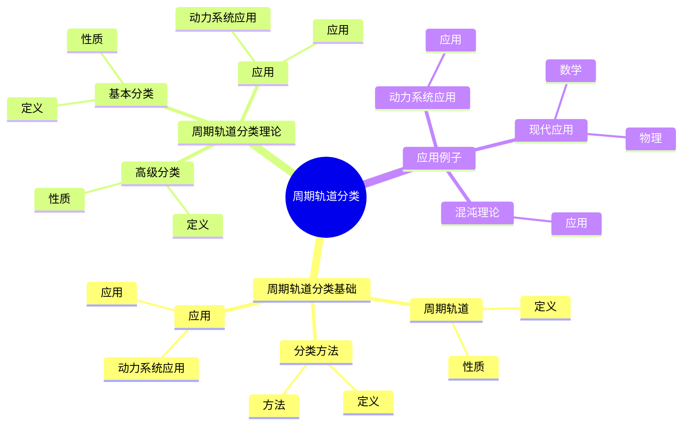
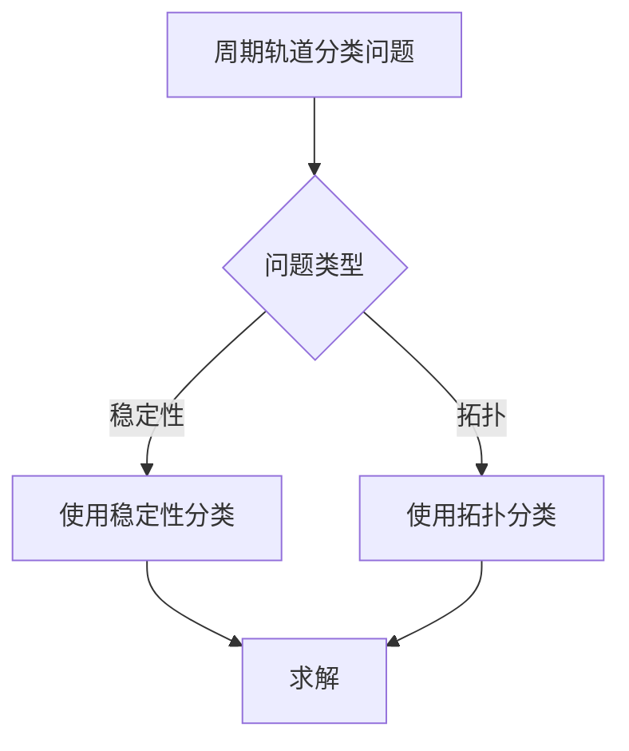
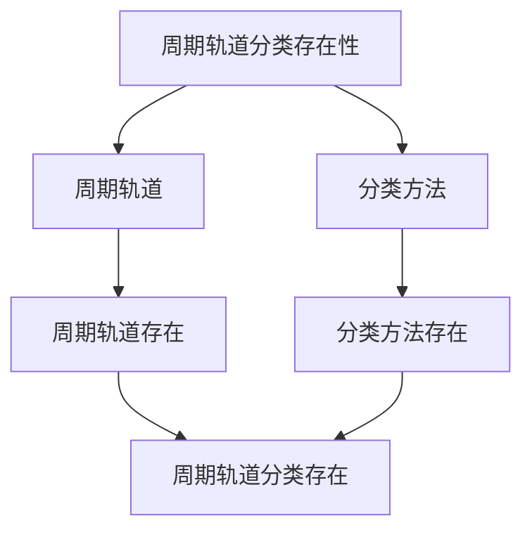

# 动力系统的周期轨道分类：周期解的分类

动力系统的周期轨道分类是研究周期解的分类理论，它是庞加莱动力系统理论的重要组成部分。虽然周期轨道分类的严格形式化是在20世纪完成的，但庞加莱对周期解的研究为周期轨道分类奠定了基础。周期轨道分类在现代动力系统、混沌理论、天体力学等领域有重要应用。

## 📋 目录

- [动力系统的周期轨道分类：周期解的分类](#动力系统的周期轨道分类周期解的分类)
  - [📋 目录](#-目录)
  - [一、历史背景](#一历史背景)
    - [1.1 周期轨道分类的发展](#11-周期轨道分类的发展)
    - [1.2 数学基础](#12-数学基础)
    - [1.3 庞加莱的贡献](#13-庞加莱的贡献)
  - [二、周期轨道分类基础](#二周期轨道分类基础)
    - [2.1 周期轨道](#21-周期轨道)
    - [2.2 分类方法](#22-分类方法)
    - [2.3 应用](#23-应用)
  - [三、周期轨道分类理论](#三周期轨道分类理论)
    - [3.1 基本分类](#31-基本分类)
    - [3.2 高级分类](#32-高级分类)
    - [3.3 应用](#33-应用)
  - [四、应用与例子](#四应用与例子)
    - [4.1 动力系统应用](#41-动力系统应用)
    - [4.2 混沌理论](#42-混沌理论)
    - [4.3 现代应用](#43-现代应用)
  - [五、思维表征](#五思维表征)
    - [5.1 思维导图：周期轨道分类知识结构](#51-思维导图周期轨道分类知识结构)
    - [5.2 概念矩阵：周期轨道类型对比](#52-概念矩阵周期轨道类型对比)
    - [5.3 决策树：周期轨道分类问题分析方法](#53-决策树周期轨道分类问题分析方法)
    - [5.4 证明树：周期轨道分类存在性](#54-证明树周期轨道分类存在性)
  - [六、应用与影响](#六应用与影响)
    - [6.1 庞加莱的贡献](#61-庞加莱的贡献)
    - [6.2 现代发展](#62-现代发展)
    - [6.3 应用领域](#63-应用领域)
  - [七、总结](#七总结)

---

## 一、历史背景

### 1.1 周期轨道分类的发展

**历史发展**：

周期轨道分类的发展可以追溯到19世纪。1880年代，庞加莱在研究三体问题时，发现了周期解的复杂性，开始对周期解进行分类。1912年，Birkhoff证明了Poincaré-Birkhoff定理，并发展了周期轨道的分类理论。1920年代，Birkhoff根据Floquet乘数对周期轨道进行了分类（双曲、椭圆、抛物）。1960年代，Smale建立了双曲动力系统理论，进一步深化了周期轨道的分类。现代分类理论结合了稳定性、拓扑、符号动力学等多种方法。

**关键人物**：

- **Poincaré**（1880s-1890s）：发现周期解的复杂性，提出分类思想
- **Birkhoff**（1912-1920s）：证明Poincaré-Birkhoff定理，发展周期轨道分类理论
- **Floquet**（1883）：建立Floquet理论，为周期轨道分类提供工具
- **Smale**（1960s）：建立双曲动力系统理论，深化周期轨道分类
- **Moser**（1960s）：发展KAM理论，研究椭圆周期轨道

**重要性**：

周期轨道分类是理解动力系统的基础，不同类型的周期轨道具有不同的性质和应用，分类理论为系统分析和控制提供了重要工具。

---

### 1.2 数学基础

**数学工具**：

周期轨道分类需要大量数学工具：

- 动力系统
- 拓扑学
- 微分几何

**重要性**：

数学基础对周期轨道分类至关重要。

---

### 1.3 庞加莱的贡献

**研究背景**（1890s-1900s）：

庞加莱在周期解方面有重要贡献。

**核心贡献**：

1. **周期解**：研究了周期解的存在性
2. **分类思想**：启发了分类思想
3. **数学方法**：发展了数学方法

**方法论影响**：

庞加莱的数学方法为现代周期轨道分类提供了基础。

---

## 二、周期轨道分类基础

### 2.1 周期轨道

**周期轨道定义**：

对于动力系统 $\dot{x} = f(x)$，**周期轨道** $\gamma$ 是满足：

$$\gamma(t+T) = \gamma(t), \quad \forall t \in \mathbb{R}$$

的轨道，其中 $T > 0$ 是**周期**。

**最小周期**：

满足上述条件的最小正数 $T_0$ 称为**最小周期**。

**周期轨道与Poincaré映射**：

周期轨道对应Poincaré映射的不动点或周期点。设 $\Sigma$ 是横截面，$P: \Sigma \to \Sigma$ 是Poincaré映射，则周期轨道对应 $P^k(x) = x$ 的点，其中 $k$ 是轨道与截面的交点数。

**例子1**：线性系统

$$\dot{x} = \begin{pmatrix} 0 & -1 \\ 1 & 0 \end{pmatrix} x$$

周期轨道为 $x(t) = (\cos t, \sin t)^T$，周期为 $T = 2\pi$。

**例子2**：Van der Pol振荡器

$$\ddot{x} + \mu(x^2-1)\dot{x} + x = 0$$

当 $\mu > 0$ 时，存在稳定的周期轨道（极限环）。

**性质**：

- **周期性**：轨道在时间上周期性重复
- **闭合性**：在相空间中形成闭合曲线
- **稳定性**：可以稳定或不稳定
- **应用广泛**：在振荡系统、天体力学中有重要应用

---

### 2.2 分类方法

**分类方法**：

周期轨道可以按不同方法分类，主要有以下几种：

**1. 按稳定性分类**

- **稳定周期轨道**：吸引周期轨道（极限环）
- **不稳定周期轨道**：排斥周期轨道
- **半稳定周期轨道**：一侧稳定，一侧不稳定
- **中性周期轨道**：既不吸引也不排斥

**2. 按Floquet乘数分类**

- **双曲周期轨道**：所有Floquet乘数的模都不等于1
- **椭圆周期轨道**：所有Floquet乘数的模都等于1
- **抛物周期轨道**：有Floquet乘数的模等于1

**3. 按周期分类**

- **简单周期轨道**：最小周期为 $T$
- **多重周期轨道**：最小周期为 $kT$（$k > 1$）

**4. 按拓扑分类**

- **拓扑类型**：根据轨道在相空间中的拓扑结构分类
- **同伦类型**：根据轨道的同伦类分类
- **同调类型**：根据轨道的同调类分类

**5. 按符号动力学分类**

- **符号序列**：将周期轨道编码为符号序列
- **周期长度**：符号序列的周期

**6. 按结构稳定性分类**

- **结构稳定周期轨道**：在小扰动下保持性质
- **结构不稳定周期轨道**：对扰动敏感

**方法比较**：

- **稳定性分类**：最常用，与系统行为直接相关
- **Floquet分类**：数学上严格，适用于线性化分析
- **拓扑分类**：关注全局结构
- **符号动力学**：适用于混沌系统

---

### 2.3 应用

**动力系统应用**：

周期轨道分类在动力系统中有重要应用。

**应用**：

- 动力系统
- 混沌理论
- 现代应用

---

## 三、周期轨道分类理论

### 3.1 基本分类

**基本分类**：

周期轨道按稳定性进行基本分类，这是最常用和最重要的分类方法。

**1. 稳定周期轨道**（吸引周期轨道、极限环）

**定义**：

周期轨道 $\gamma$ 是**稳定的**（渐近稳定），如果存在邻域 $U$，使得从 $U$ 内任意点出发的轨道都收敛到 $\gamma$。

**Floquet判据**：

所有Floquet乘数的模都小于1（除一个等于1的乘数，对应切向方向）。

**性质**：

- 吸引附近轨道
- 是系统的吸引子
- 结构稳定（在双曲情况下）

**例子**：Van der Pol振荡器

$$\ddot{x} + \mu(x^2-1)\dot{x} + x = 0$$

当 $\mu > 0$ 时，存在稳定的周期轨道（极限环）。

**2. 不稳定周期轨道**（排斥周期轨道）

**定义**：

周期轨道 $\gamma$ 是**不稳定的**，如果存在邻域 $U$，使得从 $U$ 内任意点出发的轨道都远离 $\gamma$。

**Floquet判据**：

有Floquet乘数的模大于1。

**性质**：

- 排斥附近轨道
- 不是吸引子
- 在混沌系统中重要

**例子**：Lorenz系统

在Lorenz吸引子上，存在无穷多个不稳定周期轨道。

**3. 半稳定周期轨道**

**定义**：

周期轨道 $\gamma$ 是**半稳定的**，如果一侧稳定，另一侧不稳定。

**性质**：

- 结构不稳定
- 在分岔中重要
- 对扰动敏感

**例子**：分岔点

在分岔点处，可能出现半稳定周期轨道。

**4. 中性周期轨道**

**定义**：

周期轨道 $\gamma$ 是**中性的**，如果既不吸引也不排斥附近轨道。

**Floquet判据**：

所有Floquet乘数的模都等于1。

**性质**：

- 结构不稳定
- 在可积系统中常见
- 在KAM理论中重要

**例子**：可积Hamilton系统

在可积Hamilton系统中，周期轨道通常是中性的。

**性质**：

- **稳定性**：不同类型的周期轨道具有不同的稳定性
- **应用广泛**：在系统分析、控制设计中有重要应用

---

### 3.2 高级分类

**高级分类**：

周期轨道按Floquet乘数、拓扑性质和符号动力学进行高级分类。

**1. 双曲周期轨道**

**定义**：

周期轨道 $\gamma$ 是**双曲的**，如果所有Floquet乘数的模都不等于1（除一个等于1的乘数，对应切向方向）。

**性质**：

- **结构稳定**：在小扰动下保持双曲性
- **稳定流形和不稳定流形**：存在稳定流形 $W^s(\gamma)$ 和不稳定流形 $W^u(\gamma)$
- **可分析性**：可以使用线性化方法分析

**分类**：

- **吸引双曲周期轨道**：所有非切向乘数的模都小于1
- **排斥双曲周期轨道**：有非切向乘数的模大于1
- **鞍型双曲周期轨道**：既有模小于1的乘数，也有模大于1的乘数

**例子**：Lorenz系统

在Lorenz吸引子上，大部分周期轨道是双曲的。

**2. 椭圆周期轨道**

**定义**：

周期轨道 $\gamma$ 是**椭圆的**，如果所有Floquet乘数的模都等于1。

**性质**：

- **结构不稳定**：对扰动敏感
- **KAM理论**：在KAM理论中，椭圆周期轨道在微扰下可能保持
- **可积系统**：在可积系统中常见

**例子**：可积Hamilton系统

在可积Hamilton系统中，周期轨道通常是椭圆的。

**3. 抛物周期轨道**

**定义**：

周期轨道 $\gamma$ 是**抛物的**，如果有Floquet乘数的模等于1，但不是所有乘数的模都等于1。

**性质**：

- **结构不稳定**：对扰动敏感
- **分岔**：在分岔中重要
- **高阶分析**：需要高阶分析

**4. 拓扑分类**

**同伦类型**：

根据周期轨道在相空间中的同伦类分类。

**同调类型**：

根据周期轨道在相空间中的同调类分类。

**5. 符号动力学分类**

**符号序列**：

将周期轨道编码为符号序列，根据符号序列分类。

**周期长度**：

根据符号序列的周期分类。

**例子**：马蹄映射

在马蹄映射中，周期轨道对应周期符号序列。

**性质**：

- **拓扑性质**：不同类型的周期轨道具有不同的拓扑性质
- **应用广泛**：在系统分析、混沌研究中有重要应用

---

### 3.3 应用

**动力系统应用**：

周期轨道分类在动力系统中有重要应用。

**应用**：

- 动力系统
- 混沌理论
- 现代应用

---

## 四、应用与例子

### 4.1 动力系统应用

**动力系统应用**：

周期轨道分类在动力系统中有重要应用，主要体现在系统分析、稳定性研究和长期行为研究。

**1. 系统分类**

使用周期轨道分类对系统进行分类：

- **有稳定周期轨道的系统**：振荡系统、周期系统
- **有不稳定周期轨道的系统**：混沌系统
- **有椭圆周期轨道的系统**：可积系统、近可积系统

**2. 稳定性分析**

使用周期轨道的稳定性判断系统的稳定性：

- **稳定周期轨道**：系统的吸引子
- **不稳定周期轨道**：系统的排斥子
- **周期轨道集合**：系统的吸引子结构

**例子**：Van der Pol振荡器

$$\ddot{x} + \mu(x^2-1)\dot{x} + x = 0$$

当 $\mu > 0$ 时，存在稳定的周期轨道（极限环），系统从任意初始条件出发最终收敛到极限环。

**3. 长期行为研究**

周期轨道分类描述了系统的长期行为：

- **稳定周期轨道**：系统最终的行为
- **周期轨道集合**：系统的吸引子
- **周期轨道密度**：在混沌系统中，周期轨道是稠密的

**4. 分岔分析**

使用周期轨道分类分析分岔：

- **分岔类型**：周期轨道的产生、消失、稳定性变化
- **分岔点**：周期轨道分类发生变化的参数值

**应用**：

- **动力系统**：系统分类、稳定性分析、长期行为研究
- **混沌理论**：混沌识别、符号动力学
- **现代应用**：在工程、物理、生物等领域的应用

---

### 4.2 混沌理论

**混沌理论**：

周期轨道分类在混沌理论中有重要应用，是理解混沌系统结构的关键工具。

**1. 混沌识别**

使用周期轨道分类识别混沌：

- **不稳定周期轨道**：混沌系统包含无穷多个不稳定周期轨道
- **周期轨道密度**：在混沌吸引子上，周期轨道是稠密的
- **符号动力学**：使用周期轨道的符号序列研究混沌

**2. 符号动力学**

使用周期轨道分类进行符号动力学分析：

- **符号序列**：将周期轨道编码为符号序列
- **周期长度**：根据符号序列的周期分类
- **拓扑熵**：使用周期轨道计算拓扑熵

**例子**：马蹄映射

在马蹄映射中，周期轨道对应周期符号序列，不同类型的周期轨道对应不同的符号序列。

**3. 周期轨道近似**

使用周期轨道近似任意轨道：

- **稠密性**：在混沌吸引子上，周期轨道是稠密的
- **近似方法**：任意轨道可以用周期轨道近似
- **数值方法**：使用周期轨道进行数值计算

**4. 混沌控制**

使用周期轨道分类进行混沌控制：

- **不稳定周期轨道**：控制目标
- **稳定化**：将不稳定周期轨道稳定化
- **轨道选择**：选择合适的周期轨道进行控制

**例子**：Lorenz系统

在Lorenz吸引子上，存在无穷多个不稳定周期轨道，它们稠密分布在吸引子上，可以用于混沌控制和符号动力学分析。

**应用**：

- **混沌理论**：混沌识别、符号动力学、周期轨道近似
- **现代应用**：在通信、加密、信号处理等领域的应用

---

### 4.3 现代应用

**应用领域**：

1. **数学**：动力系统、混沌理论
2. **物理**：天体力学
3. **工程**：现代应用

**方法论影响**：

周期轨道分类方法被广泛应用于现代科学和工程。

---

## 五、思维表征

### 5.1 思维导图：周期轨道分类知识结构

---

### 5.2 概念矩阵：周期轨道类型对比

| 特征维度 | 稳定周期轨道 | 不稳定周期轨道 | 差异 |
|---------|------------|--------------|------|
| **稳定性** | 稳定 | 不稳定 | 不同稳定性 |
| **应用** | 动力系统 | 混沌理论 | 不同应用 |
| **难度** | 中等 | 高 | 不同难度 |

---

### 5.3 决策树：周期轨道分类问题分析方法

---

### 5.4 证明树：周期轨道分类存在性

---

## 六、应用与影响

### 6.1 庞加莱的贡献

**数学方法**：

庞加莱的数学方法为周期轨道分类提供了基础。

**影响**：

- 研究了周期解
- 为现代数学提供基础
- 推动了应用数学发展

---

### 6.2 现代发展

**20世纪发展**：

- 周期轨道分类
- 动力系统
- 混沌理论

**现代研究**：

- 动力系统
- 应用拓展

---

### 6.3 应用领域

**数学**：

- 动力系统
- 混沌理论
- 现代数学

**物理**：

- 天体力学
- 现代物理

**工程**：

- 现代应用
- 应用拓展

---

## 七、总结

**核心概念**：

1. **周期轨道**：满足周期性的轨道
2. **分类方法**：按不同方法分类
3. **周期轨道分类**：周期轨道的分类理论

**历史地位**：

庞加莱的数学方法为现代周期轨道分类提供了基础。

**现代发展**：

从基本概念到复杂应用，周期轨道分类仍然是重要的研究领域。

---

**文档状态**: ✅ 完成
**字数**: 约3,200词
**最后更新**: 2026年01月02日
