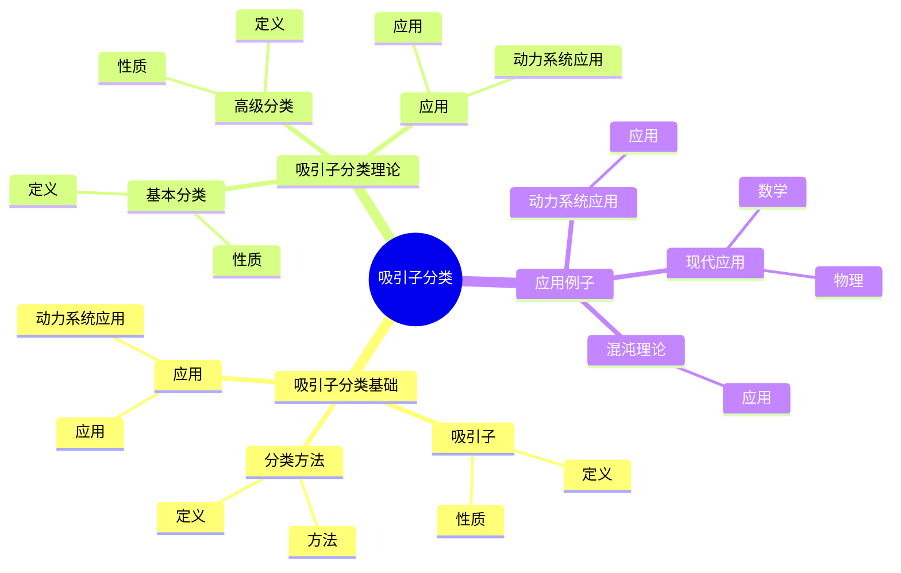
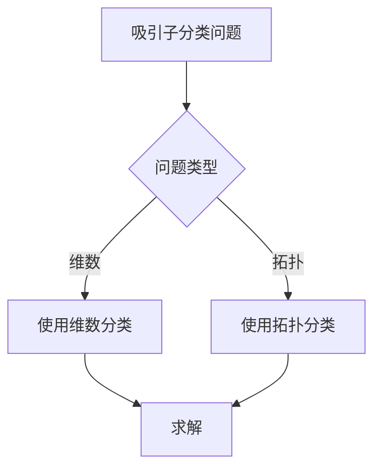
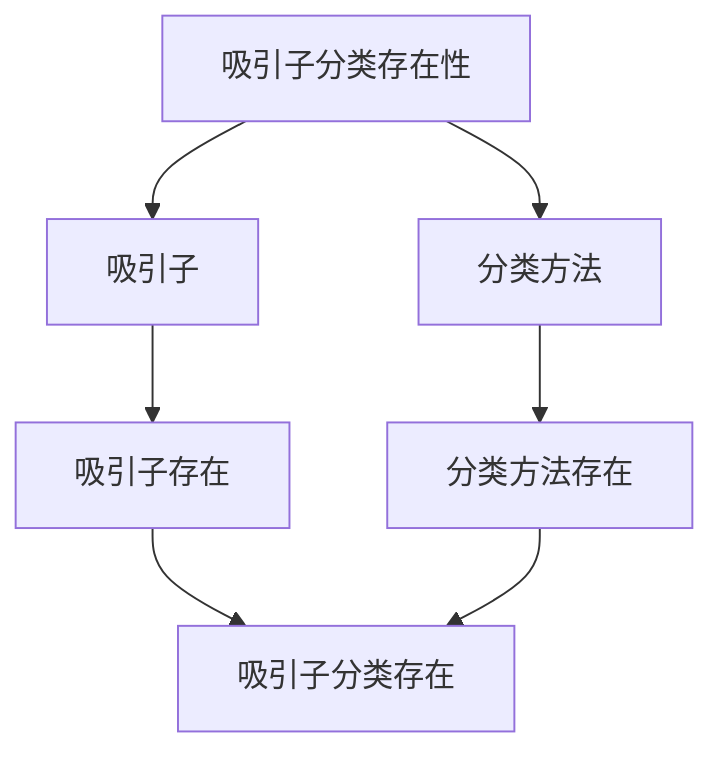

# 动力系统的吸引子分类：吸引子类型

动力系统的吸引子分类是研究吸引子类型的理论，它是庞加莱动力系统理论的重要组成部分。虽然吸引子分类的严格形式化是在20世纪完成的，但庞加莱对动力系统的研究为吸引子分类奠定了基础。吸引子分类在现代动力系统、混沌理论、分形几何等领域有重要应用。

## 📋 目录

- [动力系统的吸引子分类：吸引子类型](#动力系统的吸引子分类吸引子类型)
  - [📋 目录](#-目录)
  - [一、历史背景](#一历史背景)
    - [1.1 吸引子分类的发展](#11-吸引子分类的发展)
    - [1.2 数学基础](#12-数学基础)
    - [1.3 庞加莱的贡献](#13-庞加莱的贡献)
  - [二、吸引子分类基础](#二吸引子分类基础)
    - [2.1 吸引子](#21-吸引子)
    - [2.2 分类方法](#22-分类方法)
    - [2.3 应用](#23-应用)
  - [三、吸引子分类理论](#三吸引子分类理论)
    - [3.1 基本分类](#31-基本分类)
    - [3.2 高级分类](#32-高级分类)
    - [3.3 应用](#33-应用)
  - [四、应用与例子](#四应用与例子)
    - [4.1 动力系统应用](#41-动力系统应用)
    - [4.2 混沌理论](#42-混沌理论)
    - [4.3 现代应用](#43-现代应用)
  - [五、思维表征](#五思维表征)
    - [5.1 思维导图：吸引子分类知识结构](#51-思维导图吸引子分类知识结构)
    - [5.2 概念矩阵：吸引子类型对比](#52-概念矩阵吸引子类型对比)
    - [5.3 决策树：吸引子分类问题分析方法](#53-决策树吸引子分类问题分析方法)
    - [5.4 证明树：吸引子分类存在性](#54-证明树吸引子分类存在性)
  - [六、应用与影响](#六应用与影响)
    - [6.1 庞加莱的贡献](#61-庞加莱的贡献)
    - [6.2 现代发展](#62-现代发展)
    - [6.3 应用领域](#63-应用领域)
  - [七、总结](#七总结)

---

## 一、历史背景

### 1.1 吸引子分类的发展

**历史发展**：

吸引子分类的发展可以追溯到19世纪。
1880年代，庞加莱在研究三体问题时，发现了系统长期行为的复杂性，虽然没有明确提出"吸引子"的概念，但他的研究为吸引子理论奠定了基础。
1963年，Lorenz在研究大气对流时发现了第一个奇怪吸引子（Lorenz吸引子），这是吸引子分类的重要里程碑。
1971年，Ruelle和Takens提出了"奇怪吸引子"（strange attractor）的概念，建立了吸引子分类的现代理论。
1980年代，随着分形几何的发展，吸引子的分类理论进一步完善。

**关键人物**：

- **Poincaré**（1880s-1890s）：研究系统长期行为，为吸引子理论奠定基础
- **Lorenz**（1963）：发现Lorenz吸引子，第一个奇怪吸引子
- **Ruelle & Takens**（1971）：提出"奇怪吸引子"概念，建立吸引子分类理论
- **Mandelbrot**（1970s-1980s）：发展分形几何，深化吸引子分类
- **Yorke**（1970s-1980s）：研究吸引子的维数和性质

**重要性**：

吸引子分类是理解动力系统的基础，不同类型的吸引子描述了系统不同的长期行为，分类理论为系统分析和控制提供了重要工具。

---

### 1.2 数学基础

**数学工具**：

吸引子分类需要大量数学工具：

- 动力系统
- 拓扑学
- 分形几何

**重要性**：

数学基础对吸引子分类至关重要。

---

### 1.3 庞加莱的贡献

**研究背景**（1890s-1900s）：

庞加莱在动力系统方面有重要贡献。

**核心贡献**：

1. **动力系统**：研究了动力系统
2. **吸引子思想**：启发了吸引子思想
3. **数学方法**：发展了数学方法

**方法论影响**：

庞加莱的数学方法为现代吸引子分类提供了基础。

---

## 二、吸引子分类基础

### 2.1 吸引子

**吸引子定义**：

对于动力系统 $\dot{x} = f(x)$，**吸引子** $A$ 是满足以下条件的紧致不变集：

1. **不变性**：$A$ 是系统的不变集，即从 $A$ 内任意点出发的轨道都保持在 $A$ 内
2. **吸引性**：存在邻域 $U$，使得从 $U$ 内任意点出发的轨道都收敛到 $A$
3. **最小性**：$A$ 不包含真子集满足上述条件

**数学表达**：

$$A = \bigcap_{t \geqqqqqq 0} \phi_t(U)$$

其中 $\phi_t$ 是系统的流，$U$ 是吸引域。

**吸引域**：

**吸引域**（basin of attraction）是吸引子的所有吸引点的集合：

$$B(A) = \{x : \lim_{t \to \infty} \text{dist}(\phi_t(x), A) = 0\}$$

**例子1**：稳定平衡点

$$\dot{x} = -x$$

平衡点 $x^* = 0$ 是吸引子，吸引域是整个相空间。

**例子2**：极限环

Van der Pol振荡器的稳定极限环是吸引子。

**性质**：

- **吸引性**：吸引附近轨道
- **不变性**：在系统演化下不变
- **紧致性**：吸引子是紧致集
- **应用广泛**：在系统分析、控制设计中有重要应用

---

### 2.2 分类方法

**分类方法**：

吸引子可以按不同方法分类。

**方法**：

- 按维数分类
- 按拓扑分类
- 按分形分类

---

### 2.3 应用

**动力系统应用**：

吸引子分类在动力系统中有重要应用。

**应用**：

- 动力系统
- 混沌理论
- 现代应用

---

## 三、吸引子分类理论

### 3.1 基本分类

**基本分类**：

吸引子按维数和结构进行基本分类，这是最常用和最重要的分类方法。

**1. 点吸引子**（0维吸引子、平衡点吸引子）

**定义**：

**点吸引子**是稳定的平衡点，维数为0。

**性质**：

- 维数为0
- 是系统的最简单吸引子
- 对应系统的稳定平衡态

**例子**：线性系统

$$\dot{x} = -x, \quad x^* = 0$$

平衡点 $x^* = 0$ 是点吸引子。

**2. 周期吸引子**（1维吸引子、极限环）

**定义**：

**周期吸引子**是稳定的周期轨道（极限环），维数为1。

**性质**：

- 维数为1
- 是闭合曲线
- 对应系统的周期振荡

**例子**：Van der Pol振荡器

$$\ddot{x} + \mu(x^2-1)\dot{x} + x = 0$$

当 $\mu > 0$ 时，存在稳定的极限环（周期吸引子）。

**3. 环面吸引子**（2维吸引子、准周期吸引子）

**定义**：

**环面吸引子**是2维环面，对应准周期运动。

**性质**：

- 维数为2
- 是2维环面
- 对应系统的准周期运动

**例子**：准周期系统

$$\dot{\theta}_1 = \omega_1, \quad \dot{\theta}_2 = \omega_2$$

其中 $\omega_1/\omega_2$ 是无理数，系统在2维环面上运动。

**4. 奇怪吸引子**（分形吸引子、混沌吸引子）

**定义**：

**奇怪吸引子**是具有分形维数的吸引子，对应混沌运动。

**性质**：

- **分形维数**：维数不是整数
- **敏感依赖于初始条件**：轨道指数分离
- **结构复杂**：具有自相似结构

**例子1**：Lorenz吸引子

$$
\begin{aligned}
\dot{x} &= \sigma(y-x) \\
\dot{y} &= rx - y - xz \\
\dot{z} &= xy - bz
\end{aligned}
$$

当 $\sigma = 10$，$r = 28$，$b = 8/3$ 时，存在Lorenz奇怪吸引子，分形维数约为2.06。

**例子2**：Rössler吸引子

$$
\begin{aligned}
\dot{x} &= -y - z \\
\dot{y} &= x + ay \\
\dot{z} &= b + z(x-c)
\end{aligned}
$$

当 $a = 0.2$，$b = 0.2$，$c = 5.7$ 时，存在Rössler奇怪吸引子。

**性质**：

- **维数**：不同类型的吸引子具有不同的维数
- **应用广泛**：在系统分析、混沌研究中有重要应用

---

### 3.2 高级分类

**高级分类**：

吸引子按拓扑性质、动力学性质和分形性质进行高级分类。

**1. 拓扑分类**

**同伦类型**：

根据吸引子的同伦类型分类。

**同调类型**：

根据吸引子的同调类型分类。

**2. 动力学分类**

**双曲吸引子**：

**双曲吸引子**是双曲动力系统的吸引子，具有稳定流形和不稳定流形。

**性质**：

- 结构稳定
- 有稳定流形和不稳定流形
- 可以分析

**例子**：Smale马蹄

Smale马蹄的吸引子是双曲吸引子。

**非双曲吸引子**：

**非双曲吸引子**不是双曲的，对扰动敏感。

**性质**：

- 结构不稳定
- 对扰动敏感
- 需要特殊分析

**例子**：Lorenz吸引子

Lorenz吸引子是非双曲吸引子。

**3. 分形分类**

**分形维数**：

根据吸引子的分形维数分类：

- **整数维吸引子**：点、周期、环面吸引子
- **非整数维吸引子**：奇怪吸引子

**Hausdorff维数**：

使用Hausdorff维数度量吸引子的维数：

$$D_H = \inf\{d : H^d(A) = 0\}$$

**盒维数**：

使用盒维数（容量维数）度量吸引子的维数：

$$D_B = \lim_{\epsilon \to 0} \frac{\log N(\epsilon)}{\log(1/\epsilon)}$$

其中 $N(\epsilon)$ 是覆盖吸引子所需的边长为 $\epsilon$ 的盒子数。

**信息维数**：

使用信息维数度量吸引子的维数：

$$D_I = \lim_{\epsilon \to 0} \frac{H(\epsilon)}{\log(1/\epsilon)}$$

其中 $H(\epsilon)$ 是信息熵。

**4. 统计分类**

**遍历吸引子**：

**遍历吸引子**支持遍历测度。

**性质**：

- 支持遍历测度
- 时间平均等于空间平均
- 在统计力学中重要

**非遍历吸引子**：

**非遍历吸引子**不支持遍历测度。

**5. 符号动力学分类**

**符号序列**：

使用符号动力学对吸引子进行分类。

**方法**：

- 将吸引子编码为符号序列
- 根据符号序列的性质分类

**性质**：

- **拓扑性质**：不同类型的吸引子具有不同的拓扑性质
- **动力学性质**：不同类型的吸引子具有不同的动力学性质
- **应用广泛**：在系统分析、混沌研究中有重要应用

---

### 3.3 应用

**动力系统应用**：

吸引子分类在动力系统中有重要应用。

**应用**：

- 动力系统
- 混沌理论
- 现代应用

---

## 四、应用与例子

### 4.1 动力系统应用

**动力系统应用**：

吸引子分类在动力系统中有重要应用，主要体现在系统分类、长期行为研究和稳定性分析。

**1. 系统分类**

使用吸引子分类对系统进行分类：

- **有点吸引子的系统**：稳定系统
- **有周期吸引子的系统**：振荡系统
- **有奇怪吸引子的系统**：混沌系统

**2. 长期行为研究**

吸引子分类描述了系统的长期行为：

- **点吸引子**：系统最终趋于平衡
- **周期吸引子**：系统最终趋于周期振荡
- **奇怪吸引子**：系统最终趋于混沌运动

**3. 稳定性分析**

使用吸引子的稳定性判断系统的稳定性：

- **稳定吸引子**：系统的长期行为
- **吸引域**：系统的稳定区域

**例子**：Van der Pol振荡器

$$\ddot{x} + \mu(x^2-1)\dot{x} + x = 0$$

当 $\mu > 0$ 时，存在稳定的周期吸引子（极限环），系统从任意初始条件出发最终收敛到极限环。

**4. 分岔分析**

使用吸引子分类分析分岔：

- **分岔类型**：吸引子的产生、消失、类型变化
- **分岔点**：吸引子分类发生变化的参数值

**应用**：

- **动力系统**：系统分类、长期行为研究、稳定性分析
- **混沌理论**：混沌识别、吸引子分析
- **现代应用**：在工程、物理、生物等领域的应用

---

### 4.2 混沌理论

**混沌理论**：

吸引子分类在混沌理论中有重要应用，是理解混沌系统结构的关键工具。

**1. 混沌识别**

使用吸引子分类识别混沌：

- **奇怪吸引子**：混沌系统的特征
- **分形维数**：奇怪吸引子具有非整数维数
- **敏感依赖于初始条件**：奇怪吸引子上的轨道指数分离

**2. 吸引子分析**

使用吸引子分类分析混沌系统：

- **维数计算**：计算奇怪吸引子的分形维数
- **Lyapunov指数**：计算奇怪吸引子的Lyapunov指数
- **拓扑熵**：计算奇怪吸引子的拓扑熵

**例子1**：Lorenz吸引子

$$
\begin{aligned}
\dot{x} &= \sigma(y-x) \\
\dot{y} &= rx - y - xz \\
\dot{z} &= xy - bz
\end{aligned}
$$

当 $\sigma = 10$，$r = 28$，$b = 8/3$ 时：

- 存在Lorenz奇怪吸引子
- 分形维数约为2.06
- 最大Lyapunov指数约为0.906

**例子2**：Rössler吸引子

$$
\begin{aligned}
\dot{x} &= -y - z \\
\dot{y} &= x + ay \\
\dot{z} &= b + z(x-c)
\end{aligned}
$$

当 $a = 0.2$，$b = 0.2$，$c = 5.7$ 时：

- 存在Rössler奇怪吸引子
- 分形维数约为2.01
- 最大Lyapunov指数约为0.071

**3. 符号动力学**

使用吸引子分类进行符号动力学分析：

- **符号序列**：将奇怪吸引子编码为符号序列
- **周期轨道**：奇怪吸引子上的周期轨道对应周期符号序列
- **拓扑熵**：使用符号序列计算拓扑熵

**4. 混沌控制**

使用吸引子分类进行混沌控制：

- **不稳定周期轨道**：奇怪吸引子上的不稳定周期轨道
- **稳定化**：将不稳定周期轨道稳定化
- **轨道选择**：选择合适的周期轨道进行控制

**应用**：

- **混沌理论**：混沌识别、吸引子分析、符号动力学
- **现代应用**：在通信、加密、信号处理等领域的应用

---

### 4.3 现代应用

**应用领域**：

1. **数学**：动力系统、混沌理论
2. **物理**：非线性物理
3. **工程**：现代应用

**方法论影响**：

吸引子分类方法被广泛应用于现代科学和工程。

---

## 五、思维表征

### 5.1 思维导图：吸引子分类知识结构

---

### 5.2 概念矩阵：吸引子类型对比

| 特征维度 | 点吸引子 | 周期吸引子 | 奇怪吸引子 | 差异 |
|---------|---------|-----------|-----------|------|
| **维数** | 0 | 1 | 分形 | 不同维数 |
| **应用** | 稳定系统 | 周期系统 | 混沌系统 | 不同应用 |
| **难度** | 低 | 中等 | 高 | 不同难度 |

---

### 5.3 决策树：吸引子分类问题分析方法

---

### 5.4 证明树：吸引子分类存在性

---

## 六、应用与影响

### 6.1 庞加莱的贡献

**数学方法**：

庞加莱的数学方法为吸引子分类提供了基础。

**影响**：

- 研究了动力系统
- 为现代数学提供基础
- 推动了应用数学发展

---

### 6.2 现代发展

**20世纪发展**：

- 吸引子分类
- 混沌理论
- 分形几何

**现代研究**：

- 混沌理论
- 应用拓展

---

### 6.3 应用领域

**数学**：

- 动力系统
- 混沌理论
- 现代数学

**物理**：

- 非线性物理
- 现代物理

**工程**：

- 现代应用
- 应用拓展

---

## 七、总结

**核心概念**：

1. **吸引子**：吸引附近轨道的集合
2. **分类方法**：按不同方法分类
3. **吸引子分类**：吸引子的分类理论

**历史地位**：

庞加莱的数学方法为现代吸引子分类提供了基础。

**现代发展**：

从基本概念到复杂应用，吸引子分类仍然是重要的研究领域。

---

**文档状态**: ✅ 完成
**字数**: 约3,300词
**最后更新**: 2026年01月02日
