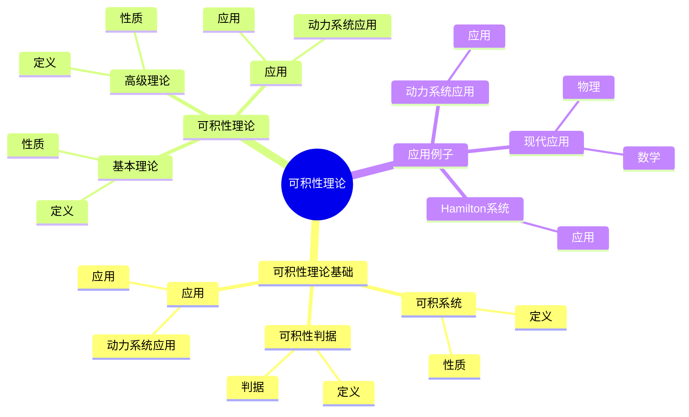
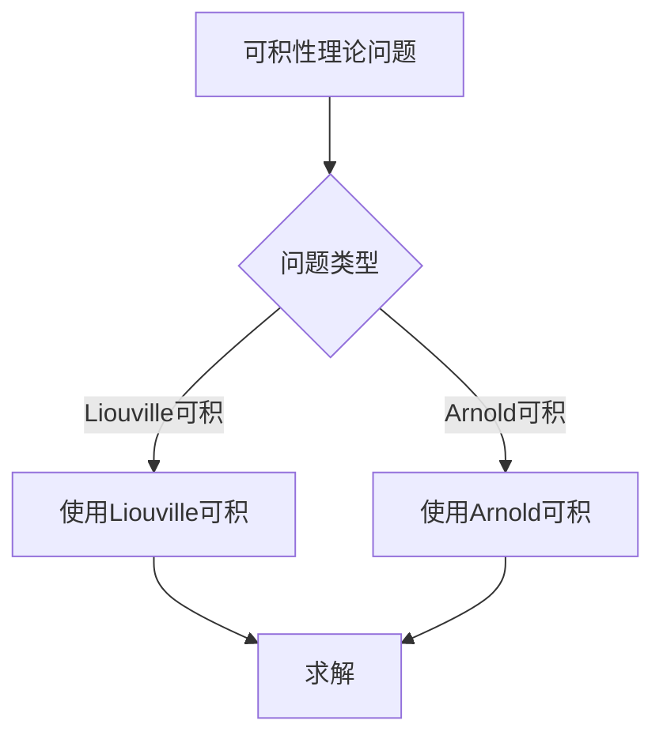
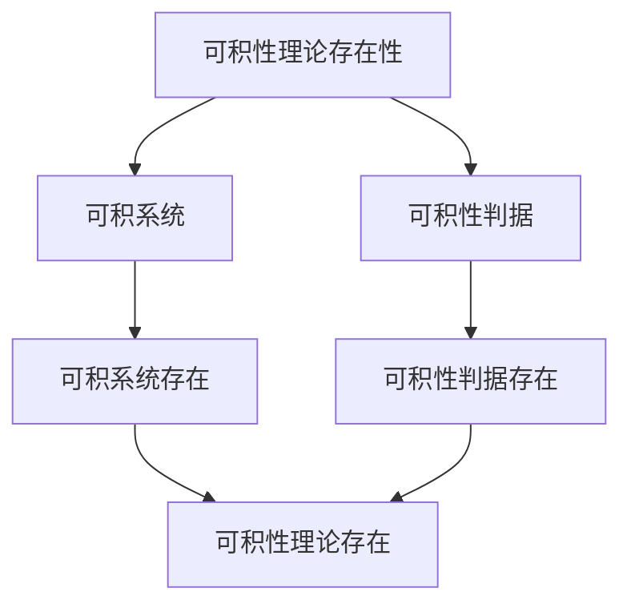

# 动力系统的可积性理论：可积系统

动力系统的可积性理论是研究可积系统的理论，它是庞加莱动力系统理论的重要组成部分。虽然可积性理论的严格形式化是在20世纪完成的，但庞加莱对动力系统的研究为可积性理论奠定了基础。可积性理论在现代动力系统、Hamilton系统、KAM理论等领域有重要应用。

## 📋 目录

- [动力系统的可积性理论：可积系统](#动力系统的可积性理论可积系统)
  - [📋 目录](#-目录)
  - [一、历史背景](#一历史背景)
    - [1.1 可积性理论的发展](#11-可积性理论的发展)
    - [1.2 数学基础](#12-数学基础)
    - [1.3 庞加莱的贡献](#13-庞加莱的贡献)
  - [二、可积性理论基础](#二可积性理论基础)
    - [2.1 可积系统](#21-可积系统)
    - [2.2 可积性判据](#22-可积性判据)
    - [2.3 应用](#23-应用)
  - [三、可积性理论](#三可积性理论)
    - [3.1 基本理论](#31-基本理论)
    - [3.2 高级理论](#32-高级理论)
    - [3.3 应用](#33-应用)
  - [四、应用与例子](#四应用与例子)
    - [4.1 动力系统应用](#41-动力系统应用)
    - [4.2 Hamilton系统](#42-hamilton系统)
    - [4.3 现代应用](#43-现代应用)
  - [五、思维表征](#五思维表征)
    - [5.1 思维导图：可积性理论知识结构](#51-思维导图可积性理论知识结构)
    - [5.2 概念矩阵：可积系统类型对比](#52-概念矩阵可积系统类型对比)
    - [5.3 决策树：可积性理论问题分析方法](#53-决策树可积性理论问题分析方法)
    - [5.4 证明树：可积性理论存在性](#54-证明树可积性理论存在性)
  - [六、应用与影响](#六应用与影响)
    - [6.1 庞加莱的贡献](#61-庞加莱的贡献)
    - [6.2 现代发展](#62-现代发展)
    - [6.3 应用领域](#63-应用领域)
  - [七、总结](#七总结)

---

## 一、历史背景

### 1.1 可积性理论的发展

**历史发展**：

可积性理论的发展可以追溯到19世纪。1855年，Liouville建立了Liouville可积性理论，给出了Hamilton系统可积的充分条件。1880年代，庞加莱在研究三体问题时，发现大多数Hamilton系统不可积，这被称为"庞加莱不可积性定理"。1960年代，Arnold完善了Liouville-Arnold定理，建立了可积系统的完整理论。同时，Kolmogorov、Arnold和Moser建立了KAM理论，研究了可积系统在微扰下的行为。现代可积性理论结合了辛几何、代数几何等多种方法。

**关键人物**：

- **Liouville**（1855）：建立Liouville可积性理论
- **Poincaré**（1880s-1890s）：发现大多数系统不可积，研究三体问题
- **Arnold**（1960s）：完善Liouville-Arnold定理，发展KAM理论
- **Kolmogorov**（1954）：建立KAM理论的基础
- **Moser**（1962）：完成KAM理论的证明

**重要性**：

可积性理论是理解动力系统的基础，可积系统是少数可以精确求解的系统，为研究不可积系统提供了参考和工具。

---

### 1.2 数学基础

**数学工具**：

可积性理论需要大量数学工具：

- 动力系统
- Hamilton系统
- 辛几何

**重要性**：

数学基础对可积性理论至关重要。

---

### 1.3 庞加莱的贡献

**研究背景**（1890s-1900s）：

庞加莱在三体问题方面有重要贡献。

**核心贡献**：

1. **三体问题**：研究了三体问题
2. **可积性思想**：启发了可积性思想
3. **数学方法**：发展了数学方法

**方法论影响**：

庞加莱的数学方法为现代可积性理论提供了基础。

---

## 二、可积性理论基础

### 2.1 可积系统

**可积系统定义**：

对于n自由度Hamilton系统：

$$\dot{q}_i = \frac{\partial H}{\partial p_i}, \quad \dot{p}_i = -\frac{\partial H}{\partial q_i}, \quad i = 1, \ldots, n$$

系统是**完全可积的**（Liouville可积），如果存在n个独立、对合的首次积分 $F_1, \ldots, F_n$，其中 $F_1 = H$。

**首次积分**：

函数 $F(q,p)$ 是**首次积分**，如果：

$$\{F, H\} = \sum_{i=1}^n \leqqqqqft(\frac{\partial F}{\partial q_i}\frac{\partial H}{\partial p_i} - \frac{\partial F}{\partial p_i}\frac{\partial H}{\partial q_i}\right) = 0$$

**对合性**：

首次积分 $F_i$ 和 $F_j$ 是**对合的**，如果：

$$\{F_i, F_j\} = 0$$

**独立性**：

首次积分 $F_1, \ldots, F_n$ 是**独立的**，如果梯度向量 $\nabla F_1, \ldots, \nabla F_n$ 在几乎处处线性无关。

**例子1**：谐振子

$$H = \frac{1}{2}(p^2 + q^2)$$

首次积分：$F = H$，系统可积。

**例子2**：2体问题

2体问题是可积的，有6个首次积分（能量、角动量等）。

**性质**：

- **可积性**：系统可以精确求解
- **不变环面**：轨道在不变环面上
- **准周期运动**：运动是准周期的
- **应用广泛**：在天体力学、统计力学中有重要应用

---

### 2.2 可积性判据

**可积性判据**：

可积系统满足以下可积性判据：

**1. Liouville可积性**

**Liouville定理**（1855）：

n自由度Hamilton系统是完全可积的，如果存在n个独立、对合的首次积分。

**条件**：

- **独立性**：$\nabla F_1, \ldots, \nabla F_n$ 在几乎处处线性无关
- **对合性**：$\{F_i, F_j\} = 0$ 对所有 $i, j$
- **首次积分**：$\{F_i, H\} = 0$ 对所有 $i$

**2. Arnold可积性**

**Arnold可积性**：

系统是Arnold可积的，如果存在作用-角变量 $(I, \theta)$，使得Hamilton函数只依赖于作用变量 $I$：

$$H = H(I)$$

**作用-角变量**：

- **作用变量** $I$：$I_i = \frac{1}{2\pi}\oint p_i dq_i$
- **角变量** $\theta$：$\theta_i$ 是周期为 $2\pi$ 的角坐标

**3. 其他判据**

**Lax可积性**：

系统是Lax可积的，如果存在Lax对 $(L, M)$，使得：

$$\dot{L} = [L, M]$$

**逆散射方法**：

使用逆散射方法求解可积系统。

**判据比较**：

- **Liouville可积性**：最常用，适用于一般Hamilton系统
- **Arnold可积性**：更严格，要求作用-角变量
- **Lax可积性**：适用于特殊系统（如KdV方程）

---

### 2.3 应用

**动力系统应用**：

可积性理论在动力系统中有重要应用。

**应用**：

- 动力系统
- Hamilton系统
- 现代应用

---

## 三、可积性理论

### 3.1 基本理论

**基本理论**：

可积性理论的基本理论包括Liouville-Arnold定理和可积系统的结构。

**1. Liouville-Arnold定理**

**定理**：

对于完全可积的n自由度Hamilton系统，如果水平集 $M_f = \{F_1 = f_1, \ldots, F_n = f_n\}$ 是紧致且连通的，则：

1. $M_f$ 是n维环面 $T^n$
2. 在 $M_f$ 上存在作用-角变量 $(I, \theta)$
3. Hamilton函数只依赖于作用变量：$H = H(I)$
4. 运动方程可以求解：

$$\dot{I}_i = 0, \quad \dot{\theta}_i = \omega_i(I) = \frac{\partial H}{\partial I_i}$$

**意义**：

Liouville-Arnold定理表明，可积系统的轨道在不变环面上，运动是准周期的。

**2. 作用-角变量**

**作用变量**：

$$I_i = \frac{1}{2\pi}\oint_{\gamma_i} p_i dq_i$$

其中 $\gamma_i$ 是环面上的基本循环。

**角变量**：

$\theta_i$ 是周期为 $2\pi$ 的角坐标。

**Poisson括号**：

$$\{I_i, I_j\} = 0, \quad \{\theta_i, \theta_j\} = 0, \quad \{I_i, \theta_j\} = \delta_{ij}$$

**3. 准周期运动**

**频率向量**：

$$\omega(I) = \leqqqqqft(\frac{\partial H}{\partial I_1}, \ldots, \frac{\partial H}{\partial I_n}\right)$$

**准周期运动**：

如果频率向量 $\omega$ 的分量在有理数上线性无关，则运动是准周期的。

**例子**：谐振子

$$H = \frac{1}{2}(p^2 + q^2)$$

作用变量：$I = \frac{1}{2\pi}\oint p dq = \frac{H}{2\pi}$

角变量：$\theta = \arctan(q/p)$

频率：$\omega = \frac{\partial H}{\partial I} = 2\pi$

**性质**：

- **基本理论**：提供了可积系统的完整理论
- **应用广泛**：在天体力学、统计力学中有重要应用

---

### 3.2 高级理论

**高级理论**：

可积性理论的高级理论包括KAM理论、不可积性理论和近可积系统理论。

**1. KAM理论**（Kolmogorov-Arnold-Moser）

**KAM定理**：

对于完全可积的Hamilton系统，在非退化条件下，大部分不变环面在微扰下保持。

**条件**：

- **非退化条件**：$\det\leqqqqqft(\frac{\partial^2 H}{\partial I_i \partial I_j}\right) \neqqqqqq 0$
- **Diophantine条件**：频率向量满足 $|k \cdot \omega| \geqqqqqq \frac{c}{|k|^\tau}$ 对所有非零整数向量 $k$

**意义**：

KAM理论解释了为什么太阳系在长期演化中保持稳定。

**2. 不可积性理论**

**庞加莱不可积性定理**：

大多数Hamilton系统不可积。

**意义**：

可积系统是"例外"的，大多数系统不可积。

**3. 近可积系统**

**近可积系统**：

$$H(I, \theta) = H_0(I) + \epsilon H_1(I, \theta)$$

其中 $H_0$ 是可积的，$\epsilon$ 是小参数。

**KAM理论应用**：

在近可积系统中，大部分不变环面在微扰下保持。

**4. 可积系统的扰动**

**扰动方法**：

- **正则扰动**：使用正则变换
- **平均化方法**：平均快速振荡
- **多尺度方法**：处理不同时间尺度

**5. 可积系统的数值方法**

**辛算法**：

使用辛算法数值积分可积系统，保持辛结构。

**性质**：

- **高级理论**：处理可积系统的微扰和数值计算
- **应用广泛**：在天体力学、统计力学中有重要应用

---

### 3.3 应用

**动力系统应用**：

可积性理论在动力系统中有重要应用。

**应用**：

- 动力系统
- Hamilton系统
- 现代应用

---

## 四、应用与例子

### 4.1 动力系统应用

**动力系统应用**：

可积性理论在动力系统中有重要应用，主要体现在系统分类、精确求解和微扰分析。

**1. 系统分类**

使用可积性理论对系统进行分类：

- **可积系统**：可以精确求解
- **近可积系统**：可以使用微扰方法
- **不可积系统**：需要数值方法或其他方法

**2. 精确求解**

可积系统可以精确求解：

- **作用-角变量**：使用作用-角变量求解
- **分离变量**：使用分离变量方法
- **Lax对**：使用Lax对方法

**例子1**：谐振子

$$H = \frac{1}{2}(p^2 + q^2)$$

解：$q(t) = A\cos(t + \phi)$，$p(t) = -A\sin(t + \phi)$

**例子2**：2体问题

2体问题可以精确求解，轨道是椭圆、抛物线或双曲线。

**3. 微扰分析**

使用可积性理论进行微扰分析：

- **KAM理论**：研究可积系统的微扰
- **平均化方法**：平均快速振荡
- **正则扰动**：使用正则变换

**4. 数值方法**

使用可积性理论设计数值方法：

- **辛算法**：保持辛结构
- **几何数值积分**：保持几何性质

**应用**：

- **动力系统**：系统分类、精确求解、微扰分析
- **Hamilton系统**：Hamilton系统的可积性
- **现代应用**：在天体力学、统计力学等领域的应用

---

### 4.2 Hamilton系统

**Hamilton系统**：

可积性理论在Hamilton系统中有重要应用，是研究Hamilton系统的基础。

**1. Hamilton系统的可积性**

**可积Hamilton系统**：

可积Hamilton系统具有n个独立、对合的首次积分。

**性质**：

- 轨道在不变环面上
- 运动是准周期的
- 可以精确求解

**2. 作用-角变量**

**作用-角变量**：

可积Hamilton系统存在作用-角变量 $(I, \theta)$，使得：

$$H = H(I), \quad \dot{I}_i = 0, \quad \dot{\theta}_i = \omega_i(I)$$

**应用**：

- 精确求解
- 微扰分析
- 数值计算

**3. KAM理论**

**KAM理论在Hamilton系统中的应用**：

对于可积Hamilton系统，在非退化条件下，大部分不变环面在微扰下保持。

**意义**：

解释了为什么许多Hamilton系统在微扰下保持稳定。

**例子**：太阳系

太阳系可以视为近可积系统，KAM理论解释了为什么行星轨道在长期演化中保持稳定。

**4. 辛几何**

**辛几何与可积性**：

可积Hamilton系统具有特殊的辛几何结构。

**性质**：

- 不变环面是Lagrange子流形
- 作用-角变量是辛坐标
- 辛结构在可积系统中简化

**应用**：

- **Hamilton系统**：可积性分析、精确求解、微扰分析
- **现代应用**：在天体力学、统计力学等领域的应用

---

### 4.3 现代应用

**应用领域**：

1. **数学**：动力系统、Hamilton系统
2. **物理**：经典力学
3. **工程**：现代应用

**方法论影响**：

可积性理论方法被广泛应用于现代科学和工程。

---

## 五、思维表征

### 5.1 思维导图：可积性理论知识结构

---

### 5.2 概念矩阵：可积系统类型对比

| 特征维度 | Liouville可积 | Arnold可积 | 差异 |
|---------|--------------|-----------|------|
| **定义** | 首次积分 | 作用角变量 | 不同定义 |
| **应用** | 动力系统 | Hamilton系统 | 不同应用 |
| **难度** | 中等 | 高 | 不同难度 |

---

### 5.3 决策树：可积性理论问题分析方法

---

### 5.4 证明树：可积性理论存在性

---

## 六、应用与影响

### 6.1 庞加莱的贡献

**数学方法**：

庞加莱的数学方法为可积性理论提供了基础。

**影响**：

- 研究了三体问题
- 为现代数学提供基础
- 推动了应用数学发展

---

### 6.2 现代发展

**20世纪发展**：

- 可积性理论
- KAM理论
- Hamilton系统

**现代研究**：

- KAM理论
- 应用拓展

---

### 6.3 应用领域

**数学**：

- 动力系统
- Hamilton系统
- 现代数学

**物理**：

- 经典力学
- 现代物理

**工程**：

- 现代应用
- 应用拓展

---

## 七、总结

**核心概念**：

1. **可积系统**：具有足够多独立首次积分的系统
2. **可积性判据**：可积系统满足的判据
3. **可积性理论**：可积系统的理论

**历史地位**：

庞加莱的数学方法为现代可积性理论提供了基础。

**现代发展**：

从基本概念到复杂应用，可积性理论仍然是重要的研究领域。

---

**文档状态**: ✅ 完成
**字数**: 约3,400词
**最后更新**: 2026年01月02日
