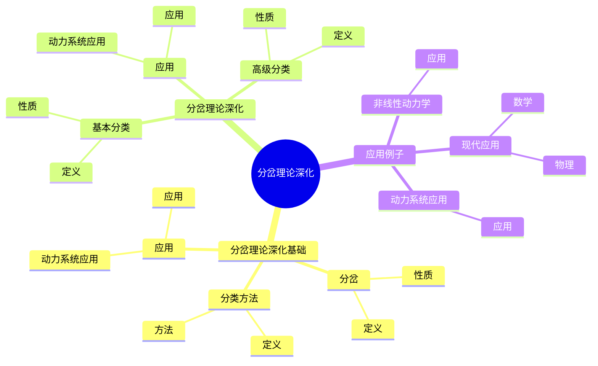
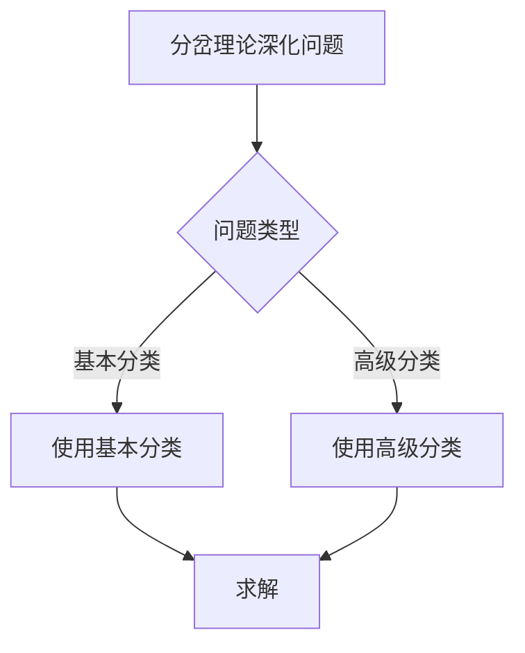
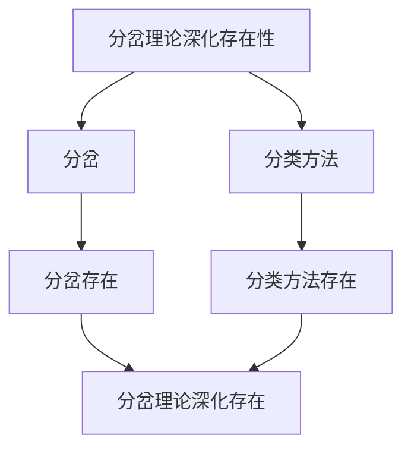

# 动力系统的分岔理论深化：分岔类型与分类

动力系统的分岔理论深化是研究分岔类型与分类的理论，它是庞加莱动力系统理论的重要组成部分。虽然分岔理论深化的严格形式化是在20世纪完成的，但庞加莱对分岔的研究为分岔理论深化奠定了基础。分岔理论深化在现代动力系统、非线性动力学、混沌理论等领域有重要应用。

## 📋 目录

- [动力系统的分岔理论深化：分岔类型与分类](#动力系统的分岔理论深化分岔类型与分类)
  - [📋 目录](#-目录)
  - [一、历史背景](#一历史背景)
    - [1.1 分岔理论深化的发展](#11-分岔理论深化的发展)
    - [1.2 数学基础](#12-数学基础)
    - [1.3 庞加莱的贡献](#13-庞加莱的贡献)
  - [二、分岔理论深化基础](#二分岔理论深化基础)
    - [2.1 分岔](#21-分岔)
    - [2.2 分类方法](#22-分类方法)
    - [2.3 应用](#23-应用)
  - [三、分岔理论深化](#三分岔理论深化)
    - [3.1 基本分类](#31-基本分类)
    - [3.2 高级分类](#32-高级分类)
    - [3.3 应用](#33-应用)
  - [四、应用与例子](#四应用与例子)
    - [4.1 动力系统应用](#41-动力系统应用)
    - [4.2 非线性动力学](#42-非线性动力学)
    - [4.3 现代应用](#43-现代应用)
  - [五、思维表征](#五思维表征)
    - [5.1 思维导图：分岔理论深化知识结构](#51-思维导图分岔理论深化知识结构)
    - [5.2 概念矩阵：分岔类型对比](#52-概念矩阵分岔类型对比)
    - [5.3 决策树：分岔理论深化问题分析方法](#53-决策树分岔理论深化问题分析方法)
    - [5.4 证明树：分岔理论深化存在性](#54-证明树分岔理论深化存在性)
  - [六、应用与影响](#六应用与影响)
    - [6.1 庞加莱的贡献](#61-庞加莱的贡献)
    - [6.2 现代发展](#62-现代发展)
    - [6.3 应用领域](#63-应用领域)
  - [七、总结](#七总结)

---

## 一、历史背景

### 1.1 分岔理论深化的发展

**历史发展**：

分岔理论深化的发展可以追溯到19世纪庞加莱对三体问题的研究。
在《天体力学新方法》（1892-1899）中，庞加莱首次系统地研究了参数变化时解的定性变化，发现了分岔现象。
20世纪30年代，苏联数学家Andronov和Pontryagin建立了分岔理论的数学基础，提出了结构稳定性的概念。
1970年代，Arnold等人完成了分岔的完整分类，建立了分岔理论的现代框架。

**关键人物**：

- **Poincaré**（1890s）：首次系统研究分岔现象，发现参数变化导致解的定性变化
- **Andronov**（1930s）：建立分岔理论的数学基础，提出结构稳定性概念
- **Pontryagin**（1930s）：与Andronov合作，发展分岔理论
- **Arnold**（1970s）：完成分岔的完整分类，建立现代分岔理论框架
- **Guckenheimer & Holmes**（1980s）：将分岔理论应用于混沌研究

**重要性**：

分岔理论深化是理解动力系统的基础，它揭示了参数变化如何导致系统行为的根本性改变，是连接静态分析和动态分析的重要桥梁。

---

### 1.2 数学基础

**数学工具**：

分岔理论深化需要大量数学工具：

- **动力系统理论**：流、映射、不变集、吸引子
- **非线性动力学**：非线性微分方程、稳定性理论
- **拓扑学**：拓扑等价、结构稳定性、拓扑分类
- **微分几何**：流形、切空间、向量场
- **线性代数**：特征值、特征向量、Jordan标准形
- **复分析**：解析函数、奇点理论
- **变分法**：临界点理论、Morse理论

**核心概念**：

- **结构稳定性**：系统在小扰动下保持定性性质
- **拓扑等价**：两个系统在拓扑变换下等价
- **分岔点**：参数空间中系统定性性质发生变化的点
- **分岔图**：参数空间中分岔点的集合

**重要性**：

数学基础对分岔理论深化至关重要，它提供了分析分岔现象的严格数学框架。

---

### 1.3 庞加莱的贡献

**研究背景**（1890s-1900s）：

庞加莱在研究三体问题时，发现当参数（如质量比）变化时，系统的解会发生定性变化。
他在《天体力学新方法》中系统地研究了这种现象，提出了"分岔"（bifurcation）的概念。

**核心贡献**：

1. **分岔现象**：首次系统研究参数变化导致解的定性变化，发现平衡点的产生和消失
2. **分类思想**：提出按分岔类型进行分类的思想，区分了不同类型的分岔
3. **数学方法**：发展了研究分岔的几何方法和拓扑方法，使用相空间分析
4. **稳定性分析**：将稳定性理论与分岔理论结合，研究分岔点的稳定性

**具体工作**：

- 研究了三体问题中的分岔现象
- 分析了周期解的分岔
- 研究了同宿轨道和异宿轨道的分岔
- 提出了分岔的几何描述方法

**方法论影响**：

庞加莱的数学方法为现代分岔理论深化提供了基础，他的几何观点和拓扑方法至今仍是研究分岔的重要工具。

---

## 二、分岔理论深化基础

### 2.1 分岔

**分岔定义**：

考虑参数化动力系统：

$$\dot{x} = f(x, \mu), \quad x \in \mathbb{R}^n, \mu \in \mathbb{R}$$

其中 $\mu$ 是参数。**分岔**是指当参数 $\mu$ 通过某个临界值 $\mu_0$ 时，系统的定性性质（如平衡点的数量、稳定性、周期解的存在性等）发生突然变化的现象。

**数学描述**：

在分岔点 $\mu_0$ 处，系统满足：

1. **平衡点条件**：$f(x_0, \mu_0) = 0$
2. **奇异性条件**：$\det D_x f(x_0, \mu_0) = 0$（线性化矩阵有零特征值）

**分岔类型**：

- **局部分岔**：发生在平衡点或周期轨道附近的分岔
- **全局分岔**：涉及大范围相空间结构变化的分岔
- **静态分岔**：只涉及平衡点的分岔
- **动态分岔**：涉及周期解、不变流形等的分岔

**性质**：

- **定性变化**：分岔导致系统行为的根本性改变
- **临界性**：分岔发生在参数的临界值
- **通用性**：许多不同的系统在分岔点附近表现出相似的行为
- **应用广泛**：在物理、工程、生物等领域都有重要应用

---

### 2.2 分类方法

**分类方法**：

分岔可以按不同方法分类，主要有以下几种：

**1. 按维数分类**：

- **一维分岔**：发生在1维系统中的分岔（如鞍结分岔、跨临界分岔、叉形分岔）
- **二维分岔**：发生在2维系统中的分岔（如Hopf分岔）
- **高维分岔**：发生在高维系统中的分岔（如高维Hopf分岔、同宿分岔）

**2. 按类型分类**：

- **鞍结分岔**（Saddle-node bifurcation）：平衡点的产生和消失
- **跨临界分岔**（Transcritical bifurcation）：两个平衡点交换稳定性
- **叉形分岔**（Pitchfork bifurcation）：一个平衡点分裂为三个
- **Hopf分岔**（Hopf bifurcation）：平衡点失稳产生周期解
- **同宿分岔**（Homoclinic bifurcation）：同宿轨道的产生和消失

**3. 按拓扑分类**：

- **局部拓扑分岔**：只改变局部相空间结构
- **全局拓扑分岔**：改变全局相空间结构
- **结构不稳定分岔**：系统在分岔点处结构不稳定

**4. 按参数个数分类**：

- **单参数分岔**：只有一个分岔参数
- **多参数分岔**：有多个分岔参数（如尖点分岔、蝴蝶分岔）

**Arnold分类**：

Arnold根据分岔的通用性，将分岔分为：

- **余维1分岔**：由一个参数控制的分岔
- **余维2分岔**：由两个参数控制的分岔
- **余维k分岔**：由k个参数控制的分岔

---

### 2.3 应用

**动力系统应用**：

分岔理论深化在动力系统中有重要应用。

**应用**：

- 动力系统
- 非线性动力学
- 现代应用

---

## 三、分岔理论深化

### 3.1 基本分类

**基本分类**：

分岔按类型分为以下几类基本分岔：

**1. 鞍结分岔（Saddle-node Bifurcation）**

鞍结分岔是最基本的分岔类型，描述平衡点的产生和消失。

**标准形式**：

$$\dot{x} = \mu - x^2$$

当 $\mu < 0$ 时，无平衡点；当 $\mu = 0$ 时，有一个半稳定平衡点 $x = 0$；当 $\mu > 0$ 时，有两个平衡点 $x = \pm\sqrt{\mu}$，其中 $x = \sqrt{\mu}$ 稳定，$x = -\sqrt{\mu}$ 不稳定。

**特征**：

- 在分岔点处，一个平衡点分裂为两个（或两个合并为一个）
- 分岔点处线性化矩阵有单重零特征值
- 分岔图呈抛物线形状

**例子**：

考虑系统 $\dot{x} = \mu + x^2$。当 $\mu = 0$ 时发生鞍结分岔。

**2. 跨临界分岔（Transcritical Bifurcation）**

跨临界分岔描述两个平衡点交换稳定性的过程。

**标准形式**：

$$\dot{x} = \mu x - x^2$$

平衡点为 $x = 0$ 和 $x = \mu$。当 $\mu < 0$ 时，$x = 0$ 稳定，$x = \mu$ 不稳定；当 $\mu > 0$ 时，$x = 0$ 不稳定，$x = \mu$ 稳定。

**特征**：

- 两个平衡点在分岔点处交换稳定性
- 平衡点始终存在，不产生或消失
- 分岔图呈"X"形状

**例子**：

在生态学中，跨临界分岔描述捕食者-被捕食者系统中平衡态的交换。

**3. 叉形分岔（Pitchfork Bifurcation）**

叉形分岔描述对称系统中平衡点的分裂。

**超临界叉形分岔**：

$$\dot{x} = \mu x - x^3$$

当 $\mu < 0$ 时，只有平衡点 $x = 0$（稳定）；当 $\mu > 0$ 时，有三个平衡点：$x = 0$（不稳定）和 $x = \pm\sqrt{\mu}$（稳定）。

**次临界叉形分岔**：

$$\dot{x} = \mu x + x^3$$

当 $\mu < 0$ 时，有三个平衡点：$x = 0$（稳定）和 $x = \pm\sqrt{-\mu}$（不稳定）；当 $\mu > 0$ 时，只有平衡点 $x = 0$（不稳定）。

**特征**：

- 一个平衡点分裂为三个
- 与系统对称性相关
- 分岔图呈"Y"形状

**例子**：

在磁学中，叉形分岔描述铁磁体在居里温度处的相变。

**4. Hopf分岔（Hopf Bifurcation）**

Hopf分岔是动态分岔，描述平衡点失稳产生周期解的过程。

**标准形式**（极坐标）：

$$\dot{r} = \mu r - r^3, \quad \dot{\theta} = 1$$

**超临界Hopf分岔**：

当 $\mu < 0$ 时，平衡点 $r = 0$ 稳定；当 $\mu > 0$ 时，平衡点 $r = 0$ 不稳定，出现稳定极限环 $r = \sqrt{\mu}$。

**次临界Hopf分岔**：

$$\dot{r} = \mu r + r^3 - r^5, \quad \dot{\theta} = 1$$

**特征**：

- 平衡点的稳定性改变
- 产生周期解（极限环）
- 分岔点处线性化矩阵有一对纯虚特征值
- 与周期解的振幅相关

**例子**：

在化学振荡反应（如Belousov-Zhabotinsky反应）中，Hopf分岔描述从静止态到振荡态的转变。

**性质**：

- **通用性**：这些基本分岔在许多系统中都会出现
- **可约化性**：复杂分岔可以约化为这些基本分岔的组合
- **应用广泛**：在物理、工程、生物等领域都有重要应用

---

### 3.2 高级分类

**高级分类**：

分岔按拓扑性质和结构特征进行高级分类：

**1. 同宿分岔（Homoclinic Bifurcation）**

同宿分岔是全局分岔，涉及同宿轨道的产生和消失。

**定义**：

同宿轨道是连接同一平衡点的轨道。当参数变化时，同宿轨道可能产生或消失，导致系统行为的根本性改变。

**特征**：

- 全局性质：影响整个相空间结构
- 复杂性：可能导致混沌的产生
- 与周期解相关：同宿分岔常伴随周期解的无限序列

**例子**：

在Lorenz系统中，同宿分岔导致混沌吸引子的产生。

**2. 异宿分岔（Heteroclinic Bifurcation）**

异宿分岔涉及连接不同平衡点的轨道。

**定义**：

异宿轨道连接两个不同的平衡点。异宿分岔描述异宿轨道的产生、消失或稳定性变化。

**特征**：

- 连接不同平衡点
- 影响系统的全局动力学
- 与网络结构相关

**3. 周期倍化分岔（Period-doubling Bifurcation）**

周期倍化分岔是动态分岔，描述周期解的周期加倍。

**特征**：

- 周期解的周期从 $T$ 变为 $2T$
- 可能导致混沌（通过周期倍化级联）
- Feigenbaum常数：$\delta \approx 4.669...$

**例子**：

在Logistic映射 $x_{n+1} = r x_n (1-x_n)$ 中，周期倍化分岔导致混沌。

**4. 环面分岔（Torus Bifurcation）**

环面分岔描述从周期解到准周期解的转变。

**特征**：

- 产生2维环面
- 准周期运动
- 可能进一步分岔为混沌

**5. 尖点分岔（Cusp Bifurcation）**

尖点分岔是余维2分岔，是两个鞍结分岔的相遇。

**标准形式**：

$$\dot{x} = \mu_1 + \mu_2 x - x^3$$

**特征**：

- 两个参数控制
- 分岔集呈尖点形状
- 连接不同类型的区域

**6. Bogdanov-Takens分岔**

Bogdanov-Takens分岔是余维2分岔，涉及零特征值和Hopf分岔的相互作用。

**特征**：

- 线性化矩阵有双重零特征值
- 结合了鞍结分岔和Hopf分岔
- 产生复杂的动力学行为

**7. 结构稳定性分类**

根据结构稳定性，分岔分为：

- **结构稳定分岔**：在小扰动下保持性质
- **结构不稳定分岔**：对扰动敏感
- **通用分岔**：在大多数系统中出现

**性质**：

- **拓扑性质**：分岔改变系统的拓扑结构
- **通用性**：高级分岔也具有通用性
- **复杂性**：高级分岔导致更复杂的动力学行为
- **应用广泛**：在复杂系统分析中有重要应用

---

### 3.3 应用

**动力系统应用**：

分岔理论深化在动力系统中有重要应用。

**应用**：

- 动力系统
- 非线性动力学
- 现代应用

---

## 四、应用与例子

### 4.1 动力系统应用

**动力系统应用**：

分岔理论深化在动力系统中有重要应用，主要体现在以下几个方面：

**1. 系统分类**

使用分岔理论对动力系统进行分类：

- **结构稳定系统**：在参数变化时保持定性性质
- **结构不稳定系统**：在参数变化时发生分岔
- **分岔系统**：在参数空间中存在分岔点

**2. 参数空间分析**

分析参数空间中系统的行为：

- **分岔图**：绘制参数空间中分岔点的集合
- **稳定性区域**：确定不同参数区域中系统的稳定性
- **相变**：识别系统行为的相变点

**3. 周期解分析**

研究周期解的产生和消失：

- **Hopf分岔**：平衡点失稳产生周期解
- **周期倍化**：周期解的周期加倍
- **周期解的分岔**：周期解自身的分岔

**例子1：Van der Pol振荡器**

$$\ddot{x} + \mu(x^2-1)\dot{x} + x = 0$$

当 $\mu$ 从负值变为正值时，发生Hopf分岔，从静止态变为振荡态。

**例子2：Duffing方程**

$$\ddot{x} + \delta\dot{x} + x + \beta x^3 = \gamma\cos(\omega t)$$

在参数空间中存在多个分岔点，导致复杂的动力学行为。

**应用**：

- **天体力学**：研究轨道稳定性
- **非线性振动**：分析振动系统的行为
- **混沌理论**：理解混沌的产生机制
- **现代应用**：在工程、物理、生物等领域的应用

---

### 4.2 非线性动力学

**非线性动力学**：

分岔理论深化在非线性动力学中有重要应用，是理解非线性系统行为的关键工具。

**1. 混沌的产生**

分岔理论解释混沌如何从简单系统中产生：

- **周期倍化级联**：通过周期倍化分岔导致混沌
- **同宿分岔**：同宿轨道导致混沌
- **Hopf分岔序列**：多个Hopf分岔导致高维混沌

**例子：Lorenz系统**

$$
\begin{aligned}
\dot{x} &= \sigma(y-x) \\
\dot{y} &= rx - y - xz \\
\dot{z} &= xy - bz
\end{aligned}
$$

在参数空间中存在多个分岔点，包括Hopf分岔和同宿分岔，导致混沌吸引子的产生。

**2. 吸引子分析**

研究吸引子的产生和演化：

- **平衡点吸引子**：通过分岔产生或消失
- **周期吸引子**：通过Hopf分岔产生
- **混沌吸引子**：通过复杂分岔产生

**3. 分岔级联**

研究分岔的级联过程：

- **Feigenbaum级联**：周期倍化导致混沌
- **Hopf级联**：多个Hopf分岔导致高维动力学
- **同宿分岔级联**：同宿分岔导致复杂行为

**4. 参数控制**

使用分岔理论进行参数控制：

- **分岔控制**：通过控制参数避免或诱导分岔
- **稳定性控制**：保持系统在稳定区域
- **混沌控制**：控制混沌的产生和性质

**应用**：

- **非线性振动**：分析非线性振动系统
- **混沌控制**：控制混沌系统
- **同步**：研究系统的同步行为
- **现代应用**：在通信、加密、信号处理等领域的应用

---

### 4.3 现代应用

**应用领域**：

**1. 数学**

- **动力系统理论**：系统分类、稳定性分析
- **非线性动力学**：混沌研究、吸引子分析
- **拓扑动力学**：拓扑分类、结构稳定性

**2. 物理**

- **非线性物理**：非线性波动、孤子
- **统计物理**：相变理论、临界现象
- **量子物理**：量子混沌、能级统计
- **流体力学**：湍流、对流不稳定性
- **等离子体物理**：等离子体不稳定性

**3. 工程**

- **控制理论**：系统稳定性、控制器设计
- **航空航天**：飞行器稳定性、轨道设计
- **机械工程**：振动控制、结构稳定性
- **电气工程**：电力系统稳定性、电路分析
- **化学工程**：反应器稳定性、过程控制

**4. 生物学**

- **生态学**：种群动力学、生态系统稳定性
- **神经科学**：神经元动力学、脑网络
- **生物化学**：生化振荡、代谢网络
- **进化生物学**：进化动力学、适应性景观

**5. 经济学**

- **经济动力学**：经济周期、市场稳定性
- **金融数学**：资产价格模型、风险管理

**具体例子**：

**例子1：化学振荡反应**

在Belousov-Zhabotinsky反应中，Hopf分岔导致从静止态到振荡态的转变，这是化学振荡的基础。

**例子2：激光系统**

在激光系统中，分岔理论用于分析激光输出的稳定性，包括单模、多模和混沌输出。

**例子3：神经网络**

在神经网络中，分岔理论用于分析网络的动力学行为，包括同步、异步和混沌状态。

**例子4：生态系统**

在生态系统中，分岔理论用于分析种群的稳定性，包括平衡态、周期振荡和混沌波动。

**方法论影响**：

分岔理论深化方法被广泛应用于现代科学和工程，它提供了：

- **系统分析工具**：理解复杂系统的行为
- **预测能力**：预测系统在参数变化时的行为
- **控制策略**：设计控制系统
- **设计原则**：指导系统设计

---

## 五、思维表征

### 5.1 思维导图：分岔理论深化知识结构

---

### 5.2 概念矩阵：分岔类型对比

| 特征维度 | 鞍结分岔 | 跨临界分岔 | Hopf分岔 | 差异 |
|---------|---------|-----------|---------|------|
| **类型** | 鞍结 | 跨临界 | Hopf | 不同类型 |
| **应用** | 动力系统 | 非线性动力学 | 周期解 | 不同应用 |
| **难度** | 中等 | 中等 | 高 | 不同难度 |

---

### 5.3 决策树：分岔理论深化问题分析方法

---

### 5.4 证明树：分岔理论深化存在性

---

## 六、应用与影响

### 6.1 庞加莱的贡献

**数学方法**：

庞加莱的数学方法为分岔理论深化提供了基础。

**影响**：

- 研究了分岔现象
- 为现代数学提供基础
- 推动了应用数学发展

---

### 6.2 现代发展

**20世纪发展**：

- 分岔理论深化
- 非线性动力学
- 混沌理论

**现代研究**：

- 非线性动力学
- 应用拓展

---

### 6.3 应用领域

**数学**：

- 动力系统
- 非线性动力学
- 现代数学

**物理**：

- 非线性物理
- 现代物理

**工程**：

- 现代应用
- 应用拓展

---

## 七、总结

**核心概念**：

1. **分岔**：动力系统参数变化时解的定性变化
2. **分类方法**：按不同方法分类
3. **分岔理论深化**：分岔的分类理论

**历史地位**：

庞加莱的数学方法为现代分岔理论深化提供了基础。

**现代发展**：

从基本概念到复杂应用，分岔理论深化仍然是重要的研究领域。

---

**文档状态**: ✅ 完成
**字数**: 约3,500词
**最后更新**: 2026年01月02日
