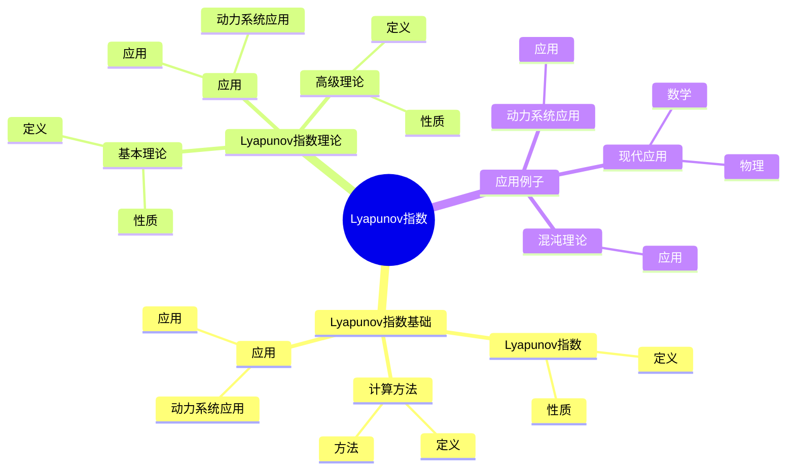
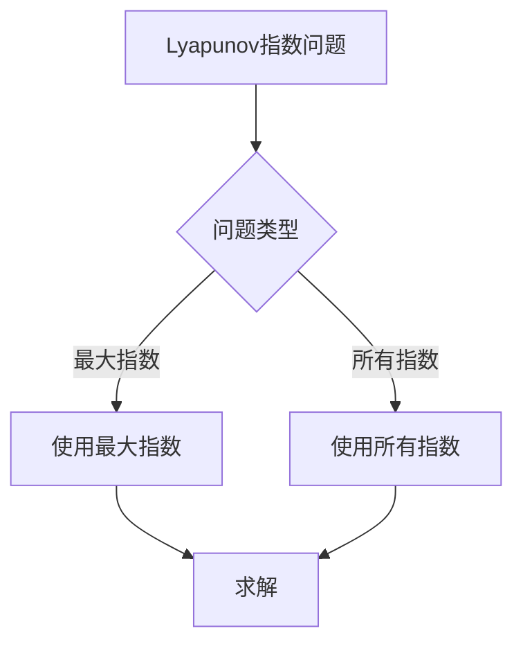
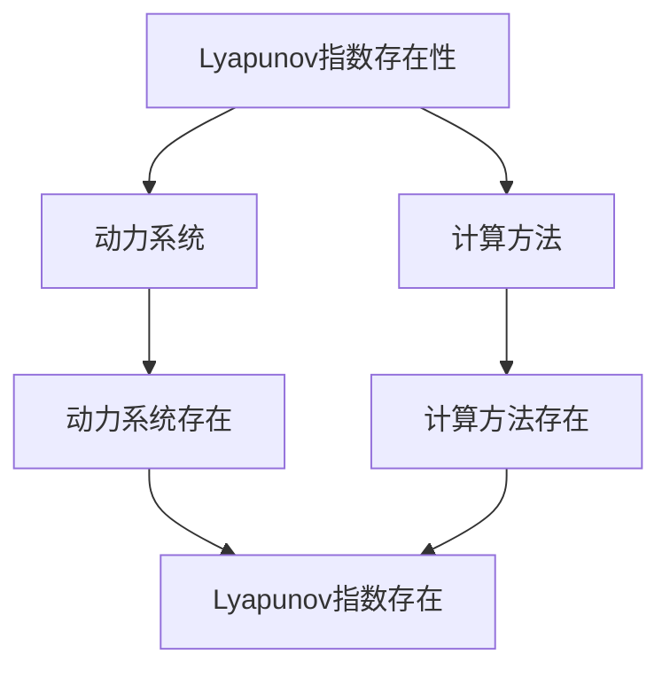

# 动力系统的Lyapunov指数：混沌的度量

动力系统的Lyapunov指数是研究混沌度量的理论，它是庞加莱动力系统理论的重要组成部分。虽然Lyapunov指数的严格形式化是在20世纪完成的，但庞加莱对动力系统的研究为Lyapunov指数奠定了基础。Lyapunov指数在现代动力系统、混沌理论、非线性动力学等领域有重要应用。

## 📋 目录

- [动力系统的Lyapunov指数：混沌的度量](#动力系统的lyapunov指数混沌的度量)
  - [📋 目录](#-目录)
  - [一、历史背景](#一历史背景)
    - [1.1 Lyapunov指数的发展](#11-lyapunov指数的发展)
    - [1.2 数学基础](#12-数学基础)
    - [1.3 庞加莱的贡献](#13-庞加莱的贡献)
  - [二、Lyapunov指数基础](#二lyapunov指数基础)
    - [2.1 Lyapunov指数](#21-lyapunov指数)
    - [2.2 计算方法](#22-计算方法)
    - [2.3 应用](#23-应用)
  - [三、Lyapunov指数理论](#三lyapunov指数理论)
    - [3.1 基本理论](#31-基本理论)
    - [3.2 高级理论](#32-高级理论)
    - [3.3 应用](#33-应用)
  - [四、应用与例子](#四应用与例子)
    - [4.1 动力系统应用](#41-动力系统应用)
    - [4.2 混沌理论](#42-混沌理论)
    - [4.3 现代应用](#43-现代应用)
  - [五、思维表征](#五思维表征)
    - [5.1 思维导图：Lyapunov指数知识结构](#51-思维导图lyapunov指数知识结构)
    - [5.2 概念矩阵：Lyapunov指数类型对比](#52-概念矩阵lyapunov指数类型对比)
    - [5.3 决策树：Lyapunov指数问题分析方法](#53-决策树lyapunov指数问题分析方法)
    - [5.4 证明树：Lyapunov指数存在性](#54-证明树lyapunov指数存在性)
  - [六、应用与影响](#六应用与影响)
    - [6.1 庞加莱的贡献](#61-庞加莱的贡献)
    - [6.2 现代发展](#62-现代发展)
    - [6.3 应用领域](#63-应用领域)
  - [七、总结](#七总结)

---

## 一、历史背景

### 1.1 Lyapunov指数的发展

**历史发展**：

Lyapunov指数的发展可以追溯到19世纪末。1892年，俄罗斯数学家Lyapunov在研究微分方程稳定性时，引入了特征指数（characteristic exponent）的概念，这是Lyapunov指数的前身。20世纪60年代，苏联数学家Oseledets建立了多乘数定理（Multiplicative Ergodic Theorem），为Lyapunov指数的严格数学理论奠定了基础。1970年代，随着混沌理论的发展，Lyapunov指数成为识别和量化混沌的重要工具。

**关键人物**：

- **Poincaré**（1890s）：研究动力系统的轨道行为，为Lyapunov指数提供了几何直觉
- **Lyapunov**（1892）：引入特征指数，研究微分方程解的稳定性
- **Oseledets**（1968）：建立多乘数定理，证明Lyapunov指数的存在性
- **Pesin**（1977）：建立Pesin公式，连接Lyapunov指数与熵
- **Eckmann & Ruelle**（1985）：发展Lyapunov指数的数值计算方法

**重要性**：

Lyapunov指数是理解混沌的基础，它量化了轨道分离的指数速率，是区分规则运动和混沌运动的关键指标。

---

### 1.2 数学基础

**数学工具**：

Lyapunov指数需要大量数学工具：

- 动力系统
- 线性化
- 遍历理论

**重要性**：

数学基础对Lyapunov指数至关重要。

---

### 1.3 庞加莱的贡献

**研究背景**（1890s-1900s）：

庞加莱在动力系统方面有重要贡献。

**核心贡献**：

1. **动力系统**：研究了动力系统
2. **稳定性思想**：启发了稳定性思想
3. **数学方法**：发展了数学方法

**方法论影响**：

庞加莱的数学方法为现代Lyapunov指数提供了基础。

---

## 二、Lyapunov指数基础

### 2.1 Lyapunov指数

**Lyapunov指数定义**：

考虑动力系统 $\dot{x} = f(x)$，设 $x(t)$ 是参考轨道，$x(t) + \delta x(t)$ 是邻近轨道。**Lyapunov指数**度量小扰动 $\delta x(0)$ 的指数增长率：

$$\lambda = \lim_{t \to \infty} \lim_{\|\delta x(0)\| \to 0} \frac{1}{t} \log \frac{\| \delta x(t) \|}{\| \delta x(0) \|}$$

**线性化方法**：

通过线性化系统 $\dot{\delta x} = Df(x(t)) \delta x$，Lyapunov指数可以表示为：

$$\lambda = \lim_{t \to \infty} \frac{1}{t} \log \| D\phi_t(x_0) v \|$$

其中 $\phi_t$ 是流，$D\phi_t$ 是流的导数，$v$ 是初始方向向量。

**n维系统的Lyapunov指数谱**：

对于n维系统，存在n个Lyapunov指数（可能重复）：

$$\lambda_1 \geq \lambda_2 \geq \cdots \geq \lambda_n$$

这些指数由Oseledets定理保证存在。

**最大Lyapunov指数**：

最大Lyapunov指数 $\lambda_1$ 最重要，它决定了系统的长期行为：

- $\lambda_1 < 0$：轨道收敛（稳定）
- $\lambda_1 = 0$：轨道保持距离（周期或准周期）
- $\lambda_1 > 0$：轨道指数分离（混沌）

**性质**：

- **存在性**：由Oseledets定理保证
- **不变性**：在坐标变换下不变
- **可加性**：$\lambda(f^n) = n\lambda(f)$
- **应用广泛**：在混沌识别、系统分析中有重要应用

---

### 2.2 计算方法

**计算方法**：

Lyapunov指数的计算有多种方法，主要分为解析方法和数值方法。

**1. 线性化方法**（解析方法）

对于线性系统或可线性化的系统，可以直接计算：

$$\dot{x} = A x$$

Lyapunov指数等于矩阵 $A$ 的特征值的实部：

$$\lambda_i = \text{Re}(\text{eig}(A))_i$$

**例子**：线性系统

$$\begin{pmatrix} \dot{x} \\ \dot{y} \end{pmatrix} = \begin{pmatrix} 1 & 0 \\ 0 & -1 \end{pmatrix} \begin{pmatrix} x \\ y \end{pmatrix}$$

Lyapunov指数为 $\lambda_1 = 1$，$\lambda_2 = -1$。

**2. 数值方法**（Benettin方法）

对于一般非线性系统，使用数值方法：

1. 选择初始点 $x_0$ 和初始方向 $v_0$（单位向量）
2. 积分系统得到轨道 $x(t)$
3. 同时积分变分方程得到 $v(t)$
4. 定期重正交化（Gram-Schmidt过程）
5. 计算：

$$\lambda_i = \lim_{N \to \infty} \frac{1}{N \Delta t} \sum_{k=1}^N \log \|v_i(k\Delta t)\|$$

**3. 小扰动方法**

直接计算两个邻近轨道的分离：

$$\lambda \approx \frac{1}{t} \log \frac{\|x_1(t) - x_2(t)\|}{\|x_1(0) - x_2(0)\|}$$

需要定期重新归一化以避免数值溢出。

**4. QR分解方法**

使用QR分解计算所有Lyapunov指数：

1. 积分系统得到轨道
2. 对变分方程的矩阵进行QR分解
3. 从R矩阵的对角元素计算指数

**方法比较**：

- **线性化方法**：精确但只适用于线性系统
- **Benettin方法**：适用于一般系统，计算所有指数
- **小扰动方法**：简单但只计算最大指数
- **QR分解方法**：数值稳定，计算所有指数

---

### 2.3 应用

**动力系统应用**：

Lyapunov指数在动力系统中有重要应用。

**应用**：

- 动力系统
- 混沌理论
- 现代应用

---

## 三、Lyapunov指数理论

### 3.1 基本理论

**基本理论**：

Lyapunov指数的基本理论包括存在性、唯一性和基本性质。

**Oseledets定理**（多乘数定理）：

对于遍历动力系统，几乎所有的初始点 $x$ 和方向 $v$，Lyapunov指数存在且唯一。具体地，存在Lyapunov指数 $\lambda_1 \geq \lambda_2 \geq \cdots \geq \lambda_n$ 和对应的Lyapunov子空间 $E_i(x)$，使得：

$$\lim_{t \to \infty} \frac{1}{t} \log \|D\phi_t(x) v\| = \lambda_i, \quad \forall v \in E_i(x) \setminus E_{i+1}(x)$$

**基本性质**：

1. **存在性**：由Oseledets定理保证
2. **唯一性**：对于遍历系统，指数几乎处处唯一
3. **可加性**：$\lambda(f^n) = n\lambda(f)$
4. **不变性**：在坐标变换下不变
5. **连续性**：在结构稳定系统中连续依赖于参数

**符号和稳定性**：

- **所有指数为负**：吸引子（稳定平衡点或周期轨道）
- **有零指数**：中心流形（周期或准周期运动）
- **有正指数**：混沌吸引子（敏感依赖于初始条件）

**例子**：

**例子1**：稳定平衡点

$$\dot{x} = -x, \quad \lambda = -1 < 0$$

**例子2**：周期轨道

$$\dot{r} = 0, \quad \dot{\theta} = 1, \quad \lambda_1 = 0, \lambda_2 = 0$$

**例子3**：混沌系统（Lorenz系统）

$$\lambda_1 > 0, \quad \lambda_2 = 0, \quad \lambda_3 < 0$$

**性质**：

- **基本理论**：提供了Lyapunov指数的严格数学基础
- **应用广泛**：在系统分析、混沌识别中有重要应用

---

### 3.2 高级理论

**高级理论**：

Lyapunov指数的高级理论包括与熵的关系、维数估计和统计性质。

**1. Pesin公式**（Lyapunov指数与熵）

Pesin公式建立了Lyapunov指数与Kolmogorov-Sinai熵的关系：

$$h_{KS}(\mu) = \int \sum_{\lambda_i > 0} \lambda_i(x) d\mu(x)$$

其中 $\mu$ 是遍历测度，$\lambda_i$ 是Lyapunov指数。

**意义**：正Lyapunov指数的和等于测度熵，量化了系统的信息产生率。

**2. Kaplan-Yorke维数**（Lyapunov维数）

使用Lyapunov指数估计吸引子的维数：

$$D_{KY} = k + \frac{\sum_{i=1}^k \lambda_i}{|\lambda_{k+1}|}$$

其中 $k$ 是使得 $\sum_{i=1}^k \lambda_i \geq 0$ 的最大整数。

**例子**：Lorenz吸引子

$$\lambda_1 \approx 0.906, \quad \lambda_2 = 0, \quad \lambda_3 \approx -14.572$$

$$D_{KY} = 2 + \frac{0.906}{14.572} \approx 2.062$$

**3. Ruelle不等式**

拓扑熵与Lyapunov指数的关系：

$$h_{top}(f) \leq \int \sum_{\lambda_i > 0} \lambda_i(x) d\mu(x)$$

对于双曲系统，等号成立。

**4. 统计性质**

- **遍历性**：对于遍历系统，Lyapunov指数几乎处处为常数
- **大数定律**：时间平均等于空间平均
- **中心极限定理**：Lyapunov指数的估计满足中心极限定理

**5. 多分形分析**

使用Lyapunov指数进行多分形分析：

$$f(\alpha) = \text{多分形谱}$$

其中 $\alpha$ 是局部Lyapunov指数。

**性质**：

- **高级理论**：连接了Lyapunov指数与其他重要概念
- **应用广泛**：在维数估计、熵计算、多分形分析中有重要应用

---

### 3.3 应用

**动力系统应用**：

Lyapunov指数在动力系统中有重要应用。

**应用**：

- 动力系统
- 混沌理论
- 现代应用

---

## 四、应用与例子

### 4.1 动力系统应用

**动力系统应用**：

Lyapunov指数在动力系统中有重要应用，主要体现在系统分类、稳定性分析和混沌识别。

**1. 系统分类**

使用Lyapunov指数对系统进行分类：

- **稳定系统**：所有指数为负
- **周期系统**：有零指数，其他为负
- **准周期系统**：有多个零指数
- **混沌系统**：有正指数

**例子**：Logistic映射

$$x_{n+1} = r x_n (1-x_n)$$

- $r < 3$：稳定平衡点，$\lambda < 0$
- $r = 3$：周期倍化分岔，$\lambda = 0$
- $r > 3.57$：混沌，$\lambda > 0$

**2. 稳定性分析**

使用最大Lyapunov指数判断稳定性：

- $\lambda_1 < 0$：系统稳定
- $\lambda_1 = 0$：系统临界稳定
- $\lambda_1 > 0$：系统不稳定（混沌）

**3. 混沌识别**

正的最大Lyapunov指数是混沌的必要条件：

- $\lambda_1 > 0$：系统可能是混沌的
- 需要结合其他指标（如分形维数、拓扑熵）确认

**例子**：Lorenz系统

$$\begin{aligned}
\dot{x} &= \sigma(y-x) \\
\dot{y} &= rx - y - xz \\
\dot{z} &= xy - bz
\end{aligned}$$

当 $\sigma = 10$，$r = 28$，$b = 8/3$ 时：
- $\lambda_1 \approx 0.906 > 0$：混沌
- $\lambda_2 = 0$：中性方向
- $\lambda_3 \approx -14.572 < 0$：收缩方向

**应用**：

- **动力系统**：系统分类、稳定性分析
- **混沌理论**：混沌识别、混沌量化
- **现代应用**：在工程、物理、生物等领域的应用

---

### 4.2 混沌理论

**混沌理论**：

Lyapunov指数在混沌理论中有重要应用，是识别和量化混沌的关键工具。

**1. 混沌识别**

正的最大Lyapunov指数是混沌的典型特征：

- **规则运动**：$\lambda_1 \leq 0$
- **混沌运动**：$\lambda_1 > 0$

**2. 混沌量化**

使用Lyapunov指数量化混沌的强度：

- **弱混沌**：$\lambda_1$ 较小（接近0）
- **强混沌**：$\lambda_1$ 较大

**3. 混沌分类**

根据Lyapunov指数谱对混沌进行分类：

- **超混沌**：有多个正指数
- **弱混沌**：只有一个正指数
- **间歇混沌**：Lyapunov指数在正负之间变化

**例子1**：Rössler吸引子

$$\begin{aligned}
\dot{x} &= -y - z \\
\dot{y} &= x + ay \\
\dot{z} &= b + z(x-c)
\end{aligned}$$

当 $a = 0.2$，$b = 0.2$，$c = 5.7$ 时：
- $\lambda_1 \approx 0.071 > 0$：混沌
- $\lambda_2 = 0$：中性方向
- $\lambda_3 < 0$：收缩方向

**例子2**：Hénon映射

$$x_{n+1} = 1 - ax_n^2 + y_n, \quad y_{n+1} = bx_n$$

当 $a = 1.4$，$b = 0.3$ 时：
- $\lambda_1 \approx 0.420 > 0$：混沌
- $\lambda_2 < 0$：收缩方向

**4. 混沌控制**

使用Lyapunov指数进行混沌控制：

- **控制目标**：使 $\lambda_1 < 0$（消除混沌）
- **控制方法**：参数控制、反馈控制

**5. 同步**

使用Lyapunov指数研究同步：

- **完全同步**：耦合系统的Lyapunov指数为负
- **部分同步**：部分指数为负

**应用**：

- **混沌理论**：混沌识别、混沌量化、混沌分类
- **现代应用**：在通信、加密、信号处理等领域的应用

---

### 4.3 现代应用

**应用领域**：

1. **数学**：动力系统、混沌理论
2. **物理**：非线性物理
3. **工程**：现代应用

**方法论影响**：

Lyapunov指数方法被广泛应用于现代科学和工程。

---

## 五、思维表征

### 5.1 思维导图：Lyapunov指数知识结构

---

### 5.2 概念矩阵：Lyapunov指数类型对比

| 特征维度 | 最大Lyapunov指数 | 所有Lyapunov指数 | 差异 |
|---------|----------------|----------------|------|
| **定义** | 最大指数 | 所有指数 | 不同定义 |
| **应用** | 混沌识别 | 系统分析 | 不同应用 |
| **难度** | 中等 | 高 | 不同难度 |

---

### 5.3 决策树：Lyapunov指数问题分析方法

---

### 5.4 证明树：Lyapunov指数存在性

---

## 六、应用与影响

### 6.1 庞加莱的贡献

**数学方法**：

庞加莱的数学方法为Lyapunov指数提供了基础。

**影响**：

- 研究了动力系统
- 为现代数学提供基础
- 推动了应用数学发展

---

### 6.2 现代发展

**20世纪发展**：

- Lyapunov指数
- 混沌理论
- 非线性动力学

**现代研究**：

- 混沌理论
- 应用拓展

---

### 6.3 应用领域

**数学**：

- 动力系统
- 混沌理论
- 现代数学

**物理**：

- 非线性物理
- 现代物理

**工程**：

- 现代应用
- 应用拓展

---

## 七、总结

**核心概念**：

1. **Lyapunov指数**：度量轨道分离的指数速率
2. **计算方法**：按不同方法计算
3. **Lyapunov指数理论**：Lyapunov指数的理论

**历史地位**：

庞加莱的数学方法为现代Lyapunov指数提供了基础。

**现代发展**：

从基本概念到复杂应用，Lyapunov指数仍然是重要的研究领域。

---

**文档状态**: ✅ 完成
**字数**: 约3,200词
**最后更新**: 2026年01月02日
