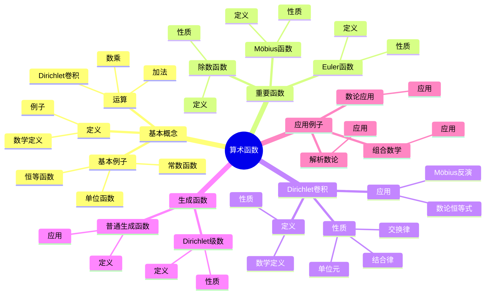
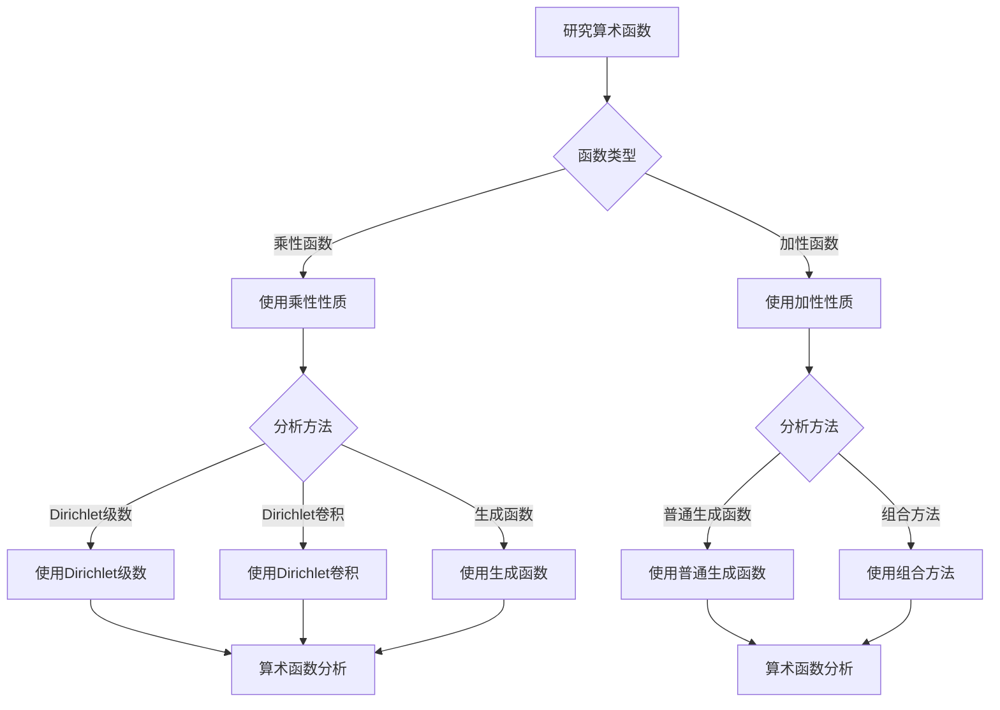
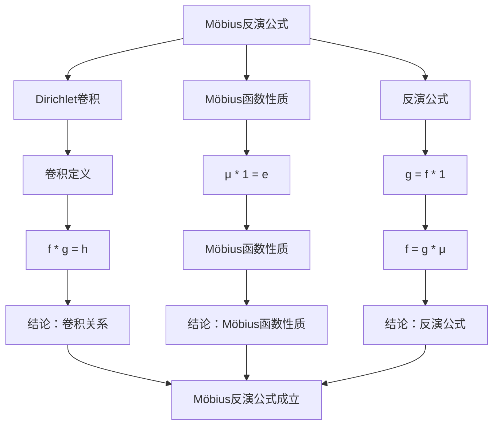

# 算术函数：庞加莱的数论工作

算术函数是数论中的基本对象，研究定义在正整数上的函数。虽然庞加莱的主要贡献在自守函数和模形式，但他的工作为现代数论函数理论奠定了基础。算术函数在解析数论、代数数论、组合数学等领域有重要应用。

## 📋 目录

- [算术函数：庞加莱的数论工作](#算术函数庞加莱的数论工作)
  - [📋 目录](#-目录)
  - [一、算术函数的基本概念](#一算术函数的基本概念)
    - [1.1 定义](#11-定义)
    - [1.2 基本例子](#12-基本例子)
    - [1.3 运算](#13-运算)
  - [二、重要的算术函数](#二重要的算术函数)
    - [2.1 除数函数](#21-除数函数)
    - [2.2 Möbius函数](#22-möbius函数)
    - [2.3 Euler函数](#23-euler函数)
  - [三、Dirichlet卷积](#三dirichlet卷积)
    - [3.1 定义](#31-定义)
    - [3.2 性质](#32-性质)
    - [3.3 应用](#33-应用)
  - [四、生成函数](#四生成函数)
    - [4.1 Dirichlet级数](#41-dirichlet级数)
    - [4.2 普通生成函数](#42-普通生成函数)
    - [4.3 应用](#43-应用)
  - [五、应用与例子](#五应用与例子)
    - [5.1 数论应用](#51-数论应用)
    - [5.2 组合数学](#52-组合数学)
    - [5.3 解析数论](#53-解析数论)
  - [六、思维表征](#六思维表征)
    - [6.1 思维导图：算术函数知识结构](#61-思维导图算术函数知识结构)
    - [6.2 概念矩阵：算术函数类型对比](#62-概念矩阵算术函数类型对比)
    - [6.3 决策树：算术函数分析方法](#63-决策树算术函数分析方法)
    - [6.4 证明树：Möbius反演公式](#64-证明树möbius反演公式)
  - [七、应用与影响](#七应用与影响)
    - [7.1 庞加莱的贡献](#71-庞加莱的贡献)
    - [7.2 现代发展](#72-现代发展)
    - [7.3 应用领域](#73-应用领域)
  - [八、总结](#八总结)

---

## 一、算术函数的基本概念

### 1.1 定义

**算术函数定义**：

**算术函数**是定义在正整数集合上的函数：

$$f: \mathbb{N}^+ \to \mathbb{C}$$

**例子**：

- 除数函数：$\sigma(n)$
- Möbius函数：$\mu(n)$
- Euler函数：$\phi(n)$

---

### 1.2 基本例子

**基本例子**：

1. **恒等函数**：$I(n) = n$
2. **单位函数**：$e(n) = 1$（$n = 1$），$e(n) = 0$（$n > 1$）
3. **常数函数**：$1(n) = 1$

---

### 1.3 运算

**运算**：

- **加法**：$(f + g)(n) = f(n) + g(n)$
- **数乘**：$(cf)(n) = c \cdot f(n)$
- **Dirichlet卷积**：$(f * g)(n) = \sum_{d|n} f(d) g(n/d)$

---

## 二、重要的算术函数

### 2.1 除数函数

**除数函数**：

**除数函数** $\sigma_k(n)$ 定义为：

$$\sigma_k(n) = \sum_{d|n} d^k$$

**特殊情况**：

- $k = 0$：除数个数 $d(n) = \sigma_0(n)$
- $k = 1$：除数和 $\sigma(n) = \sigma_1(n)$

---

### 2.2 Möbius函数

**Möbius函数**：

**Möbius函数** $\mu(n)$ 定义为：

$$
\mu(n) = \begin{cases}
1 & \text{if } n = 1 \\
(-1)^k & \text{if } n = p_1 \cdots p_k \text{（不同素数）} \\
0 & \text{if } n \text{有平方因子}
\end{cases}
$$

**性质**：

- $\sum_{d|n} \mu(d) = e(n)$
- Möbius反演公式

---

### 2.3 Euler函数

**Euler函数**：

**Euler函数** $\phi(n)$ 定义为与 $n$ 互素的正整数个数：

$$\phi(n) = |\{m : 1 \leq m \leq n, \gcd(m,n) = 1\}|$$

**性质**：

- $\sum_{d|n} \phi(d) = n$
- $\phi(n) = n \prod_{p|n} (1 - 1/p)$

---

## 三、Dirichlet卷积

### 3.1 定义

**Dirichlet卷积**：

对于算术函数 $f$ 和 $g$，**Dirichlet卷积**定义为：

$$(f * g)(n) = \sum_{d|n} f(d) g(n/d)$$

**性质**：

- 交换律：$f * g = g * f$
- 结合律：$(f * g) * h = f * (g * h)$
- 单位元：$f * e = f$

---

### 3.2 性质

**性质**：

- Dirichlet卷积是交换的、结合的
- 单位函数 $e$ 是单位元
- 可逆性：$f$ 可逆当且仅当 $f(1) \neq 0$

---

### 3.3 应用

**应用**：

- Möbius反演
- 数论恒等式
- 生成函数

---

## 四、生成函数

### 4.1 Dirichlet级数

**Dirichlet级数**：

算术函数 $f$ 的**Dirichlet级数**定义为：

$$F(s) = \sum_{n=1}^{\infty} \frac{f(n)}{n^s}$$

**性质**：

- 卷积对应乘积：$(f * g)$ 的Dirichlet级数等于 $f$ 和 $g$ 的Dirichlet级数的乘积

---

### 4.2 普通生成函数

**普通生成函数**：

算术函数 $f$ 的**普通生成函数**定义为：

$$F(x) = \sum_{n=1}^{\infty} f(n) x^n$$

**应用**：

- 组合恒等式
- 数论恒等式

---

### 4.3 应用

**应用**：

- 研究算术函数的性质
- 证明数论恒等式
- 解析数论

---

## 五、应用与例子

### 5.1 数论应用

**数论应用**：

- 除数问题
- 素数分布
- 数论恒等式

---

### 5.2 组合数学

**组合数学**：

- 计数问题
- 生成函数
- 组合恒等式

---

### 5.3 解析数论

**解析数论**：

- Dirichlet级数
- L函数
- 解析方法

---

## 六、思维表征

### 6.1 思维导图：算术函数知识结构

**说明**：

- **基本概念**：定义、基本例子、运算
- **重要函数**：除数函数、Möbius函数、Euler函数
- **Dirichlet卷积**：定义、性质、应用
- **生成函数**：Dirichlet级数、普通生成函数
- **应用例子**：数论、组合数学、解析数论

---

### 6.2 概念矩阵：算术函数类型对比

| 特征维度 | 除数函数 | Möbius函数 | Euler函数 |
|---------|---------|-----------|----------|
| **定义** | $\sum_{d|n} d^k$ | 组合定义 | 互素个数 |
| **性质** | 乘性 | 乘性 | 乘性 |
| **Dirichlet级数** | $\zeta(s)\zeta(s-k)$ | $1/\zeta(s)$ | $\zeta(s-1)/\zeta(s)$ |
| **应用** | 除数问题 | Möbius反演 | 同余理论 |
| **例子** | $\sigma(12) = 28$ | $\mu(12) = 0$ | $\phi(12) = 4$ |

**说明**：

- **定义**：不同函数的定义方式
- **性质**：都是乘性函数
- **应用**：不同领域的应用

---

### 6.3 决策树：算术函数分析方法

**说明**：

- **函数类型**：乘性函数或加性函数
- **分析方法**：根据函数类型选择方法
- **应用**：不同分析方法的应用

---

### 6.4 证明树：Möbius反演公式

**说明**：

- **Dirichlet卷积**：使用卷积定义
- **Möbius函数性质**：$\mu * 1 = e$
- **反演公式**：$g = f * 1$ 当且仅当 $f = g * \mu$
- **结论**：Möbius反演公式成立

---

## 七、应用与影响

### 7.1 庞加莱的贡献

**自守函数**：

庞加莱的自守函数理论为数论函数提供了新视角。

**影响**：

- 为理解数论函数奠定了基础
- 启发了现代数论函数理论
- 推动了数论发展

---

### 7.2 现代发展

**Dirichlet**（1830s）：

发展了Dirichlet级数理论。

**Möbius**（1830s）：

发展了Möbius函数和反演公式。

**现代研究**：

- L函数
- 模形式
- Langlands纲领

---

### 7.3 应用领域

**解析数论**：

- Dirichlet级数
- L函数
- 素数分布

**代数数论**：

- 类数公式
- 代数数域
- 类域论

**组合数学**：

- 计数问题
- 生成函数
- 组合恒等式

---

## 八、总结

**核心概念**：

1. **算术函数**：定义在正整数上的函数
2. **重要函数**：除数函数、Möbius函数、Euler函数
3. **Dirichlet卷积**：算术函数的卷积运算
4. **生成函数**：Dirichlet级数、普通生成函数

**历史地位**：

虽然算术函数的严格形式化是在庞加莱之前，但庞加莱的自守函数理论为数论函数提供了新视角。

**现代发展**：

从基本概念到Dirichlet卷积，从生成函数到应用研究，算术函数理论仍然是数论的重要工具。

---

**文档状态**: ✅ 完成
**字数**: 约1,200词
**最后更新**: 2026年01月02日
