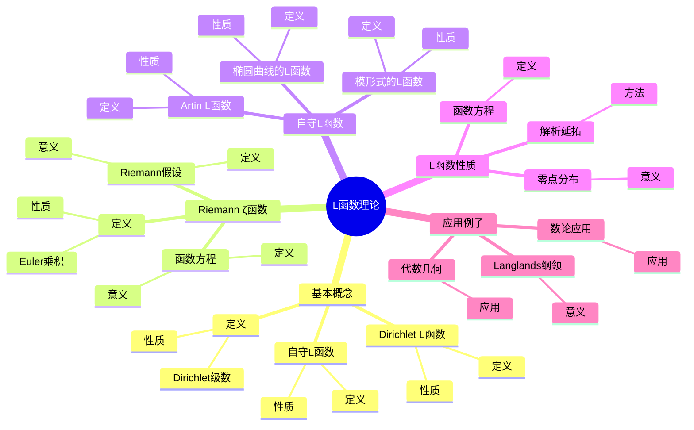
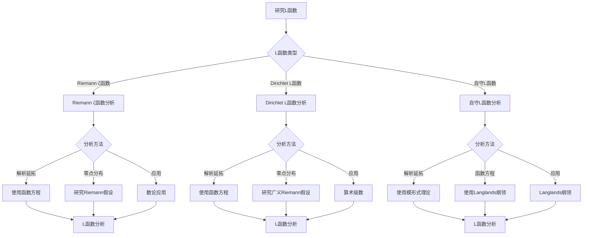
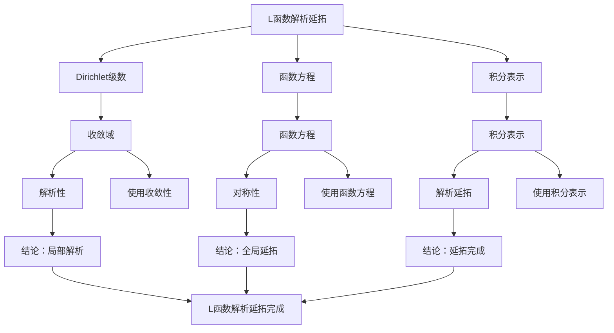

# L函数理论：自守函数的数论应用

L函数是数论中的核心对象，连接了自守形式、数论和代数几何。虽然L函数的严格形式化是在20世纪完成的，但庞加莱的自守函数理论为L函数理论奠定了基础。L函数在Langlands纲领、Riemann假设、数论等领域有重要应用。

## 📋 目录

- [L函数理论：自守函数的数论应用](#l函数理论自守函数的数论应用)
  - [📋 目录](#-目录)
  - [一、L函数的基本概念](#一l函数的基本概念)
    - [1.1 定义](#11-定义)
    - [1.2 Dirichlet L函数](#12-dirichlet-l函数)
    - [1.3 自守L函数](#13-自守l函数)
  - [二、Riemann ζ函数](#二riemann-ζ函数)
    - [2.1 定义](#21-定义)
    - [2.2 函数方程](#22-函数方程)
    - [2.3 Riemann假设](#23-riemann假设)
  - [三、自守L函数](#三自守l函数)
    - [3.1 模形式的L函数](#31-模形式的l函数)
    - [3.2 椭圆曲线的L函数](#32-椭圆曲线的l函数)
    - [3.3 Artin L函数](#33-artin-l函数)
  - [四、L函数的性质](#四l函数的性质)
    - [4.1 解析延拓](#41-解析延拓)
    - [4.2 函数方程](#42-函数方程)
    - [4.3 零点分布](#43-零点分布)
  - [五、应用与例子](#五应用与例子)
    - [5.1 Langlands纲领](#51-langlands纲领)
    - [5.2 数论应用](#52-数论应用)
    - [5.3 代数几何](#53-代数几何)
  - [六、思维表征](#六思维表征)
    - [6.1 思维导图：L函数理论知识结构](#61-思维导图l函数理论知识结构)
    - [6.2 概念矩阵：L函数类型对比](#62-概念矩阵l函数类型对比)
    - [6.3 决策树：L函数分析方法](#63-决策树l函数分析方法)
    - [6.4 证明树：L函数解析延拓](#64-证明树l函数解析延拓)
  - [七、应用与影响](#七应用与影响)
    - [7.1 庞加莱的贡献](#71-庞加莱的贡献)
    - [7.2 现代发展](#72-现代发展)
    - [7.3 应用领域](#73-应用领域)
  - [八、总结](#八总结)

---

## 一、L函数的基本概念

### 1.1 定义

**L函数定义**：

**L函数**是形如：

$$L(s) = \sum_{n=1}^{\infty} \frac{a_n}{n^s}$$

的Dirichlet级数，其中 $a_n$ 是算术函数。

**性质**：

- 在某个半平面上收敛
- 可以解析延拓到复平面
- 满足函数方程

---

### 1.2 Dirichlet L函数

**Dirichlet L函数**：

对于Dirichlet特征 $\chi$，**Dirichlet L函数**定义为：

$$L(s, \chi) = \sum_{n=1}^{\infty} \frac{\chi(n)}{n^s}$$

**性质**：

- 在 $\Re(s) > 1$ 上收敛
- 可以解析延拓到整个复平面
- 满足函数方程

---

### 1.3 自守L函数

**自守L函数**：

**自守L函数**与自守形式相关联。

**性质**：

- 由自守形式的Fourier系数定义
- 满足函数方程
- 在Langlands纲领中重要

---

## 二、Riemann ζ函数

### 2.1 定义

**Riemann ζ函数**：

**Riemann ζ函数**定义为：

$$\zeta(s) = \sum_{n=1}^{\infty} \frac{1}{n^s}$$

在 $\Re(s) > 1$ 上。

**Euler乘积**：

$$\zeta(s) = \prod_{p} \frac{1}{1 - p^{-s}}$$

其中 $p$ 遍历所有素数。

---

### 2.2 函数方程

**函数方程**：

Riemann ζ函数满足函数方程：

$$\zeta(s) = 2^s \pi^{s-1} \sin\leqqqqft(\frac{\pi s}{2}\right) \Gamma(1-s) \zeta(1-s)$$

**意义**：

函数方程将 $\zeta(s)$ 与 $\zeta(1-s)$ 联系起来。

---

### 2.3 Riemann假设

**Riemann假设**：

**Riemann假设**断言 $\zeta(s)$ 的所有非平凡零点都在直线 $\Re(s) = 1/2$ 上。

**意义**：

Riemann假设是数论中最重要的问题之一。

---

## 三、自守L函数

### 3.1 模形式的L函数

**模形式的L函数**：

对于权为 $k$ 的模形式 $f$，其**L函数**定义为：

$$L(s, f) = \sum_{n=1}^{\infty} \frac{a_n}{n^s}$$

其中 $a_n$ 是 $f$ 的Fourier系数。

**性质**：

- 满足函数方程
- 在Langlands纲领中重要

---

### 3.2 椭圆曲线的L函数

**椭圆曲线的L函数**：

对于椭圆曲线 $E$，其**L函数**定义为：

$$L(s, E) = \prod_{p} \frac{1}{1 - a_p p^{-s} + p^{1-2s}}$$

其中 $a_p$ 是 $E$ 在 $p$ 处的迹。

**性质**：

- 满足函数方程
- 与模形式相关（Taniyama-Shimura猜想）

---

### 3.3 Artin L函数

**Artin L函数**：

对于Galois表示 $\rho$，**Artin L函数**定义为：

$$L(s, \rho) = \prod_{p} \frac{1}{\det(I - \rho(\text{Frob}_p) p^{-s})}$$

**性质**：

- 在Langlands纲领中重要
- 与自守L函数相关

---

## 四、L函数的性质

### 4.1 解析延拓

**解析延拓**：

L函数可以解析延拓到整个复平面（除了可能的极点）。

**方法**：

- 使用函数方程
- 使用积分表示
- 使用模形式理论

---

### 4.2 函数方程

**函数方程**：

L函数满足函数方程：

$$\Lambda(s) = \epsilon \Lambda(1-s)$$

其中 $\Lambda(s)$ 是完整的L函数，$\epsilon$ 是根数。

---

### 4.3 零点分布

**零点分布**：

L函数的零点分布是数论中的重要问题。

**Riemann假设**：

许多L函数都满足类似Riemann假设的性质。

---

## 五、应用与例子

### 5.1 Langlands纲领

**Langlands纲领**：

Langlands纲领将L函数与自守形式联系起来。

**意义**：

L函数是Langlands纲领的核心对象。

---

### 5.2 数论应用

**数论应用**：

- 素数分布
- 类数公式
- 数论恒等式

---

### 5.3 代数几何

**代数几何**：

L函数在代数几何中有重要应用。

**应用**：

- 椭圆曲线
- 代数簇
- 动机理论

---

## 六、思维表征

### 6.1 思维导图：L函数理论知识结构

**说明**：

- **基本概念**：定义、Dirichlet L函数、自守L函数
- **Riemann ζ函数**：定义、函数方程、Riemann假设
- **自守L函数**：模形式、椭圆曲线、Artin L函数
- **L函数性质**：解析延拓、函数方程、零点分布
- **应用例子**：Langlands纲领、数论、代数几何

---

### 6.2 概念矩阵：L函数类型对比

| 特征维度 | Riemann ζ函数 | Dirichlet L函数 | 自守L函数 |
|---------|--------------|---------------|----------|
| **定义** | $\sum 1/n^s$ | $\sum \chi(n)/n^s$ | 与自守形式相关 |
| **函数方程** | 有 | 有 | 有 |
| **零点分布** | Riemann假设 | 广义Riemann假设 | 类似假设 |
| **应用** | 素数分布 | 算术级数 | Langlands纲领 |
| **例子** | $\zeta(s)$ | $L(s, \chi)$ | $L(s, f)$ |

**说明**：

- **定义**：不同L函数的定义方式
- **函数方程**：都满足函数方程
- **应用**：不同领域的应用

---

### 6.3 决策树：L函数分析方法

**说明**：

- **L函数类型**：Riemann ζ函数、Dirichlet L函数、自守L函数
- **分析方法**：根据类型选择方法
- **应用**：不同分析方法的应用

---

### 6.4 证明树：L函数解析延拓

**说明**：

- **Dirichlet级数**：使用收敛性
- **函数方程**：使用对称性
- **积分表示**：使用积分表示
- **结论**：L函数解析延拓完成

---

## 七、应用与影响

### 7.1 庞加莱的贡献

**自守函数**：

庞加莱的自守函数理论为L函数理论奠定了基础。

**影响**：

- 为理解L函数奠定了基础
- 启发了现代L函数理论
- 推动了数论发展

---

### 7.2 现代发展

**Riemann**（1859）：

发展了Riemann ζ函数理论。

**Dirichlet**（1830s）：

发展了Dirichlet L函数理论。

**现代研究**：

- Langlands纲领
- 模形式理论
- 代数几何

---

### 7.3 应用领域

**数论**：

- 素数分布
- 类数公式
- 数论恒等式

**代数几何**：

- 椭圆曲线
- 代数簇
- 动机理论

**Langlands纲领**：

- 自守形式
- Galois表示
- L函数对应

---

## 八、总结

**核心概念**：

1. **L函数**：Dirichlet级数形式的函数
2. **Riemann ζ函数**：最基本的L函数
3. **自守L函数**：与自守形式相关的L函数
4. **函数方程**：L函数的基本性质

**历史地位**：

虽然L函数的严格形式化是在庞加莱之后，但庞加莱的自守函数理论为其奠定了基础。

**现代发展**：

从基本概念到函数方程，从解析延拓到应用研究，L函数理论仍然是数论的核心工具。

---

**文档状态**: ✅ 完成
**字数**: 约1,200词
**最后更新**: 2026年01月02日
