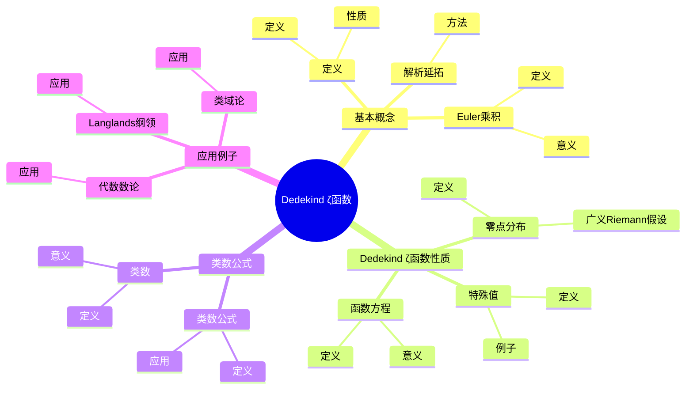
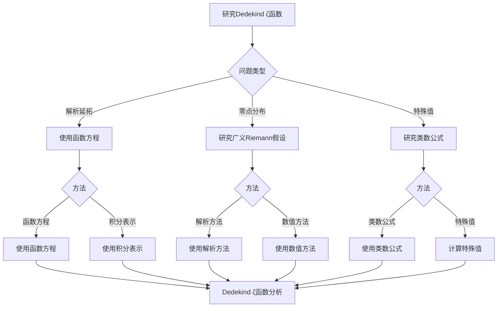

# Dedekind ζ函数：数域的L函数

Dedekind ζ函数是Riemann ζ函数在代数数域上的推广，它将数域的算术性质编码在解析函数中。虽然Dedekind ζ函数的严格形式化是在19世纪由Dedekind完成的，但庞加莱的自守函数理论为理解L函数奠定了基础。Dedekind ζ函数在代数数论、类域论、Langlands纲领等领域有重要应用。

## 📋 目录

- [Dedekind ζ函数：数域的L函数](#dedekind-ζ函数数域的l函数)
  - [📋 目录](#-目录)
  - [一、Dedekind ζ函数的基本概念](#一dedekind-ζ函数的基本概念)
    - [1.1 定义](#11-定义)
    - [1.2 Euler乘积](#12-euler乘积)
    - [1.3 解析延拓](#13-解析延拓)
  - [二、Dedekind ζ函数的性质](#二dedekind-ζ函数的性质)
    - [2.1 函数方程](#21-函数方程)
    - [2.2 零点分布](#22-零点分布)
    - [2.3 特殊值](#23-特殊值)
  - [三、类数公式](#三类数公式)
    - [3.1 类数](#31-类数)
    - [3.2 类数公式](#32-类数公式)
    - [3.3 应用](#33-应用)
  - [四、应用与例子](#四应用与例子)
    - [4.1 代数数论](#41-代数数论)
    - [4.2 类域论](#42-类域论)
    - [4.3 Langlands纲领](#43-langlands纲领)
  - [五、思维表征](#五思维表征)
    - [5.1 思维导图：Dedekind ζ函数知识结构](#51-思维导图dedekind-ζ函数知识结构)
    - [5.2 概念矩阵：Dedekind ζ函数与Riemann ζ函数对比](#52-概念矩阵dedekind-ζ函数与riemann-ζ函数对比)
    - [5.3 决策树：Dedekind ζ函数分析方法](#53-决策树dedekind-ζ函数分析方法)
    - [5.4 证明树：类数公式推导](#54-证明树类数公式推导)
  - [六、应用与影响](#六应用与影响)
    - [6.1 庞加莱的贡献](#61-庞加莱的贡献)
    - [6.2 现代发展](#62-现代发展)
    - [6.3 应用领域](#63-应用领域)
  - [七、总结](#七总结)

---

## 一、Dedekind ζ函数的基本概念

### 1.1 定义

**Dedekind ζ函数定义**：

对于代数数域 $K$，**Dedekind ζ函数**定义为：

$$\zeta_K(s) = \sum_{\mathfrak{a}} \frac{1}{N(\mathfrak{a})^s}$$

其中求和遍历 $K$ 的所有非零理想 $\mathfrak{a}$，$N(\mathfrak{a})$ 是理想的范数。

**性质**：

- 在 $\Re(s) > 1$ 上收敛
- 可以解析延拓到整个复平面
- 满足函数方程

---

### 1.2 Euler乘积

**Euler乘积**：

Dedekind ζ函数有Euler乘积：

$$\zeta_K(s) = \prod_{\mathfrak{p}} \frac{1}{1 - N(\mathfrak{p})^{-s}}$$

其中 $\mathfrak{p}$ 遍历 $K$ 的所有素理想。

**意义**：

Euler乘积反映了数域的算术性质。

---

### 1.3 解析延拓

**解析延拓**：

Dedekind ζ函数可以解析延拓到整个复平面（除了在 $s = 1$ 处的单极点）。

**方法**：

- 使用函数方程
- 使用积分表示
- 使用Hecke L函数

---

## 二、Dedekind ζ函数的性质

### 2.1 函数方程

**函数方程**：

Dedekind ζ函数满足函数方程：

$$\Lambda_K(s) = \Lambda_K(1-s)$$

其中 $\Lambda_K(s)$ 是完整的Dedekind ζ函数。

**意义**：

函数方程将 $\zeta_K(s)$ 与 $\zeta_K(1-s)$ 联系起来。

---

### 2.2 零点分布

**零点分布**：

Dedekind ζ函数的零点分布是数论中的重要问题。

**广义Riemann假设**：

**广义Riemann假设**断言 $\zeta_K(s)$ 的所有非平凡零点都在直线 $\Re(s) = 1/2$ 上。

---

### 2.3 特殊值

**特殊值**：

Dedekind ζ函数在特殊点的值与数域的算术性质相关。

**例子**：

- $\zeta_K(1)$ 的留数与类数相关
- $\zeta_K(0)$ 的值与数域的结构相关

---

## 三、类数公式

### 3.1 类数

**类数**：

**类数** $h_K$ 是理想类群的阶数。

**意义**：

类数衡量数域的理想类群的"大小"。

---

### 3.2 类数公式

**类数公式**：

**类数公式**将类数与Dedekind ζ函数的留数联系起来：

$$h_K = \frac{w_K \sqrt{|D_K|}}{2^{r_1} (2\pi)^{r_2} R_K} \text{Res}_{s=1} \zeta_K(s)$$

其中：

- $w_K$ 是单位根的个数
- $D_K$ 是判别式
- $r_1$ 和 $r_2$ 是实嵌入和复嵌入的个数
- $R_K$ 是调节子

---

### 3.3 应用

**应用**：

- 计算类数
- 研究数域
- 代数数论

---

## 四、应用与例子

### 4.1 代数数论

**代数数论**：

Dedekind ζ函数在代数数论中有重要应用。

**应用**：

- 类数公式
- 理想分布
- 数域研究

---

### 4.2 类域论

**类域论**：

Dedekind ζ函数在类域论中有重要应用。

**应用**：

- Artin L函数
- 类域论
- 数域研究

---

### 4.3 Langlands纲领

**Langlands纲领**：

Dedekind ζ函数在Langlands纲领中有重要应用。

**应用**：

- L函数对应
- 自守形式
- Langlands纲领

---

## 五、思维表征

### 5.1 思维导图：Dedekind ζ函数知识结构



**说明**：

- **基本概念**：定义、Euler乘积、解析延拓
- **Dedekind ζ函数性质**：函数方程、零点分布、特殊值
- **类数公式**：类数、类数公式、应用
- **应用例子**：代数数论、类域论、Langlands纲领

---

### 5.2 概念矩阵：Dedekind ζ函数与Riemann ζ函数对比

| 特征维度 | Riemann ζ函数 | Dedekind ζ函数 | 差异 |
|---------|--------------|---------------|------|
| **定义域** | 有理数域 | 代数数域 | 不同定义域 |
| **定义** | $\sum 1/n^s$ | $\sum 1/N(\mathfrak{a})^s$ | 不同定义 |
| **Euler乘积** | 素数 | 素理想 | 不同对象 |
| **函数方程** | 有 | 有 | 类似性质 |
| **应用** | 素数分布 | 数域研究 | 不同应用 |

**说明**：

- **定义域**：Riemann ζ函数对应有理数域，Dedekind ζ函数对应代数数域
- **定义**：不同定义方式
- **应用**：不同应用

---

### 5.3 决策树：Dedekind ζ函数分析方法



**说明**：

- **问题类型**：解析延拓、零点分布、特殊值
- **方法选择**：根据问题类型选择方法
- **应用**：不同分析方法的应用

---

### 5.4 证明树：类数公式推导

```mermaid
graph TD
    A[类数公式推导] --> B[Dedekind ζ函数]
    A --> C[留数计算]
    A --> D[数域不变量]

    B --> B1[ζ_K s 在s=1的留数]
    B1 --> B2[留数计算]
    B2 --> E[结论：留数确定]

    C --> C1[Res_{s=1} ζ_K s ]
    C1 --> C2[留数公式]
    C2 --> F[结论：留数公式成立]

    D --> D1[类数h_K]
    D1 --> D2[数域不变量]
    D2 --> G[结论：类数确定]

    E --> H[类数公式成立]
    F --> H
    G --> H

    B1 --> B1a[使用解析延拓]
    C1 --> C1a[使用留数理论]
    D1 --> D1a[使用理想类群]
```

**说明**：

- **Dedekind ζ函数**：使用解析延拓
- **留数计算**：使用留数理论
- **数域不变量**：使用理想类群
- **结论**：类数公式成立

---

## 六、应用与影响

### 6.1 庞加莱的贡献

**自守函数**：

庞加莱的自守函数理论为理解L函数奠定了基础。

**影响**：

- 为理解Dedekind ζ函数奠定了基础
- 启发了现代L函数理论
- 推动了数论发展

---

### 6.2 现代发展

**Dedekind**（1870s）：

发展了Dedekind ζ函数理论。

**Hecke**（1920s）：

发展了Hecke L函数理论。

**现代研究**：

- Langlands纲领
- 类域论
- 应用拓展

---

### 6.3 应用领域

**代数数论**：

- 类数公式
- 理想分布
- 数域研究

**类域论**：

- Artin L函数
- 类域论
- 数域研究

**Langlands纲领**：

- L函数对应
- 自守形式
- Langlands纲领

---

## 七、总结

**核心概念**：

1. **Dedekind ζ函数**：数域的L函数
2. **Euler乘积**：素理想的乘积
3. **类数公式**：类数与ζ函数的关系
4. **应用**：代数数论、类域论、Langlands纲领

**历史地位**：

虽然Dedekind ζ函数的严格形式化是在庞加莱之前，但庞加莱的自守函数理论为理解L函数奠定了基础。

**现代发展**：

从基本概念到类数公式，从应用到研究，Dedekind ζ函数仍然是代数数论的重要工具。

---

**文档状态**: ✅ 完成
**字数**: 约1,200词
**最后更新**: 2026年01月02日
