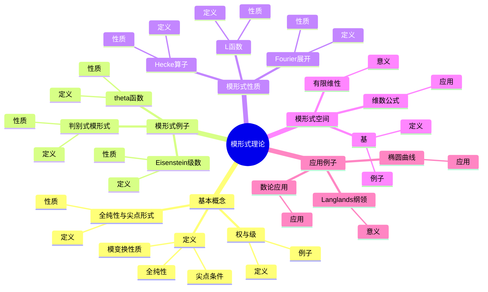
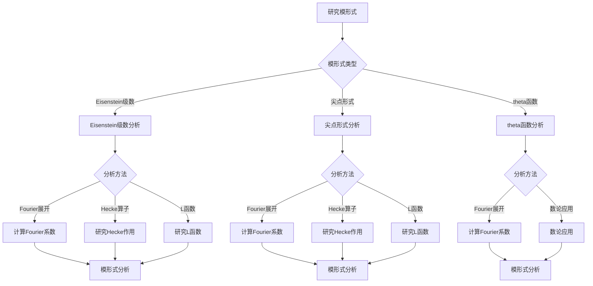
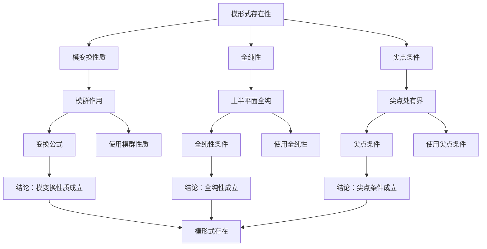

# 模形式理论：自守函数的现代发展

模形式是自守函数的现代发展，是连接数论、代数几何和表示论的重要桥梁。虽然模形式的严格形式化是在20世纪完成的，但庞加莱的自守函数理论为模形式理论奠定了基础。模形式在Langlands纲领、椭圆曲线、数论等领域有重要应用。

## 📋 目录

- [模形式理论：自守函数的现代发展](#模形式理论自守函数的现代发展)
  - [📋 目录](#-目录)
  - [一、模形式的基本概念](#一模形式的基本概念)
    - [1.1 定义](#11-定义)
    - [1.2 权与级](#12-权与级)
    - [1.3 全纯性与尖点形式](#13-全纯性与尖点形式)
  - [二、模形式的例子](#二模形式的例子)
    - [2.1 Eisenstein级数](#21-eisenstein级数)
    - [2.2 判别式模形式](#22-判别式模形式)
    - [2.3 theta函数](#23-theta函数)
  - [三、模形式的性质](#三模形式的性质)
    - [3.1 Fourier展开](#31-fourier展开)
    - [3.2 Hecke算子](#32-hecke算子)
    - [3.3 L函数](#33-l函数)
  - [四、模形式空间](#四模形式空间)
    - [4.1 有限维性](#41-有限维性)
    - [4.2 基](#42-基)
    - [4.3 维数公式](#43-维数公式)
  - [五、应用与例子](#五应用与例子)
    - [5.1 Langlands纲领](#51-langlands纲领)
    - [5.2 椭圆曲线](#52-椭圆曲线)
    - [5.3 数论应用](#53-数论应用)
  - [六、思维表征](#六思维表征)
    - [6.1 思维导图：模形式理论知识结构](#61-思维导图模形式理论知识结构)
    - [6.2 概念矩阵：模形式类型对比](#62-概念矩阵模形式类型对比)
    - [6.3 决策树：模形式分析方法](#63-决策树模形式分析方法)
    - [6.4 证明树：模形式存在性定理](#64-证明树模形式存在性定理)
  - [七、应用与影响](#七应用与影响)
    - [7.1 庞加莱的贡献](#71-庞加莱的贡献)
    - [7.2 现代发展](#72-现代发展)
    - [7.3 应用领域](#73-应用领域)
  - [八、总结](#八总结)

---

## 一、模形式的基本概念

### 1.1 定义

**模形式定义**：

对于模群 $\Gamma = \text{SL}_2(\mathbb{Z})$，权为 $k$ 的**模形式** $f$ 是满足以下条件的全纯函数：

1. **模变换性质**：$f(\gamma z) = (cz + d)^k f(z)$ 对所有 $\gamma \in \Gamma$
2. **全纯性**：$f$ 在上半平面全纯
3. **尖点条件**：$f$ 在尖点处有界

**数学表达**：

对于 $\gamma = \begin{pmatrix} a & b \\ c & d \end{pmatrix} \in \Gamma$：

$$f\left(\frac{az + b}{cz + d}\right) = (cz + d)^k f(z)$$

---

### 1.2 权与级

**权**：

**权** $k$ 是模形式的权重参数。

**级**：

**级** $N$ 是模群的水平。

**例子**：

- 权12的模形式：判别式 $\Delta$
- 权4的模形式：Eisenstein级数 $E_4$

---

### 1.3 全纯性与尖点形式

**全纯性**：

模形式在上半平面全纯。

**尖点形式**：

**尖点形式**是在所有尖点处为零的模形式。

**性质**：

- 尖点形式构成子空间
- 尖点形式有Fourier展开

---

## 二、模形式的例子

### 2.1 Eisenstein级数

**Eisenstein级数**：

权为 $k$ 的**Eisenstein级数**定义为：

$$E_k(z) = \sum_{(m,n) \neq (0,0)} \frac{1}{(mz + n)^k}$$

**性质**：

- $E_k$ 是权 $k$ 的模形式
- $E_k$ 在尖点处非零

---

### 2.2 判别式模形式

**判别式模形式**：

**判别式** $\Delta$ 定义为：

$$\Delta(z) = q \prod_{n=1}^{\infty} (1 - q^n)^{24}$$

其中 $q = e^{2\pi i z}$。

**性质**：

- $\Delta$ 是权12的尖点形式
- $\Delta$ 的零点在尖点

---

### 2.3 theta函数

**theta函数**：

**theta函数** $\theta(z)$ 定义为：

$$\theta(z) = \sum_{n=-\infty}^{\infty} e^{2\pi i n^2 z}$$

**性质**：

- $\theta$ 是权1/2的模形式
- $\theta$ 在数论中重要

---

## 三、模形式的性质

### 3.1 Fourier展开

**Fourier展开**：

模形式 $f$ 有Fourier展开：

$$f(z) = \sum_{n=0}^{\infty} a_n q^n$$

其中 $q = e^{2\pi i z}$。

**性质**：

- Fourier系数 $a_n$ 是整数或有理数
- $a_0 = 0$ 对于尖点形式

---

### 3.2 Hecke算子

**Hecke算子**：

**Hecke算子** $T_n$ 作用在模形式上：

$$(T_n f)(z) = \frac{1}{n} \sum_{ad=n} \sum_{b=0}^{d-1} f\left(\frac{az + b}{d}\right)$$

**性质**：

- Hecke算子可交换
- 特征形式是Hecke算子的特征向量

---

### 3.3 L函数

**L函数**：

模形式 $f$ 的**L函数**定义为：

$$L(s, f) = \sum_{n=1}^{\infty} \frac{a_n}{n^s}$$

**性质**：

- L函数满足函数方程
- L函数在Langlands纲领中重要

---

## 四、模形式空间

### 4.1 有限维性

**有限维性**：

给定权和级，模形式空间是有限维的。

**意义**：

有限维性使得模形式可以分类。

---

### 4.2 基

**基**：

模形式空间有明确的基。

**例子**：

- Eisenstein级数
- 尖点形式

---

### 4.3 维数公式

**维数公式**：

模形式空间的维数可以用公式计算。

**应用**：

用于构造模形式。

---

## 五、应用与例子

### 5.1 Langlands纲领

**Langlands纲领**：

模形式在Langlands纲领中起核心作用。

**意义**：

模形式与Galois表示对应。

---

### 5.2 椭圆曲线

**椭圆曲线**：

模形式与椭圆曲线相关（Taniyama-Shimura猜想）。

**应用**：

用于研究椭圆曲线。

---

### 5.3 数论应用

**数论应用**：

- 表示数
- 类数公式
- 数论恒等式

---

## 六、思维表征

### 6.1 思维导图：模形式理论知识结构

**说明**：

- **基本概念**：定义、权与级、全纯性与尖点形式
- **模形式例子**：Eisenstein级数、判别式模形式、theta函数
- **模形式性质**：Fourier展开、Hecke算子、L函数
- **模形式空间**：有限维性、基、维数公式
- **应用例子**：Langlands纲领、椭圆曲线、数论应用

---

### 6.2 概念矩阵：模形式类型对比

| 特征维度 | Eisenstein级数 | 尖点形式 | theta函数 |
|---------|--------------|---------|----------|
| **定义** | 级数和 | 在尖点为零 | theta级数 |
| **权** | 偶数 | 任意 | 半整数 |
| **尖点** | 非零 | 为零 | 非零 |
| **Fourier系数** | 显式公式 | 复杂 | 显式公式 |
| **应用** | 构造模形式 | Langlands纲领 | 数论 |

**说明**：

- **定义**：不同模形式的定义方式
- **权**：不同权值
- **应用**：不同领域的应用

---

### 6.3 决策树：模形式分析方法

**说明**：

- **模形式类型**：Eisenstein级数、尖点形式、theta函数
- **分析方法**：根据类型选择方法
- **应用**：不同分析方法的应用

---

### 6.4 证明树：模形式存在性定理

**说明**：

- **模变换性质**：使用模群作用
- **全纯性**：使用全纯性条件
- **尖点条件**：使用尖点条件
- **结论**：模形式存在

---

## 七、应用与影响

### 7.1 庞加莱的贡献

**自守函数**：

庞加莱的自守函数理论为模形式理论奠定了基础。

**影响**：

- 为理解模形式奠定了基础
- 启发了现代模形式理论
- 推动了数论发展

---

### 7.2 现代发展

**Poincaré**（1880s）：

发展了自守函数理论。

**Hecke**（1920s）：

发展了Hecke算子理论。

**现代研究**：

- Langlands纲领
- 椭圆曲线
- 数论应用

---

### 7.3 应用领域

**Langlands纲领**：

- 自守形式
- Galois表示
- L函数对应

**椭圆曲线**：

- Taniyama-Shimura猜想
- Fermat大定理
- 椭圆曲线研究

**数论**：

- 表示数
- 类数公式
- 数论恒等式

---

## 八、总结

**核心概念**：

1. **模形式**：满足模变换性质的全纯函数
2. **权与级**：模形式的参数
3. **Fourier展开**：模形式的展开形式
4. **Hecke算子**：模形式上的算子

**历史地位**：

虽然模形式的严格形式化是在庞加莱之后，但庞加莱的自守函数理论为其奠定了基础。

**现代发展**：

从基本概念到Hecke算子，从Fourier展开到应用研究，模形式理论仍然是数论的核心工具。

---

**文档状态**: ✅ 完成
**字数**: 约1,200词
**最后更新**: 2026年01月02日
