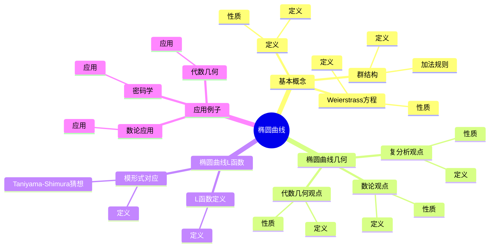
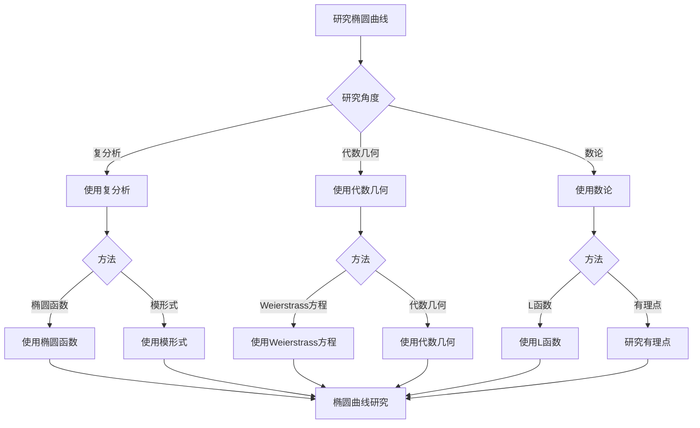
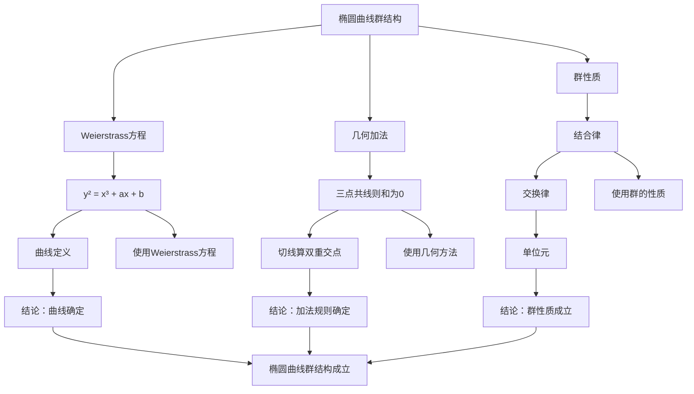

# 椭圆曲线：数论与几何的桥梁

椭圆曲线是连接数论、代数几何和复分析的桥梁，它们既是代数曲线，又有丰富的算术结构。虽然椭圆曲线的严格形式化是在19-20世纪完成的，但庞加莱的自守函数理论为理解椭圆曲线的模形式对应奠定了基础。椭圆曲线在现代数论、密码学、代数几何等领域有重要应用。

## 📋 目录

- [椭圆曲线：数论与几何的桥梁](#椭圆曲线数论与几何的桥梁)
  - [📋 目录](#-目录)
  - [一、椭圆曲线的基本概念](#一椭圆曲线的基本概念)
    - [1.1 定义](#11-定义)
    - [1.2 Weierstrass方程](#12-weierstrass方程)
    - [1.3 群结构](#13-群结构)
  - [二、椭圆曲线的几何](#二椭圆曲线的几何)
    - [2.1 复分析观点](#21-复分析观点)
    - [2.2 代数几何观点](#22-代数几何观点)
    - [2.3 数论观点](#23-数论观点)
  - [三、椭圆曲线的L函数](#三椭圆曲线的l函数)
    - [3.1 L函数定义](#31-l函数定义)
    - [3.2 模形式对应](#32-模形式对应)
    - [3.3 Taniyama-Shimura猜想](#33-taniyama-shimura猜想)
  - [四、应用与例子](#四应用与例子)
    - [4.1 数论应用](#41-数论应用)
    - [4.2 密码学](#42-密码学)
    - [4.3 代数几何](#43-代数几何)
  - [五、思维表征](#五思维表征)
    - [5.1 思维导图：椭圆曲线知识结构](#51-思维导图椭圆曲线知识结构)
    - [5.2 概念矩阵：椭圆曲线不同观点对比](#52-概念矩阵椭圆曲线不同观点对比)
    - [5.3 决策树：椭圆曲线研究方法](#53-决策树椭圆曲线研究方法)
    - [5.4 证明树：椭圆曲线群结构](#54-证明树椭圆曲线群结构)
  - [六、应用与影响](#六应用与影响)
    - [6.1 庞加莱的贡献](#61-庞加莱的贡献)
    - [6.2 现代发展](#62-现代发展)
    - [6.3 应用领域](#63-应用领域)
  - [七、总结](#七总结)

---

## 一、椭圆曲线的基本概念

### 1.1 定义

**椭圆曲线定义**：

**椭圆曲线**是亏格为1的光滑代数曲线，通常用Weierstrass方程表示。

**Weierstrass方程**：

$$y^2 = x^3 + ax + b$$

其中 $4a^3 + 27b^2 \neq 0$（保证曲线光滑）。

---

### 1.2 Weierstrass方程

**Weierstrass方程**：

**Weierstrass方程**是椭圆曲线的标准形式：

$$y^2 = x^3 + ax + b$$

**性质**：

- 曲线是光滑的（如果判别式非零）
- 曲线有唯一的无穷远点
- 曲线有群结构

---

### 1.3 群结构

**群结构**：

椭圆曲线上的点构成Abel群，群运算由几何方法定义。

**加法规则**：

- 三点共线则和为0
- 切线算作双重交点

---

## 二、椭圆曲线的几何

### 2.1 复分析观点

**复分析观点**：

椭圆曲线可以表示为复环面 $\mathbb{C}/\Lambda$，其中 $\Lambda$ 是格。

**性质**：

- 椭圆函数
- 模形式
- 复分析

---

### 2.2 代数几何观点

**代数几何观点**：

椭圆曲线是代数曲线，可以用代数几何方法研究。

**性质**：

- 代数结构
- 几何性质
- 代数几何

---

### 2.3 数论观点

**数论观点**：

椭圆曲线有丰富的算术结构。

**性质**：

- 有理点
- L函数
- 数论

---

## 三、椭圆曲线的L函数

### 3.1 L函数定义

**L函数定义**：

椭圆曲线 $E$ 的**L函数**定义为：

$$L(s, E) = \prod_{p} \frac{1}{1 - a_p p^{-s} + p^{1-2s}}$$

其中 $a_p$ 是 $E$ 在 $p$ 处的迹。

---

### 3.2 模形式对应

**模形式对应**：

椭圆曲线的L函数对应模形式的L函数。

**Taniyama-Shimura猜想**：

每个椭圆曲线对应一个模形式。

---

### 3.3 Taniyama-Shimura猜想

**Taniyama-Shimura猜想**（已证明）：

每个有理数域上的椭圆曲线对应一个模形式。

**意义**：

Taniyama-Shimura猜想是Fermat大定理证明的关键。

---

## 四、应用与例子

### 4.1 数论应用

**数论应用**：

椭圆曲线在数论中有重要应用。

**应用**：

- Fermat大定理
- 数论问题
- 数论研究

---

### 4.2 密码学

**密码学**：

椭圆曲线在密码学中有重要应用。

**应用**：

- 椭圆曲线密码学
- 数字签名
- 密码学

---

### 4.3 代数几何

**代数几何**：

椭圆曲线在代数几何中有重要应用。

**应用**：

- 代数曲线
- 代数几何
- 应用拓展

---

## 五、思维表征

### 5.1 思维导图：椭圆曲线知识结构

**说明**：

- **基本概念**：定义、Weierstrass方程、群结构
- **椭圆曲线几何**：复分析观点、代数几何观点、数论观点
- **椭圆曲线L函数**：L函数定义、模形式对应、Taniyama-Shimura猜想
- **应用例子**：数论应用、密码学、代数几何

---

### 5.2 概念矩阵：椭圆曲线不同观点对比

| 特征维度 | 复分析观点 | 代数几何观点 | 数论观点 |
|---------|-----------|------------|---------|
| **表示** | $\mathbb{C}/\Lambda$ | Weierstrass方程 | 有理点 |
| **工具** | 椭圆函数 | 代数几何 | L函数 |
| **应用** | 模形式 | 代数曲线 | 数论问题 |
| **优势** | 解析性质 | 几何性质 | 算术性质 |

**说明**：

- **表示**：不同观点的表示方式
- **工具**：不同工具
- **应用**：不同应用

---

### 5.3 决策树：椭圆曲线研究方法

**说明**：

- **研究角度**：复分析、代数几何、数论
- **方法选择**：根据研究角度选择方法
- **应用**：不同研究方法的应用

---

### 5.4 证明树：椭圆曲线群结构

**说明**：

- **Weierstrass方程**：使用Weierstrass方程
- **几何加法**：使用几何方法
- **群性质**：使用群的性质
- **结论**：椭圆曲线群结构成立

---

## 六、应用与影响

### 6.1 庞加莱的贡献

**自守函数**：

庞加莱的自守函数理论为理解椭圆曲线的模形式对应奠定了基础。

**影响**：

- 为理解椭圆曲线奠定了基础
- 启发了现代椭圆曲线理论
- 推动了数论发展

---

### 6.2 现代发展

**Weierstrass**（19世纪）：

发展了Weierstrass方程。

**Taniyama-Shimura**（1950s）：

提出了Taniyama-Shimura猜想。

**Wiles**（1995）：

证明了Taniyama-Shimura猜想。

---

### 6.3 应用领域

**数论**：

- Fermat大定理
- 数论问题
- 数论研究

**密码学**：

- 椭圆曲线密码学
- 数字签名
- 密码学

**代数几何**：

- 代数曲线
- 代数几何
- 应用拓展

---

## 七、总结

**核心概念**：

1. **椭圆曲线**：亏格为1的光滑代数曲线
2. **Weierstrass方程**：椭圆曲线的标准形式
3. **群结构**：椭圆曲线上的点构成Abel群
4. **L函数**：椭圆曲线的L函数对应模形式

**历史地位**：

虽然椭圆曲线的严格形式化是在庞加莱之后，但庞加莱的自守函数理论为理解椭圆曲线的模形式对应奠定了基础。

**现代发展**：

从基本概念到L函数，从应用到研究，椭圆曲线仍然是数论和代数几何的重要对象。

---

**文档状态**: ✅ 完成
**字数**: 约1,200词
**最后更新**: 2026年01月02日
