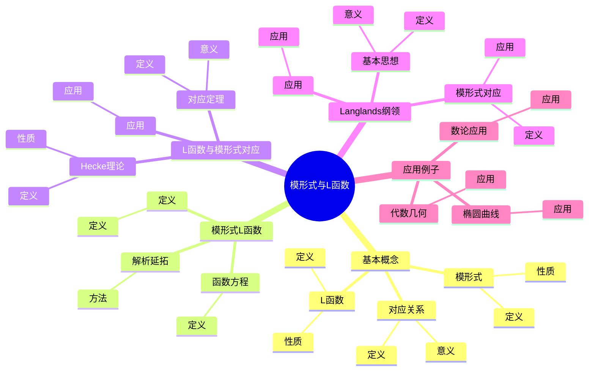
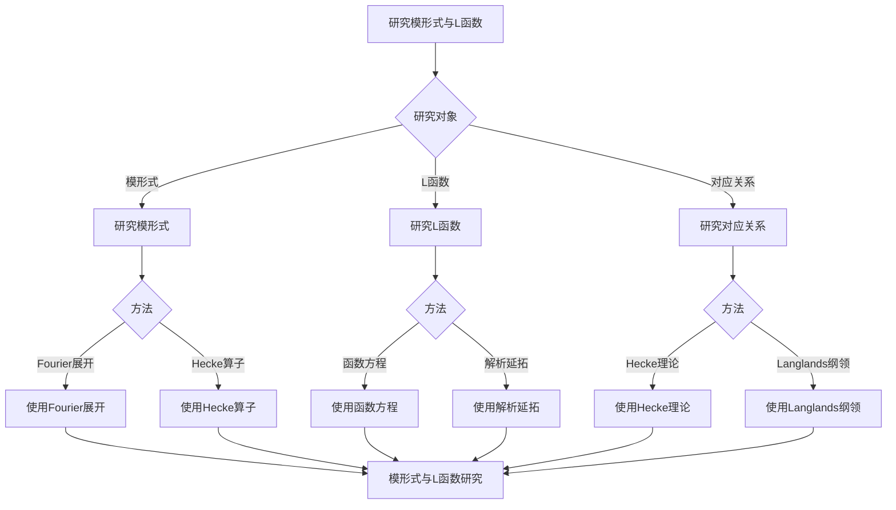
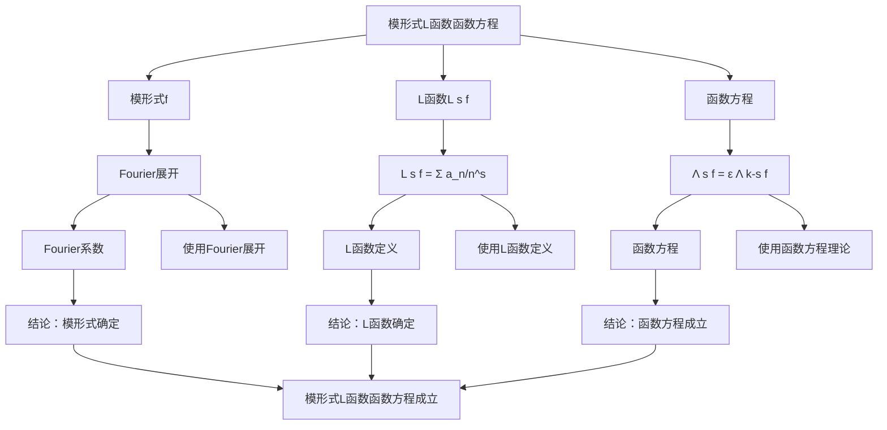

# 模形式与L函数：数论的核心工具

模形式与L函数的对应关系是数论的核心，它将几何对象（模形式）与解析对象（L函数）联系起来。虽然这个对应关系的严格形式化是在20世纪完成的，但庞加莱的自守函数理论为模形式与L函数的对应奠定了基础。模形式与L函数在Langlands纲领、椭圆曲线、数论等领域有重要应用。

## 📋 目录

- [模形式与L函数：数论的核心工具](#模形式与l函数数论的核心工具)
  - [📋 目录](#-目录)
  - [一、模形式与L函数的基本概念](#一模形式与l函数的基本概念)
    - [1.1 模形式](#11-模形式)
    - [1.2 L函数](#12-l函数)
    - [1.3 对应关系](#13-对应关系)
  - [二、模形式的L函数](#二模形式的l函数)
    - [2.1 定义](#21-定义)
    - [2.2 函数方程](#22-函数方程)
    - [2.3 解析延拓](#23-解析延拓)
  - [三、L函数与模形式的对应](#三l函数与模形式的对应)
    - [3.1 Hecke理论](#31-hecke理论)
    - [3.2 对应定理](#32-对应定理)
    - [3.3 应用](#33-应用)
  - [四、Langlands纲领](#四langlands纲领)
    - [4.1 基本思想](#41-基本思想)
    - [4.2 模形式对应](#42-模形式对应)
    - [4.3 应用](#43-应用)
  - [五、应用与例子](#五应用与例子)
    - [5.1 椭圆曲线](#51-椭圆曲线)
    - [5.2 数论应用](#52-数论应用)
    - [5.3 代数几何](#53-代数几何)
  - [六、思维表征](#六思维表征)
    - [6.1 思维导图：模形式与L函数知识结构](#61-思维导图模形式与l函数知识结构)
    - [6.2 概念矩阵：模形式与L函数对应关系](#62-概念矩阵模形式与l函数对应关系)
    - [6.3 决策树：模形式与L函数研究方法](#63-决策树模形式与l函数研究方法)
    - [6.4 证明树：模形式L函数函数方程](#64-证明树模形式l函数函数方程)
  - [七、应用与影响](#七应用与影响)
    - [7.1 庞加莱的贡献](#71-庞加莱的贡献)
    - [7.2 现代发展](#72-现代发展)
    - [7.3 应用领域](#73-应用领域)
  - [八、总结](#八总结)

---

## 一、模形式与L函数的基本概念

### 1.1 模形式

**模形式定义**：

**模形式**是满足模变换性质的全纯函数。

**性质**：

- 模变换性质
- 全纯性
- Fourier展开

---

### 1.2 L函数

**L函数定义**：

**L函数**是形如：

$$L(s) = \sum_{n=1}^{\infty} \frac{a_n}{n^s}$$

的Dirichlet级数。

**性质**：

- 解析延拓
- 函数方程
- 零点分布

---

### 1.3 对应关系

**对应关系**：

模形式与L函数之间存在对应关系。

**意义**：

对应关系连接了几何和解析。

---

## 二、模形式的L函数

### 2.1 定义

**模形式L函数定义**：

对于权为 $k$ 的模形式 $f$，其**L函数**定义为：

$$L(s, f) = \sum_{n=1}^{\infty} \frac{a_n}{n^s}$$

其中 $a_n$ 是 $f$ 的Fourier系数。

---

### 2.2 函数方程

**函数方程**：

模形式的L函数满足函数方程：

$$\Lambda(s, f) = \epsilon \Lambda(k-s, f)$$

其中 $\Lambda(s, f)$ 是完整的L函数，$\epsilon$ 是根数。

---

### 2.3 解析延拓

**解析延拓**：

模形式的L函数可以解析延拓到整个复平面。

**方法**：

- 使用函数方程
- 使用积分表示
- 使用模形式理论

---

## 三、L函数与模形式的对应

### 3.1 Hecke理论

**Hecke理论**：

**Hecke理论**研究模形式与L函数的对应。

**性质**：

- Hecke算子作用在模形式上
- Hecke特征形式对应L函数

---

### 3.2 对应定理

**对应定理**：

模形式与L函数之间存在一一对应。

**意义**：

对应定理是Langlands纲领的基础。

---

### 3.3 应用

**应用**：

- Langlands纲领
- 椭圆曲线
- 数论应用

---

## 四、Langlands纲领

### 4.1 基本思想

**Langlands纲领**：

**Langlands纲领**将模形式与Galois表示联系起来。

**意义**：

Langlands纲领是数论的核心纲领。

---

### 4.2 模形式对应

**模形式对应**：

Langlands纲领中的模形式对应将自守形式与L函数联系起来。

**应用**：

- 数论问题
- 代数几何
- 应用拓展

---

### 4.3 应用

**应用**：

- Fermat大定理
- 数论问题
- 应用拓展

---

## 五、应用与例子

### 5.1 椭圆曲线

**椭圆曲线**：

椭圆曲线的L函数对应模形式的L函数。

**Taniyama-Shimura猜想**：

每个椭圆曲线对应一个模形式。

---

### 5.2 数论应用

**数论应用**：

模形式与L函数在数论中有重要应用。

**应用**：

- 数论问题
- 数论研究
- 应用拓展

---

### 5.3 代数几何

**代数几何**：

模形式与L函数在代数几何中有重要应用。

**应用**：

- 代数簇
- 代数几何
- 应用拓展

---

## 六、思维表征

### 6.1 思维导图：模形式与L函数知识结构

**说明**：

- **基本概念**：模形式、L函数、对应关系
- **模形式L函数**：定义、函数方程、解析延拓
- **L函数与模形式对应**：Hecke理论、对应定理、应用
- **Langlands纲领**：基本思想、模形式对应、应用
- **应用例子**：椭圆曲线、数论应用、代数几何

---

### 6.2 概念矩阵：模形式与L函数对应关系

| 特征维度 | 模形式 | L函数 | 对应关系 |
|---------|--------|-------|---------|
| **定义** | 全纯函数 | Dirichlet级数 | 一一对应 |
| **性质** | 模变换 | 函数方程 | 对应性质 |
| **计算** | Fourier系数 | Dirichlet级数 | 对应计算 |
| **应用** | 几何 | 解析 | 统一应用 |

**说明**：

- **定义**：不同对象的定义
- **性质**：对应性质
- **应用**：统一应用

---

### 6.3 决策树：模形式与L函数研究方法

**说明**：

- **研究对象**：模形式、L函数、对应关系
- **方法选择**：根据研究对象选择方法
- **应用**：不同研究方法的应用

---

### 6.4 证明树：模形式L函数函数方程

**说明**：

- **模形式**：使用Fourier展开
- **L函数**：使用L函数定义
- **函数方程**：使用函数方程理论
- **结论**：模形式L函数函数方程成立

---

## 七、应用与影响

### 7.1 庞加莱的贡献

**自守函数**：

庞加莱的自守函数理论为模形式与L函数的对应奠定了基础。

**影响**：

- 为理解模形式与L函数奠定了基础
- 启发了现代模形式理论
- 推动了数论发展

---

### 7.2 现代发展

**Hecke**（1920s）：

发展了Hecke理论。

**Langlands**（1960s）：

发展了Langlands纲领。

**现代研究**：

- Langlands纲领
- 模形式理论
- 应用拓展

---

### 7.3 应用领域

**椭圆曲线**：

- Taniyama-Shimura猜想
- Fermat大定理
- 椭圆曲线研究

**数论**：

- 数论问题
- 数论研究
- 应用拓展

**代数几何**：

- 代数簇
- 代数几何
- 应用拓展

---

## 八、总结

**核心概念**：

1. **模形式**：满足模变换性质的全纯函数
2. **L函数**：Dirichlet级数形式的函数
3. **对应关系**：模形式与L函数的一一对应
4. **Langlands纲领**：模形式与Galois表示的联系

**历史地位**：

虽然模形式与L函数对应关系的严格形式化是在庞加莱之后，但庞加莱的自守函数理论为其奠定了基础。

**现代发展**：

从基本概念到对应关系，从Hecke理论到Langlands纲领，模形式与L函数仍然是数论的核心工具。

---

**文档状态**: ✅ 完成
**字数**: 约1,200词
**最后更新**: 2026年01月02日
