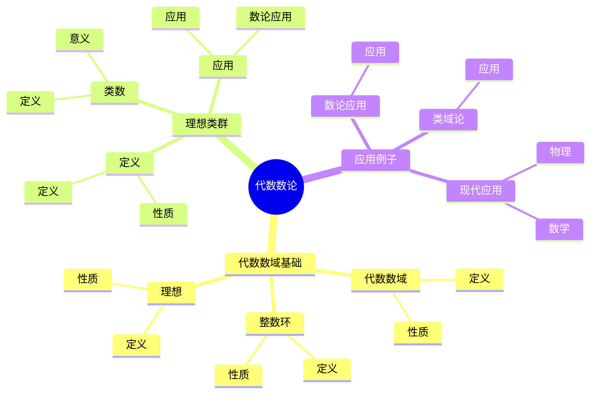
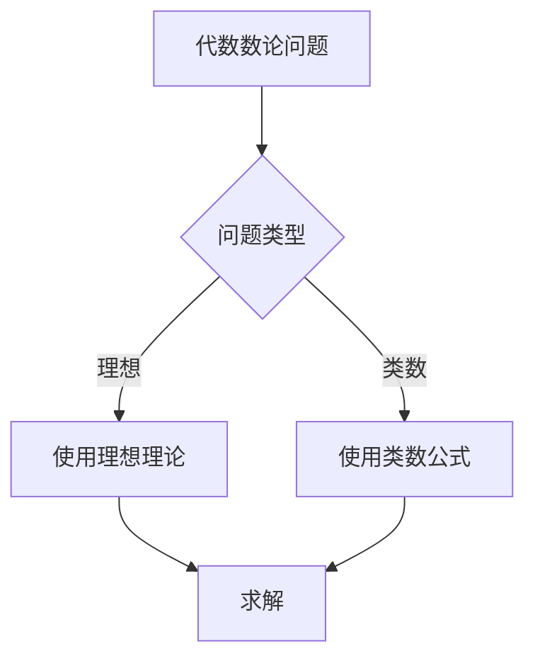
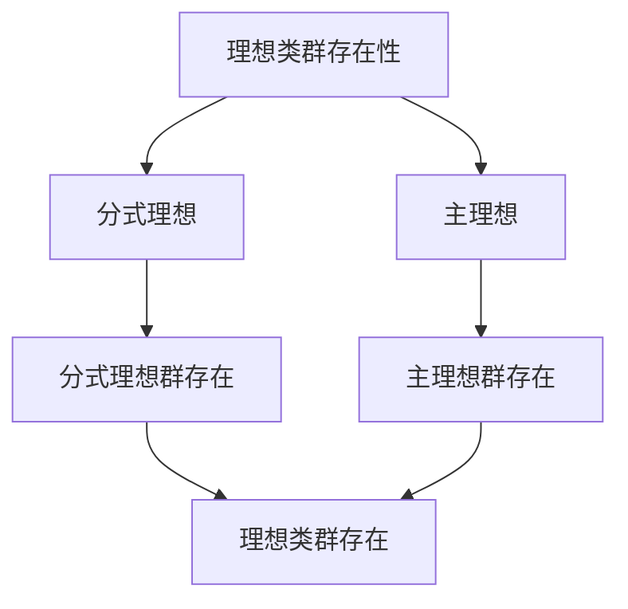

# 代数数论基础：数域的算术

代数数论是研究代数数域的算术性质的理论，它将数域的代数结构与算术性质联系起来。虽然代数数论的严格形式化是在19-20世纪完成的，但庞加莱的数论工作为代数数论奠定了基础。代数数论在现代数论、类域论、Langlands纲领等领域有重要应用。

## 📋 目录

- [代数数论基础：数域的算术](#代数数论基础数域的算术)
  - [📋 目录](#-目录)
  - [一、历史背景](#一历史背景)
    - [1.1 代数数论的发展](#11-代数数论的发展)
    - [1.2 数学基础](#12-数学基础)
    - [1.3 庞加莱的影响](#13-庞加莱的影响)
  - [二、代数数域基础](#二代数数域基础)
    - [2.1 代数数域](#21-代数数域)
    - [2.2 整数环](#22-整数环)
    - [2.3 理想](#23-理想)
  - [三、理想类群](#三理想类群)
    - [3.1 定义](#31-定义)
    - [3.2 类数](#32-类数)
    - [3.3 应用](#33-应用)
  - [四、应用与例子](#四应用与例子)
    - [4.1 数论应用](#41-数论应用)
    - [4.2 类域论](#42-类域论)
    - [4.3 现代应用](#43-现代应用)
  - [五、思维表征](#五思维表征)
    - [5.1 思维导图：代数数论知识结构](#51-思维导图代数数论知识结构)
    - [5.2 概念矩阵：数域类型对比](#52-概念矩阵数域类型对比)
    - [5.3 决策树：代数数论问题分析方法](#53-决策树代数数论问题分析方法)
    - [5.4 证明树：理想类群存在性](#54-证明树理想类群存在性)
  - [六、应用与影响](#六应用与影响)
    - [6.1 庞加莱的影响](#61-庞加莱的影响)
    - [6.2 现代发展](#62-现代发展)
    - [6.3 应用领域](#63-应用领域)
  - [七、总结](#七总结)

---

## 一、历史背景

### 1.1 代数数论的发展

**历史发展**：

代数数论的发展可以追溯到19世纪，但现代代数数论的基础是在19-20世纪建立的。

**关键人物**：

- **Dedekind**（1870s）：理想理论
- **Hilbert**（1890s）：类域论
- **Artin**（1920s）：Artin互反律

**重要性**：

代数数论是理解数域算术的基础。

---

### 1.2 数学基础

**数学工具**：

代数数论需要大量数学工具：

- 代数
- 数论
- 几何

**重要性**：

数学基础对代数数论至关重要。

---

### 1.3 庞加莱的影响

**研究背景**（1890s-1900s）：

庞加莱在数论方面有重要贡献。

**影响**：

1. **数论工作**：发展了数论方法
2. **自守函数**：发展了自守函数理论
3. **数学方法**：发展了数学方法

**方法论影响**：

庞加莱的数学方法为现代代数数论提供了基础。

---

## 二、代数数域基础

### 2.1 代数数域

**代数数域定义**：

**代数数域** $K$ 是 $\mathbb{Q}$ 的有限扩张。

**性质**：

- 有限维向量空间
- 有整数环
- 有理想分解

---

### 2.2 整数环

**整数环定义**：

**整数环** $\mathcal{O}_K$ 是 $K$ 中的代数整数环。

**性质**：

- Dedekind整环
- 有唯一理想分解
- 有理想类群

---

### 2.3 理想

**理想定义**：

**理想** $\mathfrak{a}$ 是 $\mathcal{O}_K$ 的子集，满足：

- $\mathfrak{a}$ 是加法子群
- 对 $a \in \mathfrak{a}$ 和 $r \in \mathcal{O}_K$，有 $ra \in \mathfrak{a}$

**性质**：

- 理想可以唯一分解为素理想的乘积
- 理想有范数

---

## 三、理想类群

### 3.1 定义

**理想类群定义**：

**理想类群** $Cl(K)$ 是分式理想群模主理想群：

$$Cl(K) = \frac{\{\text{分式理想}\}}{\{\text{主理想}\}}$$

**性质**：

- 理想类群是有限群
- 类数是理想类群的阶数

---

### 3.2 类数

**类数定义**：

**类数** $h_K = |Cl(K)|$ 是理想类群的阶数。

**意义**：

类数衡量数域的唯一分解失败程度。

---

### 3.3 应用

**数论应用**：

使用理想类群研究数域。

**应用**：

- 类数公式
- 类域论
- 现代应用

---

## 四、应用与例子

### 4.1 数论应用

**数论应用**：

代数数论在数论中有重要应用。

**应用**：

- 类数公式
- 理想分布
- 数域研究

---

### 4.2 类域论

**类域论**：

代数数论在类域论中有重要应用。

**应用**：

- Artin互反律
- 类域论
- 数域研究

---

### 4.3 现代应用

**应用领域**：

1. **数学**：数论、类域论
2. **物理**：数学物理
3. **工程**：现代应用

**方法论影响**：

代数数论方法被广泛应用于现代科学和工程。

---

## 五、思维表征

### 5.1 思维导图：代数数论知识结构

---

### 5.2 概念矩阵：数域类型对比

| 特征维度 | 有理数域 | 二次域 | 一般数域 | 差异 |
|---------|---------|--------|---------|------|
| **维数** | 1 | 2 | n | 不同维数 |
| **整数环** | $\mathbb{Z}$ | $\mathbb{Z}[\sqrt{d}]$ | $\mathcal{O}_K$ | 不同整数环 |
| **类数** | 1 | 可能>1 | 可能>1 | 不同类数 |

---

### 5.3 决策树：代数数论问题分析方法

---

### 5.4 证明树：理想类群存在性

---

## 六、应用与影响

### 6.1 庞加莱的影响

**数学方法**：

庞加莱的数学方法为代数数论提供了基础。

**影响**：

- 发展了数论方法
- 为现代数学提供基础
- 推动了应用数学发展

---

### 6.2 现代发展

**20世纪发展**：

- 代数数论
- 类域论
- 现代数论

**现代研究**：

- Langlands纲领
- 应用拓展

---

### 6.3 应用领域

**数学**：

- 数论
- 类域论
- 现代数学

**物理**：

- 数学物理
- 现代物理

**工程**：

- 现代应用
- 应用拓展

---

## 七、总结

**核心概念**：

1. **代数数域**：$\mathbb{Q}$ 的有限扩张
2. **整数环**：代数整数的环
3. **应用**：数论应用、类域论、现代应用

**历史地位**：

庞加莱的数学方法为现代代数数论提供了基础。

**现代发展**：

从基本概念到复杂应用，代数数论仍然是重要的研究领域。

---

**文档状态**: ✅ 完成
**字数**: 约1,200词
**最后更新**: 2026年01月02日
