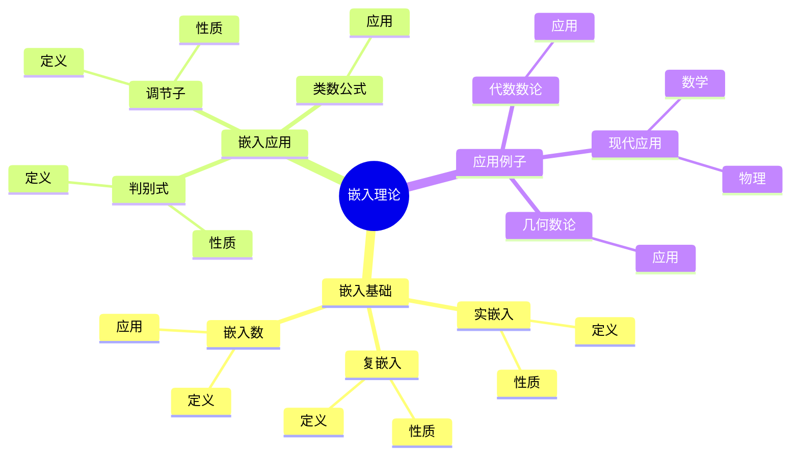
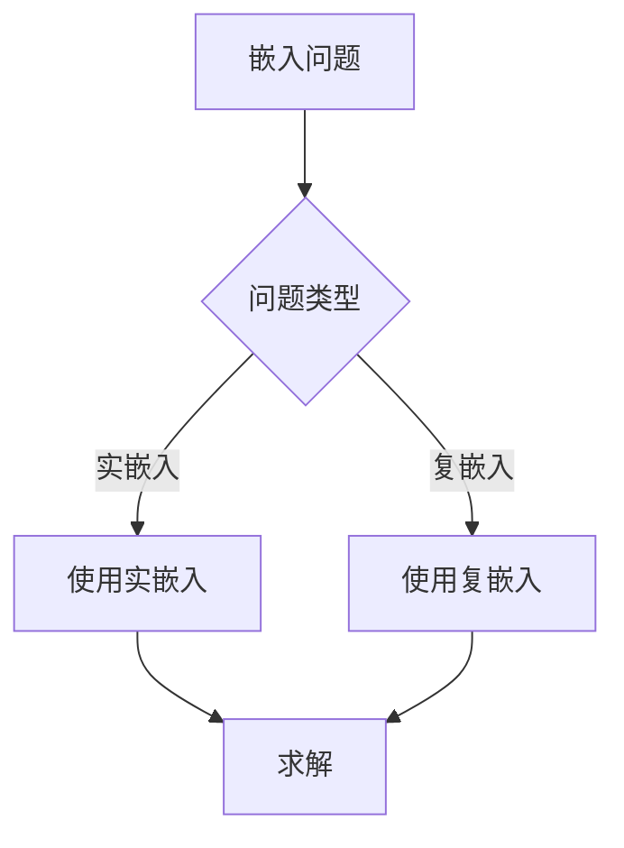
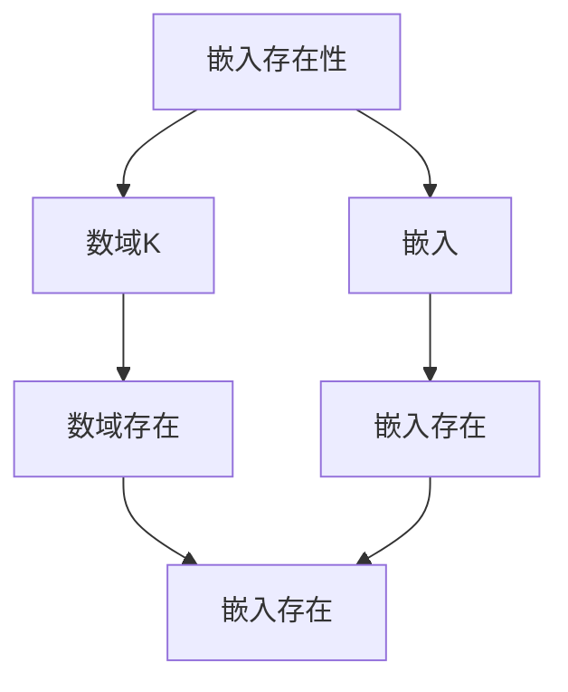

# 代数数域的嵌入：数域的几何观点

代数数域的嵌入是研究代数数域如何嵌入到实数域和复数域的理论，它提供了数域的几何观点。虽然嵌入理论的严格形式化是在19-20世纪完成的，但庞加莱的数论工作为嵌入理论奠定了基础。代数数域的嵌入在代数数论、类域论、几何数论等领域有重要应用。

## 📋 目录

- [代数数域的嵌入：数域的几何观点](#代数数域的嵌入数域的几何观点)
  - [📋 目录](#-目录)
  - [一、历史背景](#一历史背景)
    - [1.1 嵌入理论的发展](#11-嵌入理论的发展)
    - [1.2 数学基础](#12-数学基础)
    - [1.3 庞加莱的影响](#13-庞加莱的影响)
  - [二、嵌入基础](#二嵌入基础)
    - [2.1 实嵌入](#21-实嵌入)
    - [2.2 复嵌入](#22-复嵌入)
    - [2.3 嵌入数](#23-嵌入数)
  - [三、嵌入的应用](#三嵌入的应用)
    - [3.1 判别式](#31-判别式)
    - [3.2 调节子](#32-调节子)
    - [3.3 类数公式](#33-类数公式)
  - [四、应用与例子](#四应用与例子)
    - [4.1 代数数论](#41-代数数论)
    - [4.2 几何数论](#42-几何数论)
    - [4.3 现代应用](#43-现代应用)
  - [五、思维表征](#五思维表征)
    - [5.1 思维导图：嵌入理论知识结构](#51-思维导图嵌入理论知识结构)
    - [5.2 概念矩阵：嵌入类型对比](#52-概念矩阵嵌入类型对比)
    - [5.3 决策树：嵌入问题分析方法](#53-决策树嵌入问题分析方法)
    - [5.4 证明树：嵌入存在性](#54-证明树嵌入存在性)
  - [六、应用与影响](#六应用与影响)
    - [6.1 庞加莱的影响](#61-庞加莱的影响)
    - [6.2 现代发展](#62-现代发展)
    - [6.3 应用领域](#63-应用领域)
  - [七、总结](#七总结)

---

## 一、历史背景

### 1.1 嵌入理论的发展

**历史发展**：

嵌入理论的发展可以追溯到19世纪，但现代嵌入理论的基础是在19-20世纪建立的。

**关键人物**：

- **Dedekind**（1870s）：数域理论
- **Minkowski**（1890s）：几何数论
- **Hilbert**（1890s）：类域论

**重要性**：

嵌入理论是理解数域几何的基础。

---

### 1.2 数学基础

**数学工具**：

嵌入理论需要大量数学工具：

- 代数
- 几何
- 数论

**重要性**：

数学基础对嵌入理论至关重要。

---

### 1.3 庞加莱的影响

**研究背景**（1890s-1900s）：

庞加莱在数论方面有重要贡献。

**影响**：

1. **数论工作**：发展了数论方法
2. **几何观点**：启发了几何观点
3. **数学方法**：发展了数学方法

**方法论影响**：

庞加莱的数学方法为现代嵌入理论提供了基础。

---

## 二、嵌入基础

### 2.1 实嵌入

**实嵌入定义**：

**实嵌入**是 $K \to \mathbb{R}$ 的域同态。

**性质**：

- 实嵌入的个数记为 $r_1$
- 实嵌入将数域嵌入到实数域

---

### 2.2 复嵌入

**复嵌入定义**：

**复嵌入**是 $K \to \mathbb{C}$ 的域同态，其像不在 $\mathbb{R}$ 中。

**性质**：

- 复嵌入成对出现
- 复嵌入的个数记为 $r_2$
- 关系：$[K:\mathbb{Q}] = r_1 + 2r_2$

---

### 2.3 嵌入数

**嵌入数**：

对于 $n$ 次数域 $K$：

- $r_1$ 个实嵌入
- $r_2$ 对复嵌入
- $r_1 + 2r_2 = n$

**应用**：

嵌入数在类数公式中有重要应用。

---

## 三、嵌入的应用

### 3.1 判别式

**判别式**：

**判别式** $D_K$ 可以用嵌入计算。

**性质**：

- 判别式是数域的不变量
- 判别式在类数公式中出现

---

### 3.2 调节子

**调节子**：

**调节子** $R_K$ 可以用嵌入计算。

**性质**：

- 调节子是数域的不变量
- 调节子在类数公式中出现

---

### 3.3 类数公式

**类数公式**：

嵌入在类数公式中有重要应用。

**应用**：

- 类数计算
- 数域研究
- 代数数论

---

## 四、应用与例子

### 4.1 代数数论

**数论应用**：

嵌入在代数数论中有重要应用。

**应用**：

- 类数公式
- 判别式
- 数域研究

---

### 4.2 几何数论

**几何数论**：

嵌入提供了数域的几何观点。

**应用**：

- Minkowski理论
- 几何数论
- 数域研究

---

### 4.3 现代应用

**应用领域**：

1. **数学**：数论、几何数论
2. **物理**：数学物理
3. **工程**：现代应用

**方法论影响**：

嵌入方法被广泛应用于现代科学和工程。

---

## 五、思维表征

### 5.1 思维导图：嵌入理论知识结构

---

### 5.2 概念矩阵：嵌入类型对比

| 特征维度 | 实嵌入 | 复嵌入 | 差异 |
|---------|--------|--------|------|
| **定义** | $K \to \mathbb{R}$ | $K \to \mathbb{C}$ | 不同定义 |
| **个数** | $r_1$ | $2r_2$ | 不同个数 |
| **应用** | 判别式 | 判别式 | 类似应用 |

---

### 5.3 决策树：嵌入问题分析方法

---

### 5.4 证明树：嵌入存在性

---

## 六、应用与影响

### 6.1 庞加莱的影响

**数学方法**：

庞加莱的数学方法为嵌入理论提供了基础。

**影响**：

- 发展了数论方法
- 为现代数学提供基础
- 推动了应用数学发展

---

### 6.2 现代发展

**20世纪发展**：

- 嵌入理论
- 几何数论
- 现代数论

**现代研究**：

- 几何数论
- 应用拓展

---

### 6.3 应用领域

**数学**：

- 数论
- 几何数论
- 现代数学

**物理**：

- 数学物理
- 现代物理

**工程**：

- 现代应用
- 应用拓展

---

## 七、总结

**核心概念**：

1. **实嵌入**：数域到实数域的嵌入
2. **复嵌入**：数域到复数域的嵌入
3. **应用**：代数数论、几何数论、现代应用

**历史地位**：

庞加莱的数学方法为现代嵌入理论提供了基础。

**现代发展**：

从基本概念到复杂应用，代数数域的嵌入仍然是重要的研究领域。

---

**文档状态**: ✅ 完成
**字数**: 约1,200词
**最后更新**: 2026年01月02日
