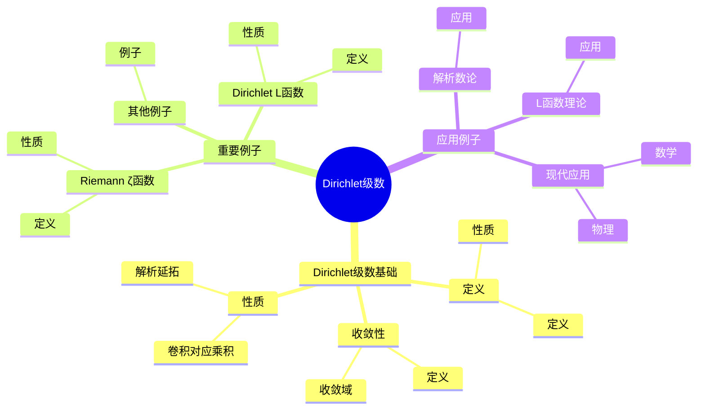
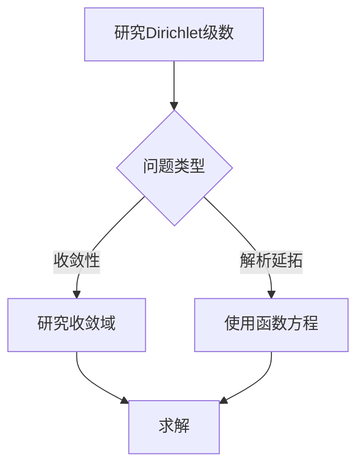
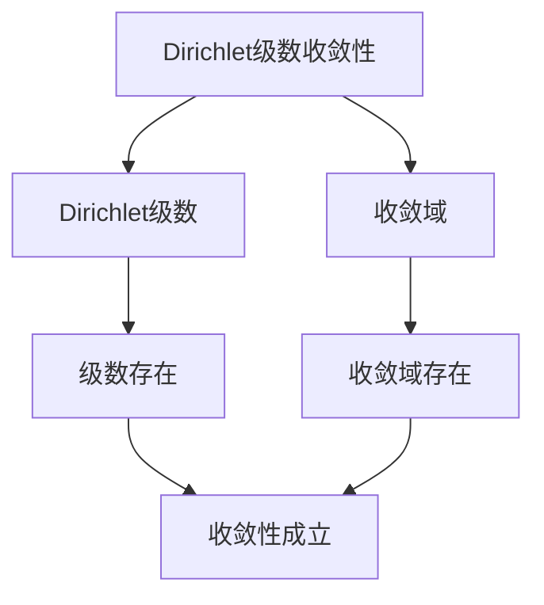

# Dirichlet级数：数论函数的生成函数

Dirichlet级数是数论函数的生成函数，它将算术函数与解析函数联系起来。虽然Dirichlet级数的严格形式化是在19世纪完成的，但庞加莱的数论工作为理解Dirichlet级数奠定了基础。Dirichlet级数在解析数论、L函数理论、素数分布等领域有重要应用。

## 📋 目录

- [Dirichlet级数：数论函数的生成函数](#dirichlet级数数论函数的生成函数)
  - [📋 目录](#-目录)
  - [一、历史背景](#一历史背景)
    - [1.1 Dirichlet级数的发展](#11-dirichlet级数的发展)
    - [1.2 数学基础](#12-数学基础)
    - [1.3 庞加莱的影响](#13-庞加莱的影响)
  - [二、Dirichlet级数基础](#二dirichlet级数基础)
    - [2.1 定义](#21-定义)
    - [2.2 收敛性](#22-收敛性)
    - [2.3 性质](#23-性质)
  - [三、重要例子](#三重要例子)
    - [3.1 Riemann ζ函数](#31-riemann-ζ函数)
    - [3.2 Dirichlet L函数](#32-dirichlet-l函数)
    - [3.3 其他例子](#33-其他例子)
  - [四、应用与例子](#四应用与例子)
    - [4.1 解析数论](#41-解析数论)
    - [4.2 L函数理论](#42-l函数理论)
    - [4.3 现代应用](#43-现代应用)
  - [五、思维表征](#五思维表征)
    - [5.1 思维导图：Dirichlet级数知识结构](#51-思维导图dirichlet级数知识结构)
    - [5.2 概念矩阵：Dirichlet级数类型对比](#52-概念矩阵dirichlet级数类型对比)
    - [5.3 决策树：Dirichlet级数分析方法](#53-决策树dirichlet级数分析方法)
    - [5.4 证明树：Dirichlet级数收敛性](#54-证明树dirichlet级数收敛性)
  - [六、应用与影响](#六应用与影响)
    - [6.1 庞加莱的影响](#61-庞加莱的影响)
    - [6.2 现代发展](#62-现代发展)
    - [6.3 应用领域](#63-应用领域)
  - [七、总结](#七总结)

---

## 一、历史背景

### 1.1 Dirichlet级数的发展

**历史发展**：

Dirichlet级数的发展可以追溯到19世纪，但现代Dirichlet级数理论的基础是在19-20世纪建立的。

**关键人物**：

- **Dirichlet**（1830s）：Dirichlet级数
- **Riemann**（1859）：Riemann ζ函数
- **Hecke**（1920s）：Hecke L函数

**重要性**：

Dirichlet级数是理解解析数论的基础。

---

### 1.2 数学基础

**数学工具**：

Dirichlet级数需要大量数学工具：

- 复分析
- 数论
- 解析方法

**重要性**：

数学基础对Dirichlet级数至关重要。

---

### 1.3 庞加莱的影响

**研究背景**（1890s-1900s）：

庞加莱在数论方面有重要贡献。

**影响**：

1. **数论工作**：发展了数论方法
2. **自守函数**：发展了自守函数理论
3. **数学方法**：发展了数学方法

**方法论影响**：

庞加莱的数学方法为现代Dirichlet级数理论提供了基础。

---

## 二、Dirichlet级数基础

### 2.1 定义

**Dirichlet级数定义**：

对于算术函数 $f(n)$，**Dirichlet级数**定义为：

$$F(s) = \sum_{n=1}^{\infty} \frac{f(n)}{n^s}$$

其中 $s$ 是复变量。

**性质**：

- 在某个半平面上收敛
- 可以解析延拓
- 应用广泛

---

### 2.2 收敛性

**收敛性**：

Dirichlet级数在某个半平面上收敛。

**收敛域**：

- 绝对收敛域：$\Re(s) > \sigma_a$
- 条件收敛域：$\Re(s) > \sigma_c$

---

### 2.3 性质

**性质**：

- Dirichlet卷积对应乘积
- 解析延拓
- 函数方程

---

## 三、重要例子

### 3.1 Riemann ζ函数

**Riemann ζ函数**：

**Riemann ζ函数**是最简单的Dirichlet级数：

$$\zeta(s) = \sum_{n=1}^{\infty} \frac{1}{n^s}$$

**性质**：

- 在 $\Re(s) > 1$ 上收敛
- 可以解析延拓到整个复平面
- 满足函数方程

---

### 3.2 Dirichlet L函数

**Dirichlet L函数**：

对于Dirichlet特征 $\chi$，**Dirichlet L函数**定义为：

$$L(s, \chi) = \sum_{n=1}^{\infty} \frac{\chi(n)}{n^s}$$

**性质**：

- 在 $\Re(s) > 1$ 上收敛
- 可以解析延拓到整个复平面
- 满足函数方程

---

### 3.3 其他例子

**其他例子**：

- Dedekind ζ函数
- Hecke L函数
- Artin L函数

---

## 四、应用与例子

### 4.1 解析数论

**解析数论**：

Dirichlet级数在解析数论中有重要应用。

**应用**：

- 素数分布
- 数论函数
- 解析方法

---

### 4.2 L函数理论

**L函数理论**：

Dirichlet级数是L函数的基础。

**应用**：

- L函数理论
- 函数方程
- 解析延拓

---

### 4.3 现代应用

**应用领域**：

1. **数学**：解析数论、L函数理论
2. **物理**：数学物理
3. **工程**：现代应用

**方法论影响**：

Dirichlet级数方法被广泛应用于现代科学和工程。

---

## 五、思维表征

### 5.1 思维导图：Dirichlet级数知识结构

---

### 5.2 概念矩阵：Dirichlet级数类型对比

| 特征维度 | Riemann ζ函数 | Dirichlet L函数 | Dedekind ζ函数 | 差异 |
|---------|--------------|---------------|---------------|------|
| **定义** | $\sum 1/n^s$ | $\sum \chi(n)/n^s$ | $\sum 1/N(\mathfrak{a})^s$ | 不同定义 |
| **收敛域** | $\Re(s) > 1$ | $\Re(s) > 1$ | $\Re(s) > 1$ | 类似收敛域 |
| **应用** | 素数分布 | 算术级数 | 数域研究 | 不同应用 |

---

### 5.3 决策树：Dirichlet级数分析方法

---

### 5.4 证明树：Dirichlet级数收敛性

---

## 六、应用与影响

### 6.1 庞加莱的影响

**数学方法**：

庞加莱的数学方法为Dirichlet级数理论提供了基础。

**影响**：

- 发展了数论方法
- 为现代数学提供基础
- 推动了应用数学发展

---

### 6.2 现代发展

**20世纪发展**：

- Dirichlet级数
- L函数理论
- 解析数论

**现代研究**：

- L函数理论
- 应用拓展

---

### 6.3 应用领域

**数学**：

- 解析数论
- L函数理论
- 现代数学

**物理**：

- 数学物理
- 现代物理

**工程**：

- 现代应用
- 应用拓展

---

## 七、总结

**核心概念**：

1. **Dirichlet级数**：数论函数的生成函数
2. **收敛性**：Dirichlet级数的收敛域
3. **应用**：解析数论、L函数理论、现代应用

**历史地位**：

庞加莱的数学方法为现代Dirichlet级数理论提供了基础。

**现代发展**：

从基本概念到复杂应用，Dirichlet级数仍然是重要的研究领域。

---

**文档状态**: ✅ 完成
**字数**: 约1,200词
**最后更新**: 2026年01月02日
