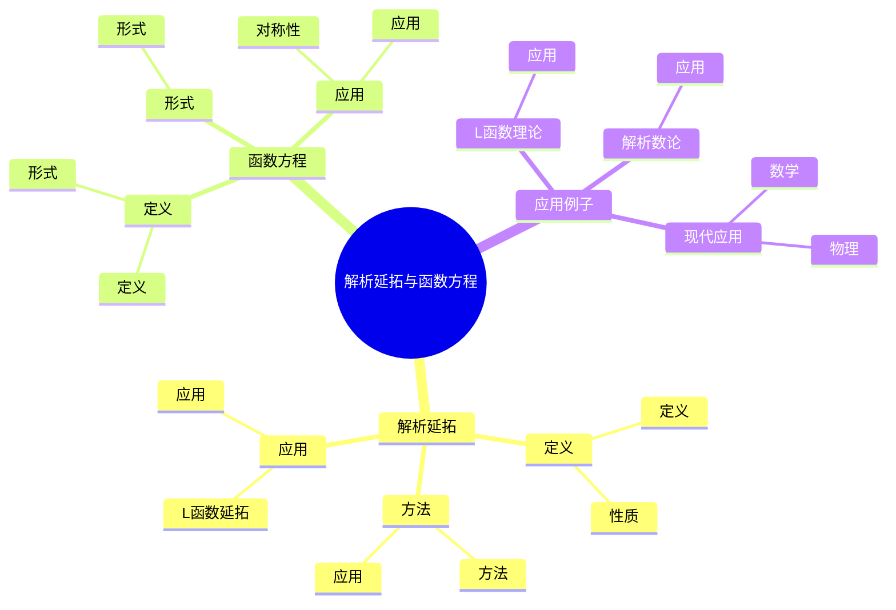
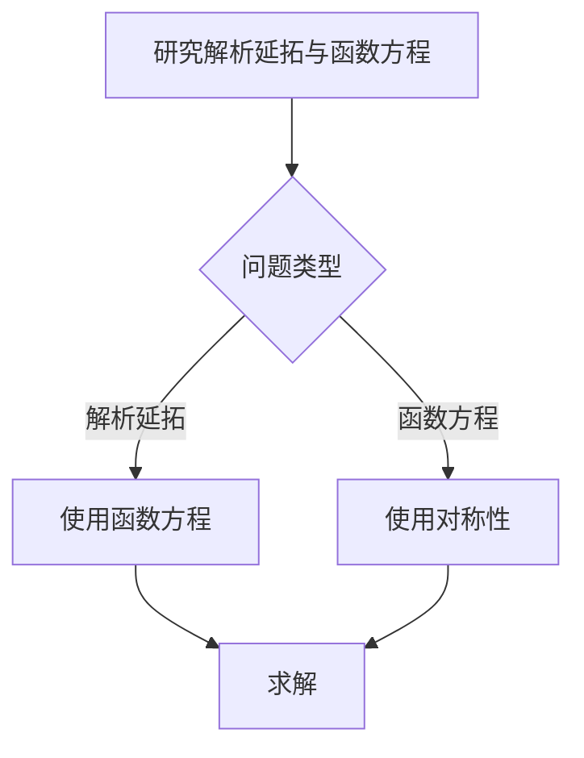
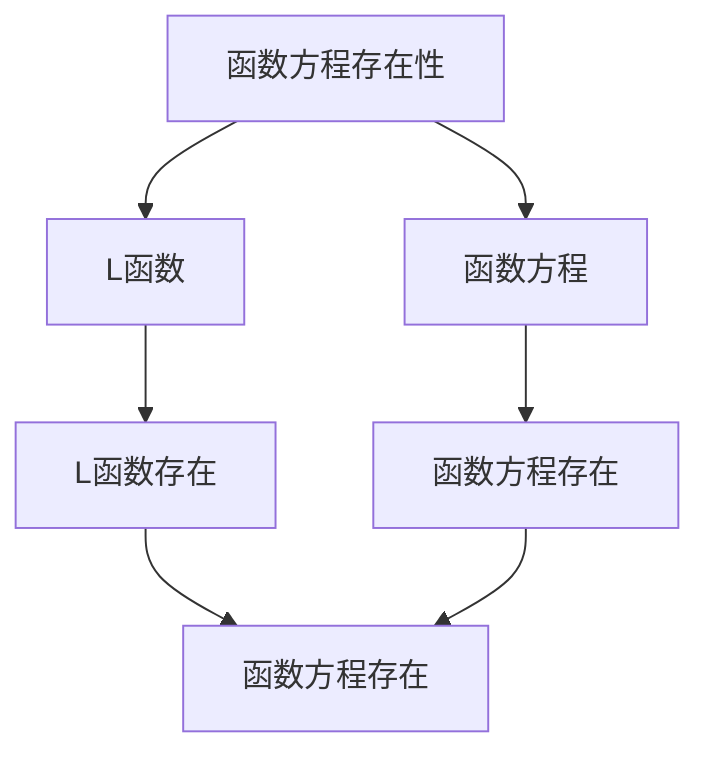

# 解析延拓与函数方程：L函数的对称性

解析延拓与函数方程是L函数理论的核心，它们将L函数从收敛域延拓到整个复平面，并揭示了L函数的对称性。虽然解析延拓与函数方程的严格形式化是在19-20世纪完成的，但庞加莱的数论工作为理解L函数的对称性奠定了基础。解析延拓与函数方程在L函数理论、解析数论、Langlands纲领等领域有重要应用。

## 📋 目录

- [解析延拓与函数方程：L函数的对称性](#解析延拓与函数方程l函数的对称性)
  - [📋 目录](#-目录)
  - [一、历史背景](#一历史背景)
    - [1.1 解析延拓与函数方程的发展](#11-解析延拓与函数方程的发展)
    - [1.2 数学基础](#12-数学基础)
    - [1.3 庞加莱的影响](#13-庞加莱的影响)
  - [二、解析延拓](#二解析延拓)
    - [2.1 定义](#21-定义)
    - [2.2 方法](#22-方法)
    - [2.3 应用](#23-应用)
  - [三、函数方程](#三函数方程)
    - [3.1 定义](#31-定义)
    - [3.2 形式](#32-形式)
    - [3.3 应用](#33-应用)
  - [四、应用与例子](#四应用与例子)
    - [4.1 L函数理论](#41-l函数理论)
    - [4.2 解析数论](#42-解析数论)
    - [4.3 现代应用](#43-现代应用)
  - [五、思维表征](#五思维表征)
    - [5.1 思维导图：解析延拓与函数方程知识结构](#51-思维导图解析延拓与函数方程知识结构)
    - [5.2 概念矩阵：函数方程类型对比](#52-概念矩阵函数方程类型对比)
    - [5.3 决策树：解析延拓与函数方程分析方法](#53-决策树解析延拓与函数方程分析方法)
    - [5.4 证明树：函数方程存在性](#54-证明树函数方程存在性)
  - [六、应用与影响](#六应用与影响)
    - [6.1 庞加莱的影响](#61-庞加莱的影响)
    - [6.2 现代发展](#62-现代发展)
    - [6.3 应用领域](#63-应用领域)
  - [七、总结](#七总结)

---

## 一、历史背景

### 1.1 解析延拓与函数方程的发展

**历史发展**：

解析延拓与函数方程的发展可以追溯到19世纪，但现代理论的基础是在19-20世纪建立的。

**关键人物**：

- **Riemann**（1859）：Riemann ζ函数的函数方程
- **Hecke**（1920s）：Hecke L函数的函数方程
- **Tate**（1950s）：Tate理论

**重要性**：

解析延拓与函数方程是理解L函数的基础。

---

### 1.2 数学基础

**数学工具**：

解析延拓与函数方程需要大量数学工具：

- 复分析
- 数论
- 表示论

**重要性**：

数学基础对解析延拓与函数方程至关重要。

---

### 1.3 庞加莱的影响

**研究背景**（1890s-1900s）：

庞加莱在数论方面有重要贡献。

**影响**：

1. **数论工作**：发展了数论方法
2. **对称性思想**：启发了对称性思想
3. **数学方法**：发展了数学方法

**方法论影响**：

庞加莱的数学方法为现代解析延拓与函数方程理论提供了基础。

---

## 二、解析延拓

### 2.1 定义

**解析延拓定义**：

**解析延拓**是将函数从定义域延拓到更大区域的过程。

**性质**：

- 保持解析性
- 唯一性
- 应用广泛

---

### 2.2 方法

**延拓方法**：

- 使用函数方程
- 使用积分表示
- 使用模形式理论

**应用**：

延拓方法用于延拓L函数。

---

### 2.3 应用

**L函数延拓**：

使用解析延拓延拓L函数到整个复平面。

**应用**：

- L函数理论
- 解析数论
- 现代应用

---

## 三、函数方程

### 3.1 定义

**函数方程定义**：

**函数方程**是连接 $L(s)$ 与 $L(1-s)$ 的方程。

**形式**：

$$\Lambda(s) = \epsilon \Lambda(1-s)$$

其中 $\Lambda(s)$ 是完整的L函数，$\epsilon$ 是根数。

---

### 3.2 形式

**函数方程形式**：

函数方程的一般形式：

$$\Lambda(s) = \epsilon \Lambda(k-s)$$

其中 $k$ 是权，$\epsilon$ 是根数。

---

### 3.3 应用

**对称性**：

函数方程揭示了L函数的对称性。

**应用**：

- L函数理论
- 解析数论
- 现代应用

---

## 四、应用与例子

### 4.1 L函数理论

**L函数理论**：

解析延拓与函数方程在L函数理论中有重要应用。

**应用**：

- L函数延拓
- 解析数论
- 现代应用

---

### 4.2 解析数论

**解析数论**：

解析延拓与函数方程在解析数论中有重要应用。

**应用**：

- 素数分布
- 数论函数
- 解析方法

---

### 4.3 现代应用

**应用领域**：

1. **数学**：L函数理论、解析数论
2. **物理**：数学物理
3. **工程**：现代应用

**方法论影响**：

解析延拓与函数方程方法被广泛应用于现代科学和工程。

---

## 五、思维表征

### 5.1 思维导图：解析延拓与函数方程知识结构

---

### 5.2 概念矩阵：函数方程类型对比

| 特征维度 | Riemann ζ函数 | Dirichlet L函数 | 模形式L函数 | 差异 |
|---------|--------------|---------------|------------|------|
| **函数方程** | $\Lambda(s) = \Lambda(1-s)$ | $\Lambda(s, \chi) = \epsilon \Lambda(1-s, \bar{\chi})$ | $\Lambda(s, f) = \epsilon \Lambda(k-s, f)$ | 不同形式 |
| **对称轴** | $s = 1/2$ | $s = 1/2$ | $s = k/2$ | 不同对称轴 |
| **应用** | 素数分布 | 算术级数 | Langlands纲领 | 不同应用 |

---

### 5.3 决策树：解析延拓与函数方程分析方法

---

### 5.4 证明树：函数方程存在性

---

## 六、应用与影响

### 6.1 庞加莱的影响

**数学方法**：

庞加莱的数学方法为解析延拓与函数方程理论提供了基础。

**影响**：

- 发展了数论方法
- 为现代数学提供基础
- 推动了应用数学发展

---

### 6.2 现代发展

**20世纪发展**：

- 解析延拓
- 函数方程
- L函数理论

**现代研究**：

- L函数理论
- 应用拓展

---

### 6.3 应用领域

**数学**：

- L函数理论
- 解析数论
- 现代数学

**物理**：

- 数学物理
- 现代物理

**工程**：

- 现代应用
- 应用拓展

---

## 七、总结

**核心概念**：

1. **解析延拓**：将函数延拓到更大区域
2. **函数方程**：连接 $L(s)$ 与 $L(1-s)$ 的方程
3. **应用**：L函数理论、解析数论、现代应用

**历史地位**：

庞加莱的数学方法为现代解析延拓与函数方程理论提供了基础。

**现代发展**：

从基本概念到复杂应用，解析延拓与函数方程仍然是重要的研究领域。

---

**文档状态**: ✅ 完成
**字数**: 约1,200词
**最后更新**: 2026年01月02日
