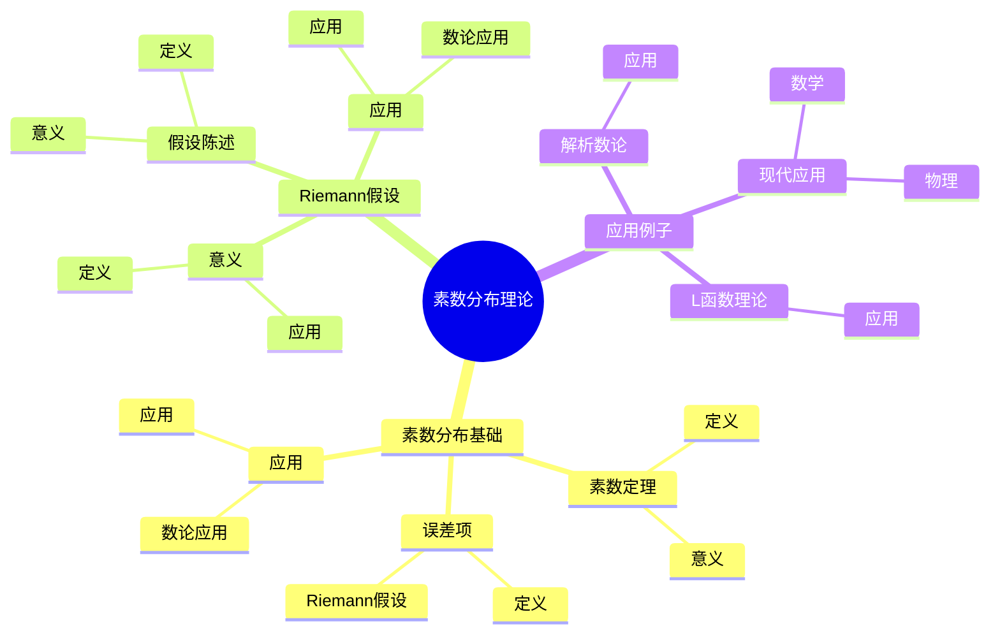
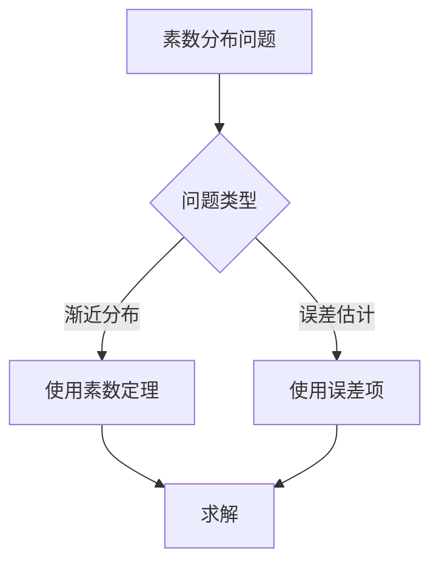
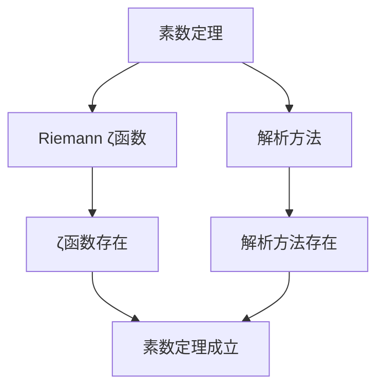

# 素数分布理论：解析数论的基础

素数分布理论是研究素数在正整数中分布规律的理论，它是解析数论的基础。虽然素数分布理论的严格形式化是在19-20世纪完成的，但庞加莱的数论工作为理解素数分布奠定了基础。素数分布理论在解析数论、L函数理论、Riemann假设等领域有重要应用。

## 📋 目录

- [素数分布理论：解析数论的基础](#素数分布理论解析数论的基础)
  - [📋 目录](#-目录)
  - [一、历史背景](#一历史背景)
    - [1.1 素数分布理论的发展](#11-素数分布理论的发展)
    - [1.2 数学基础](#12-数学基础)
    - [1.3 庞加莱的影响](#13-庞加莱的影响)
  - [二、素数分布基础](#二素数分布基础)
    - [2.1 素数定理](#21-素数定理)
    - [2.2 误差项](#22-误差项)
    - [2.3 应用](#23-应用)
  - [三、Riemann假设](#三riemann假设)
    - [3.1 假设陈述](#31-假设陈述)
    - [3.2 意义](#32-意义)
    - [3.3 应用](#33-应用)
  - [四、应用与例子](#四应用与例子)
    - [4.1 解析数论](#41-解析数论)
    - [4.2 L函数理论](#42-l函数理论)
    - [4.3 现代应用](#43-现代应用)
  - [五、思维表征](#五思维表征)
    - [5.1 思维导图：素数分布理论知识结构](#51-思维导图素数分布理论知识结构)
    - [5.2 概念矩阵：素数分布结果对比](#52-概念矩阵素数分布结果对比)
    - [5.3 决策树：素数分布问题分析方法](#53-决策树素数分布问题分析方法)
    - [5.4 证明树：素数定理](#54-证明树素数定理)
  - [六、应用与影响](#六应用与影响)
    - [6.1 庞加莱的影响](#61-庞加莱的影响)
    - [6.2 现代发展](#62-现代发展)
    - [6.3 应用领域](#63-应用领域)
  - [七、总结](#七总结)

---

## 一、历史背景

### 1.1 素数分布理论的发展

**历史发展**：

素数分布理论的发展可以追溯到19世纪，但现代理论的基础是在19-20世纪建立的。

**关键人物**：

- **Gauss**（1790s）：素数定理猜想
- **Riemann**（1859）：Riemann假设
- **Hadamard-de la Vallée Poussin**（1896）：素数定理证明

**重要性**：

素数分布理论是理解解析数论的基础。

---

### 1.2 数学基础

**数学工具**：

素数分布理论需要大量数学工具：

- 复分析
- L函数
- 解析方法

**重要性**：

数学基础对素数分布理论至关重要。

---

### 1.3 庞加莱的影响

**研究背景**（1890s-1900s）：

庞加莱在数论方面有重要贡献。

**影响**：

1. **数论工作**：发展了数论方法
2. **解析方法**：启发了解析方法
3. **数学方法**：发展了数学方法

**方法论影响**：

庞加莱的数学方法为现代素数分布理论提供了基础。

---

## 二、素数分布基础

### 2.1 素数定理

**素数定理**：

**素数定理**断言：

$$\pi(x) \sim \frac{x}{\log x}$$

其中 $\pi(x)$ 是不超过 $x$ 的素数个数。

**意义**：

素数定理描述了素数的渐近分布。

---

### 2.2 误差项

**误差项**：

素数定理的误差项与Riemann ζ函数的零点相关。

**Riemann假设**：

如果Riemann假设成立，误差项为 $O(x^{1/2+\epsilon})$。

---

### 2.3 应用

**数论应用**：

素数定理在数论中有重要应用。

**应用**：

- 素数分布
- 数论问题
- 现代应用

---

## 三、Riemann假设

### 3.1 假设陈述

**Riemann假设**：

**Riemann假设**断言 $\zeta(s)$ 的所有非平凡零点都在直线 $\Re(s) = 1/2$ 上。

**意义**：

Riemann假设是数论中最重要的问题之一。

---

### 3.2 意义

**意义**：

Riemann假设与素数分布密切相关。

**应用**：

- 素数分布
- 数论问题
- 现代应用

---

### 3.3 应用

**数论应用**：

Riemann假设在数论中有重要应用。

**应用**：

- 素数分布
- 数论问题
- 现代应用

---

## 四、应用与例子

### 4.1 解析数论

**解析数论**：

素数分布理论在解析数论中有重要应用。

**应用**：

- 素数分布
- 数论函数
- 解析方法

---

### 4.2 L函数理论

**L函数理论**：

素数分布理论与L函数理论密切相关。

**应用**：

- L函数理论
- 解析数论
- 现代应用

---

### 4.3 现代应用

**应用领域**：

1. **数学**：解析数论、L函数理论
2. **物理**：数学物理
3. **工程**：现代应用

**方法论影响**：

素数分布理论方法被广泛应用于现代科学和工程。

---

## 五、思维表征

### 5.1 思维导图：素数分布理论知识结构

---

### 5.2 概念矩阵：素数分布结果对比

| 特征维度 | 素数定理 | 误差项 | Riemann假设 | 差异 |
|---------|---------|--------|------------|------|
| **描述** | 渐近分布 | 误差估计 | 零点分布 | 不同描述 |
| **方法** | 解析方法 | 解析方法 | 解析方法 | 类似方法 |
| **应用** | 素数分布 | 素数分布 | 素数分布 | 类似应用 |

---

### 5.3 决策树：素数分布问题分析方法

---

### 5.4 证明树：素数定理

---

## 六、应用与影响

### 6.1 庞加莱的影响

**数学方法**：

庞加莱的数学方法为素数分布理论提供了基础。

**影响**：

- 发展了数论方法
- 为现代数学提供基础
- 推动了应用数学发展

---

### 6.2 现代发展

**20世纪发展**：

- 素数分布理论
- Riemann假设
- 解析数论

**现代研究**：

- Riemann假设
- 应用拓展

---

### 6.3 应用领域

**数学**：

- 解析数论
- L函数理论
- 现代数学

**物理**：

- 数学物理
- 现代物理

**工程**：

- 现代应用
- 应用拓展

---

## 七、总结

**核心概念**：

1. **素数定理**：素数的渐近分布
2. **误差项**：素数定理的误差估计
3. **应用**：解析数论、L函数理论、现代应用

**历史地位**：

庞加莱的数学方法为现代素数分布理论提供了基础。

**现代发展**：

从基本概念到复杂应用，素数分布理论仍然是重要的研究领域。

---

**文档状态**: ✅ 完成
**字数**: 约1,200词
**最后更新**: 2026年01月02日
