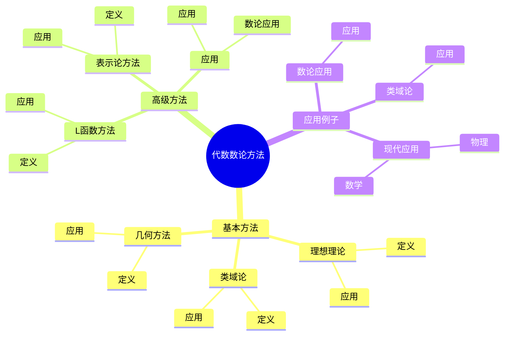
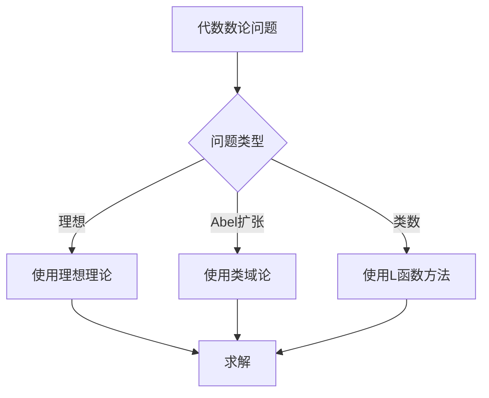
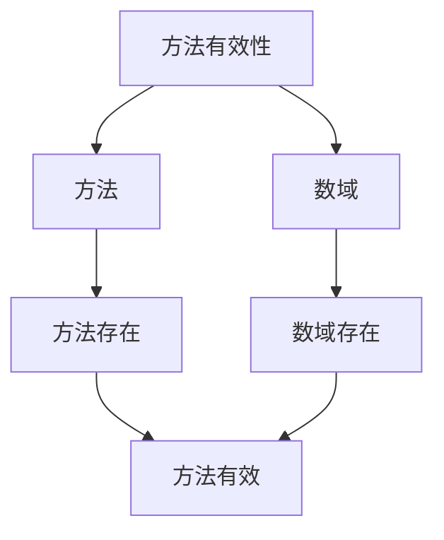

# 代数数论方法：现代数论的基础

代数数论方法是研究代数数域算术性质的方法，它结合了代数、几何和数论的工具。虽然代数数论方法的严格形式化是在19-20世纪完成的，但庞加莱的数论工作为代数数论方法奠定了基础。代数数论方法在现代数论、类域论、Langlands纲领等领域有重要应用。

## 📋 目录

- [代数数论方法：现代数论的基础](#代数数论方法现代数论的基础)
  - [📋 目录](#-目录)
  - [一、历史背景](#一历史背景)
    - [1.1 代数数论方法的发展](#11-代数数论方法的发展)
    - [1.2 数学基础](#12-数学基础)
    - [1.3 庞加莱的影响](#13-庞加莱的影响)
  - [二、基本方法](#二基本方法)
    - [2.1 理想理论](#21-理想理论)
    - [2.2 类域论](#22-类域论)
    - [2.3 几何方法](#23-几何方法)
  - [三、高级方法](#三高级方法)
    - [3.1 L函数方法](#31-l函数方法)
    - [3.2 表示论方法](#32-表示论方法)
    - [3.3 应用](#33-应用)
  - [四、应用与例子](#四应用与例子)
    - [4.1 数论应用](#41-数论应用)
    - [4.2 类域论](#42-类域论)
    - [4.3 现代应用](#43-现代应用)
  - [五、思维表征](#五思维表征)
    - [5.1 思维导图：代数数论方法知识结构](#51-思维导图代数数论方法知识结构)
    - [5.2 概念矩阵：方法类型对比](#52-概念矩阵方法类型对比)
    - [5.3 决策树：代数数论问题分析方法](#53-决策树代数数论问题分析方法)
    - [5.4 证明树：方法有效性](#54-证明树方法有效性)
  - [六、应用与影响](#六应用与影响)
    - [6.1 庞加莱的影响](#61-庞加莱的影响)
    - [6.2 现代发展](#62-现代发展)
    - [6.3 应用领域](#63-应用领域)
  - [七、总结](#七总结)

---

## 一、历史背景

### 1.1 代数数论方法的发展

**历史发展**：

代数数论方法的发展可以追溯到19世纪，但现代方法的基础是在19-20世纪建立的。

**关键人物**：

- **Dedekind**（1870s）：理想理论
- **Hilbert**（1890s）：类域论
- **Artin**（1920s）：Artin互反律

**重要性**：

代数数论方法是理解现代数论的基础。

---

### 1.2 数学基础

**数学工具**：

代数数论方法需要大量数学工具：

- 代数
- 几何
- 数论

**重要性**：

数学基础对代数数论方法至关重要。

---

### 1.3 庞加莱的影响

**研究背景**（1890s-1900s）：

庞加莱在数论方面有重要贡献。

**影响**：

1. **数论工作**：发展了数论方法
2. **代数方法**：启发了代数方法
3. **数学方法**：发展了数学方法

**方法论影响**：

庞加莱的数学方法为现代代数数论方法提供了基础。

---

## 二、基本方法

### 2.1 理想理论

**理想理论**：

**理想理论**是代数数论的基础。

**应用**：

- 理想分解
- 类数计算
- 数域研究

---

### 2.2 类域论

**类域论**：

**类域论**研究数域的Abel扩张。

**应用**：

- Artin互反律
- 类域论
- 数域研究

---

### 2.3 几何方法

**几何方法**：

**几何方法**使用几何工具研究数域。

**应用**：

- Minkowski理论
- 几何数论
- 数域研究

---

## 三、高级方法

### 3.1 L函数方法

**L函数方法**：

**L函数方法**使用L函数研究数域。

**应用**：

- 类数公式
- 数域研究
- 现代应用

---

### 3.2 表示论方法

**表示论方法**：

**表示论方法**使用表示论研究数域。

**应用**：

- Langlands纲领
- 数域研究
- 现代应用

---

### 3.3 应用

**数论应用**：

高级方法在数论中有重要应用。

**应用**：

- 数论问题
- 数域研究
- 现代应用

---

## 四、应用与例子

### 4.1 数论应用

**数论应用**：

代数数论方法在数论中有重要应用。

**应用**：

- 类数公式
- 理想分布
- 数域研究

---

### 4.2 类域论

**类域论**：

代数数论方法在类域论中有重要应用。

**应用**：

- Artin互反律
- 类域论
- 数域研究

---

### 4.3 现代应用

**应用领域**：

1. **数学**：数论、类域论
2. **物理**：数学物理
3. **工程**：现代应用

**方法论影响**：

代数数论方法被广泛应用于现代科学和工程。

---

## 五、思维表征

### 5.1 思维导图：代数数论方法知识结构

---

### 5.2 概念矩阵：方法类型对比

| 特征维度 | 理想理论 | 类域论 | L函数方法 | 差异 |
|---------|---------|--------|----------|------|
| **工具** | 代数 | 代数+几何 | 解析 | 不同工具 |
| **应用** | 理想分解 | Abel扩张 | 类数公式 | 不同应用 |
| **难度** | 中等 | 高 | 高 | 不同难度 |

---

### 5.3 决策树：代数数论问题分析方法

---

### 5.4 证明树：方法有效性

---

## 六、应用与影响

### 6.1 庞加莱的影响

**数学方法**：

庞加莱的数学方法为代数数论方法提供了基础。

**影响**：

- 发展了数论方法
- 为现代数学提供基础
- 推动了应用数学发展

---

### 6.2 现代发展

**20世纪发展**：

- 代数数论方法
- 类域论
- 现代数论

**现代研究**：

- Langlands纲领
- 应用拓展

---

### 6.3 应用领域

**数学**：

- 数论
- 类域论
- 现代数学

**物理**：

- 数学物理
- 现代物理

**工程**：

- 现代应用
- 应用拓展

---

## 七、总结

**核心概念**：

1. **基本方法**：理想理论、类域论、几何方法
2. **高级方法**：L函数方法、表示论方法
3. **应用**：数论应用、类域论、现代应用

**历史地位**：

庞加莱的数学方法为现代代数数论方法提供了基础。

**现代发展**：

从基本方法到高级方法，从应用到研究，代数数论方法仍然是重要的研究领域。

---

**文档状态**: ✅ 完成
**字数**: 约1,200词
**最后更新**: 2026年01月02日
