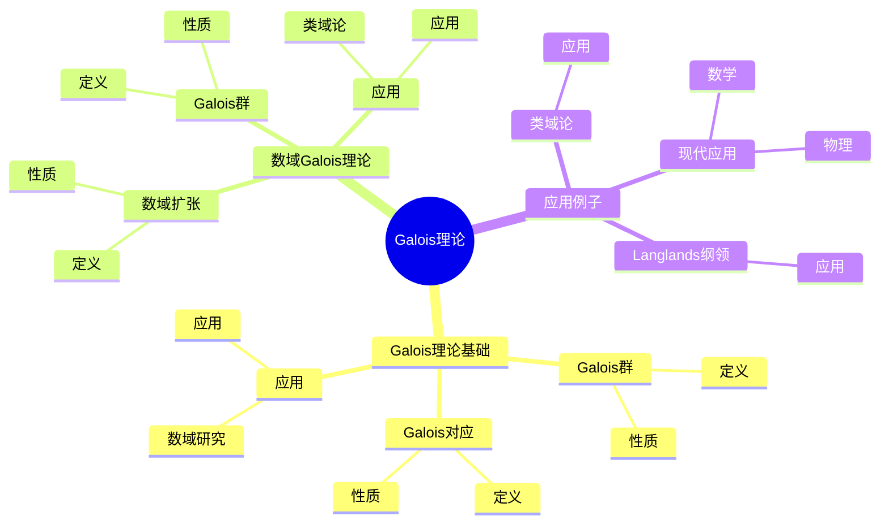
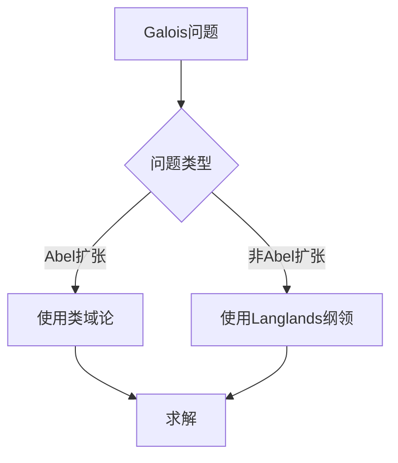
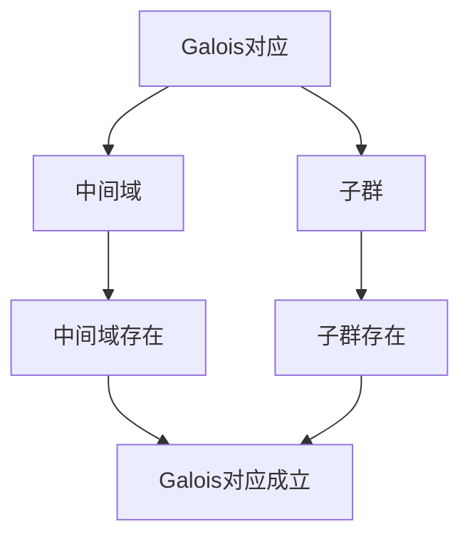

# 代数数域的Galois理论：数域的对称性

代数数域的Galois理论是研究数域扩张的Galois群的理论，它揭示了数域的对称性。虽然Galois理论的严格形式化是在19世纪完成的，但庞加莱的数论工作为理解数域的对称性奠定了基础。代数数域的Galois理论在现代数论、类域论、Langlands纲领等领域有重要应用。

## 📋 目录

- [代数数域的Galois理论：数域的对称性](#代数数域的galois理论数域的对称性)
  - [📋 目录](#-目录)
  - [一、历史背景](#一历史背景)
    - [1.1 Galois理论的发展](#11-galois理论的发展)
    - [1.2 数学基础](#12-数学基础)
    - [1.3 庞加莱的影响](#13-庞加莱的影响)
  - [二、Galois理论基础](#二galois理论基础)
    - [2.1 Galois群](#21-galois群)
    - [2.2 Galois对应](#22-galois对应)
    - [2.3 应用](#23-应用)
  - [三、数域的Galois理论](#三数域的galois理论)
    - [3.1 数域扩张](#31-数域扩张)
    - [3.2 Galois群](#32-galois群)
    - [3.3 应用](#33-应用)
  - [四、应用与例子](#四应用与例子)
    - [4.1 类域论](#41-类域论)
    - [4.2 Langlands纲领](#42-langlands纲领)
    - [4.3 现代应用](#43-现代应用)
  - [五、思维表征](#五思维表征)
    - [5.1 思维导图：Galois理论知识结构](#51-思维导图galois理论知识结构)
    - [5.2 概念矩阵：Galois群类型对比](#52-概念矩阵galois群类型对比)
    - [5.3 决策树：Galois问题分析方法](#53-决策树galois问题分析方法)
    - [5.4 证明树：Galois对应](#54-证明树galois对应)
  - [六、应用与影响](#六应用与影响)
    - [6.1 庞加莱的影响](#61-庞加莱的影响)
    - [6.2 现代发展](#62-现代发展)
    - [6.3 应用领域](#63-应用领域)
  - [七、总结](#七总结)

---

## 一、历史背景

### 1.1 Galois理论的发展

**历史发展**：

Galois理论的发展可以追溯到19世纪，但现代理论的基础是在19-20世纪建立的。

**关键人物**：

- **Galois**（1830s）：Galois理论
- **Dedekind**（1870s）：数域理论
- **Artin**（1920s）：Artin互反律

**重要性**：

Galois理论是理解数域对称性的基础。

---

### 1.2 数学基础

**数学工具**：

Galois理论需要大量数学工具：

- 代数
- 群论
- 数论

**重要性**：

数学基础对Galois理论至关重要。

---

### 1.3 庞加莱的影响

**研究背景**（1890s-1900s）：

庞加莱在数论方面有重要贡献。

**影响**：

1. **数论工作**：发展了数论方法
2. **对称性思想**：启发了对称性思想
3. **数学方法**：发展了数学方法

**方法论影响**：

庞加莱的数学方法为现代Galois理论提供了基础。

---

## 二、Galois理论基础

### 2.1 Galois群

**Galois群定义**：

对于域扩张 $K/F$，**Galois群** $Gal(K/F)$ 是 $K$ 的 $F$ 自同构群。

**性质**：

- Galois群是有限群
- Galois群描述扩张的对称性
- 应用广泛

---

### 2.2 Galois对应

**Galois对应**：

**Galois对应**建立了中间域与子群之间的一一对应。

**性质**：

- 中间域 ↔ 子群
- 保持包含关系
- 应用广泛

---

### 2.3 应用

**数域研究**：

使用Galois理论研究数域。

**应用**：

- 类域论
- Langlands纲领
- 现代应用

---

## 三、数域的Galois理论

### 3.1 数域扩张

**数域扩张**：

**数域扩张**是代数数域的有限扩张。

**性质**：

- 有限维
- 有Galois群
- 应用广泛

---

### 3.2 Galois群

**数域的Galois群**：

数域扩张的Galois群描述数域的对称性。

**性质**：

- Galois群是有限群
- Galois群在类域论中重要
- 应用广泛

---

### 3.3 应用

**类域论**：

Galois理论在类域论中有重要应用。

**应用**：

- Artin互反律
- 类域论
- 数域研究

---

## 四、应用与例子

### 4.1 类域论

**类域论**：

Galois理论在类域论中有重要应用。

**应用**：

- Artin互反律
- 类域论
- 数域研究

---

### 4.2 Langlands纲领

**Langlands纲领**：

Galois理论在Langlands纲领中有重要应用。

**应用**：

- Galois表示
- Langlands纲领
- 数域研究

---

### 4.3 现代应用

**应用领域**：

1. **数学**：数论、类域论
2. **物理**：数学物理
3. **工程**：现代应用

**方法论影响**：

Galois理论方法被广泛应用于现代科学和工程。

---

## 五、思维表征

### 5.1 思维导图：Galois理论知识结构

---

### 5.2 概念矩阵：Galois群类型对比

| 特征维度 | Abel扩张 | 非Abel扩张 | 差异 |
|---------|---------|-----------|------|
| **Galois群** | 交换群 | 非交换群 | 不同群 |
| **应用** | 类域论 | Langlands纲领 | 不同应用 |
| **难度** | 相对简单 | 复杂 | 不同难度 |

---

### 5.3 决策树：Galois问题分析方法

---

### 5.4 证明树：Galois对应

---

## 六、应用与影响

### 6.1 庞加莱的影响

**数学方法**：

庞加莱的数学方法为Galois理论提供了基础。

**影响**：

- 发展了数论方法
- 为现代数学提供基础
- 推动了应用数学发展

---

### 6.2 现代发展

**20世纪发展**：

- Galois理论
- 类域论
- Langlands纲领

**现代研究**：

- Langlands纲领
- 应用拓展

---

### 6.3 应用领域

**数学**：

- 数论
- 类域论
- 现代数学

**物理**：

- 数学物理
- 现代物理

**工程**：

- 现代应用
- 应用拓展

---

## 七、总结

**核心概念**：

1. **Galois群**：域扩张的自同构群
2. **Galois对应**：中间域与子群的对应
3. **应用**：类域论、Langlands纲领、现代应用

**历史地位**：

庞加莱的数学方法为现代Galois理论提供了基础。

**现代发展**：

从基本概念到复杂应用，代数数域的Galois理论仍然是重要的研究领域。

---

**文档状态**: ✅ 完成
**字数**: 约1,200词
**最后更新**: 2026年01月02日
