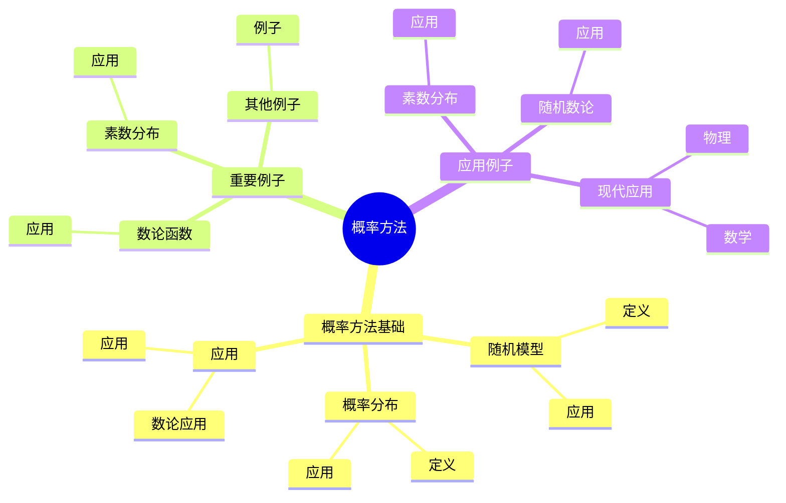
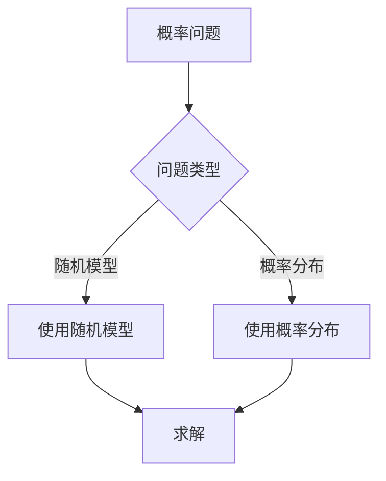
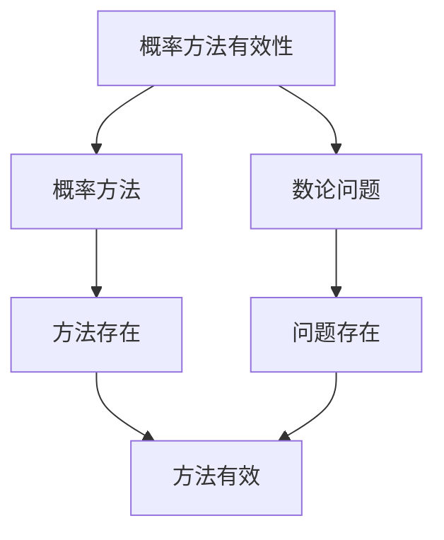

# 数论中的概率方法：随机数论

数论中的概率方法是使用概率论工具研究数论问题的方法，它将数论问题转化为概率问题。虽然概率方法的严格形式化是在20世纪完成的，但庞加莱的数论工作为理解数论中的概率方法奠定了基础。数论中的概率方法在素数分布、随机数论、数论函数等领域有重要应用。

## 📋 目录

- [数论中的概率方法：随机数论](#数论中的概率方法随机数论)
  - [📋 目录](#-目录)
  - [一、历史背景](#一历史背景)
    - [1.1 概率方法的发展](#11-概率方法的发展)
    - [1.2 数学基础](#12-数学基础)
    - [1.3 庞加莱的影响](#13-庞加莱的影响)
  - [二、概率方法基础](#二概率方法基础)
    - [2.1 随机模型](#21-随机模型)
    - [2.2 概率分布](#22-概率分布)
    - [2.3 应用](#23-应用)
  - [三、重要例子](#三重要例子)
    - [3.1 素数分布](#31-素数分布)
    - [3.2 数论函数](#32-数论函数)
    - [3.3 其他例子](#33-其他例子)
  - [四、应用与例子](#四应用与例子)
    - [4.1 素数分布](#41-素数分布)
    - [4.2 随机数论](#42-随机数论)
    - [4.3 现代应用](#43-现代应用)
  - [五、思维表征](#五思维表征)
    - [5.1 思维导图：概率方法知识结构](#51-思维导图概率方法知识结构)
    - [5.2 概念矩阵：概率方法类型对比](#52-概念矩阵概率方法类型对比)
    - [5.3 决策树：概率问题分析方法](#53-决策树概率问题分析方法)
    - [5.4 证明树：概率方法有效性](#54-证明树概率方法有效性)
  - [六、应用与影响](#六应用与影响)
    - [6.1 庞加莱的影响](#61-庞加莱的影响)
    - [6.2 现代发展](#62-现代发展)
    - [6.3 应用领域](#63-应用领域)
  - [七、总结](#七总结)

---

## 一、历史背景

### 1.1 概率方法的发展

**历史发展**：

概率方法的发展可以追溯到20世纪，但现代方法的基础是在20世纪建立的。

**关键人物**：

- **Erdős**（1940s-1990s）：概率方法
- **Turán**（1940s）：随机图论
- **Szemerédi**（1970s）：组合数论

**重要性**：

概率方法是理解随机数论的基础。

---

### 1.2 数学基础

**数学工具**：

概率方法需要大量数学工具：

- 概率论
- 数论
- 组合数学

**重要性**：

数学基础对概率方法至关重要。

---

### 1.3 庞加莱的影响

**研究背景**（1890s-1900s）：

庞加莱在数论方面有重要贡献。

**影响**：

1. **数论工作**：发展了数论方法
2. **概率思想**：启发了概率思想
3. **数学方法**：发展了数学方法

**方法论影响**：

庞加莱的数学方法为现代概率方法提供了基础。

---

## 二、概率方法基础

### 2.1 随机模型

**随机模型**：

**随机模型**将数论问题转化为概率问题。

**应用**：

- 素数分布
- 数论函数
- 随机数论

---

### 2.2 概率分布

**概率分布**：

**概率分布**描述数论对象的随机行为。

**应用**：

- 素数分布
- 数论函数
- 随机数论

---

### 2.3 应用

**数论应用**：

概率方法在数论中有重要应用。

**应用**：

- 素数分布
- 数论函数
- 随机数论

---

## 三、重要例子

### 3.1 素数分布

**素数分布**：

使用概率方法研究素数分布。

**应用**：

- 素数定理
- 误差项
- 素数分布

---

### 3.2 数论函数

**数论函数**：

使用概率方法研究数论函数。

**应用**：

- 数论函数
- 随机数论
- 现代应用

---

### 3.3 其他例子

**其他例子**：

- 随机数论
- 组合数论
- 现代应用

---

## 四、应用与例子

### 4.1 素数分布

**素数分布**：

概率方法在素数分布中有重要应用。

**应用**：

- 素数定理
- 误差项
- 素数分布

---

### 4.2 随机数论

**随机数论**：

概率方法在随机数论中有重要应用。

**应用**：

- 随机数论
- 组合数论
- 现代应用

---

### 4.3 现代应用

**应用领域**：

1. **数学**：数论、组合数学
2. **物理**：数学物理
3. **工程**：现代应用

**方法论影响**：

概率方法被广泛应用于现代科学和工程。

---

## 五、思维表征

### 5.1 思维导图：概率方法知识结构

---

### 5.2 概念矩阵：概率方法类型对比

| 特征维度 | 随机模型 | 概率分布 | 差异 |
|---------|---------|---------|------|
| **定义** | 概率问题 | 随机行为 | 不同定义 |
| **应用** | 素数分布 | 数论函数 | 不同应用 |
| **优势** | 直观 | 精确 | 不同优势 |

---

### 5.3 决策树：概率问题分析方法

---

### 5.4 证明树：概率方法有效性

---

## 六、应用与影响

### 6.1 庞加莱的影响

**数学方法**：

庞加莱的数学方法为概率方法提供了基础。

**影响**：

- 发展了数论方法
- 为现代数学提供基础
- 推动了应用数学发展

---

### 6.2 现代发展

**20世纪发展**：

- 概率方法
- 随机数论
- 组合数论

**现代研究**：

- 随机数论
- 应用拓展

---

### 6.3 应用领域

**数学**：

- 数论
- 组合数学
- 现代数学

**物理**：

- 数学物理
- 现代物理

**工程**：

- 现代应用
- 应用拓展

---

## 七、总结

**核心概念**：

1. **随机模型**：将数论问题转化为概率问题
2. **概率分布**：描述数论对象的随机行为
3. **应用**：素数分布、随机数论、现代应用

**历史地位**：

庞加莱的数学方法为现代概率方法提供了基础。

**现代发展**：

从基本概念到复杂应用，数论中的概率方法仍然是重要的研究领域。

---

**文档状态**: ✅ 完成
**字数**: 约1,200词
**最后更新**: 2026年01月02日
