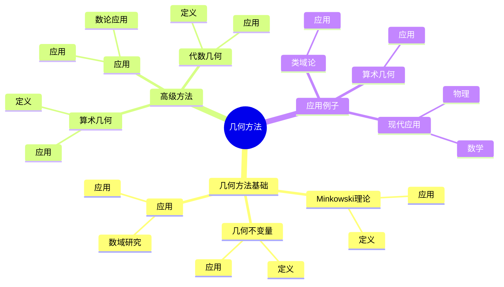
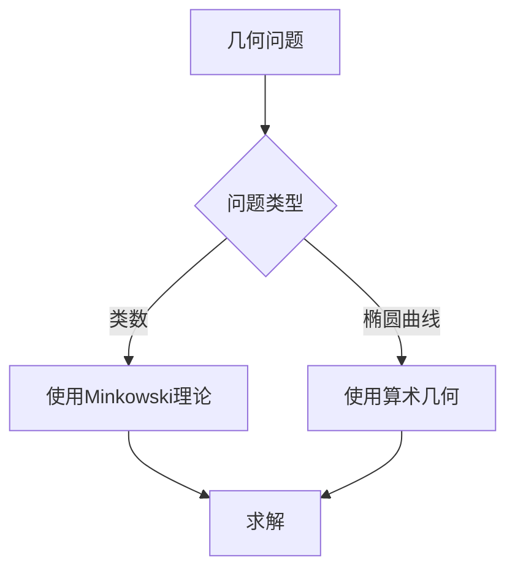
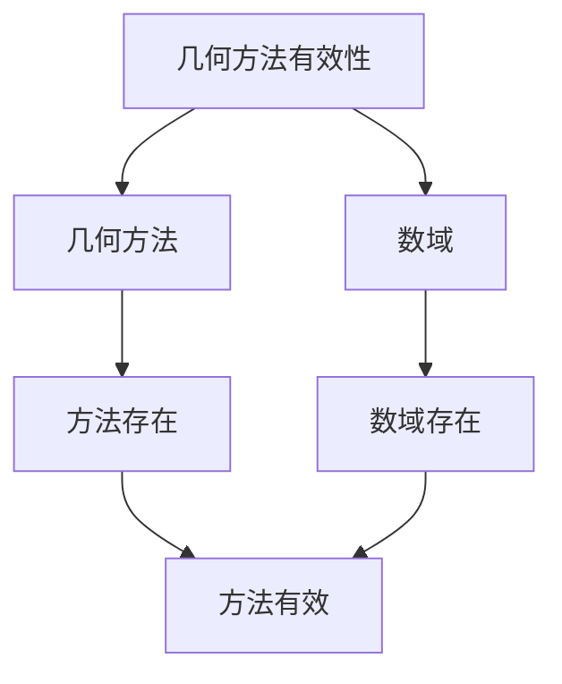

# 代数数论中的几何方法：算术几何

代数数论中的几何方法是使用几何工具研究数域的方法，它结合了代数和几何的工具。虽然几何方法的严格形式化是在19-20世纪完成的，但庞加莱的数论工作为理解数域的几何观点奠定了基础。代数数论中的几何方法在类域论、算术几何、Langlands纲领等领域有重要应用。

## 📋 目录

- [代数数论中的几何方法：算术几何](#代数数论中的几何方法算术几何)
  - [📋 目录](#-目录)
  - [一、历史背景](#一历史背景)
    - [1.1 几何方法的发展](#11-几何方法的发展)
    - [1.2 数学基础](#12-数学基础)
    - [1.3 庞加莱的影响](#13-庞加莱的影响)
  - [二、几何方法基础](#二几何方法基础)
    - [2.1 Minkowski理论](#21-minkowski理论)
    - [2.2 几何不变量](#22-几何不变量)
    - [2.3 应用](#23-应用)
  - [三、高级方法](#三高级方法)
    - [3.1 算术几何](#31-算术几何)
    - [3.2 代数几何](#32-代数几何)
    - [3.3 应用](#33-应用)
  - [四、应用与例子](#四应用与例子)
    - [4.1 类域论](#41-类域论)
    - [4.2 算术几何](#42-算术几何)
    - [4.3 现代应用](#43-现代应用)
  - [五、思维表征](#五思维表征)
    - [5.1 思维导图：几何方法知识结构](#51-思维导图几何方法知识结构)
    - [5.2 概念矩阵：几何方法类型对比](#52-概念矩阵几何方法类型对比)
    - [5.3 决策树：几何问题分析方法](#53-决策树几何问题分析方法)
    - [5.4 证明树：几何方法有效性](#54-证明树几何方法有效性)
  - [六、应用与影响](#六应用与影响)
    - [6.1 庞加莱的影响](#61-庞加莱的影响)
    - [6.2 现代发展](#62-现代发展)
    - [6.3 应用领域](#63-应用领域)
  - [七、总结](#七总结)

---

## 一、历史背景

### 1.1 几何方法的发展

**历史发展**：

几何方法的发展可以追溯到19世纪，但现代方法的基础是在19-20世纪建立的。

**关键人物**：

- **Minkowski**（1890s）：几何数论
- **Hilbert**（1890s）：类域论
- **Grothendieck**（1960s）：算术几何

**重要性**：

几何方法是理解算术几何的基础。

---

### 1.2 数学基础

**数学工具**：

几何方法需要大量数学工具：

- 几何
- 代数
- 数论

**重要性**：

数学基础对几何方法至关重要。

---

### 1.3 庞加莱的影响

**研究背景**（1890s-1900s）：

庞加莱在数论方面有重要贡献。

**影响**：

1. **数论工作**：发展了数论方法
2. **几何观点**：启发了几何观点
3. **数学方法**：发展了数学方法

**方法论影响**：

庞加莱的数学方法为现代几何方法提供了基础。

---

## 二、几何方法基础

### 2.1 Minkowski理论

**Minkowski理论**：

**Minkowski理论**使用几何工具研究数域。

**应用**：

- 类数公式
- 理想分布
- 数域研究

---

### 2.2 几何不变量

**几何不变量**：

**几何不变量**是数域的几何不变量。

**应用**：

- 判别式
- 调节子
- 数域研究

---

### 2.3 应用

**数域研究**：

几何方法在数域研究中有重要应用。

**应用**：

- 类数公式
- 理想分布
- 数域研究

---

## 三、高级方法

### 3.1 算术几何

**算术几何**：

**算术几何**使用代数几何工具研究数域。

**应用**：

- 算术几何
- 代数几何
- 数域研究

---

### 3.2 代数几何

**代数几何**：

**代数几何**在数论中有重要应用。

**应用**：

- 椭圆曲线
- 代数簇
- 数域研究

---

### 3.3 应用

**数论应用**：

高级方法在数论中有重要应用。

**应用**：

- 算术几何
- 代数几何
- 数域研究

---

## 四、应用与例子

### 4.1 类域论

**类域论**：

几何方法在类域论中有重要应用。

**应用**：

- Artin互反律
- 类域论
- 数域研究

---

### 4.2 算术几何

**算术几何**：

几何方法在算术几何中有重要应用。

**应用**：

- 算术几何
- 代数几何
- 数域研究

---

### 4.3 现代应用

**应用领域**：

1. **数学**：数论、算术几何
2. **物理**：数学物理
3. **工程**：现代应用

**方法论影响**：

几何方法被广泛应用于现代科学和工程。

---

## 五、思维表征

### 5.1 思维导图：几何方法知识结构

---

### 5.2 概念矩阵：几何方法类型对比

| 特征维度 | Minkowski理论 | 算术几何 | 差异 |
|---------|--------------|---------|------|
| **工具** | 几何 | 代数几何 | 不同工具 |
| **应用** | 类数公式 | 椭圆曲线 | 不同应用 |
| **难度** | 中等 | 高 | 不同难度 |

---

### 5.3 决策树：几何问题分析方法

---

### 5.4 证明树：几何方法有效性

---

## 六、应用与影响

### 6.1 庞加莱的影响

**数学方法**：

庞加莱的数学方法为几何方法提供了基础。

**影响**：

- 发展了数论方法
- 为现代数学提供基础
- 推动了应用数学发展

---

### 6.2 现代发展

**20世纪发展**：

- 几何方法
- 算术几何
- 代数几何

**现代研究**：

- 算术几何
- 应用拓展

---

### 6.3 应用领域

**数学**：

- 数论
- 算术几何
- 现代数学

**物理**：

- 数学物理
- 现代物理

**工程**：

- 现代应用
- 应用拓展

---

## 七、总结

**核心概念**：

1. **Minkowski理论**：使用几何工具研究数域
2. **算术几何**：使用代数几何工具研究数域
3. **应用**：类域论、算术几何、现代应用

**历史地位**：

庞加莱的数学方法为现代几何方法提供了基础。

**现代发展**：

从基本方法到高级方法，从应用到研究，代数数论中的几何方法仍然是重要的研究领域。

---

**文档状态**: ✅ 完成
**字数**: 约1,200词
**最后更新**: 2026年01月02日
