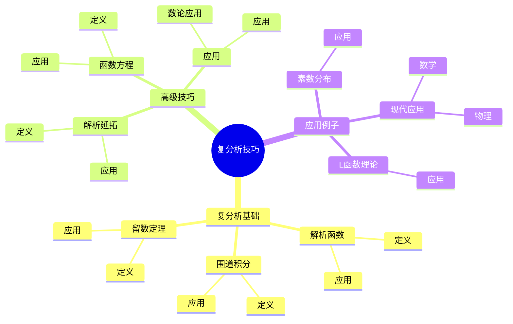
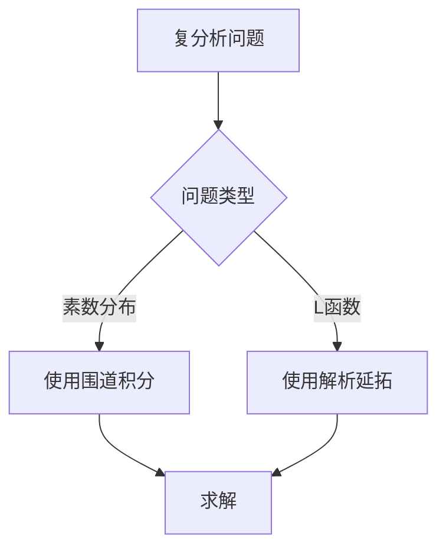
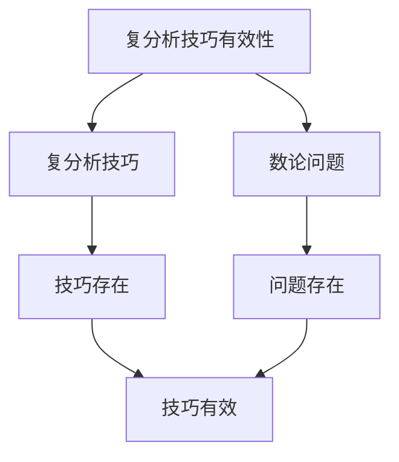

# 解析数论中的复分析：复分析技巧

解析数论中的复分析是使用复分析技巧研究数论问题的方法，它结合了复分析和数论的工具。虽然复分析技巧的严格形式化是在19-20世纪完成的，但庞加莱的数论工作为理解解析数论中的复分析奠定了基础。解析数论中的复分析在素数分布、L函数理论、解析数论等领域有重要应用。

## 📋 目录

- [解析数论中的复分析：复分析技巧](#解析数论中的复分析复分析技巧)
  - [📋 目录](#-目录)
  - [一、历史背景](#一历史背景)
    - [1.1 复分析技巧的发展](#11-复分析技巧的发展)
    - [1.2 数学基础](#12-数学基础)
    - [1.3 庞加莱的影响](#13-庞加莱的影响)
  - [二、复分析基础](#二复分析基础)
    - [2.1 解析函数](#21-解析函数)
    - [2.2 围道积分](#22-围道积分)
    - [2.3 留数定理](#23-留数定理)
  - [三、高级技巧](#三高级技巧)
    - [3.1 解析延拓](#31-解析延拓)
    - [3.2 函数方程](#32-函数方程)
    - [3.3 应用](#33-应用)
  - [四、应用与例子](#四应用与例子)
    - [4.1 素数分布](#41-素数分布)
    - [4.2 L函数理论](#42-l函数理论)
    - [4.3 现代应用](#43-现代应用)
  - [五、思维表征](#五思维表征)
    - [5.1 思维导图：复分析技巧知识结构](#51-思维导图复分析技巧知识结构)
    - [5.2 概念矩阵：复分析技巧类型对比](#52-概念矩阵复分析技巧类型对比)
    - [5.3 决策树：复分析问题分析方法](#53-决策树复分析问题分析方法)
    - [5.4 证明树：复分析技巧有效性](#54-证明树复分析技巧有效性)
  - [六、应用与影响](#六应用与影响)
    - [6.1 庞加莱的影响](#61-庞加莱的影响)
    - [6.2 现代发展](#62-现代发展)
    - [6.3 应用领域](#63-应用领域)
  - [七、总结](#七总结)

---

## 一、历史背景

### 1.1 复分析技巧的发展

**历史发展**：

复分析技巧的发展可以追溯到19世纪，但现代技巧的基础是在19-20世纪建立的。

**关键人物**：

- **Cauchy**（1820s）：复分析基础
- **Riemann**（1859）：Riemann ζ函数
- **Hadamard-de la Vallée Poussin**（1896）：素数定理

**重要性**：

复分析技巧是理解解析数论的基础。

---

### 1.2 数学基础

**数学工具**：

复分析技巧需要大量数学工具：

- 复分析
- 数论
- 解析方法

**重要性**：

数学基础对复分析技巧至关重要。

---

### 1.3 庞加莱的影响

**研究背景**（1890s-1900s）：

庞加莱在数论方面有重要贡献。

**影响**：

1. **数论工作**：发展了数论方法
2. **复分析思想**：启发了复分析思想
3. **数学方法**：发展了数学方法

**方法论影响**：

庞加莱的数学方法为现代复分析技巧提供了基础。

---

## 二、复分析基础

### 2.1 解析函数

**解析函数**：

**解析函数**是复分析的基本对象。

**应用**：

- L函数
- 解析数论
- 现代应用

---

### 2.2 围道积分

**围道积分**：

**围道积分**用于计算数论函数的和。

**应用**：

- 素数分布
- 数论函数
- 解析数论

---

### 2.3 留数定理

**留数定理**：

**留数定理**用于计算围道积分。

**应用**：

- 素数分布
- 数论函数
- 解析数论

---

## 三、高级技巧

### 3.1 解析延拓

**解析延拓**：

**解析延拓**用于延拓L函数。

**应用**：

- L函数理论
- 解析数论
- 现代应用

---

### 3.2 函数方程

**函数方程**：

**函数方程**用于研究L函数的对称性。

**应用**：

- L函数理论
- 解析数论
- 现代应用

---

### 3.3 应用

**数论应用**：

高级技巧在数论中有重要应用。

**应用**：

- 素数分布
- L函数理论
- 解析数论

---

## 四、应用与例子

### 4.1 素数分布

**素数分布**：

复分析在素数分布中有重要应用。

**应用**：

- 素数定理
- 误差项
- 素数分布

---

### 4.2 L函数理论

**L函数理论**：

复分析在L函数理论中有重要应用。

**应用**：

- L函数理论
- 函数方程
- 解析延拓

---

### 4.3 现代应用

**应用领域**：

1. **数学**：解析数论、L函数理论
2. **物理**：数学物理
3. **工程**：现代应用

**方法论影响**：

复分析技巧被广泛应用于现代科学和工程。

---

## 五、思维表征

### 5.1 思维导图：复分析技巧知识结构

---

### 5.2 概念矩阵：复分析技巧类型对比

| 特征维度 | 围道积分 | 解析延拓 | 函数方程 | 差异 |
|---------|---------|---------|---------|------|
| **工具** | 积分 | 延拓 | 方程 | 不同工具 |
| **应用** | 素数分布 | L函数 | L函数 | 不同应用 |
| **难度** | 中等 | 高 | 高 | 不同难度 |

---

### 5.3 决策树：复分析问题分析方法

---

### 5.4 证明树：复分析技巧有效性

---

## 六、应用与影响

### 6.1 庞加莱的影响

**数学方法**：

庞加莱的数学方法为复分析技巧提供了基础。

**影响**：

- 发展了数论方法
- 为现代数学提供基础
- 推动了应用数学发展

---

### 6.2 现代发展

**20世纪发展**：

- 复分析技巧
- L函数理论
- 解析数论

**现代研究**：

- L函数理论
- 应用拓展

---

### 6.3 应用领域

**数学**：

- 解析数论
- L函数理论
- 现代数学

**物理**：

- 数学物理
- 现代物理

**工程**：

- 现代应用
- 应用拓展

---

## 七、总结

**核心概念**：

1. **复分析基础**：解析函数、围道积分、留数定理
2. **高级技巧**：解析延拓、函数方程
3. **应用**：素数分布、L函数理论、现代应用

**历史地位**：

庞加莱的数学方法为现代复分析技巧提供了基础。

**现代发展**：

从基本技巧到高级技巧，从应用到研究，解析数论中的复分析仍然是重要的研究领域。

---

**文档状态**: ✅ 完成
**字数**: 约1,200词
**最后更新**: 2026年01月02日
