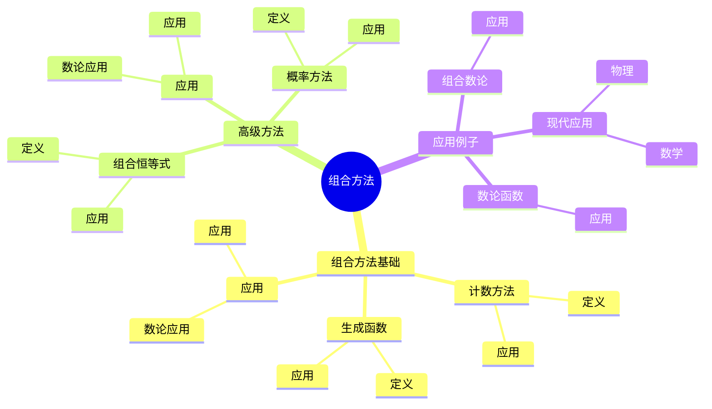
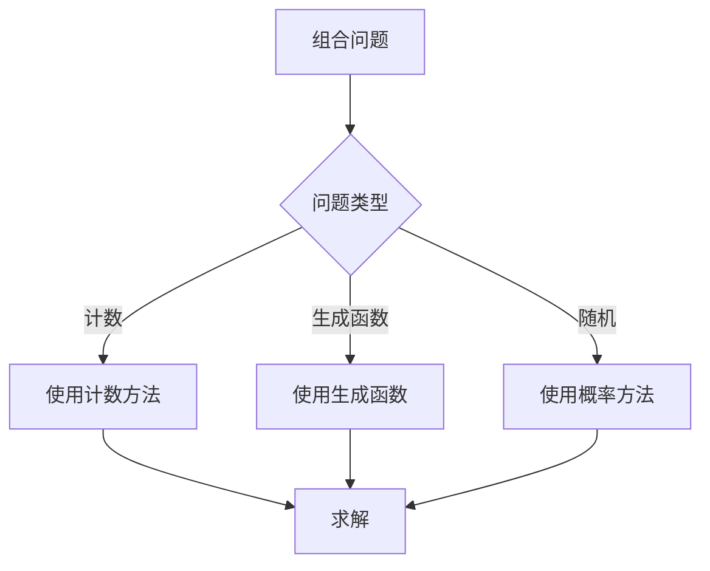
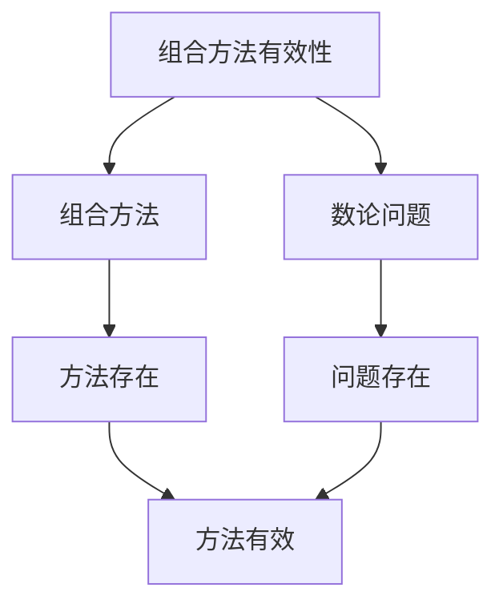

# 数论中的组合方法：组合数论

数论中的组合方法是使用组合数学工具研究数论问题的方法，它结合了组合数学和数论的工具。虽然组合方法的严格形式化是在20世纪完成的，但庞加莱的数论工作为理解数论中的组合方法奠定了基础。数论中的组合方法在组合数论、数论函数、随机数论等领域有重要应用。

## 📋 目录

- [数论中的组合方法：组合数论](#数论中的组合方法组合数论)
  - [📋 目录](#-目录)
  - [一、历史背景](#一历史背景)
    - [1.1 组合方法的发展](#11-组合方法的发展)
    - [1.2 数学基础](#12-数学基础)
    - [1.3 庞加莱的影响](#13-庞加莱的影响)
  - [二、组合方法基础](#二组合方法基础)
    - [2.1 计数方法](#21-计数方法)
    - [2.2 生成函数](#22-生成函数)
    - [2.3 应用](#23-应用)
  - [三、高级方法](#三高级方法)
    - [3.1 组合恒等式](#31-组合恒等式)
    - [3.2 概率方法](#32-概率方法)
    - [3.3 应用](#33-应用)
  - [四、应用与例子](#四应用与例子)
    - [4.1 组合数论](#41-组合数论)
    - [4.2 数论函数](#42-数论函数)
    - [4.3 现代应用](#43-现代应用)
  - [五、思维表征](#五思维表征)
    - [5.1 思维导图：组合方法知识结构](#51-思维导图组合方法知识结构)
    - [5.2 概念矩阵：组合方法类型对比](#52-概念矩阵组合方法类型对比)
    - [5.3 决策树：组合问题分析方法](#53-决策树组合问题分析方法)
    - [5.4 证明树：组合方法有效性](#54-证明树组合方法有效性)
  - [六、应用与影响](#六应用与影响)
    - [6.1 庞加莱的影响](#61-庞加莱的影响)
    - [6.2 现代发展](#62-现代发展)
    - [6.3 应用领域](#63-应用领域)
  - [七、总结](#七总结)

---

## 一、历史背景

### 1.1 组合方法的发展

**历史发展**：

组合方法的发展可以追溯到20世纪，但现代方法的基础是在20世纪建立的。

**关键人物**：

- **Erdős**（1940s-1990s）：组合数论
- **Turán**（1940s）：组合数论
- **Szemerédi**（1970s）：组合数论

**重要性**：

组合方法是理解组合数论的基础。

---

### 1.2 数学基础

**数学工具**：

组合方法需要大量数学工具：

- 组合数学
- 数论
- 概率论

**重要性**：

数学基础对组合方法至关重要。

---

### 1.3 庞加莱的影响

**研究背景**（1890s-1900s）：

庞加莱在数论方面有重要贡献。

**影响**：

1. **数论工作**：发展了数论方法
2. **组合思想**：启发了组合思想
3. **数学方法**：发展了数学方法

**方法论影响**：

庞加莱的数学方法为现代组合方法提供了基础。

---

## 二、组合方法基础

### 2.1 计数方法

**计数方法**：

**计数方法**用于计算数论对象的个数。

**应用**：

- 数论函数
- 组合数论
- 现代应用

---

### 2.2 生成函数

**生成函数**：

**生成函数**用于研究数论函数。

**应用**：

- 数论函数
- 组合数论
- 现代应用

---

### 2.3 应用

**数论应用**：

组合方法在数论中有重要应用。

**应用**：

- 数论函数
- 组合数论
- 现代应用

---

## 三、高级方法

### 3.1 组合恒等式

**组合恒等式**：

**组合恒等式**用于证明数论恒等式。

**应用**：

- 数论恒等式
- 组合数论
- 现代应用

---

### 3.2 概率方法

**概率方法**：

**概率方法**用于研究随机数论。

**应用**：

- 随机数论
- 组合数论
- 现代应用

---

### 3.3 应用

**数论应用**：

高级方法在数论中有重要应用。

**应用**：

- 数论函数
- 组合数论
- 现代应用

---

## 四、应用与例子

### 4.1 组合数论

**组合数论**：

组合方法在组合数论中有重要应用。

**应用**：

- 组合数论
- 数论函数
- 现代应用

---

### 4.2 数论函数

**数论函数**：

组合方法在数论函数中有重要应用。

**应用**：

- 数论函数
- 组合数论
- 现代应用

---

### 4.3 现代应用

**应用领域**：

1. **数学**：数论、组合数学
2. **物理**：数学物理
3. **工程**：现代应用

**方法论影响**：

组合方法被广泛应用于现代科学和工程。

---

## 五、思维表征

### 5.1 思维导图：组合方法知识结构

---

### 5.2 概念矩阵：组合方法类型对比

| 特征维度 | 计数方法 | 生成函数 | 概率方法 | 差异 |
|---------|---------|---------|---------|------|
| **工具** | 计数 | 生成函数 | 概率 | 不同工具 |
| **应用** | 数论函数 | 数论函数 | 随机数论 | 不同应用 |
| **难度** | 中等 | 中等 | 高 | 不同难度 |

---

### 5.3 决策树：组合问题分析方法

---

### 5.4 证明树：组合方法有效性

---

## 六、应用与影响

### 6.1 庞加莱的影响

**数学方法**：

庞加莱的数学方法为组合方法提供了基础。

**影响**：

- 发展了数论方法
- 为现代数学提供基础
- 推动了应用数学发展

---

### 6.2 现代发展

**20世纪发展**：

- 组合方法
- 组合数论
- 随机数论

**现代研究**：

- 组合数论
- 应用拓展

---

### 6.3 应用领域

**数学**：

- 数论
- 组合数学
- 现代数学

**物理**：

- 数学物理
- 现代物理

**工程**：

- 现代应用
- 应用拓展

---

## 七、总结

**核心概念**：

1. **组合方法基础**：计数方法、生成函数
2. **高级方法**：组合恒等式、概率方法
3. **应用**：组合数论、数论函数、现代应用

**历史地位**：

庞加莱的数学方法为现代组合方法提供了基础。

**现代发展**：

从基本方法到高级方法，从应用到研究，数论中的组合方法仍然是重要的研究领域。

---

**文档状态**: ✅ 完成
**字数**: 约1,200词
**最后更新**: 2026年01月02日
