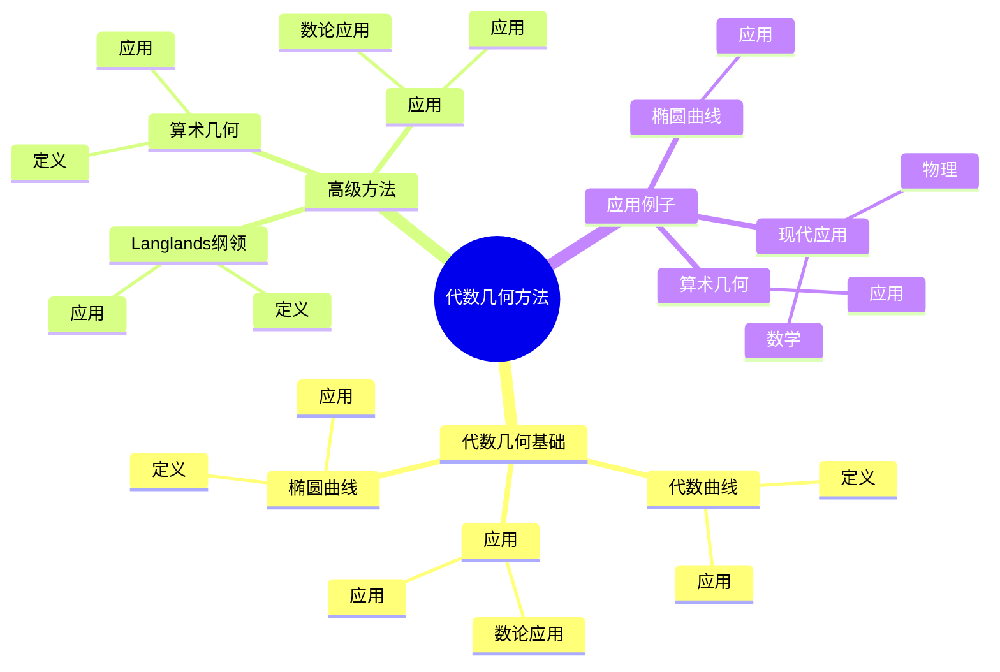
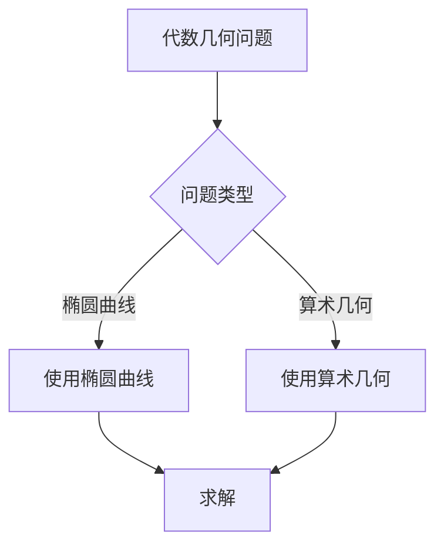
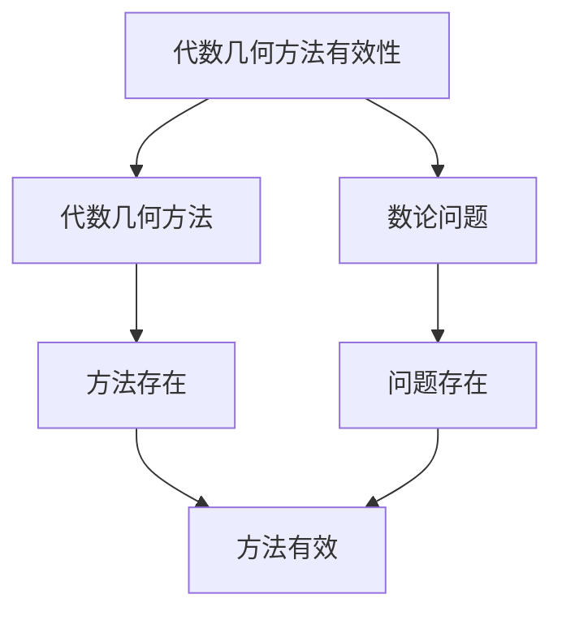

# 数论中的代数几何方法：算术几何技巧

数论中的代数几何方法是使用代数几何工具研究数论问题的方法，它结合了代数几何和数论的工具。虽然代数几何方法的严格形式化是在20世纪完成的，但庞加莱的数论工作为理解数论中的代数几何方法奠定了基础。数论中的代数几何方法在椭圆曲线、算术几何、Langlands纲领等领域有重要应用。

## 📋 目录

- [数论中的代数几何方法：算术几何技巧](#数论中的代数几何方法算术几何技巧)
  - [📋 目录](#-目录)
  - [一、历史背景](#一历史背景)
    - [1.1 代数几何方法的发展](#11-代数几何方法的发展)
    - [1.2 数学基础](#12-数学基础)
    - [1.3 庞加莱的影响](#13-庞加莱的影响)
  - [二、代数几何基础](#二代数几何基础)
    - [2.1 代数曲线](#21-代数曲线)
    - [2.2 椭圆曲线](#22-椭圆曲线)
    - [2.3 应用](#23-应用)
  - [三、高级方法](#三高级方法)
    - [3.1 算术几何](#31-算术几何)
    - [3.2 Langlands纲领](#32-langlands纲领)
    - [3.3 应用](#33-应用)
  - [四、应用与例子](#四应用与例子)
    - [4.1 椭圆曲线](#41-椭圆曲线)
    - [4.2 算术几何](#42-算术几何)
    - [4.3 现代应用](#43-现代应用)
  - [五、思维表征](#五思维表征)
    - [5.1 思维导图：代数几何方法知识结构](#51-思维导图代数几何方法知识结构)
    - [5.2 概念矩阵：代数几何方法类型对比](#52-概念矩阵代数几何方法类型对比)
    - [5.3 决策树：代数几何问题分析方法](#53-决策树代数几何问题分析方法)
    - [5.4 证明树：代数几何方法有效性](#54-证明树代数几何方法有效性)
  - [六、应用与影响](#六应用与影响)
    - [6.1 庞加莱的影响](#61-庞加莱的影响)
    - [6.2 现代发展](#62-现代发展)
    - [6.3 应用领域](#63-应用领域)
  - [七、总结](#七总结)

---

## 一、历史背景

### 1.1 代数几何方法的发展

**历史发展**：

代数几何方法的发展可以追溯到20世纪，但现代方法的基础是在20世纪建立的。

**关键人物**：

- **Weil**（1940s-1950s）：算术几何
- **Grothendieck**（1960s）：概形理论
- **Faltings**（1980s）：Mordell猜想

**重要性**：

代数几何方法是理解算术几何的基础。

---

### 1.2 数学基础

**数学工具**：

代数几何方法需要大量数学工具：

- 代数几何
- 数论
- 表示论

**重要性**：

数学基础对代数几何方法至关重要。

---

### 1.3 庞加莱的影响

**研究背景**（1890s-1900s）：

庞加莱在数论方面有重要贡献。

**影响**：

1. **数论工作**：发展了数论方法
2. **几何思想**：启发了几何思想
3. **数学方法**：发展了数学方法

**方法论影响**：

庞加莱的数学方法为现代代数几何方法提供了基础。

---

## 二、代数几何基础

### 2.1 代数曲线

**代数曲线**：

**代数曲线**是代数几何的基本对象。

**应用**：

- 椭圆曲线
- 算术几何
- 数域研究

---

### 2.2 椭圆曲线

**椭圆曲线**：

**椭圆曲线**是亏格为1的代数曲线。

**应用**：

- Fermat大定理
- 数论问题
- 现代应用

---

### 2.3 应用

**数论应用**：

代数几何在数论中有重要应用。

**应用**：

- 椭圆曲线
- 算术几何
- 数域研究

---

## 三、高级方法

### 3.1 算术几何

**算术几何**：

**算术几何**使用代数几何工具研究数论问题。

**应用**：

- 椭圆曲线
- 代数簇
- 数域研究

---

### 3.2 Langlands纲领

**Langlands纲领**：

**Langlands纲领**将代数几何与表示论联系起来。

**应用**：

- Langlands纲领
- 数域研究
- 现代应用

---

### 3.3 应用

**数论应用**：

高级方法在数论中有重要应用。

**应用**：

- 椭圆曲线
- 算术几何
- Langlands纲领

---

## 四、应用与例子

### 4.1 椭圆曲线

**椭圆曲线**：

代数几何方法在椭圆曲线中有重要应用。

**应用**：

- Fermat大定理
- 数论问题
- 现代应用

---

### 4.2 算术几何

**算术几何**：

代数几何方法在算术几何中有重要应用。

**应用**：

- 椭圆曲线
- 代数簇
- 数域研究

---

### 4.3 现代应用

**应用领域**：

1. **数学**：数论、算术几何
2. **物理**：数学物理
3. **工程**：现代应用

**方法论影响**：

代数几何方法被广泛应用于现代科学和工程。

---

## 五、思维表征

### 5.1 思维导图：代数几何方法知识结构

---

### 5.2 概念矩阵：代数几何方法类型对比

| 特征维度 | 代数曲线 | 椭圆曲线 | 算术几何 | 差异 |
|---------|---------|---------|---------|------|
| **工具** | 代数几何 | 椭圆曲线 | 概形理论 | 不同工具 |
| **应用** | 代数曲线 | Fermat大定理 | Langlands纲领 | 不同应用 |
| **难度** | 中等 | 高 | 极高 | 不同难度 |

---

### 5.3 决策树：代数几何问题分析方法

---

### 5.4 证明树：代数几何方法有效性

---

## 六、应用与影响

### 6.1 庞加莱的影响

**数学方法**：

庞加莱的数学方法为代数几何方法提供了基础。

**影响**：

- 发展了数论方法
- 为现代数学提供基础
- 推动了应用数学发展

---

### 6.2 现代发展

**20世纪发展**：

- 代数几何方法
- 算术几何
- Langlands纲领

**现代研究**：

- Langlands纲领
- 应用拓展

---

### 6.3 应用领域

**数学**：

- 数论
- 算术几何
- 现代数学

**物理**：

- 数学物理
- 现代物理

**工程**：

- 现代应用
- 应用拓展

---

## 七、总结

**核心概念**：

1. **代数几何基础**：代数曲线、椭圆曲线
2. **高级方法**：算术几何、Langlands纲领
3. **应用**：椭圆曲线、算术几何、现代应用

**历史地位**：

庞加莱的数学方法为现代代数几何方法提供了基础。

**现代发展**：

从基本方法到高级方法，从应用到研究，数论中的代数几何方法仍然是重要的研究领域。

---

**文档状态**: ✅ 完成
**字数**: 约1,200词
**最后更新**: 2026年01月02日
