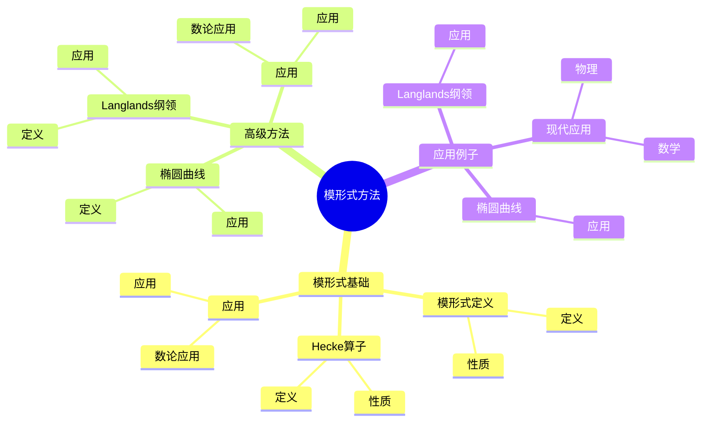
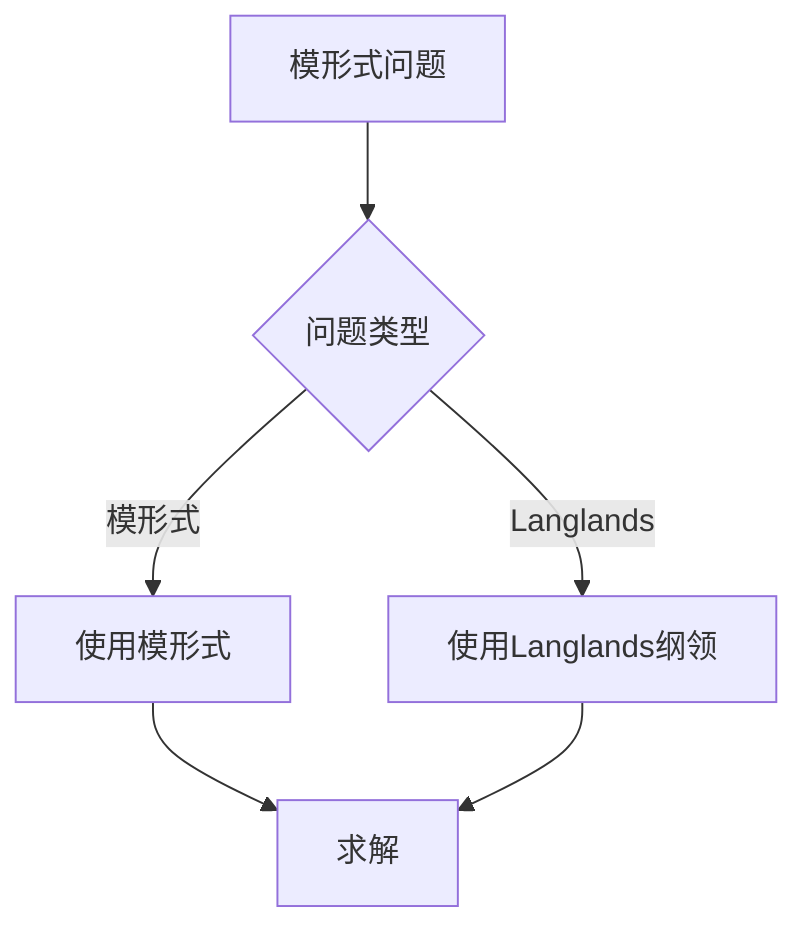
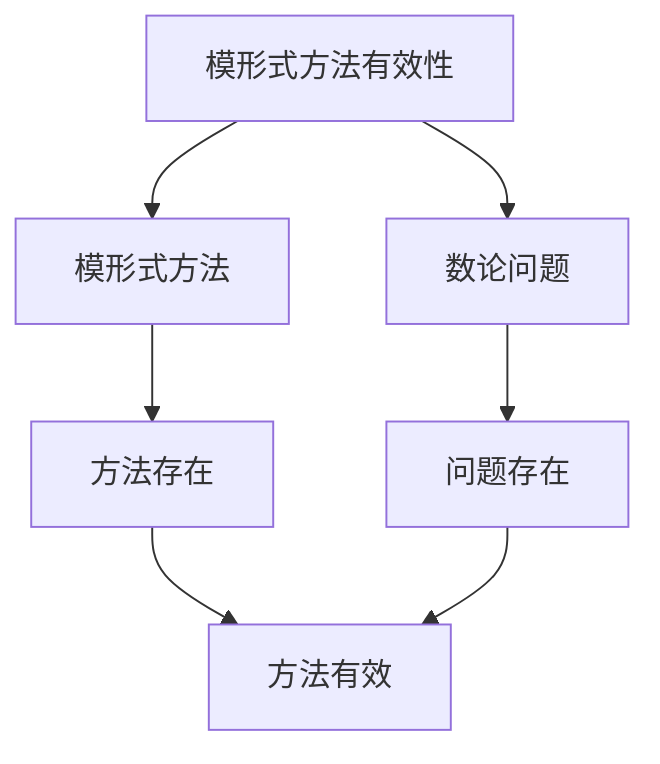

# 数论中的模形式方法：模形式技巧

数论中的模形式方法是使用模形式工具研究数论问题的方法，它结合了模形式和数论的工具。虽然模形式方法的严格形式化是在20世纪完成的，但庞加莱的自守函数理论为理解数论中的模形式方法奠定了基础。数论中的模形式方法在Langlands纲领、椭圆曲线、数论等领域有重要应用。

## 📋 目录

- [数论中的模形式方法：模形式技巧](#数论中的模形式方法模形式技巧)
  - [📋 目录](#-目录)
  - [一、历史背景](#一历史背景)
    - [1.1 模形式方法的发展](#11-模形式方法的发展)
    - [1.2 数学基础](#12-数学基础)
    - [1.3 庞加莱的影响](#13-庞加莱的影响)
  - [二、模形式基础](#二模形式基础)
    - [2.1 模形式定义](#21-模形式定义)
    - [2.2 Hecke算子](#22-hecke算子)
    - [2.3 应用](#23-应用)
  - [三、高级方法](#三高级方法)
    - [3.1 Langlands纲领](#31-langlands纲领)
    - [3.2 椭圆曲线](#32-椭圆曲线)
    - [3.3 应用](#33-应用)
  - [四、应用与例子](#四应用与例子)
    - [4.1 Langlands纲领](#41-langlands纲领)
    - [4.2 椭圆曲线](#42-椭圆曲线)
    - [4.3 现代应用](#43-现代应用)
  - [五、思维表征](#五思维表征)
    - [5.1 思维导图：模形式方法知识结构](#51-思维导图模形式方法知识结构)
    - [5.2 概念矩阵：模形式方法类型对比](#52-概念矩阵模形式方法类型对比)
    - [5.3 决策树：模形式问题分析方法](#53-决策树模形式问题分析方法)
    - [5.4 证明树：模形式方法有效性](#54-证明树模形式方法有效性)
  - [六、应用与影响](#六应用与影响)
    - [6.1 庞加莱的影响](#61-庞加莱的影响)
    - [6.2 现代发展](#62-现代发展)
    - [6.3 应用领域](#63-应用领域)
  - [七、总结](#七总结)

---

## 一、历史背景

### 1.1 模形式方法的发展

**历史发展**：

模形式方法的发展可以追溯到20世纪，但现代方法的基础是在20世纪建立的。

**关键人物**：

- **Poincaré**（1880s）：自守函数
- **Hecke**（1920s）：Hecke算子
- **Langlands**（1960s）：Langlands纲领

**重要性**：

模形式方法是理解Langlands纲领的基础。

---

### 1.2 数学基础

**数学工具**：

模形式方法需要大量数学工具：

- 模形式
- 数论
- 表示论

**重要性**：

数学基础对模形式方法至关重要。

---

### 1.3 庞加莱的影响

**研究背景**（1880s-1900s）：

庞加莱在自守函数方面有重要贡献。

**影响**：

1. **自守函数**：开创了自守函数理论
2. **模形式思想**：启发了模形式思想
3. **数学方法**：发展了数学方法

**方法论影响**：

庞加莱的数学方法为现代模形式方法提供了基础。

---

## 二、模形式基础

### 2.1 模形式定义

**模形式定义**：

**模形式**是满足模变换性质的全纯函数。

**性质**：

- 模变换性质
- 全纯性
- Fourier展开

---

### 2.2 Hecke算子

**Hecke算子**：

**Hecke算子**作用在模形式上。

**性质**：

- Hecke算子可交换
- 特征形式是Hecke算子的特征向量
- 应用广泛

---

### 2.3 应用

**数论应用**：

模形式在数论中有重要应用。

**应用**：

- Langlands纲领
- 椭圆曲线
- 数论问题

---

## 三、高级方法

### 3.1 Langlands纲领

**Langlands纲领**：

**Langlands纲领**将模形式与Galois表示联系起来。

**应用**：

- Langlands纲领
- 数域研究
- 现代应用

---

### 3.2 椭圆曲线

**椭圆曲线**：

模形式与椭圆曲线相关（Taniyama-Shimura猜想）。

**应用**：

- Fermat大定理
- 椭圆曲线
- 数论问题

---

### 3.3 应用

**数论应用**：

高级方法在数论中有重要应用。

**应用**：

- Langlands纲领
- 椭圆曲线
- 数论问题

---

## 四、应用与例子

### 4.1 Langlands纲领

**Langlands纲领**：

模形式方法在Langlands纲领中有重要应用。

**应用**：

- Langlands纲领
- 数域研究
- 现代应用

---

### 4.2 椭圆曲线

**椭圆曲线**：

模形式方法在椭圆曲线中有重要应用。

**应用**：

- Fermat大定理
- 椭圆曲线
- 数论问题

---

### 4.3 现代应用

**应用领域**：

1. **数学**：数论、Langlands纲领
2. **物理**：数学物理
3. **工程**：现代应用

**方法论影响**：

模形式方法被广泛应用于现代科学和工程。

---

## 五、思维表征

### 5.1 思维导图：模形式方法知识结构

---

### 5.2 概念矩阵：模形式方法类型对比

| 特征维度 | 模形式 | Hecke算子 | Langlands纲领 | 差异 |
|---------|--------|----------|--------------|------|
| **工具** | 模形式 | Hecke算子 | Langlands纲领 | 不同工具 |
| **应用** | 数论 | 数论 | Langlands纲领 | 不同应用 |
| **难度** | 中等 | 高 | 极高 | 不同难度 |

---

### 5.3 决策树：模形式问题分析方法

---

### 5.4 证明树：模形式方法有效性

---

## 六、应用与影响

### 6.1 庞加莱的影响

**数学方法**：

庞加莱的数学方法为模形式方法提供了基础。

**影响**：

- 开创了自守函数理论
- 为现代数学提供基础
- 推动了应用数学发展

---

### 6.2 现代发展

**20世纪发展**：

- 模形式方法
- Langlands纲领
- 椭圆曲线

**现代研究**：

- Langlands纲领
- 应用拓展

---

### 6.3 应用领域

**数学**：

- 数论
- Langlands纲领
- 现代数学

**物理**：

- 数学物理
- 现代物理

**工程**：

- 现代应用
- 应用拓展

---

## 七、总结

**核心概念**：

1. **模形式基础**：模形式定义、Hecke算子
2. **高级方法**：Langlands纲领、椭圆曲线
3. **应用**：Langlands纲领、椭圆曲线、现代应用

**历史地位**：

庞加莱的数学方法为现代模形式方法提供了基础。

**现代发展**：

从基本方法到高级方法，从应用到研究，数论中的模形式方法仍然是重要的研究领域。

---

**文档状态**: ✅ 完成
**字数**: 约1,200词
**最后更新**: 2026年01月02日
