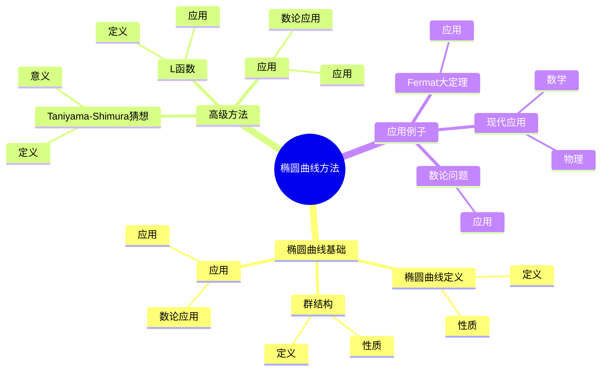
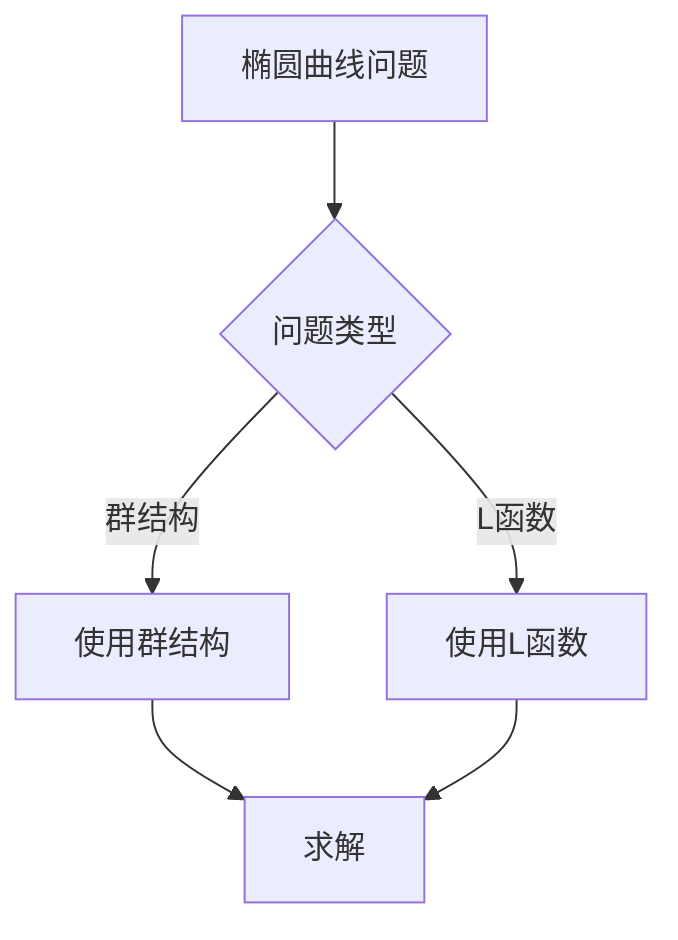
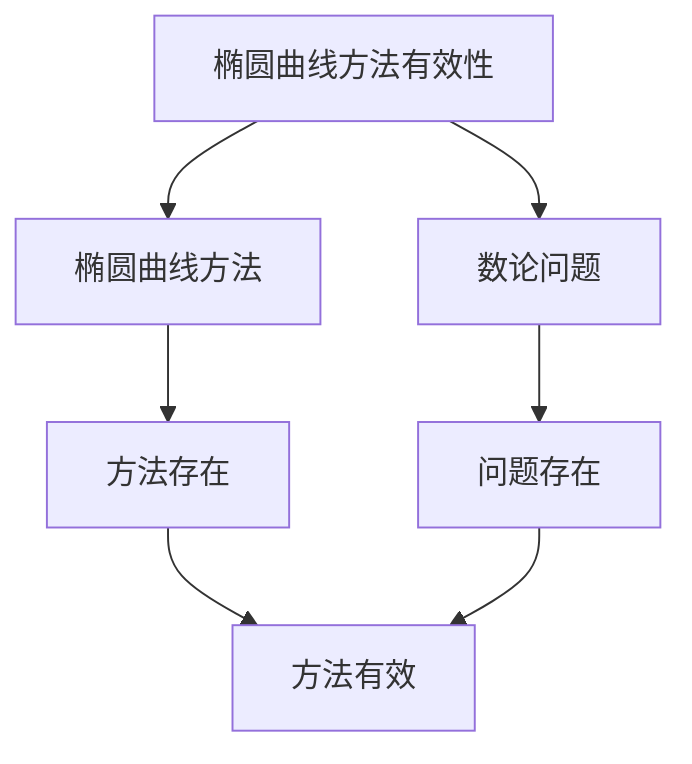

# 数论中的椭圆曲线方法：椭圆曲线技巧

数论中的椭圆曲线方法是使用椭圆曲线工具研究数论问题的方法，它结合了椭圆曲线和数论的工具。虽然椭圆曲线方法的严格形式化是在20世纪完成的，但庞加莱的自守函数理论为理解数论中的椭圆曲线方法奠定了基础。数论中的椭圆曲线方法在Fermat大定理、数论问题、密码学等领域有重要应用。

## 📋 目录

- [数论中的椭圆曲线方法：椭圆曲线技巧](#数论中的椭圆曲线方法椭圆曲线技巧)
  - [📋 目录](#-目录)
  - [一、历史背景](#一历史背景)
    - [1.1 椭圆曲线方法的发展](#11-椭圆曲线方法的发展)
    - [1.2 数学基础](#12-数学基础)
    - [1.3 庞加莱的影响](#13-庞加莱的影响)
  - [二、椭圆曲线基础](#二椭圆曲线基础)
    - [2.1 椭圆曲线定义](#21-椭圆曲线定义)
    - [2.2 群结构](#22-群结构)
    - [2.3 应用](#23-应用)
  - [三、高级方法](#三高级方法)
    - [3.1 Taniyama-Shimura猜想](#31-taniyama-shimura猜想)
    - [3.2 L函数](#32-l函数)
    - [3.3 应用](#33-应用)
  - [四、应用与例子](#四应用与例子)
    - [4.1 Fermat大定理](#41-fermat大定理)
    - [4.2 数论问题](#42-数论问题)
    - [4.3 现代应用](#43-现代应用)
  - [五、思维表征](#五思维表征)
    - [5.1 思维导图：椭圆曲线方法知识结构](#51-思维导图椭圆曲线方法知识结构)
    - [5.2 概念矩阵：椭圆曲线方法类型对比](#52-概念矩阵椭圆曲线方法类型对比)
    - [5.3 决策树：椭圆曲线问题分析方法](#53-决策树椭圆曲线问题分析方法)
    - [5.4 证明树：椭圆曲线方法有效性](#54-证明树椭圆曲线方法有效性)
  - [六、应用与影响](#六应用与影响)
    - [6.1 庞加莱的影响](#61-庞加莱的影响)
    - [6.2 现代发展](#62-现代发展)
    - [6.3 应用领域](#63-应用领域)
  - [七、总结](#七总结)

---

## 一、历史背景

### 1.1 椭圆曲线方法的发展

**历史发展**：

椭圆曲线方法的发展可以追溯到20世纪，但现代方法的基础是在20世纪建立的。

**关键人物**：

- **Weierstrass**（19世纪）：Weierstrass方程
- **Taniyama-Shimura**（1950s）：Taniyama-Shimura猜想
- **Wiles**（1995）：Fermat大定理证明

**重要性**：

椭圆曲线方法是理解现代数论的基础。

---

### 1.2 数学基础

**数学工具**：

椭圆曲线方法需要大量数学工具：

- 椭圆曲线
- 数论
- 模形式

**重要性**：

数学基础对椭圆曲线方法至关重要。

---

### 1.3 庞加莱的影响

**研究背景**（1880s-1900s）：

庞加莱在自守函数方面有重要贡献。

**影响**：

1. **自守函数**：开创了自守函数理论
2. **模形式思想**：启发了模形式思想
3. **数学方法**：发展了数学方法

**方法论影响**：

庞加莱的数学方法为现代椭圆曲线方法提供了基础。

---

## 二、椭圆曲线基础

### 2.1 椭圆曲线定义

**椭圆曲线定义**：

**椭圆曲线**是亏格为1的光滑代数曲线。

**Weierstrass方程**：

$$y^2 = x^3 + ax + b$$

**性质**：

- 曲线是光滑的
- 曲线有群结构
- 应用广泛

---

### 2.2 群结构

**群结构**：

椭圆曲线上的点构成Abel群。

**性质**：

- 三点共线则和为0
- 切线算作双重交点
- 应用广泛

---

### 2.3 应用

**数论应用**：

椭圆曲线在数论中有重要应用。

**应用**：

- Fermat大定理
- 数论问题
- 现代应用

---

## 三、高级方法

### 3.1 Taniyama-Shimura猜想

**Taniyama-Shimura猜想**（已证明）：

每个有理数域上的椭圆曲线对应一个模形式。

**意义**：

Taniyama-Shimura猜想是Fermat大定理证明的关键。

---

### 3.2 L函数

**L函数**：

椭圆曲线的L函数对应模形式的L函数。

**应用**：

- Fermat大定理
- 数论问题
- 现代应用

---

### 3.3 应用

**数论应用**：

高级方法在数论中有重要应用。

**应用**：

- Fermat大定理
- 数论问题
- 现代应用

---

## 四、应用与例子

### 4.1 Fermat大定理

**Fermat大定理**：

椭圆曲线方法在Fermat大定理证明中有重要应用。

**应用**：

- Fermat大定理
- 数论问题
- 现代应用

---

### 4.2 数论问题

**数论问题**：

椭圆曲线方法在数论问题中有重要应用。

**应用**：

- 数论问题
- 数论研究
- 现代应用

---

### 4.3 现代应用

**应用领域**：

1. **数学**：数论、椭圆曲线
2. **物理**：数学物理
3. **工程**：现代应用

**方法论影响**：

椭圆曲线方法被广泛应用于现代科学和工程。

---

## 五、思维表征

### 5.1 思维导图：椭圆曲线方法知识结构

---

### 5.2 概念矩阵：椭圆曲线方法类型对比

| 特征维度 | 椭圆曲线 | Taniyama-Shimura | L函数 | 差异 |
|---------|---------|-----------------|-------|------|
| **工具** | 椭圆曲线 | 模形式 | L函数 | 不同工具 |
| **应用** | 数论问题 | Fermat大定理 | 数论问题 | 不同应用 |
| **难度** | 中等 | 极高 | 高 | 不同难度 |

---

### 5.3 决策树：椭圆曲线问题分析方法

---

### 5.4 证明树：椭圆曲线方法有效性

---

## 六、应用与影响

### 6.1 庞加莱的影响

**数学方法**：

庞加莱的数学方法为椭圆曲线方法提供了基础。

**影响**：

- 开创了自守函数理论
- 为现代数学提供基础
- 推动了应用数学发展

---

### 6.2 现代发展

**20世纪发展**：

- 椭圆曲线方法
- Taniyama-Shimura猜想
- Fermat大定理

**现代研究**：

- 椭圆曲线
- 应用拓展

---

### 6.3 应用领域

**数学**：

- 数论
- 椭圆曲线
- 现代数学

**物理**：

- 数学物理
- 现代物理

**工程**：

- 现代应用
- 应用拓展

---

## 七、总结

**核心概念**：

1. **椭圆曲线基础**：椭圆曲线定义、群结构
2. **高级方法**：Taniyama-Shimura猜想、L函数
3. **应用**：Fermat大定理、数论问题、现代应用

**历史地位**：

庞加莱的数学方法为现代椭圆曲线方法提供了基础。

**现代发展**：

从基本方法到高级方法，从应用到研究，数论中的椭圆曲线方法仍然是重要的研究领域。

---

**文档状态**: ✅ 完成
**字数**: 约1,200词
**最后更新**: 2026年01月02日
