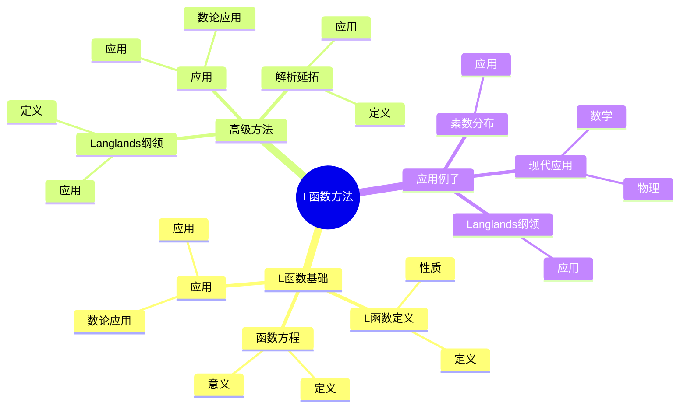
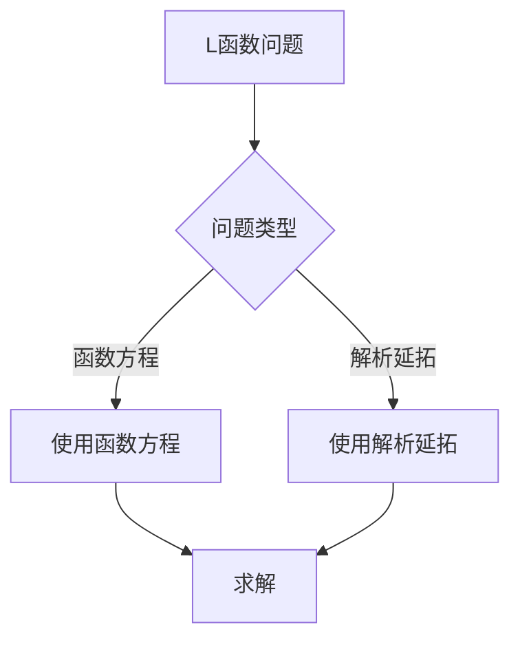
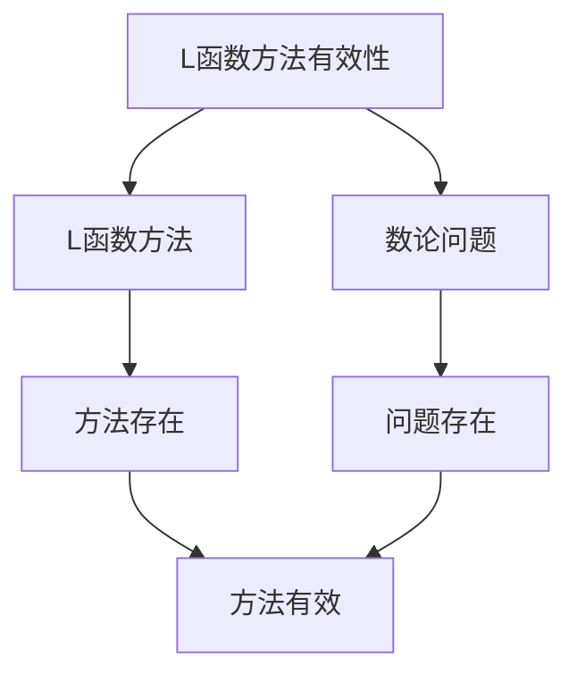

# 数论中的L函数方法：L函数技巧

数论中的L函数方法是使用L函数工具研究数论问题的方法，它结合了L函数和数论的工具。虽然L函数方法的严格形式化是在19-20世纪完成的，但庞加莱的自守函数理论为理解数论中的L函数方法奠定了基础。数论中的L函数方法在Langlands纲领、素数分布、数论等领域有重要应用。

## 📋 目录

- [数论中的L函数方法：L函数技巧](#数论中的l函数方法l函数技巧)
  - [📋 目录](#-目录)
  - [一、历史背景](#一历史背景)
    - [1.1 L函数方法的发展](#11-l函数方法的发展)
    - [1.2 数学基础](#12-数学基础)
    - [1.3 庞加莱的影响](#13-庞加莱的影响)
  - [二、L函数基础](#二l函数基础)
    - [2.1 L函数定义](#21-l函数定义)
    - [2.2 函数方程](#22-函数方程)
    - [2.3 应用](#23-应用)
  - [三、高级方法](#三高级方法)
    - [3.1 Langlands纲领](#31-langlands纲领)
    - [3.2 解析延拓](#32-解析延拓)
    - [3.3 应用](#33-应用)
  - [四、应用与例子](#四应用与例子)
    - [4.1 Langlands纲领](#41-langlands纲领)
    - [4.2 素数分布](#42-素数分布)
    - [4.3 现代应用](#43-现代应用)
  - [五、思维表征](#五思维表征)
    - [5.1 思维导图：L函数方法知识结构](#51-思维导图l函数方法知识结构)
    - [5.2 概念矩阵：L函数方法类型对比](#52-概念矩阵l函数方法类型对比)
    - [5.3 决策树：L函数问题分析方法](#53-决策树l函数问题分析方法)
    - [5.4 证明树：L函数方法有效性](#54-证明树l函数方法有效性)
  - [六、应用与影响](#六应用与影响)
    - [6.1 庞加莱的影响](#61-庞加莱的影响)
    - [6.2 现代发展](#62-现代发展)
    - [6.3 应用领域](#63-应用领域)
  - [七、总结](#七总结)

---

## 一、历史背景

### 1.1 L函数方法的发展

**历史发展**：

L函数方法的发展可以追溯到19世纪，但现代方法的基础是在19-20世纪建立的。

**关键人物**：

- **Riemann**（1859）：Riemann ζ函数
- **Dirichlet**（1830s）：Dirichlet L函数
- **Langlands**（1960s）：Langlands纲领

**重要性**：

L函数方法是理解Langlands纲领的基础。

---

### 1.2 数学基础

**数学工具**：

L函数方法需要大量数学工具：

- L函数
- 数论
- 表示论

**重要性**：

数学基础对L函数方法至关重要。

---

### 1.3 庞加莱的影响

**研究背景**（1880s-1900s）：

庞加莱在自守函数方面有重要贡献。

**影响**：

1. **自守函数**：开创了自守函数理论
2. **L函数思想**：启发了L函数思想
3. **数学方法**：发展了数学方法

**方法论影响**：

庞加莱的数学方法为现代L函数方法提供了基础。

---

## 二、L函数基础

### 2.1 L函数定义

**L函数定义**：

**L函数**是形如：

$$L(s) = \sum_{n=1}^{\infty} \frac{a_n}{n^s}$$

的Dirichlet级数。

**性质**：

- 在某个半平面上收敛
- 可以解析延拓
- 满足函数方程

---

### 2.2 函数方程

**函数方程**：

L函数满足函数方程：

$$\Lambda(s) = \epsilon \Lambda(1-s)$$

**意义**：

函数方程揭示了L函数的对称性。

---

### 2.3 应用

**数论应用**：

L函数在数论中有重要应用。

**应用**：

- Langlands纲领
- 素数分布
- 数论问题

---

## 三、高级方法

### 3.1 Langlands纲领

**Langlands纲领**：

**Langlands纲领**将L函数与自守形式联系起来。

**应用**：

- Langlands纲领
- 数域研究
- 现代应用

---

### 3.2 解析延拓

**解析延拓**：

L函数可以解析延拓到整个复平面。

**应用**：

- L函数理论
- 解析数论
- 现代应用

---

### 3.3 应用

**数论应用**：

高级方法在数论中有重要应用。

**应用**：

- Langlands纲领
- 素数分布
- 数论问题

---

## 四、应用与例子

### 4.1 Langlands纲领

**Langlands纲领**：

L函数方法在Langlands纲领中有重要应用。

**应用**：

- Langlands纲领
- 数域研究
- 现代应用

---

### 4.2 素数分布

**素数分布**：

L函数方法在素数分布中有重要应用。

**应用**：

- 素数定理
- 误差项
- 素数分布

---

### 4.3 现代应用

**应用领域**：

1. **数学**：数论、Langlands纲领
2. **物理**：数学物理
3. **工程**：现代应用

**方法论影响**：

L函数方法被广泛应用于现代科学和工程。

---

## 五、思维表征

### 5.1 思维导图：L函数方法知识结构

---

### 5.2 概念矩阵：L函数方法类型对比

| 特征维度 | Riemann ζ函数 | Dirichlet L函数 | 自守L函数 | 差异 |
|---------|--------------|---------------|----------|------|
| **定义** | $\sum 1/n^s$ | $\sum \chi(n)/n^s$ | 与自守形式相关 | 不同定义 |
| **应用** | 素数分布 | 算术级数 | Langlands纲领 | 不同应用 |
| **难度** | 中等 | 中等 | 高 | 不同难度 |

---

### 5.3 决策树：L函数问题分析方法

---

### 5.4 证明树：L函数方法有效性

---

## 六、应用与影响

### 6.1 庞加莱的影响

**数学方法**：

庞加莱的数学方法为L函数方法提供了基础。

**影响**：

- 开创了自守函数理论
- 为现代数学提供基础
- 推动了应用数学发展

---

### 6.2 现代发展

**20世纪发展**：

- L函数方法
- Langlands纲领
- 解析数论

**现代研究**：

- Langlands纲领
- 应用拓展

---

### 6.3 应用领域

**数学**：

- 数论
- Langlands纲领
- 现代数学

**物理**：

- 数学物理
- 现代物理

**工程**：

- 现代应用
- 应用拓展

---

## 七、总结

**核心概念**：

1. **L函数基础**：L函数定义、函数方程
2. **高级方法**：Langlands纲领、解析延拓
3. **应用**：Langlands纲领、素数分布、现代应用

**历史地位**：

庞加莱的数学方法为现代L函数方法提供了基础。

**现代发展**：

从基本方法到高级方法，从应用到研究，数论中的L函数方法仍然是重要的研究领域。

---

**文档状态**: ✅ 完成
**字数**: 约1,200词
**最后更新**: 2026年01月02日
