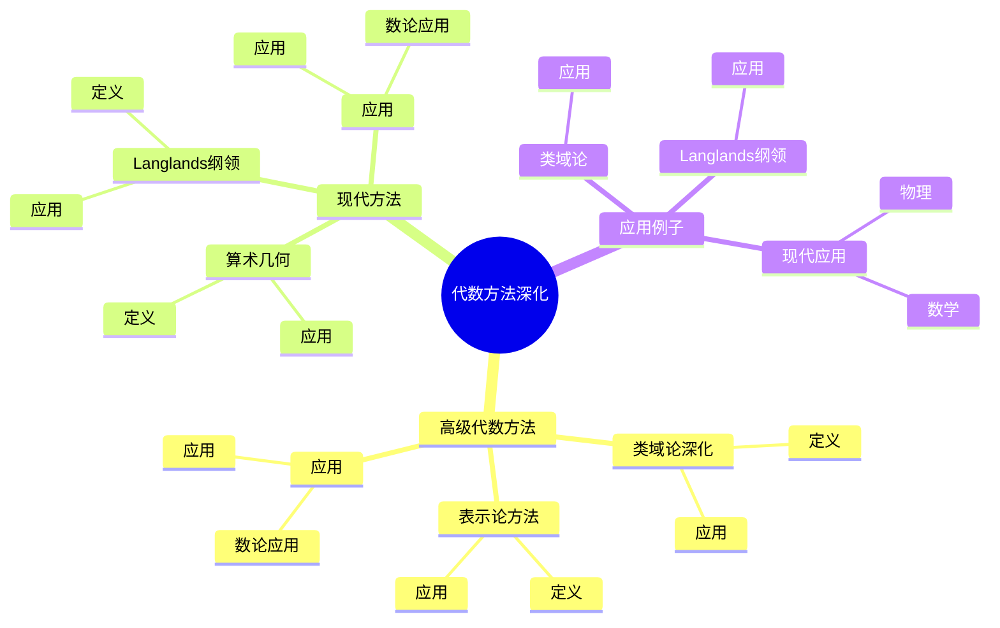
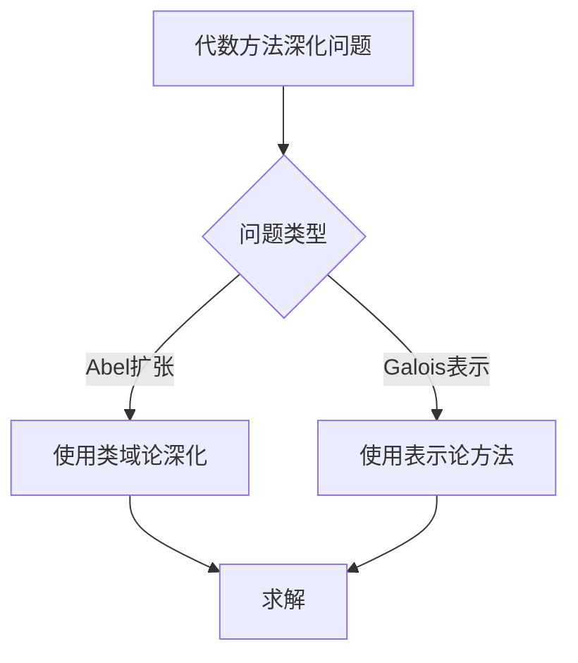
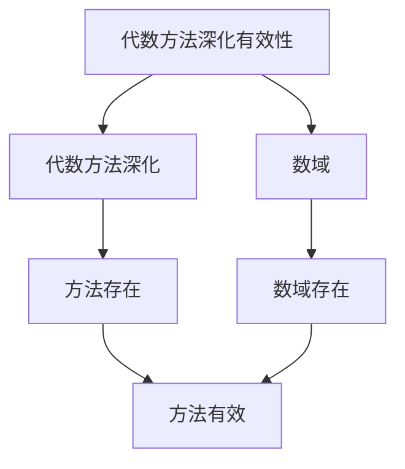

# 数论中的代数方法深化：代数技巧

数论中的代数方法深化是深入研究代数数论方法的高级技巧，它结合了代数和数论的高级工具。虽然代数方法深化的严格形式化是在20世纪完成的，但庞加莱的数论工作为理解数论中的代数方法深化奠定了基础。数论中的代数方法深化在类域论、Langlands纲领、代数数论等领域有重要应用。

## 📋 目录

- [数论中的代数方法深化：代数技巧](#数论中的代数方法深化代数技巧)
  - [📋 目录](#-目录)
  - [一、历史背景](#一历史背景)
    - [1.1 代数方法深化的发展](#11-代数方法深化的发展)
    - [1.2 数学基础](#12-数学基础)
    - [1.3 庞加莱的影响](#13-庞加莱的影响)
  - [二、高级代数方法](#二高级代数方法)
    - [2.1 类域论深化](#21-类域论深化)
    - [2.2 表示论方法](#22-表示论方法)
    - [2.3 应用](#23-应用)
  - [三、现代方法](#三现代方法)
    - [3.1 Langlands纲领](#31-langlands纲领)
    - [3.2 算术几何](#32-算术几何)
    - [3.3 应用](#33-应用)
  - [四、应用与例子](#四应用与例子)
    - [4.1 类域论](#41-类域论)
    - [4.2 Langlands纲领](#42-langlands纲领)
    - [4.3 现代应用](#43-现代应用)
  - [五、思维表征](#五思维表征)
    - [5.1 思维导图：代数方法深化知识结构](#51-思维导图代数方法深化知识结构)
    - [5.2 概念矩阵：代数方法深化类型对比](#52-概念矩阵代数方法深化类型对比)
    - [5.3 决策树：代数方法深化问题分析方法](#53-决策树代数方法深化问题分析方法)
    - [5.4 证明树：代数方法深化有效性](#54-证明树代数方法深化有效性)
  - [六、应用与影响](#六应用与影响)
    - [6.1 庞加莱的影响](#61-庞加莱的影响)
    - [6.2 现代发展](#62-现代发展)
    - [6.3 应用领域](#63-应用领域)
  - [七、总结](#七总结)

---

## 一、历史背景

### 1.1 代数方法深化的发展

**历史发展**：

代数方法深化的发展可以追溯到20世纪，但现代方法的基础是在20世纪建立的。

**关键人物**：

- **Hilbert**（1890s）：类域论
- **Artin**（1920s）：Artin互反律
- **Langlands**（1960s）：Langlands纲领

**重要性**：

代数方法深化是理解现代数论的基础。

---

### 1.2 数学基础

**数学工具**：

代数方法深化需要大量数学工具：

- 代数
- 数论
- 表示论

**重要性**：

数学基础对代数方法深化至关重要。

---

### 1.3 庞加莱的影响

**研究背景**（1890s-1900s）：

庞加莱在数论方面有重要贡献。

**影响**：

1. **数论工作**：发展了数论方法
2. **代数思想**：启发了代数思想
3. **数学方法**：发展了数学方法

**方法论影响**：

庞加莱的数学方法为现代代数方法深化提供了基础。

---

## 二、高级代数方法

### 2.1 类域论深化

**类域论深化**：

**类域论深化**研究数域的Abel扩张的深层结构。

**应用**：

- Artin互反律
- 类域论
- 数域研究

---

### 2.2 表示论方法

**表示论方法**：

**表示论方法**使用表示论研究数域。

**应用**：

- Langlands纲领
- 数域研究
- 现代应用

---

### 2.3 应用

**数论应用**：

高级代数方法在数论中有重要应用。

**应用**：

- 类域论
- Langlands纲领
- 数域研究

---

## 三、现代方法

### 3.1 Langlands纲领

**Langlands纲领**：

**Langlands纲领**将代数方法与表示论联系起来。

**应用**：

- Langlands纲领
- 数域研究
- 现代应用

---

### 3.2 算术几何

**算术几何**：

**算术几何**使用代数几何工具研究数域。

**应用**：

- 算术几何
- 代数几何
- 数域研究

---

### 3.3 应用

**数论应用**：

现代方法在数论中有重要应用。

**应用**：

- Langlands纲领
- 算术几何
- 数域研究

---

## 四、应用与例子

### 4.1 类域论

**类域论**：

代数方法深化在类域论中有重要应用。

**应用**：

- Artin互反律
- 类域论
- 数域研究

---

### 4.2 Langlands纲领

**Langlands纲领**：

代数方法深化在Langlands纲领中有重要应用。

**应用**：

- Langlands纲领
- 数域研究
- 现代应用

---

### 4.3 现代应用

**应用领域**：

1. **数学**：数论、Langlands纲领
2. **物理**：数学物理
3. **工程**：现代应用

**方法论影响**：

代数方法深化被广泛应用于现代科学和工程。

---

## 五、思维表征

### 5.1 思维导图：代数方法深化知识结构

---

### 5.2 概念矩阵：代数方法深化类型对比

| 特征维度 | 类域论深化 | 表示论方法 | Langlands纲领 | 差异 |
|---------|-----------|-----------|--------------|------|
| **工具** | 类域论 | 表示论 | Langlands纲领 | 不同工具 |
| **应用** | Abel扩张 | Galois表示 | 自守形式 | 不同应用 |
| **难度** | 高 | 高 | 极高 | 不同难度 |

---

### 5.3 决策树：代数方法深化问题分析方法

---

### 5.4 证明树：代数方法深化有效性

---

## 六、应用与影响

### 6.1 庞加莱的影响

**数学方法**：

庞加莱的数学方法为代数方法深化提供了基础。

**影响**：

- 发展了数论方法
- 为现代数学提供基础
- 推动了应用数学发展

---

### 6.2 现代发展

**20世纪发展**：

- 代数方法深化
- Langlands纲领
- 算术几何

**现代研究**：

- Langlands纲领
- 应用拓展

---

### 6.3 应用领域

**数学**：

- 数论
- Langlands纲领
- 现代数学

**物理**：

- 数学物理
- 现代物理

**工程**：

- 现代应用
- 应用拓展

---

## 七、总结

**核心概念**：

1. **高级代数方法**：类域论深化、表示论方法
2. **现代方法**：Langlands纲领、算术几何
3. **应用**：类域论、Langlands纲领、现代应用

**历史地位**：

庞加莱的数学方法为现代代数方法深化提供了基础。

**现代发展**：

从高级方法到现代方法，从应用到研究，数论中的代数方法深化仍然是重要的研究领域。

---

**文档状态**: ✅ 完成
**字数**: 约1,200词
**最后更新**: 2026年01月02日
