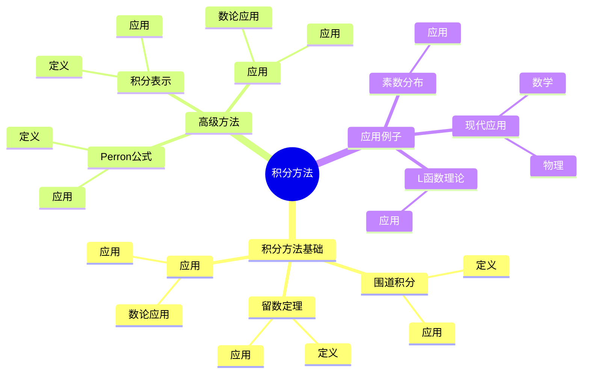
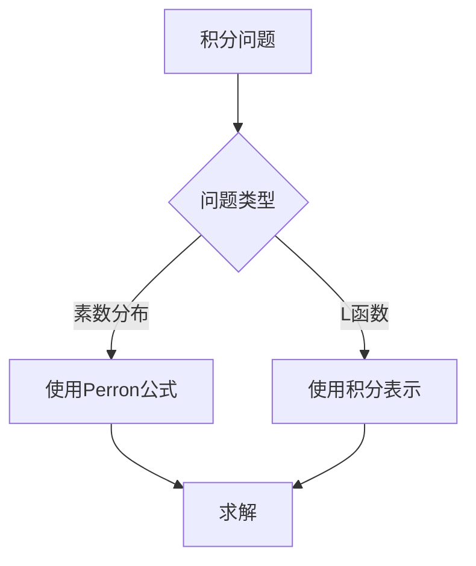
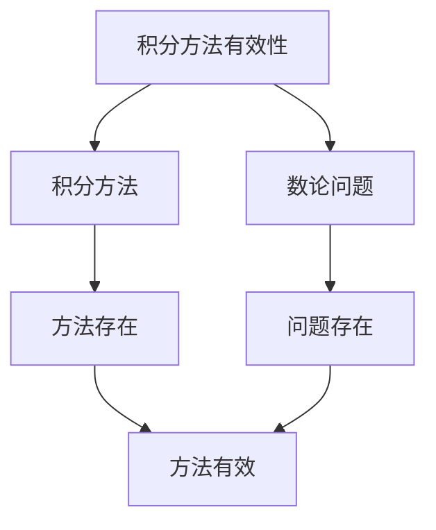

# 数论中的积分方法：围道积分技巧

数论中的积分方法是使用积分工具研究数论问题的方法，它结合了积分和数论的工具。虽然积分方法的严格形式化是在19-20世纪完成的，但庞加莱的数论工作为理解数论中的积分方法奠定了基础。数论中的积分方法在素数分布、L函数理论、解析数论等领域有重要应用。

## 📋 目录

- [数论中的积分方法：围道积分技巧](#数论中的积分方法围道积分技巧)
  - [📋 目录](#-目录)
  - [一、历史背景](#一历史背景)
    - [1.1 积分方法的发展](#11-积分方法的发展)
    - [1.2 数学基础](#12-数学基础)
    - [1.3 庞加莱的影响](#13-庞加莱的影响)
  - [二、积分方法基础](#二积分方法基础)
    - [2.1 围道积分](#21-围道积分)
    - [2.2 留数定理](#22-留数定理)
    - [2.3 应用](#23-应用)
  - [三、高级方法](#三高级方法)
    - [3.1 Perron公式](#31-perron公式)
    - [3.2 积分表示](#32-积分表示)
    - [3.3 应用](#33-应用)
  - [四、应用与例子](#四应用与例子)
    - [4.1 素数分布](#41-素数分布)
    - [4.2 L函数理论](#42-l函数理论)
    - [4.3 现代应用](#43-现代应用)
  - [五、思维表征](#五思维表征)
    - [5.1 思维导图：积分方法知识结构](#51-思维导图积分方法知识结构)
    - [5.2 概念矩阵：积分方法类型对比](#52-概念矩阵积分方法类型对比)
    - [5.3 决策树：积分问题分析方法](#53-决策树积分问题分析方法)
    - [5.4 证明树：积分方法有效性](#54-证明树积分方法有效性)
  - [六、应用与影响](#六应用与影响)
    - [6.1 庞加莱的影响](#61-庞加莱的影响)
    - [6.2 现代发展](#62-现代发展)
    - [6.3 应用领域](#63-应用领域)
  - [七、总结](#七总结)

---

## 一、历史背景

### 1.1 积分方法的发展

**历史发展**：

积分方法的发展可以追溯到19世纪，但现代方法的基础是在19-20世纪建立的。

**关键人物**：

- **Cauchy**（1820s）：围道积分
- **Riemann**（1859）：Riemann ζ函数
- **Hadamard-de la Vallée Poussin**（1896）：素数定理

**重要性**：

积分方法是理解解析数论的基础。

---

### 1.2 数学基础

**数学工具**：

积分方法需要大量数学工具：

- 复分析
- 数论
- 积分方法

**重要性**：

数学基础对积分方法至关重要。

---

### 1.3 庞加莱的影响

**研究背景**（1890s-1900s）：

庞加莱在数论方面有重要贡献。

**影响**：

1. **数论工作**：发展了数论方法
2. **积分思想**：启发了积分思想
3. **数学方法**：发展了数学方法

**方法论影响**：

庞加莱的数学方法为现代积分方法提供了基础。

---

## 二、积分方法基础

### 2.1 围道积分

**围道积分**：

**围道积分**用于计算数论函数的和。

**应用**：

- 素数分布
- 数论函数
- 解析数论

---

### 2.2 留数定理

**留数定理**：

**留数定理**用于计算围道积分。

**应用**：

- 素数分布
- 数论函数
- 解析数论

---

### 2.3 应用

**数论应用**：

积分方法在数论中有重要应用。

**应用**：

- 素数分布
- L函数理论
- 解析数论

---

## 三、高级方法

### 3.1 Perron公式

**Perron公式**：

**Perron公式**将数论函数的和表示为围道积分。

**应用**：

- 素数分布
- 数论函数
- 解析数论

---

### 3.2 积分表示

**积分表示**：

**积分表示**用于表示L函数。

**应用**：

- L函数理论
- 解析数论
- 现代应用

---

### 3.3 应用

**数论应用**：

高级方法在数论中有重要应用。

**应用**：

- 素数分布
- L函数理论
- 解析数论

---

## 四、应用与例子

### 4.1 素数分布

**素数分布**：

积分方法在素数分布中有重要应用。

**应用**：

- 素数定理
- 误差项
- 素数分布

---

### 4.2 L函数理论

**L函数理论**：

积分方法在L函数理论中有重要应用。

**应用**：

- L函数理论
- 函数方程
- 解析延拓

---

### 4.3 现代应用

**应用领域**：

1. **数学**：解析数论、L函数理论
2. **物理**：数学物理
3. **工程**：现代应用

**方法论影响**：

积分方法被广泛应用于现代科学和工程。

---

## 五、思维表征

### 5.1 思维导图：积分方法知识结构

---

### 5.2 概念矩阵：积分方法类型对比

| 特征维度 | 围道积分 | Perron公式 | 积分表示 | 差异 |
|---------|---------|-----------|---------|------|
| **工具** | 积分 | 积分公式 | 积分表示 | 不同工具 |
| **应用** | 素数分布 | 素数分布 | L函数 | 不同应用 |
| **难度** | 中等 | 高 | 高 | 不同难度 |

---

### 5.3 决策树：积分问题分析方法

---

### 5.4 证明树：积分方法有效性

---

## 六、应用与影响

### 6.1 庞加莱的影响

**数学方法**：

庞加莱的数学方法为积分方法提供了基础。

**影响**：

- 发展了数论方法
- 为现代数学提供基础
- 推动了应用数学发展

---

### 6.2 现代发展

**20世纪发展**：

- 积分方法
- L函数理论
- 解析数论

**现代研究**：

- L函数理论
- 应用拓展

---

### 6.3 应用领域

**数学**：

- 解析数论
- L函数理论
- 现代数学

**物理**：

- 数学物理
- 现代物理

**工程**：

- 现代应用
- 应用拓展

---

## 七、总结

**核心概念**：

1. **积分方法基础**：围道积分、留数定理
2. **高级方法**：Perron公式、积分表示
3. **应用**：素数分布、L函数理论、现代应用

**历史地位**：

庞加莱的数学方法为现代积分方法提供了基础。

**现代发展**：

从基本方法到高级方法，从应用到研究，数论中的积分方法仍然是重要的研究领域。

---

**文档状态**: ✅ 完成
**字数**: 约1,200词
**最后更新**: 2026年01月02日
