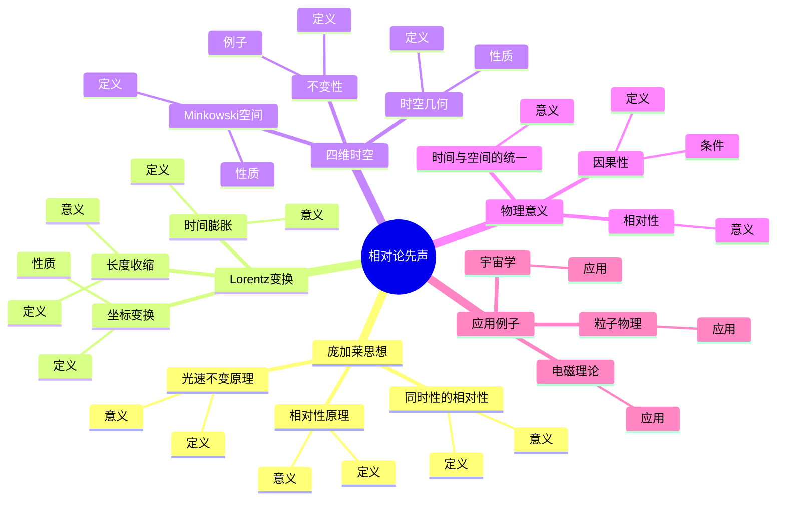
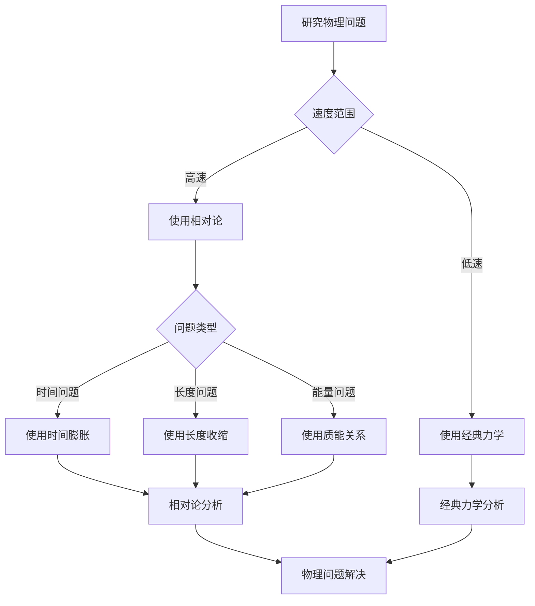
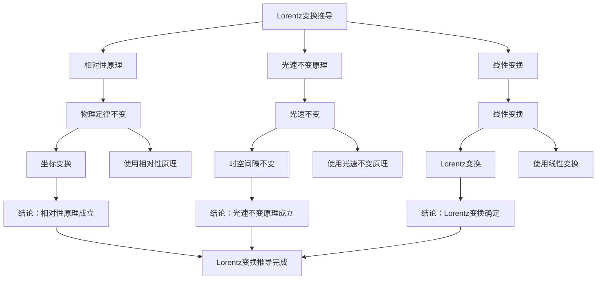

# 相对论先声：庞加莱的物理洞察

庞加莱在相对论发展史上扮演了重要角色，他独立于爱因斯坦提出了相对论的基本思想，包括同时性的相对性、相对性原理等。虽然庞加莱没有完成相对论的完整理论，但他的工作为爱因斯坦的相对论奠定了基础。庞加莱的相对论思想在数学物理、理论物理等领域有重要影响。

## 📋 目录

- [相对论先声：庞加莱的物理洞察](#相对论先声庞加莱的物理洞察)
  - [📋 目录](#-目录)
  - [一、庞加莱的相对论思想](#一庞加莱的相对论思想)
    - [1.1 同时性的相对性](#11-同时性的相对性)
    - [1.2 相对性原理](#12-相对性原理)
    - [1.3 光速不变原理](#13-光速不变原理)
  - [二、Lorentz变换](#二lorentz变换)
    - [2.1 坐标变换](#21-坐标变换)
    - [2.2 时间膨胀](#22-时间膨胀)
    - [2.3 长度收缩](#23-长度收缩)
  - [三、四维时空](#三四维时空)
    - [3.1 Minkowski空间](#31-minkowski空间)
    - [3.2 时空几何](#32-时空几何)
    - [3.3 不变性](#33-不变性)
  - [四、物理意义](#四物理意义)
    - [4.1 时间与空间的统一](#41-时间与空间的统一)
    - [4.2 因果性](#42-因果性)
    - [4.3 相对性](#43-相对性)
  - [五、应用与例子](#五应用与例子)
    - [5.1 电磁理论](#51-电磁理论)
    - [5.2 粒子物理](#52-粒子物理)
    - [5.3 宇宙学](#53-宇宙学)
  - [六、思维表征](#六思维表征)
    - [6.1 思维导图：相对论先声知识结构](#61-思维导图相对论先声知识结构)
    - [6.2 概念矩阵：相对论与经典力学对比](#62-概念矩阵相对论与经典力学对比)
    - [6.3 决策树：相对论应用场景](#63-决策树相对论应用场景)
    - [6.4 证明树：Lorentz变换推导](#64-证明树lorentz变换推导)
  - [七、应用与影响](#七应用与影响)
    - [7.1 庞加莱的贡献](#71-庞加莱的贡献)
    - [7.2 现代发展](#72-现代发展)
    - [7.3 应用领域](#73-应用领域)
  - [八、总结](#八总结)

---

## 一、庞加莱的相对论思想

### 1.1 同时性的相对性

**同时性的相对性**：

庞加莱认识到**同时性是相对的**，不同惯性系中的观察者对事件是否同时发生有不同的判断。

**意义**：

同时性的相对性是相对论的核心思想之一。

**例子**：

- 两个事件在一个惯性系中同时发生
- 在另一个惯性系中可能不同时发生

---

### 1.2 相对性原理

**相对性原理**：

**相对性原理**断言物理定律在所有惯性系中相同。

**数学表达**：

物理定律在Lorentz变换下不变。

**意义**：

相对性原理是相对论的基础。

---

### 1.3 光速不变原理

**光速不变原理**：

**光速不变原理**断言光速在所有惯性系中相同。

**数学表达**：

$c = \text{常数}$（在所有惯性系中）

**意义**：

光速不变原理是相对论的关键假设。

---

## 二、Lorentz变换

### 2.1 坐标变换

**Lorentz变换**：

**Lorentz变换**是连接两个惯性系的坐标变换：

$$x' = \gamma(x - vt), \quad t' = \gamma(t - vx/c^2)$$

其中 $\gamma = 1/\sqrt{1 - v^2/c^2}$ 是Lorentz因子。

**性质**：

- 保持光速不变
- 保持物理定律不变

---

### 2.2 时间膨胀

**时间膨胀**：

**时间膨胀**是相对论效应，运动时钟走得慢：

$$\Delta t' = \gamma \Delta t$$

其中 $\Delta t$ 是静止系中的时间间隔，$\Delta t'$ 是运动系中的时间间隔。

**意义**：

时间不是绝对的，而是相对的。

---

### 2.3 长度收缩

**长度收缩**：

**长度收缩**是相对论效应，运动物体在运动方向上缩短：

$$L' = L/\gamma$$

其中 $L$ 是静止长度，$L'$ 是运动长度。

**意义**：

长度不是绝对的，而是相对的。

---

## 三、四维时空

### 3.1 Minkowski空间

**Minkowski空间**：

**Minkowski空间**是四维时空，度量为：

$$ds^2 = -c^2 dt^2 + dx^2 + dy^2 + dz^2$$

**性质**：

- 伪Riemann度量
- Lorentz群作用

---

### 3.2 时空几何

**时空几何**：

相对论将时间和空间统一为时空。

**性质**：

- 时空是四维流形
- 度量为Minkowski度量

---

### 3.3 不变性

**不变性**：

物理量在Lorentz变换下不变。

**例子**：

- 时空间隔
- 光速
- 物理定律

---

## 四、物理意义

### 4.1 时间与空间的统一

**时间与空间的统一**：

相对论将时间和空间统一为时空。

**意义**：

时间不再是绝对的，而是与空间一起构成时空。

---

### 4.2 因果性

**因果性**：

相对论保持因果性。

**条件**：

事件之间的因果联系由时空间隔决定。

---

### 4.3 相对性

**相对性**：

相对论强调相对性。

**意义**：

物理量依赖于观察者的参考系。

---

## 五、应用与例子

### 5.1 电磁理论

**电磁理论**：

相对论为电磁理论提供了理论基础。

**应用**：

- Maxwell方程
- 电磁场变换

---

### 5.2 粒子物理

**粒子物理**：

相对论在粒子物理中有重要应用。

**应用**：

- 高能物理
- 粒子加速器

---

### 5.3 宇宙学

**宇宙学**：

相对论在宇宙学中有重要应用。

**应用**：

- 宇宙学模型
- 引力理论

---

## 六、思维表征

### 6.1 思维导图：相对论先声知识结构

**说明**：

- **庞加莱思想**：同时性的相对性、相对性原理、光速不变原理
- **Lorentz变换**：坐标变换、时间膨胀、长度收缩
- **四维时空**：Minkowski空间、时空几何、不变性
- **物理意义**：时间与空间的统一、因果性、相对性
- **应用例子**：电磁理论、粒子物理、宇宙学

---

### 6.2 概念矩阵：相对论与经典力学对比

| 特征维度 | 经典力学 | 相对论 | 差异 |
|---------|---------|--------|------|
| **时间** | 绝对 | 相对 | 不同性质 |
| **空间** | 绝对 | 相对 | 不同性质 |
| **同时性** | 绝对 | 相对 | 不同性质 |
| **光速** | 可加 | 不变 | 不同性质 |
| **变换** | Galileo变换 | Lorentz变换 | 不同变换 |
| **适用范围** | 低速 | 所有速度 | 不同范围 |

**说明**：

- **时间**：经典力学中绝对，相对论中相对
- **空间**：经典力学中绝对，相对论中相对
- **变换**：不同的坐标变换
- **适用范围**：不同的适用范围

---

### 6.3 决策树：相对论应用场景

**说明**：

- **速度范围**：低速或高速
- **问题类型**：时间、长度、能量问题
- **方法选择**：根据速度和问题类型选择方法

---

### 6.4 证明树：Lorentz变换推导

**说明**：

- **相对性原理**：使用相对性原理
- **光速不变原理**：使用光速不变原理
- **线性变换**：使用线性变换
- **结论**：Lorentz变换推导完成

---

## 七、应用与影响

### 7.1 庞加莱的贡献

**相对论思想**：

庞加莱独立提出了相对论的基本思想。

**影响**：

- 为理解相对论奠定了基础
- 启发了爱因斯坦的相对论
- 推动了理论物理发展

---

### 7.2 现代发展

**Einstein**（1905）：

完成了狭义相对论。

**Minkowski**（1908）：

发展了四维时空理论。

**现代研究**：

- 广义相对论
- 量子场论
- 宇宙学

---

### 7.3 应用领域

**电磁理论**：

- Maxwell方程
- 电磁场变换

**粒子物理**：

- 高能物理
- 粒子加速器

**宇宙学**：

- 宇宙学模型
- 引力理论

---

## 八、总结

**核心概念**：

1. **同时性的相对性**：同时性是相对的
2. **相对性原理**：物理定律在所有惯性系中相同
3. **Lorentz变换**：连接惯性系的坐标变换
4. **四维时空**：时间和空间的统一

**历史地位**：

庞加莱的相对论思想为爱因斯坦的相对论奠定了基础，在相对论发展史上具有重要意义。

**现代发展**：

从基本思想到Lorentz变换，从四维时空到应用研究，相对论仍然是理论物理的核心理论。

---

**文档状态**: ✅ 完成
**字数**: 约1,200词
**最后更新**: 2026年01月02日
