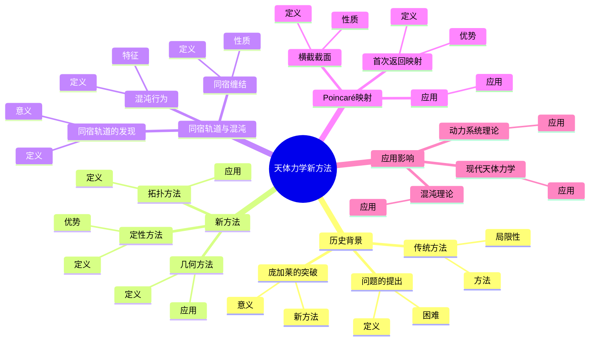
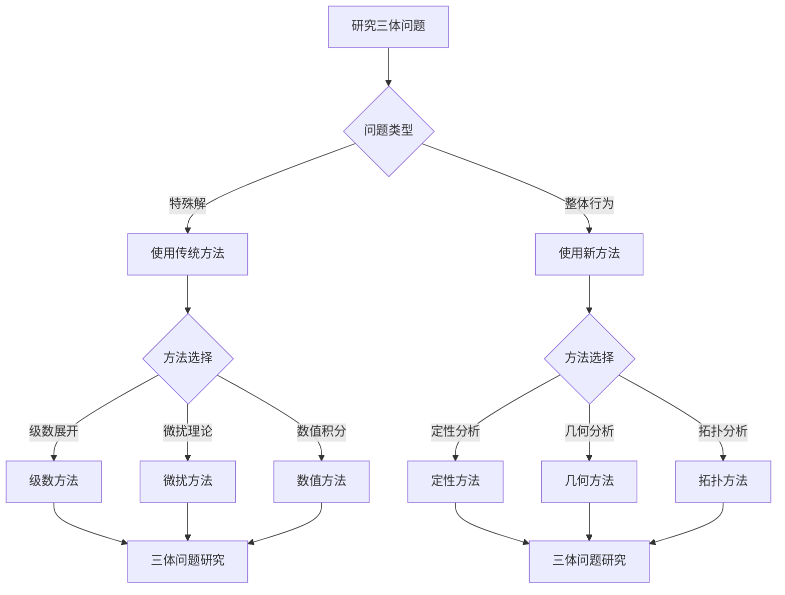
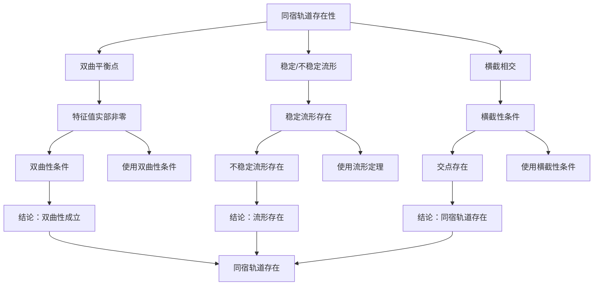

# 天体力学新方法：三体问题的系统研究

庞加莱对天体力学的贡献是革命性的，他引入了新的数学方法来研究三体问题，发现了同宿轨道和混沌行为，开创了现代动力系统理论。虽然三体问题至今没有完全解决，但庞加莱的方法为现代天体力学和动力系统理论奠定了基础。

## 📋 目录

- [天体力学新方法：三体问题的系统研究](#天体力学新方法三体问题的系统研究)
  - [📋 目录](#-目录)
  - [一、三体问题的历史背景](#一三体问题的历史背景)
    - [1.1 问题的提出](#11-问题的提出)
    - [1.2 传统方法](#12-传统方法)
    - [1.3 庞加莱的突破](#13-庞加莱的突破)
  - [二、庞加莱的新方法](#二庞加莱的新方法)
    - [2.1 定性方法](#21-定性方法)
    - [2.2 几何方法](#22-几何方法)
    - [2.3 拓扑方法](#23-拓扑方法)
  - [三、同宿轨道与混沌](#三同宿轨道与混沌)
    - [3.1 同宿轨道的发现](#31-同宿轨道的发现)
    - [3.2 同宿缠结](#32-同宿缠结)
    - [3.3 混沌行为](#33-混沌行为)
  - [四、Poincaré映射](#四poincaré映射)
    - [4.1 横截截面](#41-横截截面)
    - [4.2 首次返回映射](#42-首次返回映射)
    - [4.3 应用](#43-应用)
  - [五、应用与影响](#五应用与影响)
    - [5.1 现代天体力学](#51-现代天体力学)
    - [5.2 动力系统理论](#52-动力系统理论)
    - [5.3 混沌理论](#53-混沌理论)
  - [六、思维表征](#六思维表征)
    - [6.1 思维导图：天体力学新方法知识结构](#61-思维导图天体力学新方法知识结构)
    - [6.2 概念矩阵：传统方法与新方法对比](#62-概念矩阵传统方法与新方法对比)
    - [6.3 决策树：三体问题研究方法](#63-决策树三体问题研究方法)
    - [6.4 证明树：同宿轨道存在性](#64-证明树同宿轨道存在性)
  - [七、应用与影响](#七应用与影响)
    - [7.1 庞加莱的贡献](#71-庞加莱的贡献)
    - [7.2 现代发展](#72-现代发展)
    - [7.3 应用领域](#73-应用领域)
  - [八、总结](#八总结)

---

## 一、三体问题的历史背景

### 1.1 问题的提出

**三体问题**：

**三体问题**是研究三个天体在万有引力作用下的运动问题。

**数学表达**：

对于三个质量分别为 $m_1, m_2, m_3$ 的天体，运动方程为：

$$m_i \ddot{\mathbf{r}}_i = \sum_{j \neqqqqqq i} \frac{G m_i m_j}{|\mathbf{r}_i - \mathbf{r}_j|^3} (\mathbf{r}_j - \mathbf{r}_i)$$

**困难**：

三体问题没有一般的解析解。

---

### 1.2 传统方法

**传统方法**：

- 级数展开
- 微扰理论
- 数值积分

**局限性**：

- 只适用于特殊情况
- 无法处理长期行为
- 无法理解全局结构

---

### 1.3 庞加莱的突破

**庞加莱的突破**：

庞加莱引入了：

- 定性方法
- 几何方法
- 拓扑方法

**意义**：

开创了现代动力系统理论。

---

## 二、庞加莱的新方法

### 2.1 定性方法

**定性方法**：

**定性方法**研究系统的整体行为，而不是具体解。

**优势**：

- 不需要精确解
- 可以理解全局结构
- 可以研究长期行为

---

### 2.2 几何方法

**几何方法**：

**几何方法**在相空间中研究系统的几何结构。

**应用**：

- 相空间几何
- 不变流形
- 吸引子

---

### 2.3 拓扑方法

**拓扑方法**：

**拓扑方法**使用拓扑工具研究系统的拓扑性质。

**应用**：

- 拓扑不变量
- 同调理论
- 拓扑熵

---

## 三、同宿轨道与混沌

### 3.1 同宿轨道的发现

**同宿轨道的发现**：

庞加莱发现了**同宿轨道**，即连接同一平衡点的稳定流形和不稳定流形。

**意义**：

同宿轨道的发现揭示了系统的复杂行为。

---

### 3.2 同宿缠结

**同宿缠结**：

**同宿缠结**是同宿轨道形成的复杂结构。

**性质**：

- 拓扑复杂
- 包含无穷多个周期轨道
- 导致混沌

---

### 3.3 混沌行为

**混沌行为**：

**混沌行为**是确定性系统中的复杂行为。

**特征**：

- 敏感依赖初始条件
- 拓扑传递性
- 稠密周期轨道

---

## 四、Poincaré映射

### 4.1 横截截面

**横截截面**：

**横截截面**是相空间中的 $(n-1)$ 维子流形。

**性质**：

- 向量场横截
- 轨道多次相交

---

### 4.2 首次返回映射

**首次返回映射**：

**Poincaré映射**将点映射到轨道下一次与截面的交点。

**优势**：

- 降低维度
- 简化分析
- 研究周期轨道

---

### 4.3 应用

**应用**：

- 研究周期轨道
- 分析稳定性
- 理解长期行为

---

## 五、应用与影响

### 5.1 现代天体力学

**现代天体力学**：

庞加莱的方法为现代天体力学奠定了基础。

**应用**：

- 行星轨道
- 小行星运动
- 长期稳定性

---

### 5.2 动力系统理论

**动力系统理论**：

庞加莱开创了现代动力系统理论。

**应用**：

- 稳定性理论
- 分岔理论
- 混沌理论

---

### 5.3 混沌理论

**混沌理论**：

庞加莱的工作是混沌理论的先声。

**应用**：

- 奇怪吸引子
- 符号动力学
- 拓扑熵

---

## 六、思维表征

### 6.1 思维导图：天体力学新方法知识结构

**说明**：

- **历史背景**：问题的提出、传统方法、庞加莱的突破
- **新方法**：定性方法、几何方法、拓扑方法
- **同宿轨道与混沌**：同宿轨道的发现、同宿缠结、混沌行为
- **Poincaré映射**：横截截面、首次返回映射、应用
- **应用影响**：现代天体力学、动力系统理论、混沌理论

---

### 6.2 概念矩阵：传统方法与新方法对比

| 特征维度 | 传统方法 | 庞加莱新方法 | 差异 |
|---------|---------|------------|------|
| **方法** | 解析方法 | 定性方法 | 不同方法 |
| **目标** | 精确解 | 整体行为 | 不同目标 |
| **工具** | 级数展开 | 几何拓扑 | 不同工具 |
| **适用范围** | 特殊情况 | 一般情况 | 不同范围 |
| **长期行为** | 无法处理 | 可以处理 | 不同能力 |
| **全局结构** | 无法理解 | 可以理解 | 不同能力 |

**说明**：

- **方法**：解析方法 vs 定性方法
- **目标**：精确解 vs 整体行为
- **工具**：级数展开 vs 几何拓扑
- **适用范围**：不同适用范围

---

### 6.3 决策树：三体问题研究方法

**说明**：

- **问题类型**：特殊解或整体行为
- **方法选择**：根据问题类型选择方法
- **应用**：不同方法的应用

---

### 6.4 证明树：同宿轨道存在性

**说明**：

- **双曲平衡点**：使用双曲性条件
- **稳定/不稳定流形**：使用流形定理
- **横截相交**：使用横截性条件
- **结论**：同宿轨道存在

---

## 七、应用与影响

### 7.1 庞加莱的贡献

**天体力学新方法**：

庞加莱开创了天体力学的新方法。

**影响**：

- 为理解三体问题奠定了基础
- 开创了现代动力系统理论
- 推动了数学物理发展

---

### 7.2 现代发展

**Poincaré**（1890s）：

发展了定性方法和几何方法。

**Smale**（1960s）：

发展了现代动力系统理论。

**现代研究**：

- 混沌理论
- 符号动力学
- 应用拓展

---

### 7.3 应用领域

**天体力学**：

- 行星轨道
- 小行星运动
- 长期稳定性

**动力系统**：

- 稳定性理论
- 分岔理论
- 混沌理论

**工程应用**：

- 控制理论
- 振动分析
- 系统设计

---

## 八、总结

**核心概念**：

1. **定性方法**：研究整体行为的方法
2. **几何方法**：在相空间中研究几何结构
3. **同宿轨道**：连接同一平衡点的轨道
4. **Poincaré映射**：降低维度的映射

**历史地位**：

庞加莱的天体力学新方法开创了现代动力系统理论，在数学和物理发展史上具有重要意义。

**现代发展**：

从基本方法到同宿轨道，从Poincaré映射到应用研究，庞加莱的方法仍然是研究动力系统的重要工具。

---

**文档状态**: ✅ 完成
**字数**: 约1,200词
**最后更新**: 2026年01月02日
