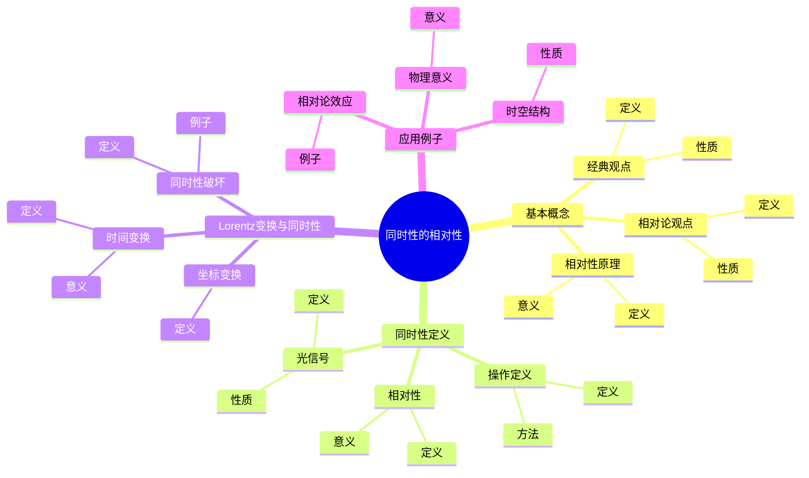
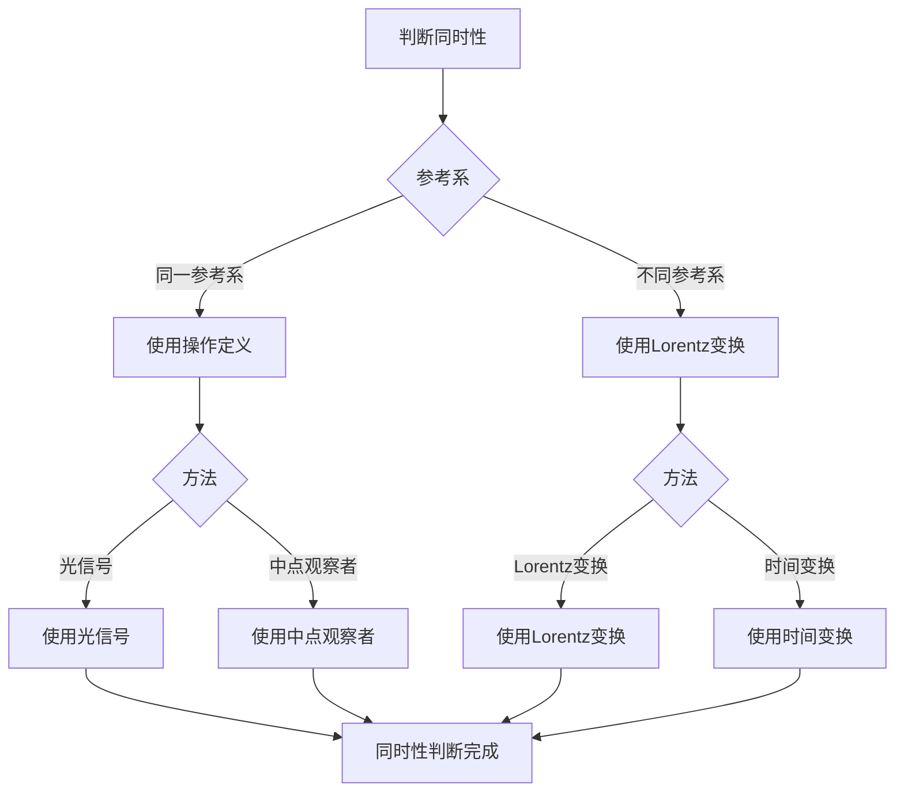
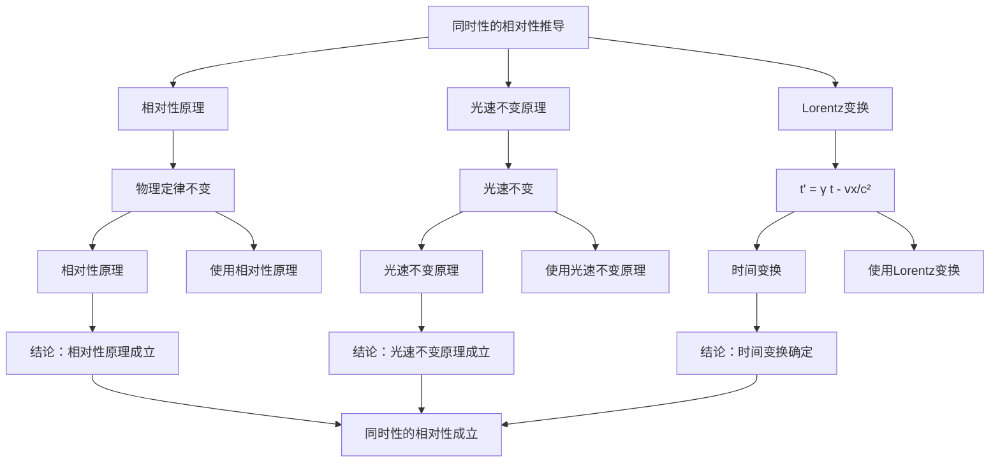

# 同时性的相对性：相对论的基础

同时性的相对性是相对论的核心思想之一，它指出不同惯性系中的观察者对事件是否同时发生有不同的判断。庞加莱独立于爱因斯坦提出了同时性的相对性思想，这为相对论奠定了基础。同时性的相对性在理论物理、相对论、时空理论等领域有重要应用。

## 📋 目录

- [同时性的相对性：相对论的基础](#同时性的相对性相对论的基础)
  - [📋 目录](#-目录)
  - [一、同时性的相对性的基本概念](#一同时性的相对性的基本概念)
    - [1.1 经典观点](#11-经典观点)
    - [1.2 相对论观点](#12-相对论观点)
    - [1.3 相对性原理](#13-相对性原理)
  - [二、同时性的定义](#二同时性的定义)
    - [2.1 操作定义](#21-操作定义)
    - [2.2 光信号](#22-光信号)
    - [2.3 相对性](#23-相对性)
  - [三、Lorentz变换与同时性](#三lorentz变换与同时性)
    - [3.1 坐标变换](#31-坐标变换)
    - [3.2 时间变换](#32-时间变换)
    - [3.3 同时性破坏](#33-同时性破坏)
  - [四、应用与例子](#四应用与例子)
    - [4.1 相对论效应](#41-相对论效应)
    - [4.2 时空结构](#42-时空结构)
    - [4.3 物理意义](#43-物理意义)
  - [五、思维表征](#五思维表征)
    - [5.1 思维导图：同时性的相对性知识结构](#51-思维导图同时性的相对性知识结构)
    - [5.2 概念矩阵：经典观点与相对论观点对比](#52-概念矩阵经典观点与相对论观点对比)
    - [5.3 决策树：同时性判断方法](#53-决策树同时性判断方法)
    - [5.4 证明树：同时性的相对性推导](#54-证明树同时性的相对性推导)
  - [六、应用与影响](#六应用与影响)
    - [6.1 庞加莱的贡献](#61-庞加莱的贡献)
    - [6.2 现代发展](#62-现代发展)
    - [6.3 应用领域](#63-应用领域)
  - [七、总结](#七总结)

---

## 一、同时性的相对性的基本概念

### 1.1 经典观点

**经典观点**：

在经典力学中，同时性是绝对的。

**性质**：

- 所有惯性系中的观察者都认为相同的事件同时发生
- 时间与空间分离
- Galileo变换保持同时性

---

### 1.2 相对论观点

**相对论观点**：

在相对论中，同时性是相对的。

**性质**：

- 不同惯性系中的观察者对事件是否同时发生有不同的判断
- 时间与空间统一为时空
- Lorentz变换不保持同时性

---

### 1.3 相对性原理

**相对性原理**：

**相对性原理**断言物理定律在所有惯性系中相同。

**意义**：

相对性原理是相对论的基础。

---

## 二、同时性的定义

### 2.1 操作定义

**操作定义**：

同时性的**操作定义**使用光信号来定义。

**方法**：

- 在两个事件的中点放置观察者
- 观察者同时接收到来自两个事件的光信号
- 如果光信号同时到达，则事件同时发生

---

### 2.2 光信号

**光信号**：

**光信号**是定义同时性的工具。

**性质**：

- 光速在所有惯性系中相同
- 光信号提供客观的参考

---

### 2.3 相对性

**相对性**：

同时性是相对的，依赖于观察者的参考系。

**意义**：

相对性揭示了时空的本质。

---

## 三、Lorentz变换与同时性

### 3.1 坐标变换

**Lorentz变换**：

**Lorentz变换**是连接两个惯性系的坐标变换：

$$t' = \gamma(t - vx/c^2)$$

其中 $\gamma = 1/\sqrt{1 - v^2/c^2}$ 是Lorentz因子。

---

### 3.2 时间变换

**时间变换**：

Lorentz变换中的时间变换：

$$t' = \gamma(t - vx/c^2)$$

**意义**：

时间变换导致同时性的相对性。

---

### 3.3 同时性破坏

**同时性破坏**：

在Lorentz变换下，同时性被破坏。

**例子**：

- 在一个惯性系中同时的事件
- 在另一个惯性系中可能不同时

---

## 四、应用与例子

### 4.1 相对论效应

**相对论效应**：

同时性的相对性导致相对论效应。

**例子**：

- 时间膨胀
- 长度收缩
- 相对论效应

---

### 4.2 时空结构

**时空结构**：

同时性的相对性揭示了时空的结构。

**性质**：

- 时空是四维的
- 时间与空间统一
- 时空结构

---

### 4.3 物理意义

**物理意义**：

同时性的相对性有深刻的物理意义。

**意义**：

- 揭示了时空的本质
- 统一了时间与空间
- 相对论的基础

---

## 五、思维表征

### 5.1 思维导图：同时性的相对性知识结构

**说明**：

- **基本概念**：经典观点、相对论观点、相对性原理
- **同时性定义**：操作定义、光信号、相对性
- **Lorentz变换与同时性**：坐标变换、时间变换、同时性破坏
- **应用例子**：相对论效应、时空结构、物理意义

---

### 5.2 概念矩阵：经典观点与相对论观点对比

| 特征维度 | 经典观点 | 相对论观点 | 差异 |
|---------|---------|-----------|------|
| **同时性** | 绝对 | 相对 | 不同性质 |
| **时间** | 绝对 | 相对 | 不同性质 |
| **空间** | 绝对 | 相对 | 不同性质 |
| **变换** | Galileo变换 | Lorentz变换 | 不同变换 |
| **适用范围** | 低速 | 所有速度 | 不同范围 |

**说明**：

- **同时性**：经典观点中绝对，相对论中相对
- **变换**：不同的坐标变换
- **适用范围**：不同的适用范围

---

### 5.3 决策树：同时性判断方法

**说明**：

- **参考系**：同一参考系或不同参考系
- **方法选择**：根据参考系选择方法
- **应用**：不同判断方法的应用

---

### 5.4 证明树：同时性的相对性推导

**说明**：

- **相对性原理**：使用相对性原理
- **光速不变原理**：使用光速不变原理
- **Lorentz变换**：使用Lorentz变换
- **结论**：同时性的相对性成立

---

## 六、应用与影响

### 6.1 庞加莱的贡献

**同时性的相对性**：

庞加莱独立提出了同时性的相对性思想。

**影响**：

- 为理解相对论奠定了基础
- 启发了爱因斯坦的相对论
- 推动了理论物理发展

---

### 6.2 现代发展

**Poincaré**（1900s）：

提出了同时性的相对性思想。

**Einstein**（1905）：

完成了狭义相对论。

**现代研究**：

- 广义相对论
- 量子场论
- 应用拓展

---

### 6.3 应用领域

**理论物理**：

- 相对论
- 量子场论
- 理论物理

**相对论**：

- 狭义相对论
- 广义相对论
- 相对论

**时空理论**：

- 时空结构
- 时空理论
- 应用拓展

---

## 七、总结

**核心概念**：

1. **同时性的相对性**：不同惯性系中的观察者对事件是否同时发生有不同的判断
2. **操作定义**：使用光信号定义同时性
3. **Lorentz变换**：导致同时性的相对性
4. **应用**：相对论效应、时空结构、物理意义

**历史地位**：

同时性的相对性是庞加莱的重要贡献，它为相对论奠定了基础，在相对论发展史上具有重要意义。

**现代发展**：

从基本概念到Lorentz变换，从应用到研究，同时性的相对性仍然是相对论的基础。

---

**文档状态**: ✅ 完成
**字数**: 约1,200词
**最后更新**: 2026年01月02日
