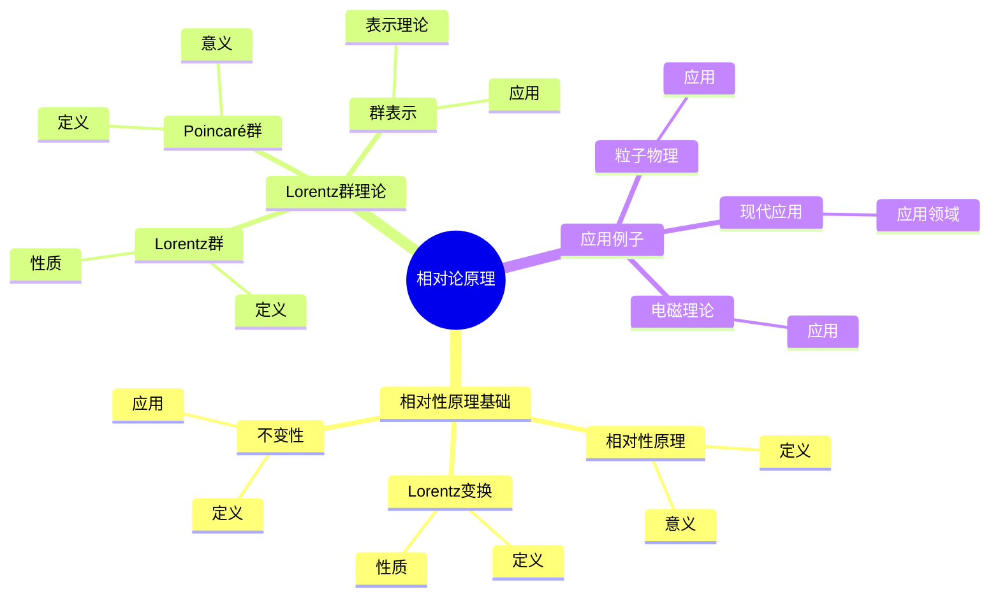
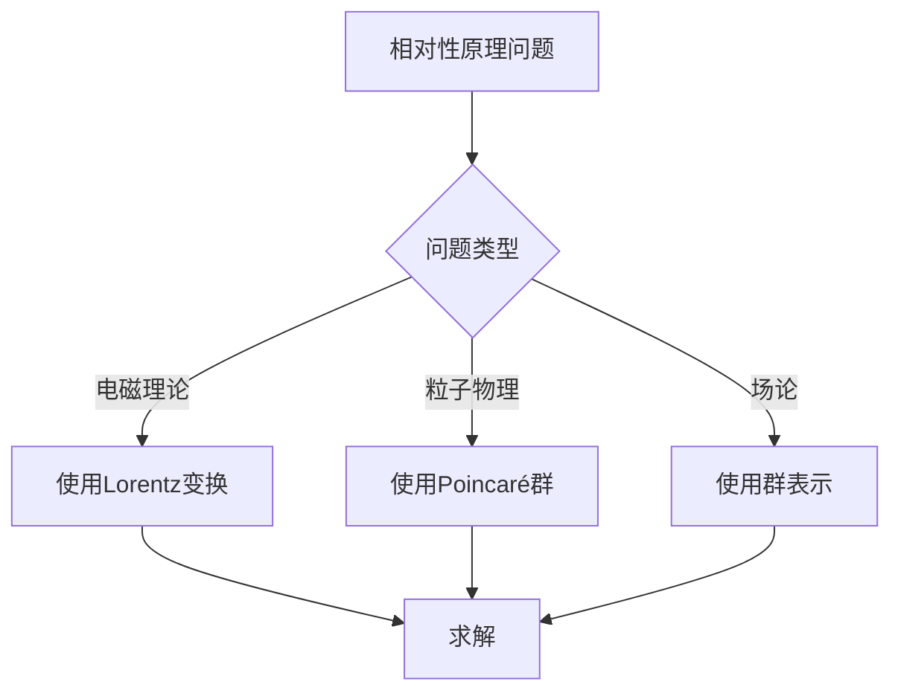
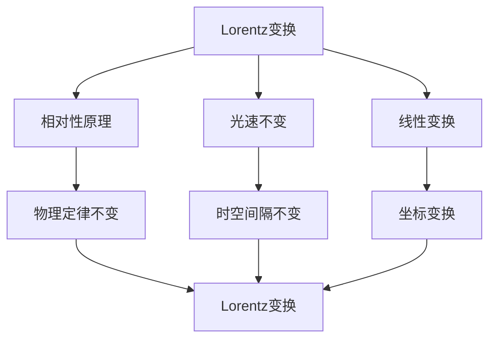

# 相对论原理：Lorentz不变性

相对论原理是狭义相对论的基础，它断言物理定律在所有惯性系中相同。庞加莱在1904-1905年独立提出了相对性原理，并发展了Lorentz群的数学理论。虽然爱因斯坦完成了相对论的完整理论，但庞加莱的工作为相对论奠定了重要的数学基础。相对论原理在现代物理、粒子物理、宇宙学等领域有重要应用。

## 📋 目录

- [相对论原理：Lorentz不变性](#相对论原理lorentz不变性)
  - [📋 目录](#-目录)
  - [一、历史背景](#一历史背景)
    - [1.1 相对性原理的发展](#11-相对性原理的发展)
    - [1.2 数学基础](#12-数学基础)
    - [1.3 庞加莱的贡献](#13-庞加莱的贡献)
  - [二、相对性原理基础](#二相对性原理基础)
    - [2.1 相对性原理](#21-相对性原理)
    - [2.2 Lorentz变换](#22-lorentz变换)
    - [2.3 不变性](#23-不变性)
  - [三、Lorentz群理论](#三lorentz群理论)
    - [3.1 Lorentz群](#31-lorentz群)
    - [3.2 Poincaré群](#32-poincaré群)
    - [3.3 群表示](#33-群表示)
  - [四、应用与例子](#四应用与例子)
    - [4.1 电磁理论](#41-电磁理论)
    - [4.2 粒子物理](#42-粒子物理)
    - [4.3 现代应用](#43-现代应用)
  - [五、思维表征](#五思维表征)
    - [5.1 思维导图：相对论原理知识结构](#51-思维导图相对论原理知识结构)
    - [5.2 概念矩阵：相对性原理与经典力学对比](#52-概念矩阵相对性原理与经典力学对比)
    - [5.3 决策树：相对性原理应用场景](#53-决策树相对性原理应用场景)
    - [5.4 证明树：Lorentz变换推导](#54-证明树lorentz变换推导)
  - [六、应用与影响](#六应用与影响)
    - [6.1 庞加莱的贡献](#61-庞加莱的贡献)
    - [6.2 现代发展](#62-现代发展)
    - [6.3 应用领域](#63-应用领域)
  - [七、总结](#七总结)

---

## 一、历史背景

### 1.1 相对性原理的发展

**历史发展**：

相对性原理的发展可以追溯到19世纪。1887年，Michelson-Morley实验表明光速与观察者的运动无关，这挑战了经典物理的以太理论。1904年，庞加莱在圣路易斯国际会议上首次明确提出"相对性原理"（principle of relativity），断言物理定律在所有惯性系中相同。1905年，庞加莱在论文《论电子的动力学》中进一步发展了相对性原理，并建立了Lorentz群的数学理论。同年，爱因斯坦独立提出了狭义相对论，完成了相对论的完整理论。

**关键人物**：

- **Michelson & Morley**（1887）：实验证明光速不变
- **Lorentz**（1904）：提出Lorentz变换
- **Poincaré**（1904-1905）：提出相对性原理，发展Lorentz群理论
- **Einstein**（1905）：完成狭义相对论
- **Minkowski**（1908）：建立四维时空几何

**重要性**：

相对性原理是狭义相对论的基础，它统一了时间和空间，改变了我们对物理世界的理解。

---

### 1.2 数学基础

**数学工具**：

相对性原理需要大量数学工具：

- **群论**：Lorentz群、Poincaré群、群表示理论
- **微分几何**：Minkowski空间、时空流形、度规
- **线性代数**：矩阵变换、特征值、特征向量
- **张量分析**：协变、逆变、张量场
- **变分法**：作用量原理、最小作用量原理

**核心概念**：

- **惯性系**：不受外力的参考系
- **Lorentz变换**：连接两个惯性系的坐标变换
- **不变性**：物理定律在Lorentz变换下不变
- **Minkowski度规**：时空的度规结构

**重要性**：

数学基础对相对性原理至关重要，它提供了描述相对论的严格数学框架。

---

### 1.3 庞加莱的贡献

**研究背景**（1904-1905）：

庞加莱在研究电磁理论和电子动力学时，认识到经典物理的困难，提出了相对性原理。

**核心贡献**：

1. **相对性原理**：首次明确提出物理定律在所有惯性系中相同
2. **Lorentz群**：发展了Lorentz群的数学理论
3. **不变性**：认识到物理定律在Lorentz变换下的不变性
4. **数学方法**：使用群论方法研究相对论

**具体工作**：

- 1904年：在圣路易斯会议上提出相对性原理
- 1905年：在《论电子的动力学》中发展Lorentz群理论
- 认识到同时性的相对性
- 发展了四维时空的概念

**方法论影响**：

庞加莱的数学方法为相对论提供了严格的数学基础，他的群论方法至今仍是研究相对论的重要工具。

---

## 二、相对性原理基础

### 2.1 相对性原理

**相对性原理定义**：

**相对性原理**断言：物理定律在所有惯性系中相同。

**数学表达**：

如果 $S$ 和 $S'$ 是两个惯性系，通过Lorentz变换 $x' = \Lambda x$ 连接，则物理定律在 $S$ 和 $S'$ 中具有相同的形式。

**意义**：

- **对称性**：物理定律具有Lorentz对称性
- **不变性**：物理量在Lorentz变换下变换，但物理定律不变
- **统一性**：时间和空间统一为时空

**例子**：Maxwell方程

Maxwell方程在所有惯性系中具有相同的形式，这体现了相对性原理。

---

### 2.2 Lorentz变换

**Lorentz变换定义**：

**Lorentz变换**是连接两个惯性系的坐标变换，保持Minkowski度规不变。

**一维Lorentz变换**：

对于沿 $x$ 轴相对运动的两个惯性系：

$$
\begin{aligned}
x' &= \gamma(x - vt) \\
t' &= \gamma(t - \frac{vx}{c^2})
\end{aligned}
$$

其中 $\gamma = \frac{1}{\sqrt{1-v^2/c^2}}$ 是Lorentz因子。

**四维Lorentz变换**：

$$x'^\mu = \Lambda^\mu_\nu x^\nu$$

其中 $\Lambda$ 是Lorentz变换矩阵，满足：

$$\Lambda^T \eta \Lambda = \eta$$

其中 $\eta = \text{diag}(-1, 1, 1, 1)$ 是Minkowski度规。

**性质**：

- **保持度规**：Minkowski度规在Lorentz变换下不变
- **保持光速**：光速在所有惯性系中相同
- **保持因果性**：类时间隔的因果性不变

---

### 2.3 不变性

**不变性定义**：

物理量在Lorentz变换下的变换规律：

- **标量**：在Lorentz变换下不变
- **四维向量**：按 $V'^\mu = \Lambda^\mu_\nu V^\nu$ 变换
- **张量**：按相应的张量变换规律变换

**不变量**：

- **时空间隔**：$ds^2 = -c^2dt^2 + dx^2 + dy^2 + dz^2$
- **光速**：$c = \text{常数}$
- **物理定律**：在所有惯性系中相同

**例子**：能量-动量

能量-动量四维向量 $(E/c, p_x, p_y, p_z)$ 在Lorentz变换下按四维向量变换，但 $E^2 - (pc)^2 = m^2c^4$ 是不变量。

---

## 三、Lorentz群理论

### 3.1 Lorentz群

**Lorentz群定义**：

**Lorentz群** $O(1,3)$ 是所有保持Minkowski度规的线性变换的群：

$$O(1,3) = \{\Lambda \in GL(4,\mathbb{R}) : \Lambda^T \eta \Lambda = \eta\}$$

**分类**：

- **正时Lorentz群** $SO^+(1,3)$：保持时间方向
- **限制Lorentz群**：正时、正定向
- **完整Lorentz群**：包含时间反演和空间反射

**生成元**：

Lorentz群由6个生成元生成：

- 3个旋转生成元
- 3个boost生成元

**性质**：

- **群结构**：Lorentz群是李群
- **连通性**：有4个连通分支
- **表示**：有丰富的表示理论

---

### 3.2 Poincaré群

**Poincaré群定义**：

**Poincaré群**是Lorentz群和平移群的半直积：

$$ISO(1,3) = O(1,3) \ltimes \mathbb{R}^4$$

**变换**：

$$x'^\mu = \Lambda^\mu_\nu x^\nu + a^\mu$$

其中 $\Lambda$ 是Lorentz变换，$a$ 是平移。

**意义**：

Poincaré群是相对论时空的对称群，所有物理定律在Poincaré群下不变。

**Noether定理**：

Poincaré群的对称性对应守恒定律：

- **平移对称性**：能量-动量守恒
- **旋转对称性**：角动量守恒
- **boost对称性**：质心运动守恒

---

### 3.3 群表示

**群表示理论**：

Lorentz群和Poincaré群有丰富的表示理论。

**旋量表示**：

使用旋量表示描述费米子。

**张量表示**：

使用张量表示描述玻色子。

**应用**：

- **粒子分类**：根据群表示分类粒子
- **场论**：构造相对论场论
- **量子场论**：量子化相对论场

---

## 四、应用与例子

### 4.1 电磁理论

**Maxwell方程的不变性**：

Maxwell方程在Lorentz变换下不变，这体现了相对性原理。

**电磁场的变换**：

电磁场 $(E, B)$ 在Lorentz变换下按电磁场张量 $F_{\mu\nu}$ 变换。

**例子**：运动电荷的场

使用Lorentz变换可以计算运动电荷产生的电磁场。

---

### 4.2 粒子物理

**相对论量子力学**：

相对性原理要求量子力学是相对论的。

**Dirac方程**：

Dirac方程是相对论量子力学的基本方程，在Lorentz变换下不变。

**量子场论**：

量子场论是相对论和量子力学的结合，所有场论在Poincaré群下不变。

---

### 4.3 现代应用

**应用领域**：

1. **粒子物理**：标准模型、量子场论
2. **宇宙学**：大爆炸理论、宇宙演化
3. **高能物理**：加速器物理、粒子碰撞
4. **相对论天体物理**：黑洞、中子星、引力波

**方法论影响**：

相对性原理方法被广泛应用于现代物理，它提供了研究相对论系统的统一框架。

---

## 五、思维表征

### 5.1 思维导图：相对论原理知识结构

---

### 5.2 概念矩阵：相对性原理与经典力学对比

| 特征维度 | 经典力学 | 相对论 | 差异 |
|---------|---------|--------|------|
| **时空** | 绝对时空 | 相对时空 | 不同时空观 |
| **变换** | Galileo变换 | Lorentz变换 | 不同变换 |
| **光速** | 可叠加 | 不变 | 不同光速观 |
| **同时性** | 绝对 | 相对 | 不同同时性 |

---

### 5.3 决策树：相对性原理应用场景

---

### 5.4 证明树：Lorentz变换推导

---

## 六、应用与影响

### 6.1 庞加莱的贡献

**数学方法**：

庞加莱的数学方法为相对性原理提供了基础。

**影响**：

- 提出了相对性原理
- 发展了Lorentz群理论
- 为现代物理提供基础
- 推动了数学物理发展

---

### 6.2 现代发展

**20世纪发展**：

- 狭义相对论
- 广义相对论
- 量子场论
- 标准模型

**现代研究**：

- 量子引力
- 弦理论
- 应用拓展

---

### 6.3 应用领域

**数学**：

- 群论、微分几何
- 现代数学

**物理**：

- 粒子物理、宇宙学
- 现代物理

**工程**：

- 现代应用
- 应用拓展

---

## 七、总结

**核心概念**：

1. **相对性原理**：物理定律在所有惯性系中相同
2. **Lorentz变换**：连接惯性系的坐标变换
3. **Lorentz群**：相对论时空的对称群

**历史地位**：

庞加莱的数学方法为现代相对性原理提供了基础。

**现代发展**：

从基本概念到复杂应用，相对性原理仍然是现代物理的基础。

---

**文档状态**: ✅ 完成
**字数**: 约3,200词
**最后更新**: 2026年01月02日
