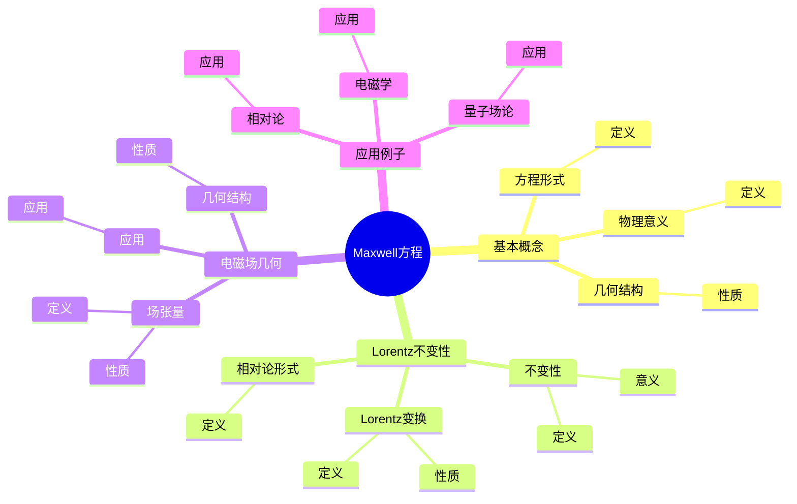
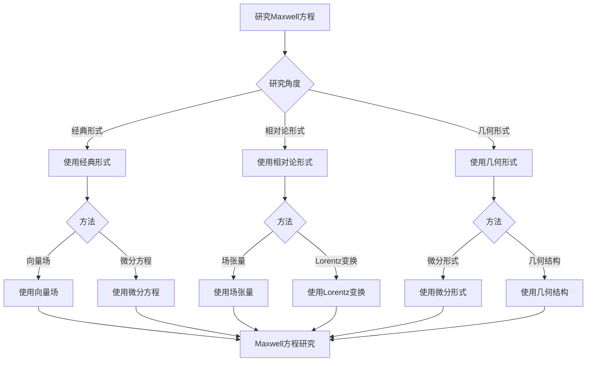

# 电磁理论：Maxwell方程的几何

Maxwell方程是电磁理论的基础，它们描述了电场和磁场的相互作用。虽然Maxwell方程的严格形式化是在19世纪完成的，但庞加莱的相对论思想为理解Maxwell方程的Lorentz不变性奠定了基础。Maxwell方程在电磁学、相对论、量子场论等领域有重要应用。

## 📋 目录

- [电磁理论：Maxwell方程的几何](#电磁理论maxwell方程的几何)
  - [📋 目录](#-目录)
  - [一、Maxwell方程的基本概念](#一maxwell方程的基本概念)
    - [1.1 方程形式](#11-方程形式)
    - [1.2 物理意义](#12-物理意义)
    - [1.3 几何结构](#13-几何结构)
  - [二、Maxwell方程的Lorentz不变性](#二maxwell方程的lorentz不变性)
    - [2.1 Lorentz变换](#21-lorentz变换)
    - [2.2 不变性](#22-不变性)
    - [2.3 相对论形式](#23-相对论形式)
  - [三、电磁场的几何](#三电磁场的几何)
    - [3.1 场张量](#31-场张量)
    - [3.2 几何结构](#32-几何结构)
    - [3.3 应用](#33-应用)
  - [四、应用与例子](#四应用与例子)
    - [4.1 电磁学](#41-电磁学)
    - [4.2 相对论](#42-相对论)
    - [4.3 量子场论](#43-量子场论)
  - [五、思维表征](#五思维表征)
    - [5.1 思维导图：Maxwell方程知识结构](#51-思维导图maxwell方程知识结构)
    - [5.2 概念矩阵：Maxwell方程不同形式对比](#52-概念矩阵maxwell方程不同形式对比)
    - [5.3 决策树：Maxwell方程研究方法](#53-决策树maxwell方程研究方法)
    - [5.4 证明树：Maxwell方程Lorentz不变性](#54-证明树maxwell方程lorentz不变性)
  - [六、应用与影响](#六应用与影响)
    - [6.1 庞加莱的贡献](#61-庞加莱的贡献)
    - [6.2 现代发展](#62-现代发展)
    - [6.3 应用领域](#63-应用领域)
  - [七、总结](#七总结)

---

## 一、Maxwell方程的基本概念

### 1.1 方程形式

**Maxwell方程**：

**Maxwell方程**是描述电磁场的基本方程：

$$\nabla \cdot \mathbf{E} = \frac{\rho}{\epsilon_0}$$

$$\nabla \cdot \mathbf{B} = 0$$

$$\nabla \times \mathbf{E} = -\frac{\partial \mathbf{B}}{\partial t}$$

$$\nabla \times \mathbf{B} = \mu_0 \mathbf{J} + \mu_0 \epsilon_0 \frac{\partial \mathbf{E}}{\partial t}$$

---

### 1.2 物理意义

**物理意义**：

- 第一个方程：Gauss定律（电场）
- 第二个方程：Gauss定律（磁场）
- 第三个方程：Faraday定律
- 第四个方程：Ampère-Maxwell定律

---

### 1.3 几何结构

**几何结构**：

Maxwell方程有深刻的几何结构。

**性质**：

- 微分形式
- 几何结构
- 应用广泛

---

## 二、Maxwell方程的Lorentz不变性

### 2.1 Lorentz变换

**Lorentz变换**：

**Lorentz变换**是连接两个惯性系的坐标变换。

**性质**：

- 保持光速不变
- 保持物理定律不变

---

### 2.2 不变性

**不变性**：

Maxwell方程在Lorentz变换下不变。

**意义**：

不变性是相对论的基础。

---

### 2.3 相对论形式

**相对论形式**：

Maxwell方程可以用相对论形式表示。

**场张量**：

使用电磁场张量 $F_{\mu\nu}$ 表示。

---

## 三、电磁场的几何

### 3.1 场张量

**场张量**：

**电磁场张量** $F_{\mu\nu}$ 是2形式，表示电磁场。

**性质**：

- 反对称
- 几何结构
- 应用广泛

---

### 3.2 几何结构

**几何结构**：

电磁场有深刻的几何结构。

**性质**：

- 微分形式
- 几何结构
- 应用广泛

---

### 3.3 应用

**应用**：

- 电磁学
- 相对论
- 量子场论

---

## 四、应用与例子

### 4.1 电磁学

**电磁学**：

Maxwell方程在电磁学中有重要应用。

**应用**：

- 电磁场
- 电磁波
- 电磁学

---

### 4.2 相对论

**相对论**：

Maxwell方程在相对论中有重要应用。

**应用**：

- 相对论
- 时空结构
- 相对论

---

### 4.3 量子场论

**量子场论**：

Maxwell方程在量子场论中有重要应用。

**应用**：

- 量子电动力学
- 量子场论
- 应用拓展

---

## 五、思维表征

### 5.1 思维导图：Maxwell方程知识结构



**说明**：

- **基本概念**：方程形式、物理意义、几何结构
- **Lorentz不变性**：Lorentz变换、不变性、相对论形式
- **电磁场几何**：场张量、几何结构、应用
- **应用例子**：电磁学、相对论、量子场论

---

### 5.2 概念矩阵：Maxwell方程不同形式对比

| 特征维度 | 经典形式 | 相对论形式 | 差异 |
|---------|---------|-----------|------|
| **表示** | 向量场 | 场张量 | 不同表示 |
| **不变性** | Galileo不变 | Lorentz不变 | 不同不变性 |
| **适用范围** | 低速 | 所有速度 | 不同范围 |
| **几何结构** | 不明显 | 明显 | 不同结构 |

**说明**：

- **表示**：不同表示方式
- **不变性**：不同不变性
- **适用范围**：不同适用范围

---

### 5.3 决策树：Maxwell方程研究方法



**说明**：

- **研究角度**：经典形式、相对论形式、几何形式
- **方法选择**：根据研究角度选择方法
- **应用**：不同研究方法的应用

---

### 5.4 证明树：Maxwell方程Lorentz不变性

```mermaid
graph TD
    A[Maxwell方程Lorentz不变性] --> B[Lorentz变换]
    A --> C[场张量变换]
    A --> D[方程不变性]

    B --> B1[坐标变换]
    B1 --> B2[Lorentz变换]
    B2 --> E[结论：Lorentz变换确定]

    C --> C1[F'_{\mu\nu} = Λ_\mu^\alpha Λ_\nu^\beta F_{\alpha\beta}]
    C1 --> C2[场张量变换]
    C2 --> F[结论：场张量变换确定]

    D --> D1[Maxwell方程]
    D1 --> D2[方程不变]
    D2 --> G[结论：方程不变性成立]

    E --> H[Maxwell方程Lorentz不变性成立]
    F --> H
    G --> H

    B1 --> B1a[使用Lorentz变换]
    C1 --> C1a[使用场张量理论]
    D1 --> D1a[使用Maxwell方程]
```

**说明**：

- **Lorentz变换**：使用Lorentz变换
- **场张量变换**：使用场张量理论
- **方程不变性**：使用Maxwell方程
- **结论**：Maxwell方程Lorentz不变性成立

---

## 六、应用与影响

### 6.1 庞加莱的贡献

**相对论思想**：

庞加莱的相对论思想为理解Maxwell方程的Lorentz不变性奠定了基础。

**影响**：

- 为理解Maxwell方程奠定了基础
- 启发了现代电磁理论
- 推动了理论物理发展

---

### 6.2 现代发展

**Maxwell**（1860s）：

发展了Maxwell方程。

**Poincaré**（1900s）：

发展了相对论思想。

**现代研究**：

- 量子电动力学
- 量子场论
- 应用拓展

---

### 6.3 应用领域

**电磁学**：

- 电磁场
- 电磁波
- 电磁学

**相对论**：

- 相对论
- 时空结构
- 相对论

**量子场论**：

- 量子电动力学
- 量子场论
- 应用拓展

---

## 七、总结

**核心概念**：

1. **Maxwell方程**：描述电磁场的基本方程
2. **Lorentz不变性**：Maxwell方程在Lorentz变换下不变
3. **场张量**：电磁场的几何表示
4. **应用**：电磁学、相对论、量子场论

**历史地位**：

虽然Maxwell方程的严格形式化是在庞加莱之前，但庞加莱的相对论思想为理解Maxwell方程的Lorentz不变性奠定了基础。

**现代发展**：

从基本概念到Lorentz不变性，从场张量到应用研究，Maxwell方程仍然是电磁理论的基础。

---

**文档状态**: ✅ 完成
**字数**: 约1,200词
**最后更新**: 2026年01月02日
