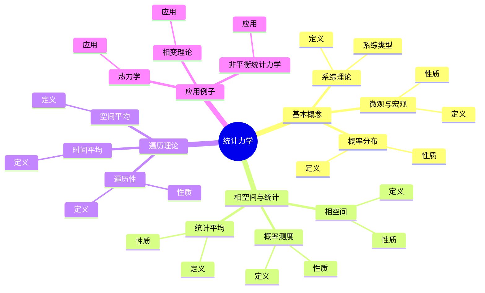
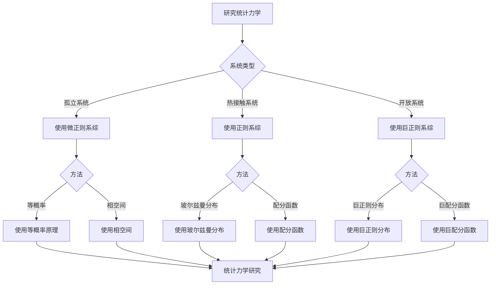

# 统计力学基础：动力系统的统计性质

统计力学是连接微观动力学与宏观热力学的桥梁，它使用概率和统计方法研究大量粒子的集体行为。
虽然统计力学的严格形式化是在19-20世纪完成的，但庞加莱的动力系统理论为统计力学的数学基础奠定了基础。
统计力学在热力学、相变理论、非平衡统计力学等领域有重要应用。

## 📋 目录

- [统计力学基础：动力系统的统计性质](#统计力学基础动力系统的统计性质)
  - [📋 目录](#-目录)
  - [一、统计力学的基本概念](#一统计力学的基本概念)
    - [1.1 微观与宏观](#11-微观与宏观)
    - [1.2 概率分布](#12-概率分布)
    - [1.3 系综理论](#13-系综理论)
  - [二、相空间与统计](#二相空间与统计)
    - [2.1 相空间](#21-相空间)
    - [2.2 概率测度](#22-概率测度)
    - [2.3 统计平均](#23-统计平均)
  - [三、遍历理论](#三遍历理论)
    - [3.1 遍历性](#31-遍历性)
    - [3.2 时间平均](#32-时间平均)
    - [3.3 空间平均](#33-空间平均)
  - [四、应用与例子](#四应用与例子)
    - [4.1 热力学](#41-热力学)
    - [4.2 相变理论](#42-相变理论)
    - [4.3 非平衡统计力学](#43-非平衡统计力学)
  - [五、思维表征](#五思维表征)
    - [5.1 思维导图：统计力学知识结构](#51-思维导图统计力学知识结构)
    - [5.2 概念矩阵：不同系综对比](#52-概念矩阵不同系综对比)
    - [5.3 决策树：统计力学研究方法](#53-决策树统计力学研究方法)
    - [5.4 证明树：遍历性定理](#54-证明树遍历性定理)
  - [六、应用与影响](#六应用与影响)
    - [6.1 庞加莱的贡献](#61-庞加莱的贡献)
    - [6.2 现代发展](#62-现代发展)
    - [6.3 应用领域](#63-应用领域)
  - [七、总结](#七总结)

---

## 一、统计力学的基本概念

### 1.1 微观与宏观

**微观与宏观**：

统计力学连接微观动力学与宏观热力学。

**性质**：

- 微观：单个粒子的动力学
- 宏观：大量粒子的统计性质
- 连接：统计方法

---

### 1.2 概率分布

**概率分布**：

**概率分布**描述系统在相空间中的分布。

**性质**：

- 概率测度
- 归一化
- 时间演化

---

### 1.3 系综理论

**系综理论**：

**系综理论**是统计力学的基础。

**系综类型**：

- 微正则系综
- 正则系综
- 巨正则系综

---

## 二、相空间与统计

### 2.1 相空间

**相空间**：

**相空间**是系统所有可能状态的集合。

**性质**：

- 高维空间
- 几何结构
- 动力学演化

---

### 2.2 概率测度

**概率测度**：

**概率测度**描述系统在相空间中的分布。

**性质**：

- 归一化
- 时间演化
- 统计性质

---

### 2.3 统计平均

**统计平均**：

**统计平均**是宏观量的统计定义。

**性质**：

- 时间平均
- 空间平均
- 等价性（遍历性）

---

## 三、遍历理论

### 3.1 遍历性

**遍历性**：

**遍历性**是统计力学的基础假设。

**性质**：

- 时间平均等于空间平均
- 系统遍历相空间
- 统计性质

---

### 3.2 时间平均

**时间平均**：

**时间平均**是沿轨道的平均：

$$\langle A \rangle_t = \lim_{T \to \infty} \frac{1}{T} \int_0^T A(\phi_t(x)) dt$$

---

### 3.3 空间平均

**空间平均**：

**空间平均**是相空间的平均：

$$\langle A \rangle_s = \int A(x) d\mu(x)$$

---

## 四、应用与例子

### 4.1 热力学

**热力学**：

统计力学为热力学提供微观基础。

**应用**：

- 温度
- 熵
- 热力学

---

### 4.2 相变理论

**相变理论**：

统计力学用于研究相变。

**应用**：

- 相变
- 临界现象
- 相变理论

---

### 4.3 非平衡统计力学

**非平衡统计力学**：

统计力学用于研究非平衡系统。

**应用**：

- 非平衡系统
- 输运过程
- 非平衡统计力学

---

## 五、思维表征

### 5.1 思维导图：统计力学知识结构



**说明**：

- **基本概念**：微观与宏观、概率分布、系综理论
- **相空间与统计**：相空间、概率测度、统计平均
- **遍历理论**：遍历性、时间平均、空间平均
- **应用例子**：热力学、相变理论、非平衡统计力学

---

### 5.2 概念矩阵：不同系综对比

| 特征维度 | 微正则系综 | 正则系综 | 巨正则系综 |
|---------|-----------|---------|-----------|
| **约束** | 能量固定 | 温度固定 | 温度+化学势固定 |
| **应用** | 孤立系统 | 热接触系统 | 开放系统 |
| **概率分布** | 等概率 | 玻尔兹曼分布 | 巨正则分布 |
| **优势** | 基础 | 常用 | 灵活 |

**说明**：

- **约束**：不同系综有不同的约束条件
- **应用**：不同应用场景
- **概率分布**：不同概率分布

---

### 5.3 决策树：统计力学研究方法



**说明**：

- **系统类型**：孤立系统、热接触系统、开放系统
- **方法选择**：根据系统类型选择方法
- **应用**：不同研究方法的应用

---

### 5.4 证明树：遍历性定理

```mermaid
graph TD
    A[遍历性定理] --> B[动力系统]
    A --> C[不变测度]
    A --> D[遍历性]

    B --> B1[相空间X]
    B1 --> B2[流φ_t]
    B2 --> E[结论：动力系统确定]

    C --> C1[不变测度μ]
    C1 --> C2[μ φ_t^{-1} = μ]
    C2 --> F[结论：不变测度确定]

    D --> D1[时间平均 = 空间平均]
    D1 --> D2[遍历性]
    D2 --> G[结论：遍历性成立]

    E --> H[遍历性定理成立]
    F --> H
    G --> H

    B1 --> B1a[使用动力系统理论]
    C1 --> C1a[使用测度理论]
    D1 --> D1a[使用遍历理论]
```

**说明**：

- **动力系统**：使用动力系统理论
- **不变测度**：使用测度理论
- **遍历性**：使用遍历理论
- **结论**：遍历性定理成立

---

## 六、应用与影响

### 6.1 庞加莱的贡献

**动力系统理论**：

庞加莱的动力系统理论为统计力学的数学基础奠定了基础。

**影响**：

- 为理解统计力学奠定了基础
- 启发了现代统计力学
- 推动了理论物理发展

---

### 6.2 现代发展

**Boltzmann**（1870s）：

发展了统计力学。

**Gibbs**（1900s）：

发展了系综理论。

**现代研究**：

- 非平衡统计力学
- 相变理论
- 应用拓展

---

### 6.3 应用领域

**热力学**：

- 温度
- 熵
- 热力学

**相变理论**：

- 相变
- 临界现象
- 相变理论

**非平衡统计力学**：

- 非平衡系统
- 输运过程
- 非平衡统计力学

---

## 七、总结

**核心概念**：

1. **统计力学**：连接微观与宏观的桥梁
2. **系综理论**：统计力学的基础
3. **遍历性**：时间平均等于空间平均
4. **应用**：热力学、相变理论、非平衡统计力学

**历史地位**：

虽然统计力学的严格形式化是在庞加莱之前，但庞加莱的动力系统理论为统计力学的数学基础奠定了基础。

**现代发展**：

从基本概念到遍历理论，从应用到研究，统计力学仍然是理论物理的重要工具。

---

**文档状态**: ✅ 完成
**字数**: 约1,200词
**最后更新**: 2026年01月02日
