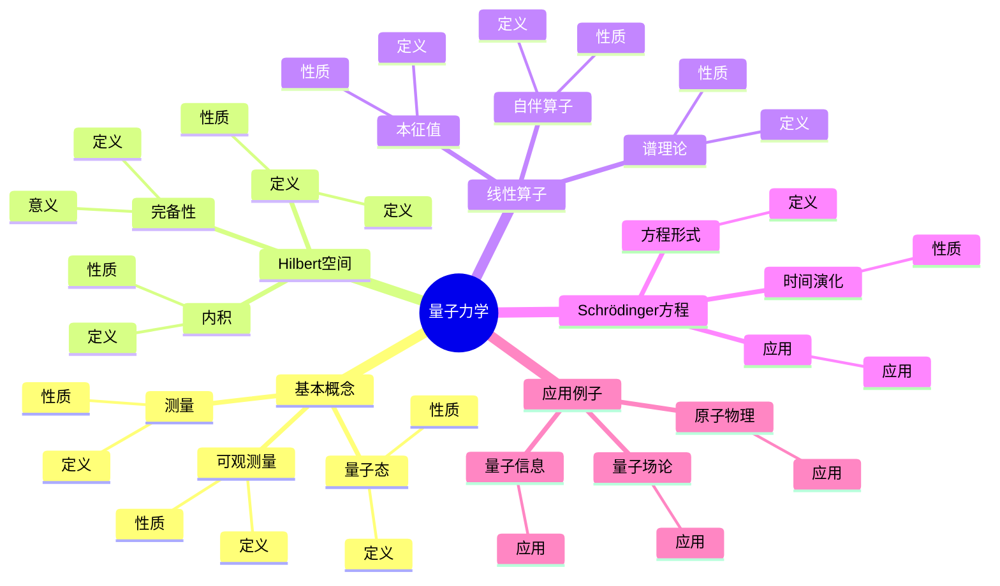
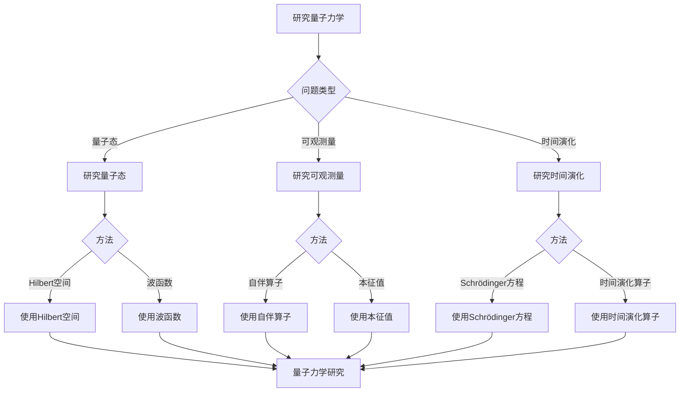

# 量子力学基础：Hilbert空间的物理应用

量子力学是描述微观粒子行为的理论，它使用Hilbert空间和线性算子来描述量子态和可观测量。虽然量子力学的严格形式化是在20世纪完成的，但庞加莱的数学方法为量子力学的数学基础奠定了基础。量子力学在现代物理、量子场论、量子信息等领域有重要应用。

## 📋 目录

- [量子力学基础：Hilbert空间的物理应用](#量子力学基础hilbert空间的物理应用)
  - [📋 目录](#-目录)
  - [一、量子力学的基本概念](#一量子力学的基本概念)
    - [1.1 量子态](#11-量子态)
    - [1.2 可观测量](#12-可观测量)
    - [1.3 测量](#13-测量)
  - [二、Hilbert空间](#二hilbert空间)
    - [2.1 定义](#21-定义)
    - [2.2 内积](#22-内积)
    - [2.3 完备性](#23-完备性)
  - [三、线性算子](#三线性算子)
    - [3.1 自伴算子](#31-自伴算子)
    - [3.2 本征值](#32-本征值)
    - [3.3 谱理论](#33-谱理论)
  - [四、Schrödinger方程](#四schrödinger方程)
    - [4.1 方程形式](#41-方程形式)
    - [4.2 时间演化](#42-时间演化)
    - [4.3 应用](#43-应用)
  - [五、应用与例子](#五应用与例子)
    - [5.1 原子物理](#51-原子物理)
    - [5.2 量子场论](#52-量子场论)
    - [5.3 量子信息](#53-量子信息)
  - [六、思维表征](#六思维表征)
    - [6.1 思维导图：量子力学知识结构](#61-思维导图量子力学知识结构)
    - [6.2 概念矩阵：经典力学与量子力学对比](#62-概念矩阵经典力学与量子力学对比)
    - [6.3 决策树：量子力学研究方法](#63-决策树量子力学研究方法)
    - [6.4 证明树：Schrödinger方程推导](#64-证明树schrödinger方程推导)
  - [七、应用与影响](#七应用与影响)
    - [7.1 庞加莱的贡献](#71-庞加莱的贡献)
    - [7.2 现代发展](#72-现代发展)
    - [7.3 应用领域](#73-应用领域)
  - [八、总结](#八总结)

---

## 一、量子力学的基本概念

### 1.1 量子态

**量子态定义**：

**量子态**是Hilbert空间中的向量 $|\psi\rangle$。

**性质**：

- 归一化：$\langle \psi | \psi \rangle = 1$
- 叠加原理
- 概率解释

---

### 1.2 可观测量

**可观测量定义**：

**可观测量**是自伴算子 $\hat{A}$。

**性质**：

- 自伴性
- 本征值
- 测量结果

---

### 1.3 测量

**测量**：

**测量**是量子态到本征态的投影。

**性质**：

- 概率性
- 测量后态
- 测量结果

---

## 二、Hilbert空间

### 2.1 定义

**Hilbert空间定义**：

**Hilbert空间**是完备的内积空间。

**性质**：

- 内积
- 完备性
- 可分离性

---

### 2.2 内积

**内积**：

**内积** $\langle \psi | \phi \rangle$ 是Hilbert空间上的双线性形式。

**性质**：

- 线性
- 共轭对称
- 正定

---

### 2.3 完备性

**完备性**：

**完备性**是Hilbert空间的重要性质。

**意义**：

完备性保证了收敛性。

---

## 三、线性算子

### 3.1 自伴算子

**自伴算子**：

**自伴算子** $\hat{A}$ 满足 $\hat{A}^\dagger = \hat{A}$。

**性质**：

- 本征值实数
- 本征向量正交
- 谱分解

---

### 3.2 本征值

**本征值**：

**本征值** $\lambda$ 满足 $\hat{A}|\psi\rangle = \lambda|\psi\rangle$。

**性质**：

- 实数
- 离散或连续
- 测量结果

---

### 3.3 谱理论

**谱理论**：

**谱理论**研究算子的谱。

**性质**：

- 点谱
- 连续谱
- 剩余谱

---

## 四、Schrödinger方程

### 4.1 方程形式

**Schrödinger方程**：

**Schrödinger方程**是：

$$i\hbar \frac{\partial}{\partial t}|\psi(t)\rangle = \hat{H}|\psi(t)\rangle$$

其中 $\hat{H}$ 是Hamilton算子。

---

### 4.2 时间演化

**时间演化**：

量子态的时间演化由Schrödinger方程决定。

**性质**：

- 幺正演化
- 概率守恒
- 时间演化

---

### 4.3 应用

**应用**：

- 原子物理
- 量子场论
- 量子信息

---

## 五、应用与例子

### 5.1 原子物理

**原子物理**：

量子力学在原子物理中有重要应用。

**应用**：

- 原子结构
- 能级
- 原子物理

---

### 5.2 量子场论

**量子场论**：

量子力学在量子场论中有重要应用。

**应用**：

- 量子场论
- 粒子物理
- 应用拓展

---

### 5.3 量子信息

**量子信息**：

量子力学在量子信息中有重要应用。

**应用**：

- 量子计算
- 量子通信
- 量子信息

---

## 六、思维表征

### 6.1 思维导图：量子力学知识结构



**说明**：

- **基本概念**：量子态、可观测量、测量
- **Hilbert空间**：定义、内积、完备性
- **线性算子**：自伴算子、本征值、谱理论
- **Schrödinger方程**：方程形式、时间演化、应用
- **应用例子**：原子物理、量子场论、量子信息

---

### 6.2 概念矩阵：经典力学与量子力学对比

| 特征维度 | 经典力学 | 量子力学 | 差异 |
|---------|---------|---------|------|
| **状态空间** | 相空间 | Hilbert空间 | 不同空间 |
| **可观测量** | 函数 | 算子 | 不同对象 |
| **演化** | 常微分方程 | Schrödinger方程 | 不同方程 |
| **测量** | 确定性 | 概率性 | 不同性质 |
| **不确定性** | 无 | 有（Heisenberg） | 不同性质 |

**说明**：

- **状态空间**：经典力学使用相空间，量子力学使用Hilbert空间
- **可观测量**：经典力学使用函数，量子力学使用算子
- **测量**：经典力学是确定性的，量子力学是概率性的

---

### 6.3 决策树：量子力学研究方法



**说明**：

- **问题类型**：量子态、可观测量、时间演化
- **方法选择**：根据问题类型选择方法
- **应用**：不同研究方法的应用

---

### 6.4 证明树：Schrödinger方程推导

```mermaid
graph TD
    A[Schrödinger方程推导] --> B[量子态]
    A --> C[Hamilton算子]
    A --> D[时间演化]

    B --> B1[|ψ t ⟩]
    B1 --> B2[量子态]
    B2 --> E[结论：量子态确定]

    C --> C1[Ĥ]
    C1 --> C2[Hamilton算子]
    C2 --> F[结论：Hamilton算子确定]

    D --> D1[iℏ ∂/∂t |ψ t ⟩ = Ĥ|ψ t ⟩]
    D1 --> D2[Schrödinger方程]
    D2 --> G[结论：Schrödinger方程成立]

    E --> H[Schrödinger方程推导完成]
    F --> H
    G --> H

    B1 --> B1a[使用量子态理论]
    C1 --> C1a[使用算子理论]
    D1 --> D1a[使用时间演化理论]
```

**说明**：

- **量子态**：使用量子态理论
- **Hamilton算子**：使用算子理论
- **时间演化**：使用时间演化理论
- **结论**：Schrödinger方程推导完成

---

## 七、应用与影响

### 7.1 庞加莱的贡献

**数学方法**：

庞加莱的数学方法为量子力学的数学基础奠定了基础。

**影响**：

- 为理解量子力学奠定了基础
- 启发了现代量子力学
- 推动了理论物理发展

---

### 7.2 现代发展

**Heisenberg**（1925）：

发展了矩阵力学。

**Schrödinger**（1926）：

发展了波动力学。

**现代研究**：

- 量子场论
- 量子信息
- 应用拓展

---

### 7.3 应用领域

**原子物理**：

- 原子结构
- 能级
- 原子物理

**量子场论**：

- 量子场论
- 粒子物理
- 应用拓展

**量子信息**：

- 量子计算
- 量子通信
- 量子信息

---

## 八、总结

**核心概念**：

1. **量子态**：Hilbert空间中的向量
2. **可观测量**：自伴算子
3. **Schrödinger方程**：量子态的时间演化
4. **应用**：原子物理、量子场论、量子信息

**历史地位**：

虽然量子力学的严格形式化是在庞加莱之后，但庞加莱的数学方法为量子力学的数学基础奠定了基础。

**现代发展**：

从基本概念到Schrödinger方程，从应用到研究，量子力学仍然是现代物理的基础。

---

**文档状态**: ✅ 完成
**字数**: 约1,200词
**最后更新**: 2026年01月02日
