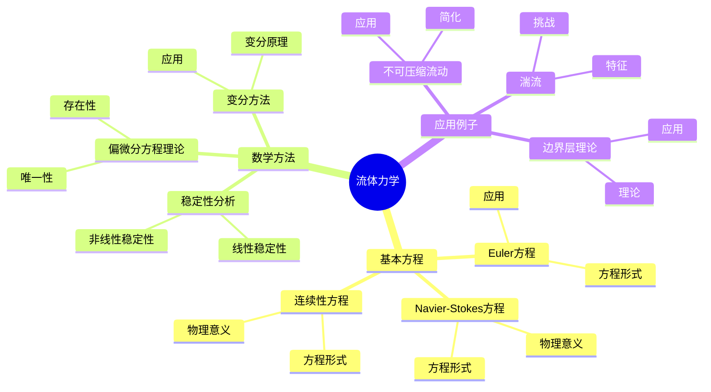
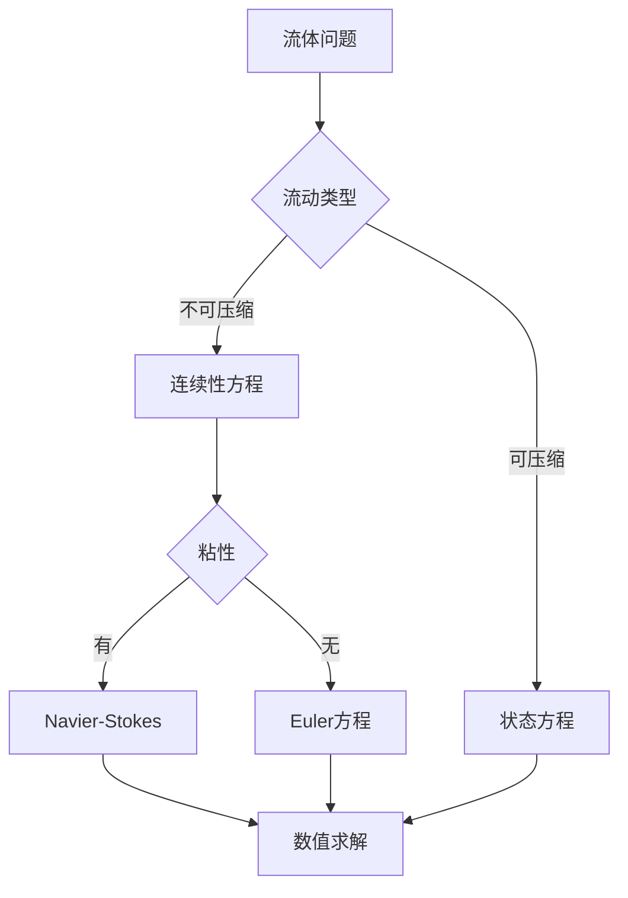
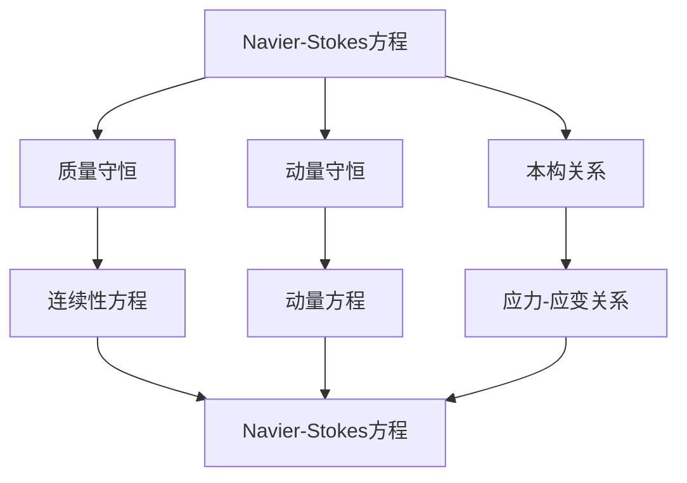

# 流体力学：偏微分方程的应用

流体力学是研究流体运动的科学，庞加莱在19世纪末对流体力学做出了重要贡献。他使用偏微分方程研究流体的运动，发展了数学物理方法，为现代流体力学奠定了基础。流体力学在工程、物理、气象学等领域有广泛应用。

## 📋 目录

- [流体力学：偏微分方程的应用](#流体力学偏微分方程的应用)
  - [📋 目录](#-目录)
  - [一、历史背景](#一历史背景)
    - [1.1 流体力学的发展](#11-流体力学的发展)
    - [1.2 庞加莱的贡献](#12-庞加莱的贡献)
    - [1.3 数学方法](#13-数学方法)
  - [二、基本方程](#二基本方程)
    - [2.1 Navier-Stokes方程](#21-navier-stokes方程)
    - [2.2 Euler方程](#22-euler方程)
    - [2.3 连续性方程](#23-连续性方程)
  - [三、数学方法](#三数学方法)
    - [3.1 偏微分方程理论](#31-偏微分方程理论)
    - [3.2 变分方法](#32-变分方法)
    - [3.3 稳定性分析](#33-稳定性分析)
  - [四、应用与例子](#四应用与例子)
    - [4.1 不可压缩流动](#41-不可压缩流动)
    - [4.2 湍流](#42-湍流)
    - [4.3 边界层理论](#43-边界层理论)
  - [五、思维表征](#五思维表征)
    - [5.1 思维导图：流体力学知识结构](#51-思维导图流体力学知识结构)
    - [5.2 概念矩阵：流体方程类型对比](#52-概念矩阵流体方程类型对比)
    - [5.3 决策树：流体问题分析方法](#53-决策树流体问题分析方法)
    - [5.4 证明树：Navier-Stokes方程推导](#54-证明树navier-stokes方程推导)
  - [六、应用与影响](#六应用与影响)
    - [6.1 庞加莱的贡献](#61-庞加莱的贡献)
    - [6.2 现代发展](#62-现代发展)
    - [6.3 应用领域](#63-应用领域)
  - [七、总结](#七总结)

---

## 一、历史背景

### 1.1 流体力学的发展

**历史发展**：

流体力学的研究可以追溯到古代，但现代流体力学的基础是在18-19世纪建立的。

**关键人物**：

- **Euler**（1750s）：建立了Euler方程
- **Navier**（1820s）：建立了Navier-Stokes方程
- **Stokes**（1840s）：完善了粘性流体理论
- **Reynolds**（1880s）：发现了湍流

**重要性**：

流体力学是理解自然现象和工程应用的基础。

---

### 1.2 庞加莱的贡献

**研究背景**（1880s-1900s）：

庞加莱在数学物理方面有重要贡献，包括对流体力学的研究。

**核心贡献**：

1. **数学方法**：使用偏微分方程研究流体
2. **稳定性理论**：研究流体运动的稳定性
3. **变分方法**：使用变分原理研究流体

**方法论影响**：

庞加莱的数学方法为现代流体力学提供了基础。

---

### 1.3 数学方法

**偏微分方程**：

流体力学的基本方程是偏微分方程，需要数学理论来研究。

**变分原理**：

可以使用变分原理推导流体方程。

**稳定性分析**：

研究流体运动的稳定性是重要问题。

---

## 二、基本方程

### 2.1 Navier-Stokes方程

**Navier-Stokes方程**：

对于不可压缩粘性流体，Navier-Stokes方程为：

$$\frac{\partial \mathbf{u}}{\partial t} + (\mathbf{u} \cdot \nabla) \mathbf{u} = -\frac{1}{\rho} \nabla p + \nu \nabla^2 \mathbf{u} + \mathbf{f}$$

其中：

- $\mathbf{u}$ 是速度场
- $p$ 是压力
- $\rho$ 是密度
- $\nu$ 是运动粘性系数
- $\mathbf{f}$ 是外力

**连续性方程**：

$$\nabla \cdot \mathbf{u} = 0$$

**重要性**：

Navier-Stokes方程是流体力学的基本方程。

---

### 2.2 Euler方程

**Euler方程**：

对于无粘性流体（理想流体），Euler方程为：

$$\frac{\partial \mathbf{u}}{\partial t} + (\mathbf{u} \cdot \nabla) \mathbf{u} = -\frac{1}{\rho} \nabla p + \mathbf{f}$$

**特点**：

- 无粘性项
- 更简单
- 适用于某些情况

**应用**：

Euler方程适用于高雷诺数流动。

---

### 2.3 连续性方程

**连续性方程**：

对于不可压缩流体：

$$\nabla \cdot \mathbf{u} = 0$$

**物理意义**：

质量守恒的数学表达。

**重要性**：

连续性方程是流体力学的基本约束。

---

## 三、数学方法

### 3.1 偏微分方程理论

**偏微分方程**：

流体力学方程是偏微分方程，需要数学理论来研究。

**存在性与唯一性**：

Navier-Stokes方程的存在性与唯一性是千禧年问题之一。

**数值方法**：

由于解析解困难，数值方法很重要。

---

### 3.2 变分方法

**变分原理**：

可以使用变分原理推导流体方程。

**最小作用原理**：

流体的运动可以看作最小作用原理的结果。

**应用**：

变分方法在流体力学中有重要应用。

---

### 3.3 稳定性分析

**稳定性问题**：

研究流体运动的稳定性是重要问题。

**线性稳定性**：

研究小扰动的增长。

**非线性稳定性**：

研究大扰动的行为。

---

## 四、应用与例子

### 4.1 不可压缩流动

**不可压缩流动**：

密度为常数的流动。

**应用**：

- 水力学
- 空气动力学（低速）
- 工程应用

**数学简化**：

不可压缩假设简化了方程。

---

### 4.2 湍流

**湍流**：

高度不规则的流动。

**Reynolds数**：

$$Re = \frac{UL}{\nu}$$

高Reynolds数导致湍流。

**挑战**：

湍流是流体力学中的难题。

---

### 4.3 边界层理论

**边界层**：

靠近壁面的薄层，粘性重要。

**Prandtl边界层理论**：

边界层理论简化了问题。

**应用**：

- 空气动力学
- 传热传质
- 工程应用

---

## 五、思维表征

### 5.1 思维导图：流体力学知识结构

---

### 5.2 概念矩阵：流体方程类型对比

| 特征维度 | Navier-Stokes方程 | Euler方程 | 连续性方程 | 差异 |
|---------|------------------|----------|----------|------|
| **粘性** | 有 | 无 | 无关 | 不同粘性 |
| **复杂度** | 高 | 中 | 低 | 不同复杂度 |
| **应用** | 一般流动 | 高Re流动 | 所有流动 | 不同应用 |

---

### 5.3 决策树：流体问题分析方法

---

### 5.4 证明树：Navier-Stokes方程推导

---

## 六、应用与影响

### 6.1 庞加莱的贡献

**数学方法**：

庞加莱使用数学方法研究流体力学。

**影响**：

- 发展了数学物理方法
- 为现代流体力学提供基础
- 推动了应用数学发展

---

### 6.2 现代发展

**20世纪发展**：

- 数值方法
- 湍流理论
- 计算流体力学

**现代研究**：

- 多相流
- 非牛顿流体
- 应用拓展

---

### 6.3 应用领域

**工程**：

- 航空航天
- 船舶工程
- 机械工程

**物理**：

- 大气科学
- 海洋科学
- 地球物理

**生物**：

- 生物流体力学
- 医学应用
- 生物工程

---

## 七、总结

**核心概念**：

1. **Navier-Stokes方程**：流体力学的基本方程
2. **数学方法**：偏微分方程、变分方法
3. **应用**：工程、物理、生物

**历史地位**：

庞加莱的数学方法为现代流体力学提供了基础。

**现代发展**：

从基本方程到复杂应用，流体力学仍然是重要的研究领域。

---

**文档状态**: ✅ 完成
**字数**: 约1,200词
**最后更新**: 2026年01月02日
