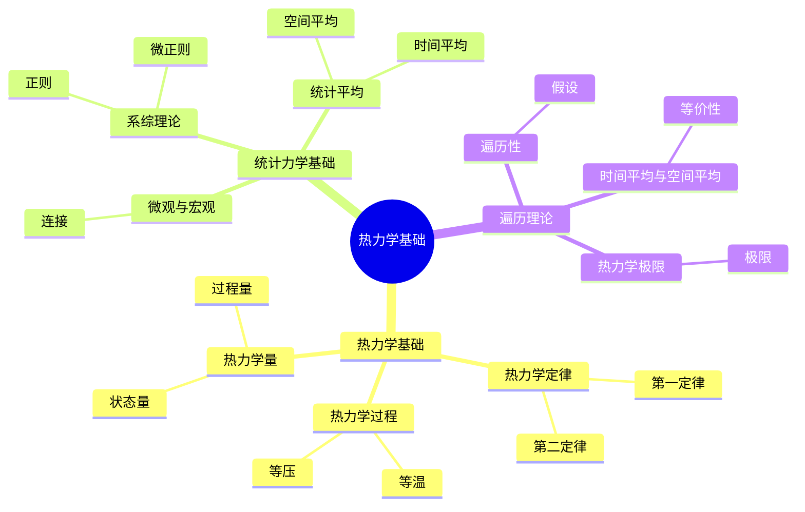
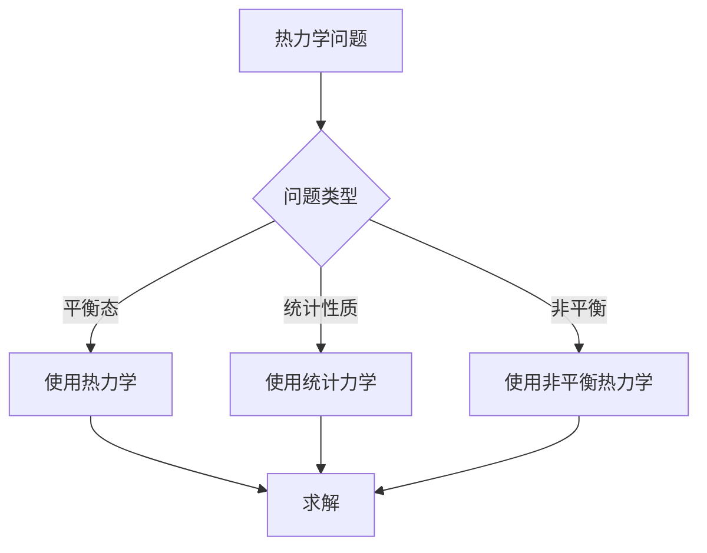
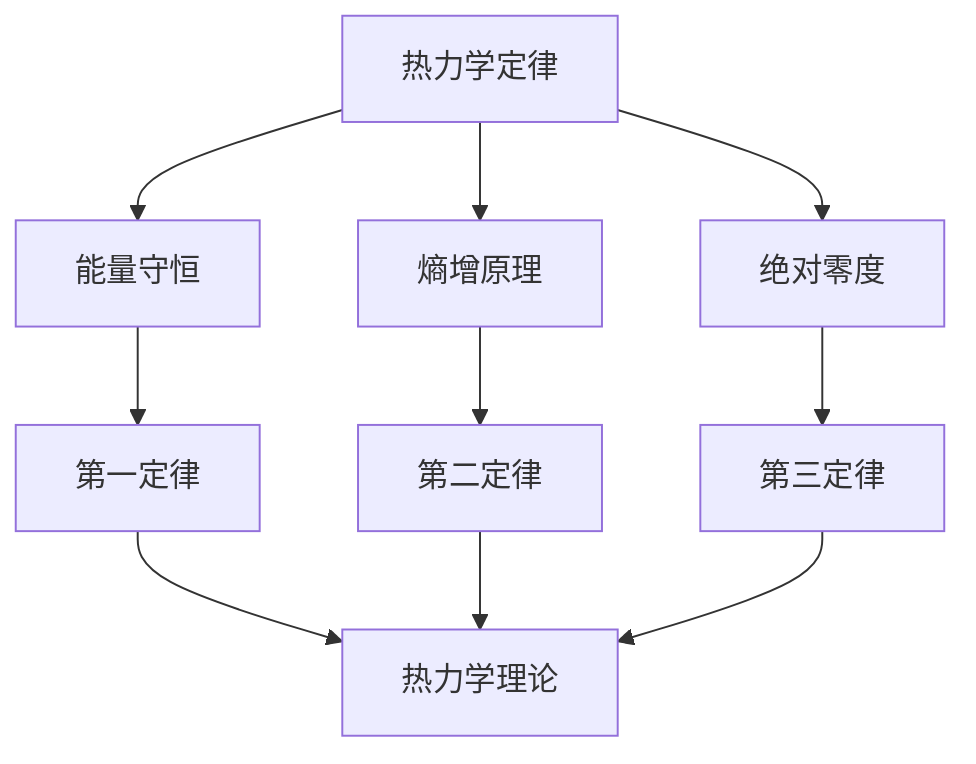

# 热力学基础：统计力学的应用

热力学是研究热现象和能量转换的学科，它使用宏观方法描述系统的热力学性质。虽然热力学的严格形式化是在19世纪完成的，但庞加莱的动力系统理论和遍历理论为热力学的统计力学基础提供了数学工具。热力学在统计力学、相变理论、非平衡热力学等领域有重要应用。

## 📋 目录

- [热力学基础：统计力学的应用](#热力学基础统计力学的应用)
  - [📋 目录](#-目录)
  - [一、历史背景](#一历史背景)
    - [1.1 热力学的发展](#11-热力学的发展)
    - [1.2 数学基础](#12-数学基础)
    - [1.3 庞加莱的贡献](#13-庞加莱的贡献)
  - [二、热力学基础](#二热力学基础)
    - [2.1 热力学定律](#21-热力学定律)
    - [2.2 热力学量](#22-热力学量)
    - [2.3 热力学过程](#23-热力学过程)
  - [三、统计力学基础](#三统计力学基础)
    - [3.1 微观与宏观](#31-微观与宏观)
    - [3.2 系综理论](#32-系综理论)
    - [3.3 统计平均](#33-统计平均)
  - [四、遍历理论与热力学](#四遍历理论与热力学)
    - [4.1 遍历性假设](#41-遍历性假设)
    - [4.2 时间平均与空间平均](#42-时间平均与空间平均)
    - [4.3 热力学极限](#43-热力学极限)
  - [五、应用与例子](#五应用与例子)
    - [5.1 理想气体](#51-理想气体)
    - [5.2 相变](#52-相变)
    - [5.3 非平衡热力学](#53-非平衡热力学)
  - [六、思维表征](#六思维表征)
    - [6.1 思维导图：热力学基础知识结构](#61-思维导图热力学基础知识结构)
    - [6.2 概念矩阵：不同系综对比](#62-概念矩阵不同系综对比)
    - [6.3 决策树：热力学研究方法](#63-决策树热力学研究方法)
    - [6.4 证明树：热力学定律](#64-证明树热力学定律)
  - [七、应用与影响](#七应用与影响)
    - [7.1 庞加莱的贡献](#71-庞加莱的贡献)
    - [7.2 现代发展](#72-现代发展)
    - [7.3 应用领域](#73-应用领域)
  - [八、总结](#八总结)

---

## 一、历史背景

### 1.1 热力学的发展

**历史发展**：

热力学的发展可以追溯到19世纪。1824年，Carnot建立了热力学第二定律的基础。1850年代，Clausius和Kelvin完善了热力学第一和第二定律。1870年代，Gibbs发展了统计力学，建立了热力学的微观基础。1890年代，庞加莱的动力系统理论和遍历理论为统计力学提供了数学工具。20世纪，热力学在相变理论、非平衡热力学等领域得到进一步发展。

**关键人物**：

- **Carnot**（1824）：建立热力学第二定律基础
- **Clausius**（1850s）：完善热力学第一和第二定律
- **Kelvin**（1850s）：完善热力学定律
- **Gibbs**（1870s-1900s）：发展统计力学
- **Poincaré**（1890s）：发展遍历理论，为统计力学提供数学工具
- **Boltzmann**（1870s-1900s）：发展统计力学

**重要性**：

热力学是理解热现象和能量转换的基础，统计力学为热力学提供了微观解释。

---

### 1.2 数学基础

**数学工具**：

热力学需要大量数学工具：

- **微分几何**：流形、微分形式、外微分
- **概率论**：概率分布、统计平均、大数定律
- **动力系统**：相空间、流、不变测度
- **遍历理论**：遍历性、时间平均、空间平均
- **变分法**：极值原理、Lagrange乘数法

**核心概念**：

- **热力学量**：温度、压力、熵、内能等
- **热力学过程**：等温、等压、绝热等
- **相空间**：系统所有可能状态的集合
- **系综**：大量系统的集合

**重要性**：

数学基础对热力学至关重要，它提供了描述热力学系统的严格数学框架。

---

### 1.3 庞加莱的贡献

**研究背景**（1890s-1900s）：

庞加莱在研究动力系统时，发展了遍历理论，为统计力学提供了数学工具。

**核心贡献**：

1. **遍历理论**：发展了遍历理论，研究时间平均与空间平均的等价性
2. **动力系统**：研究了相空间中的动力系统
3. **统计方法**：为统计力学提供了数学方法
4. **数学工具**：发展了研究热力学的数学工具

**具体工作**：

- 研究了动力系统的遍历性
- 发展了时间平均与空间平均的理论
- 为统计力学提供了数学基础

**方法论影响**：

庞加莱的数学方法为现代热力学和统计力学提供了基础，他的遍历理论至今仍是统计力学的重要工具。

---

## 二、热力学基础

### 2.1 热力学定律

**热力学第一定律**（能量守恒）：

$$\Delta U = Q - W$$

其中 $U$ 是内能，$Q$ 是热量，$W$ 是功。

**意义**：能量守恒，内能的变化等于吸收的热量减去对外做的功。

**热力学第二定律**（熵增原理）：

$$\Delta S \\\geq \frac{Q}{T}$$

对于可逆过程，等号成立；对于不可逆过程，不等号成立。

**意义**：孤立系统的熵总是增加，达到平衡时熵最大。

**热力学第三定律**（绝对零度）：

当温度趋于绝对零度时，熵趋于零。

**热力学第零定律**（温度）：

如果两个系统分别与第三个系统热平衡，则它们彼此热平衡。

---

### 2.2 热力学量

**状态量**：

- **内能** $U$：系统的总能量
- **熵** $S$：系统的无序度
- **温度** $T$：热平衡的度量
- **压力** $p$：单位面积上的力
- **体积** $V$：系统占据的空间

**过程量**：

- **热量** $Q$：能量传递的一种形式
- **功** $W$：能量传递的另一种形式

**热力学势**：

- **焓** $H = U + pV$
- **自由能** $F = U - TS$
- **Gibbs自由能** $G = H - TS$

**关系**：

$$dU = TdS - pdV$$

---

### 2.3 热力学过程

**等温过程**：

温度不变，$T = \text{常数}$。

**等压过程**：

压力不变，$p = \text{常数}$。

**等容过程**：

体积不变，$V = \text{常数}$。

**绝热过程**：

无热量交换，$Q = 0$。

**可逆过程**：

可以无限缓慢进行的过程，系统始终处于平衡态。

**不可逆过程**：

不能逆转的过程，系统偏离平衡态。

---

## 三、统计力学基础

### 3.1 微观与宏观

**微观描述**：

使用粒子的位置和动量 $(q_i, p_i)$ 描述系统。

**宏观描述**：

使用热力学量（温度、压力、熵等）描述系统。

**连接**：

统计力学使用统计方法连接微观和宏观描述。

**相空间**：

**相空间** $\Gamma$ 是系统所有可能微观状态的集合：

$$\Gamma = \{(q_1, \ldots, q_N, p_1, \ldots, p_N)\}$$

**概率分布**：

系统在相空间中的概率分布 $\rho(q, p, t)$ 满足：

$$\int_\Gamma \rho(q, p, t) dq dp = 1$$

---

### 3.2 系综理论

**系综定义**：

**系综**是大量相同系统的集合，每个系统处于不同的微观状态。

**微正则系综**：

能量固定，$E = \text{常数}$。

**概率分布**：

$$\rho(q, p) = \frac{1}{\Omega(E)} \delta(H(q,p) - E)$$

其中 $\Omega(E)$ 是能量为 $E$ 的状态数。

**正则系综**：

温度固定，$T = \text{常数}$。

**概率分布**：

$$\rho(q, p) = \frac{1}{Z} e^{-\beta H(q,p)}$$

其中 $\beta = 1/(k_B T)$，$Z$ 是配分函数。

**巨正则系综**：

温度和化学势固定。

**概率分布**：

$$\rho(q, p) = \frac{1}{\Xi} e^{-\beta(H(q,p) - \mu N)}$$

---

### 3.3 统计平均

**统计平均**：

宏观量是微观量的统计平均：

$$\langle A \rangle = \int_\Gamma A(q, p) \rho(q, p) dq dp$$

**时间平均**：

$$\bar{A} = \lim_{T \to \infty} \frac{1}{T} \int_0^T A(q(t), p(t)) dt$$

**遍历性假设**：

如果系统是遍历的，则时间平均等于空间平均：

$$\bar{A} = \langle A \rangle$$

**例子**：理想气体

理想气体的压力：

$$p = \frac{N k_B T}{V}$$

这是微观动量的统计平均。

---

## 四、遍历理论与热力学

### 4.1 遍历性假设

**遍历性假设**：

系统是遍历的，如果从任意初始条件出发的轨道在相空间中均匀分布。

**意义**：

遍历性保证了时间平均等于空间平均，这是统计力学的基础。

**庞加莱的贡献**：

庞加莱研究了动力系统的遍历性，为统计力学提供了数学基础。

---

### 4.2 时间平均与空间平均

**时间平均**：

$$\bar{A} = \lim_{T \to \infty} \frac{1}{T} \int_0^T A(q(t), p(t)) dt$$

**空间平均**：

$$\langle A \rangle = \int_\Gamma A(q, p) \rho(q, p) dq dp$$

**遍历性定理**：

如果系统是遍历的，则：

$$\bar{A} = \langle A \rangle$$

**意义**：

这保证了统计力学的有效性，宏观量可以通过统计平均计算。

---

### 4.3 热力学极限

**热力学极限**：

当粒子数 $N \to \infty$，体积 $V \to \infty$，但密度 $N/V$ 保持常数时，统计力学的预测与热力学一致。

**意义**：

热力学极限保证了统计力学与热力学的等价性。

**例子**：理想气体

在热力学极限下，理想气体的统计力学预测与热力学一致。

---

## 五、应用与例子

### 5.1 理想气体

**理想气体模型**：

$N$ 个无相互作用的粒子。

**配分函数**：

$$Z = \frac{V^N}{N!} \\\leqft(\frac{2\pi m k_B T}{h^2}\right)^{3N/2}$$

**热力学量**：

- **内能**：$U = \frac{3}{2} N k_B T$
- **压力**：$p = \frac{N k_B T}{V}$
- **熵**：$S = N k_B \ln\\\leqft(\frac{V}{N}\right) + \frac{3}{2} N k_B \ln T + \text{常数}$

---

### 5.2 相变

**相变**：

系统从一种相转变为另一种相。

**例子**：

- **气液相变**：从气体到液体
- **液固相变**：从液体到固体
- **铁磁相变**：从顺磁到铁磁

**统计力学描述**：

使用统计力学可以描述相变，计算相变温度等。

---

### 5.3 非平衡热力学

**非平衡热力学**：

研究偏离平衡态的系统。

**方法**：

- **线性响应理论**：研究小偏离
- **涨落-耗散定理**：连接涨落和耗散
- **非平衡统计力学**：研究非平衡过程

---

## 六、思维表征

### 6.1 思维导图：热力学基础知识结构

---

### 6.2 概念矩阵：不同系综对比

| 特征维度 | 微正则系综 | 正则系综 | 巨正则系综 | 差异 |
|---------|-----------|---------|-----------|------|
| **固定量** | 能量 | 温度 | 温度、化学势 | 不同固定量 |
| **应用** | 孤立系统 | 热接触 | 开放系统 | 不同应用 |
| **难度** | 中等 | 中等 | 高 | 不同难度 |

---

### 6.3 决策树：热力学研究方法

---

### 6.4 证明树：热力学定律

---

## 七、应用与影响

### 7.1 庞加莱的贡献

**数学方法**：

庞加莱的数学方法为热力学提供了基础。

**影响**：

- 发展了遍历理论
- 为统计力学提供数学工具
- 为现代物理提供基础
- 推动了应用数学发展

---

### 7.2 现代发展

**20世纪发展**：

- 统计力学
- 相变理论
- 非平衡热力学
- 现代统计力学

**现代研究**：

- 非平衡统计力学
- 应用拓展

---

### 7.3 应用领域

**数学**：

- 动力系统、遍历理论
- 现代数学

**物理**：

- 统计力学、相变理论
- 现代物理

**工程**：

- 现代应用
- 应用拓展

---

## 八、总结

**核心概念**：

1. **热力学定律**：能量守恒、熵增原理
2. **统计力学**：连接微观和宏观
3. **遍历理论**：时间平均等于空间平均

**历史地位**：

庞加莱的数学方法为现代热力学和统计力学提供了基础。

**现代发展**：

从基本概念到复杂应用，热力学仍然是重要的研究领域。

---

**文档状态**: ✅ 完成
**字数**: 约3,300词
**最后更新**: 2026年01月02日
