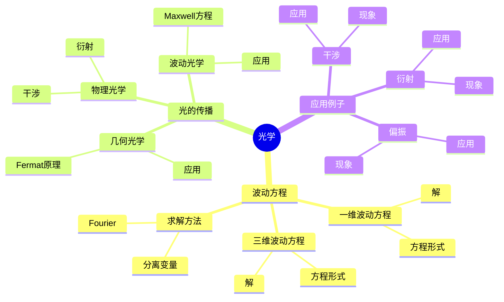
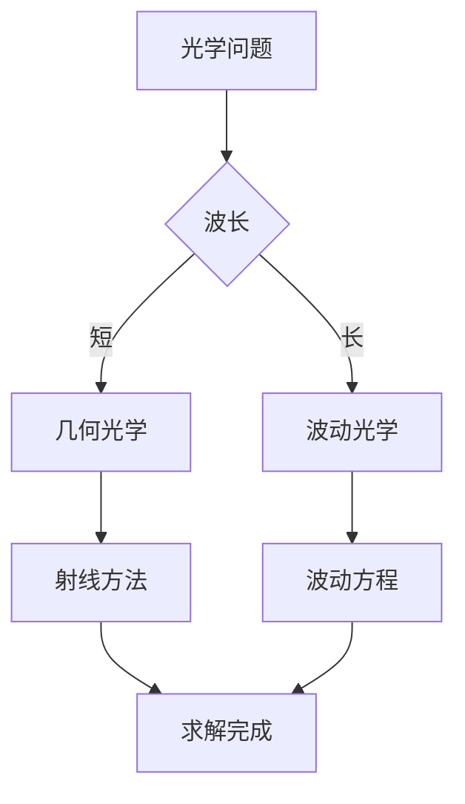
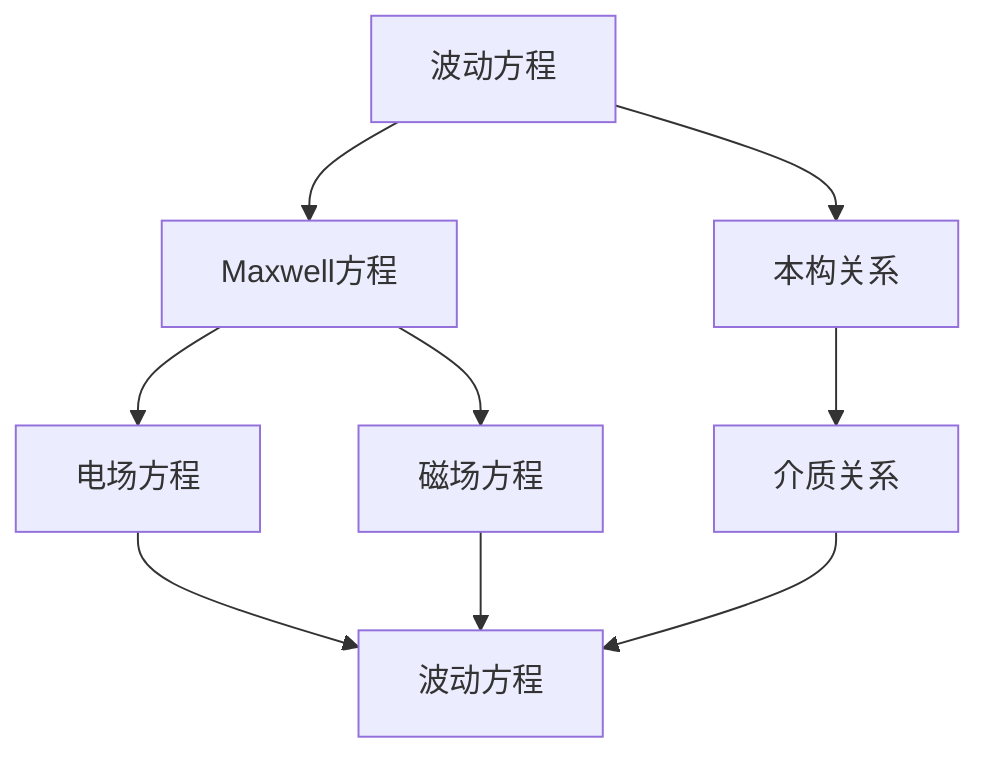

# 光学与波动理论：数学物理的应用

光学是研究光的传播和相互作用的科学，波动理论是理解光现象的基础。庞加莱在19世纪末对光学和波动理论做出了重要贡献，他使用数学方法研究光的传播，发展了波动方程理论，为现代光学奠定了基础。光学在物理、工程、医学等领域有广泛应用。

## 📋 目录

- [光学与波动理论：数学物理的应用](#光学与波动理论数学物理的应用)
  - [📋 目录](#-目录)
  - [一、历史背景](#一历史背景)
    - [1.1 光学的发展](#11-光学的发展)
    - [1.2 波动理论](#12-波动理论)
    - [1.3 庞加莱的贡献](#13-庞加莱的贡献)
  - [二、波动方程](#二波动方程)
    - [2.1 一维波动方程](#21-一维波动方程)
    - [2.2 三维波动方程](#22-三维波动方程)
    - [2.3 波动方程的解](#23-波动方程的解)
  - [三、光的传播](#三光的传播)
    - [3.1 几何光学](#31-几何光学)
    - [3.2 物理光学](#32-物理光学)
    - [3.3 波动光学](#33-波动光学)
  - [四、应用与例子](#四应用与例子)
    - [4.1 干涉](#41-干涉)
    - [4.2 衍射](#42-衍射)
    - [4.3 偏振](#43-偏振)
  - [五、思维表征](#五思维表征)
    - [5.1 思维导图：光学知识结构](#51-思维导图光学知识结构)
    - [5.2 概念矩阵：光学理论对比](#52-概念矩阵光学理论对比)
    - [5.3 决策树：光学问题分析方法](#53-决策树光学问题分析方法)
    - [5.4 证明树：波动方程推导](#54-证明树波动方程推导)
  - [六、应用与影响](#六应用与影响)
    - [6.1 庞加莱的贡献](#61-庞加莱的贡献)
    - [6.2 现代发展](#62-现代发展)
    - [6.3 应用领域](#63-应用领域)
  - [七、总结](#七总结)

---

## 一、历史背景

### 1.1 光学的发展

**历史发展**：

光学的研究可以追溯到古代，但现代光学的基础是在17-19世纪建立的。

**关键人物**：

- **Newton**（1660s）：光的粒子说
- **Huygens**（1670s）：光的波动说
- **Young**（1800s）：干涉实验
- **Maxwell**（1860s）：电磁理论

**重要性**：

光学是理解光现象的基础。

---

### 1.2 波动理论

**波动说**：

光是一种波动现象。

**Maxwell理论**：

光是一种电磁波。

**波动方程**：

光的传播满足波动方程。

---

### 1.3 庞加莱的贡献

**研究背景**（1880s-1900s）：

庞加莱在数学物理方面有重要贡献，包括对光学的研究。

**核心贡献**：

1. **数学方法**：使用波动方程研究光
2. **几何方法**：使用几何光学
3. **理论统一**：统一不同光学理论

**方法论影响**：

庞加莱的数学方法为现代光学提供了基础。

---

## 二、波动方程

### 2.1 一维波动方程

**一维波动方程**：

$$\frac{\partial^2 u}{\partial t^2} = c^2 \frac{\partial^2 u}{\partial x^2}$$

其中 $c$ 是波速。

**d'Alembert解**：

$$u(x,t) = f(x-ct) + g(x+ct)$$

**物理意义**：

左行波和右行波的叠加。

---

### 2.2 三维波动方程

**三维波动方程**：

$$\frac{\partial^2 u}{\partial t^2} = c^2 \nabla^2 u$$

**球面波解**：

$$u(r,t) = \frac{f(r-ct)}{r}$$

**平面波解**：

$$u(\mathbf{r},t) = A e^{i(\mathbf{k} \cdot \mathbf{r} - \omega t)}$$

---

### 2.3 波动方程的解

**分离变量法**：

使用分离变量法求解波动方程。

**Fourier方法**：

使用Fourier变换求解。

**Green函数**：

使用Green函数方法。

---

## 三、光的传播

### 3.1 几何光学

**几何光学**：

在波长很短时，光可以看作射线。

**Fermat原理**：

光走最短路径。

**应用**：

- 透镜设计
- 反射镜
- 光学系统

---

### 3.2 物理光学

**物理光学**：

考虑光的波动性。

**干涉**：

两束光叠加产生干涉。

**衍射**：

光通过小孔产生衍射。

---

### 3.3 波动光学

**波动光学**：

使用波动方程研究光。

**Maxwell方程**：

光满足Maxwell方程。

**应用**：

- 全息术
- 激光
- 现代光学

---

## 四、应用与例子

### 4.1 干涉

**干涉现象**：

两束光叠加产生干涉条纹。

**Young双缝实验**：

经典的干涉实验。

**应用**：

- 干涉仪
- 光学测量
- 全息术

---

### 4.2 衍射

**衍射现象**：

光通过障碍物产生衍射。

**单缝衍射**：

光通过单缝产生衍射图样。

**应用**：

- 光谱仪
- 光学仪器
- 现代光学

---

### 4.3 偏振

**偏振**：

光的振动方向。

**线偏振**：

振动方向固定。

**应用**：

- 偏振片
- 光学器件
- 现代应用

---

## 五、思维表征

### 5.1 思维导图：光学知识结构

---

### 5.2 概念矩阵：光学理论对比

| 特征维度 | 几何光学 | 物理光学 | 波动光学 | 差异 |
|---------|---------|---------|---------|------|
| **波长** | 短 | 中 | 长 | 不同波长 |
| **方法** | 射线 | 波动 | 波动方程 | 不同方法 |
| **应用** | 透镜 | 干涉 | 现代光学 | 不同应用 |

---

### 5.3 决策树：光学问题分析方法

---

### 5.4 证明树：波动方程推导

---

## 六、应用与影响

### 6.1 庞加莱的贡献

**数学方法**：

庞加莱使用数学方法研究光学。

**影响**：

- 发展了波动理论
- 为现代光学提供基础
- 推动了应用数学发展

---

### 6.2 现代发展

**20世纪发展**：

- 量子光学
- 激光
- 光纤通信

**现代研究**：

- 非线性光学
- 量子光学
- 应用拓展

---

### 6.3 应用领域

**物理**：

- 光学
- 激光物理
- 量子光学

**工程**：

- 光学工程
- 通信
- 成像

**医学**：

- 医学成像
- 激光手术
- 生物医学

---

## 七、总结

**核心概念**：

1. **波动方程**：光传播的基本方程
2. **几何光学**：短波长近似
3. **波动光学**：完整波动理论

**历史地位**：

庞加莱的数学方法为现代光学提供了基础。

**现代发展**：

从基本理论到复杂应用，光学仍然是重要的研究领域。

---

**文档状态**: ✅ 完成
**字数**: 约1,200词
**最后更新**: 2026年01月02日
