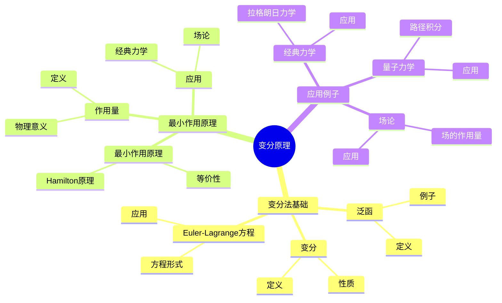
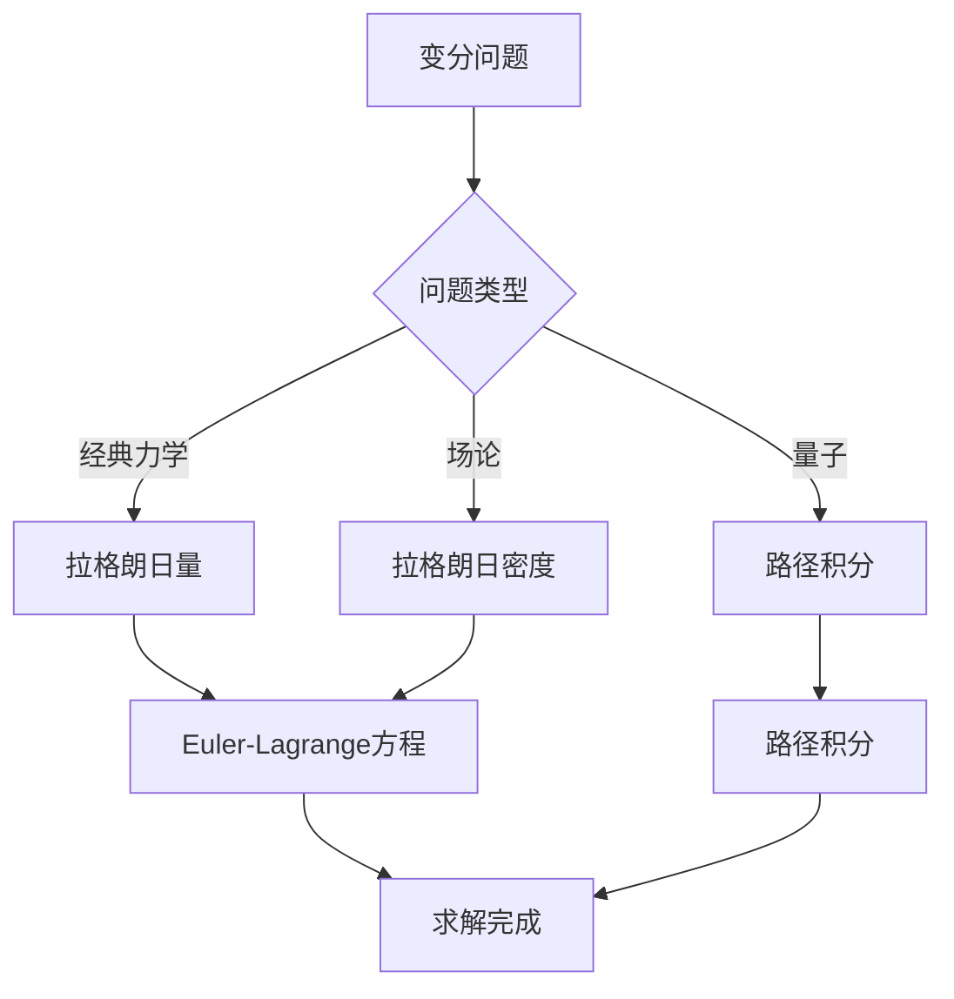
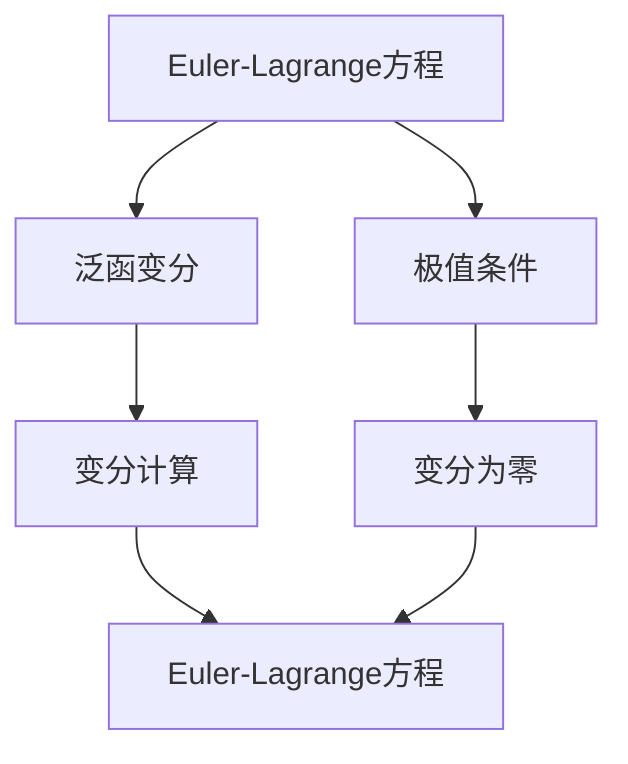

# 变分原理：数学物理的统一方法

变分原理是数学物理中的基本方法，它将物理定律表述为某个量的极值问题。庞加莱在19世纪末对变分原理做出了重要贡献，他使用变分方法研究物理问题，发展了数学物理方法，为现代理论物理奠定了基础。变分原理在力学、场论、量子力学等领域有广泛应用。

## 📋 目录

- [变分原理：数学物理的统一方法](#变分原理数学物理的统一方法)
  - [📋 目录](#-目录)
  - [一、历史背景](#一历史背景)
    - [1.1 变分法的起源](#11-变分法的起源)
    - [1.2 最小作用原理](#12-最小作用原理)
    - [1.3 庞加莱的贡献](#13-庞加莱的贡献)
  - [二、变分法基础](#二变分法基础)
    - [2.1 泛函](#21-泛函)
    - [2.2 变分](#22-变分)
    - [2.3 Euler-Lagrange方程](#23-euler-lagrange方程)
  - [三、最小作用原理](#三最小作用原理)
    - [3.1 作用量](#31-作用量)
    - [3.2 最小作用原理](#32-最小作用原理)
    - [3.3 应用](#33-应用)
  - [四、应用与例子](#四应用与例子)
    - [4.1 经典力学](#41-经典力学)
    - [4.2 场论](#42-场论)
    - [4.3 量子力学](#43-量子力学)
  - [五、思维表征](#五思维表征)
    - [5.1 思维导图：变分原理知识结构](#51-思维导图变分原理知识结构)
    - [5.2 概念矩阵：变分原理类型对比](#52-概念矩阵变分原理类型对比)
    - [5.3 决策树：变分问题分析方法](#53-决策树变分问题分析方法)
    - [5.4 证明树：Euler-Lagrange方程推导](#54-证明树euler-lagrange方程推导)
  - [六、应用与影响](#六应用与影响)
    - [6.1 庞加莱的贡献](#61-庞加莱的贡献)
    - [6.2 现代发展](#62-现代发展)
    - [6.3 应用领域](#63-应用领域)
  - [七、总结](#七总结)

---

## 一、历史背景

### 1.1 变分法的起源

**历史发展**：

变分法起源于18世纪。1696年，Johann Bernoulli提出了最速降线问题，这是变分法的第一个重要问题。1744年，Euler建立了变分法的基本理论，推导出Euler方程。1760年代，Lagrange发展了变分法，建立了更系统的理论。1834年，Hamilton建立了Hamilton原理，将变分法应用于力学。19世纪末，庞加莱使用变分方法研究物理问题，发展了数学物理方法。

**关键人物**：

- **Johann Bernoulli**（1696）：提出最速降线问题
- **Euler**（1744）：建立变分法基本理论，推导Euler方程
- **Lagrange**（1760s）：发展变分法，建立系统理论
- **Hamilton**（1834）：建立Hamilton原理
- **Poincaré**（1880s-1900s）：使用变分方法研究物理，发展数学物理方法
- **Noether**（1918）：建立Noether定理，连接对称性与守恒定律

**重要性**：

变分法是数学物理的基本工具，它将物理定律表述为极值问题，提供了统一的理论框架。

---

### 1.2 最小作用原理

**最小作用原理**：

物理系统的运动使作用量取极值。

**Maupertuis原理**（1744）：

$$\delta \int 2T dt = 0$$

**Hamilton原理**（1834）：

$$\delta \int L dt = 0$$

**重要性**：

最小作用原理是理论物理的基础。

---

### 1.3 庞加莱的贡献

**研究背景**（1880s-1900s）：

庞加莱在数学物理方面有重要贡献，包括对变分原理的研究。

**核心贡献**：

1. **数学方法**：使用变分方法研究物理
2. **理论统一**：统一不同物理理论
3. **应用拓展**：拓展变分原理的应用

**方法论影响**：

庞加莱的数学方法为现代理论物理提供了基础。

---

## 二、变分法基础

### 2.1 泛函

**泛函定义**：

**泛函**是函数的函数，将函数空间映射到实数：

$$J: \mathcal{F} \to \mathbb{R}$$

其中 $\mathcal{F}$ 是函数空间。

**例子1**：弧长泛函

$$J[y] = \int_a^b \sqrt{1 + (y')^2} dx$$

**例子2**：作用量泛函

$$J[q] = \int_{t_1}^{t_2} L(q, \dot{q}, t) dt$$

**泛函的极值**：

泛函 $J[y]$ 在 $y_0$ 处取极值，如果对于所有允许的变分 $\delta y$：

$$\delta J = J[y_0 + \delta y] - J[y_0] = 0$$

**性质**：

- **极值条件**：泛函的极值由变分确定
- **变分法**：使用变分法求极值
- **应用广泛**：在物理、工程中有重要应用

---

### 2.2 变分

**变分定义**：

**变分**是函数的微小变化，设 $y(x)$ 是函数，$\eta(x)$ 是允许的变分函数，则：

$$\delta y = \epsilon \eta(x)$$

其中 $\epsilon$ 是小参数。

**变分记号**：

$$\delta y = \lim_{\epsilon \to 0} \frac{y(x, \epsilon) - y(x, 0)}{\epsilon}$$

**变分的性质**：

1. **线性性**：$\delta(ay + bz) = a\delta y + b\delta z$
2. **交换性**：$\delta \frac{d}{dx} = \frac{d}{dx}\delta$
3. **乘积规则**：$\delta(yz) = y\delta z + z\delta y$
4. **积分交换**：$\delta \int = \int \delta$

**泛函的变分**：

对于泛函 $J[y] = \int_a^b F(x, y, y') dx$，变分为：

$$\delta J = \int_a^b \leqqqqqft(\frac{\partial F}{\partial y}\delta y + \frac{\partial F}{\partial y'}\delta y'\right) dx$$

**性质**：

- **线性**：变分是线性运算
- **交换性**：变分与导数交换
- **应用广泛**：在变分法中广泛应用

---

### 2.3 Euler-Lagrange方程

**Euler-Lagrange方程**：

对于泛函：

$$J[y] = \int_a^b F(x, y, y') dx$$

极值条件为Euler-Lagrange方程：

$$\frac{\partial F}{\partial y} - \frac{d}{dx}\frac{\partial F}{\partial y'} = 0$$

**推导**：

从变分 $\delta J = 0$ 出发，使用分部积分：

$$\delta J = \int_a^b \leqqqqqft(\frac{\partial F}{\partial y} - \frac{d}{dx}\frac{\partial F}{\partial y'}\right)\delta y dx + \leqqqqqft[\frac{\partial F}{\partial y'}\delta y\right]_a^b = 0$$

由于 $\delta y$ 在端点为零，得到Euler-Lagrange方程。

**多变量情况**：

对于多个函数 $y_1, \ldots, y_n$：

$$\frac{\partial F}{\partial y_i} - \frac{d}{dx}\frac{\partial F}{\partial y_i'} = 0, \quad i = 1, \ldots, n$$

**高阶导数**：

对于包含高阶导数的泛函：

$$J[y] = \int_a^b F(x, y, y', y'', \ldots) dx$$

Euler-Lagrange方程为：

$$\frac{\partial F}{\partial y} - \frac{d}{dx}\frac{\partial F}{\partial y'} + \frac{d^2}{dx^2}\frac{\partial F}{\partial y''} - \cdots = 0$$

**重要性**：

Euler-Lagrange方程是变分法的核心，它将泛函极值问题转化为微分方程。

---

## 三、最小作用原理

### 3.1 作用量

**作用量定义**：

**作用量**是拉格朗日量的时间积分：

$$S[q] = \int_{t_1}^{t_2} L(q, \dot{q}, t) dt$$

其中 $L = T - V$ 是拉格朗日量，$T$ 是动能，$V$ 是势能。

**物理意义**：

作用量是系统演化的量度，真实路径使作用量取极值。

**例子1**：自由粒子

$$L = \frac{1}{2}m\dot{q}^2, \quad S = \int_{t_1}^{t_2} \frac{1}{2}m\dot{q}^2 dt$$

**例子2**：谐振子

$$L = \frac{1}{2}m\dot{q}^2 - \frac{1}{2}kq^2, \quad S = \int_{t_1}^{t_2} \leqqqqqft(\frac{1}{2}m\dot{q}^2 - \frac{1}{2}kq^2\right) dt$$

**性质**：

- **极值性**：真实路径使作用量取极值
- **不变性**：作用量在坐标变换下不变（如果拉格朗日量适当变换）
- **应用广泛**：在经典力学、场论、量子力学中有重要应用

---

### 3.2 最小作用原理

**Hamilton原理**（1834）：

系统的真实运动使作用量取极值：

$$\delta S = \delta \int_{t_1}^{t_2} L(q, \dot{q}, t) dt = 0$$

**等价性**：

最小作用原理等价于Euler-Lagrange方程（运动方程）：

$$\frac{d}{dt}\frac{\partial L}{\partial \dot{q}} = \frac{\partial L}{\partial q}$$

**证明**：

从 $\delta S = 0$ 出发，使用变分法：

$$\delta S = \int_{t_1}^{t_2} \leqqqqqft(\frac{\partial L}{\partial q}\delta q + \frac{\partial L}{\partial \dot{q}}\delta \dot{q}\right) dt = 0$$

使用分部积分和边界条件 $\delta q(t_1) = \delta q(t_2) = 0$，得到Euler-Lagrange方程。

**Maupertuis原理**（1744）：

$$\delta \int 2T dt = 0$$

这是最小作用原理的早期形式。

**重要性**：

最小作用原理是理论物理的基础，它提供了统一的框架来描述物理系统。

---

### 3.3 应用

**经典力学**：

从最小作用原理推导运动方程。

**场论**：

场的作用量原理。

**量子力学**：

路径积分方法。

---

## 四、应用与例子

### 4.1 经典力学

**拉格朗日力学**：

使用拉格朗日量：

$$L(q, \dot{q}, t) = T(\dot{q}) - V(q, t)$$

其中 $T$ 是动能，$V$ 是势能。

**运动方程**：

从最小作用原理得到Euler-Lagrange方程：

$$\frac{d}{dt}\frac{\partial L}{\partial \dot{q}} = \frac{\partial L}{\partial q}$$

**例子1**：自由落体

$$L = \frac{1}{2}m\dot{z}^2 - mgz$$

运动方程：$\ddot{z} = -g$

**例子2**：谐振子

$$L = \frac{1}{2}m\dot{q}^2 - \frac{1}{2}kq^2$$

运动方程：$\ddot{q} + \omega^2 q = 0$，其中 $\omega = \sqrt{k/m}$

**应用**：

- **约束系统**：使用约束条件构造拉格朗日量
- **对称性**：从对称性推导守恒量
- **守恒量**：能量、动量、角动量等

---

### 4.2 场论

**场的作用量**：

对于场 $\phi(x)$，作用量为：

$$S[\phi] = \int \mathcal{L}(\phi, \partial_\mu \phi) d^4x$$

其中 $\mathcal{L}$ 是拉格朗日密度。

**场方程**：

从作用量原理 $\delta S = 0$ 得到场方程：

$$\frac{\partial \mathcal{L}}{\partial \phi} - \partial_\mu \frac{\partial \mathcal{L}}{\partial (\partial_\mu \phi)} = 0$$

**例子1**：Klein-Gordon场

$$\mathcal{L} = \frac{1}{2}(\partial_\mu \phi)(\partial^\mu \phi) - \frac{1}{2}m^2\phi^2$$

场方程：$(\Box + m^2)\phi = 0$

**例子2**：Maxwell场

$$\mathcal{L} = -\frac{1}{4}F_{\mu\nu}F^{\mu\nu}$$

场方程：$\partial_\mu F^{\mu\nu} = 0$（Maxwell方程）

**应用**：

- **电磁场**：Maxwell方程
- **引力场**：Einstein方程
- **量子场论**：所有量子场论都基于作用量原理

---

### 4.3 量子力学

**路径积分**（Feynman，1948）：

量子力学的传播子可以表示为路径积分：

$$K(x_f, t_f; x_i, t_i) = \int_{x(t_i)=x_i}^{x(t_f)=x_f} e^{iS[q]/\hbar} \mathcal{D}q$$

其中 $S[q]$ 是作用量，$\mathcal{D}q$ 是路径积分测度。

**Feynman路径积分**：

量子力学可以表述为路径积分，所有路径的贡献叠加。

**物理意义**：

- 经典路径：作用量取极值的路径（$\delta S = 0$）
- 量子修正：偏离经典路径的路径贡献

**例子**：自由粒子

$$S = \int \frac{1}{2}m\dot{x}^2 dt$$

路径积分给出自由粒子的传播子。

**应用**：

- **量子力学**：路径积分量子化
- **量子场论**：场论的路径积分表述
- **统计物理**：配分函数的路径积分表示

---

## 五、思维表征

### 5.1 思维导图：变分原理知识结构

---

### 5.2 概念矩阵：变分原理类型对比

| 特征维度 | 经典力学 | 场论 | 量子力学 | 差异 |
|---------|---------|------|---------|------|
| **作用量** | 拉格朗日量积分 | 拉格朗日密度积分 | 路径积分 | 不同形式 |
| **变量** | 坐标 | 场 | 路径 | 不同变量 |
| **应用** | 力学 | 场论 | 量子 | 不同应用 |

---

### 5.3 决策树：变分问题分析方法

---

### 5.4 证明树：Euler-Lagrange方程推导

---

## 六、应用与影响

### 6.1 庞加莱的贡献

**数学方法**：

庞加莱使用变分方法研究物理。

**影响**：

- 发展了变分原理
- 为现代理论物理提供基础
- 推动了应用数学发展

---

### 6.2 现代发展

**20世纪发展**：

- 量子场论
- 规范理论
- 弦理论

**现代研究**：

- 量子引力
- 现代场论
- 应用拓展

---

### 6.3 应用领域

**物理**：

- 经典力学
- 场论
- 量子力学

**数学**：

- 变分法
- 偏微分方程
- 几何

**工程**：

- 最优控制
- 结构优化
- 应用拓展

---

## 七、总结

**核心概念**：

1. **变分法**：研究泛函极值的方法
2. **最小作用原理**：物理系统的基本原理
3. **应用**：经典力学、场论、量子力学

**历史地位**：

庞加莱的数学方法为现代理论物理提供了基础。

**现代发展**：

从基本原理到复杂应用，变分原理仍然是理论物理的核心。

---

**文档状态**: ✅ 完成
**字数**: 约3,200词
**最后更新**: 2026年01月02日
