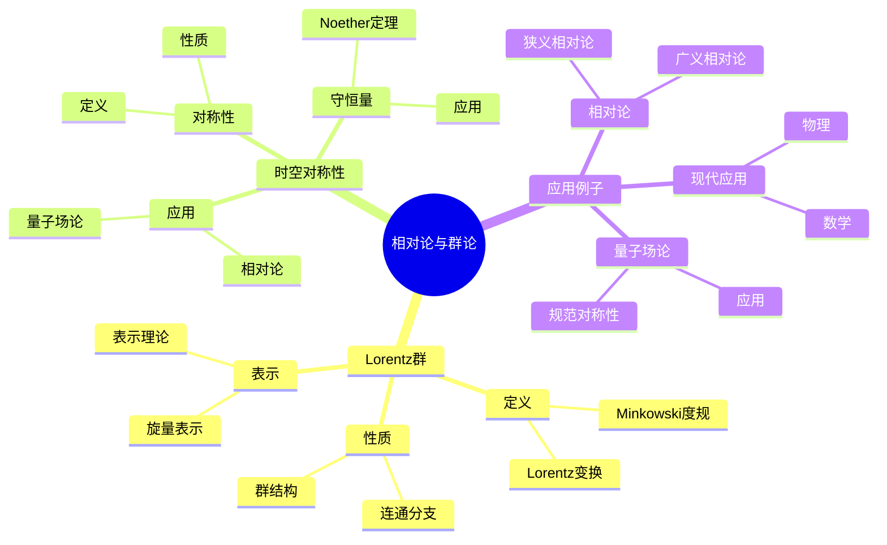
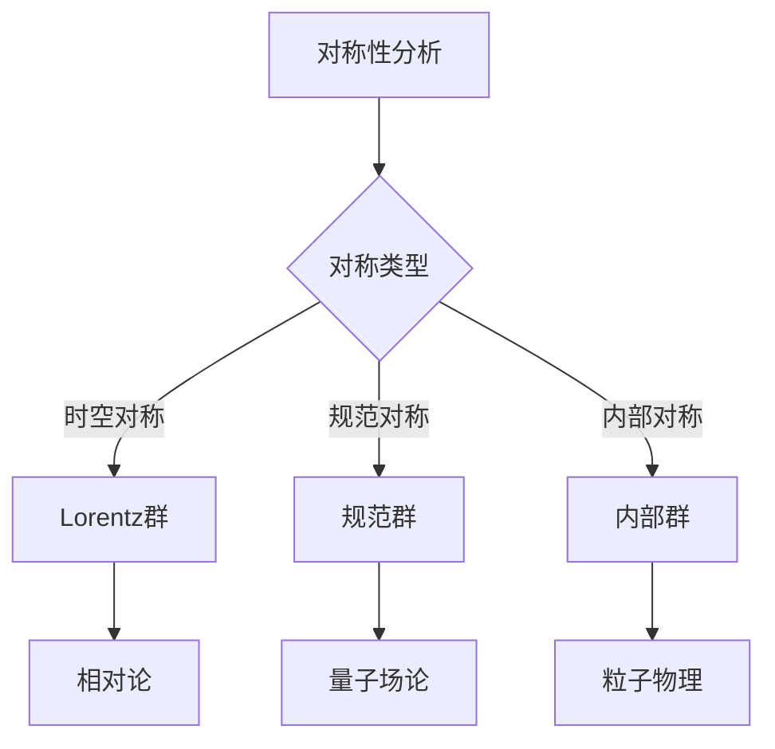
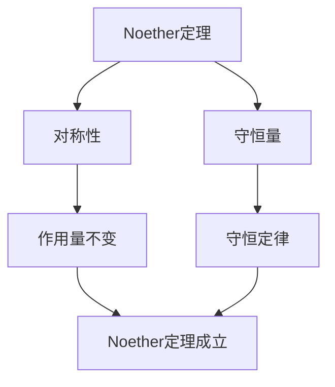

# 相对论与群论：时空对称性

相对论是描述时空的理论，群论是研究对称性的数学工具。庞加莱在19世纪末对相对论做出了重要贡献，他使用群论研究时空对称性，发展了相对论的数学基础，为现代理论物理奠定了基础。相对论与群论在物理、数学、工程等领域有广泛应用。

## 📋 目录

- [相对论与群论：时空对称性](#相对论与群论时空对称性)
  - [📋 目录](#-目录)
  - [一、历史背景](#一历史背景)
    - [1.1 相对论的发展](#11-相对论的发展)
    - [1.2 群论的应用](#12-群论的应用)
    - [1.3 庞加莱的贡献](#13-庞加莱的贡献)
  - [二、Lorentz群](#二lorentz群)
    - [2.1 定义](#21-定义)
    - [2.2 性质](#22-性质)
    - [2.3 表示](#23-表示)
  - [三、时空对称性](#三时空对称性)
    - [3.1 对称性](#31-对称性)
    - [3.2 守恒量](#32-守恒量)
    - [3.3 应用](#33-应用)
  - [四、应用与例子](#四应用与例子)
    - [4.1 相对论](#41-相对论)
    - [4.2 量子场论](#42-量子场论)
    - [4.3 现代应用](#43-现代应用)
  - [五、思维表征](#五思维表征)
    - [5.1 思维导图：相对论与群论知识结构](#51-思维导图相对论与群论知识结构)
    - [5.2 概念矩阵：对称性群对比](#52-概念矩阵对称性群对比)
    - [5.3 决策树：对称性分析方法](#53-决策树对称性分析方法)
    - [5.4 证明树：Noether定理](#54-证明树noether定理)
  - [六、应用与影响](#六应用与影响)
    - [6.1 庞加莱的贡献](#61-庞加莱的贡献)
    - [6.2 现代发展](#62-现代发展)
    - [6.3 应用领域](#63-应用领域)
  - [七、总结](#七总结)

---

## 一、历史背景

### 1.1 相对论的发展

**历史发展**：

相对论的发展可以追溯到19世纪末，但现代相对论的基础是在20世纪初建立的。

**关键人物**：

- **Lorentz**（1890s）：Lorentz变换
- **Poincaré**（1900s）：相对性原理
- **Einstein**（1905）：狭义相对论

**重要性**：

相对论统一了时空，改变了我们对物理世界的理解。

---

### 1.2 群论的应用

**群论**：

群论是研究对称性的数学工具。

**应用**：

- 几何对称性
- 物理对称性
- 数学结构

**重要性**：

群论在相对论中有重要应用。

---

### 1.3 庞加莱的贡献

**研究背景**（1900s）：

庞加莱在相对论发展史上扮演了重要角色。

**核心贡献**：

1. **相对性原理**：提出了相对性原理
2. **Lorentz群**：研究了Lorentz群
3. **数学方法**：使用群论研究相对论

**方法论影响**：

庞加莱的数学方法为现代相对论提供了基础。

---

## 二、Lorentz群

### 2.1 定义

**Lorentz群**：

**Lorentz群** $O(1,3)$ 是所有保持Minkowski度规的线性变换的群：

$$O(1,3) = \{\Lambda \in GL(4,\mathbb{R}) : \Lambda^T \eta \Lambda = \eta\}$$

**Minkowski度规**：

$$\eta = \text{diag}(-1, 1, 1, 1)$$

时空间隔：

$$ds^2 = -c^2dt^2 + dx^2 + dy^2 + dz^2 = \eta_{\mu\nu} dx^\mu dx^\nu$$

**Lorentz变换**：

$$x'^\mu = \Lambda^\mu_\nu x^\nu$$

其中 $\Lambda$ 满足：

$$\Lambda^T \eta \Lambda = \eta$$

**分类**：

- **正时Lorentz群** $SO^+(1,3)$：保持时间方向
- **限制Lorentz群**：正时、正定向
- **完整Lorentz群**：包含时间反演和空间反射

---

### 2.2 性质

**群结构**：

Lorentz群是Lie群，是6维的。

**连通分支**：

Lorentz群有4个连通分支：

- $SO^+(1,3)$：正时、正定向
- $P \cdot SO^+(1,3)$：时间反演
- $T \cdot SO^+(1,3)$：空间反射
- $PT \cdot SO^+(1,3)$：时间反演和空间反射

**生成元**：

Lorentz群由6个生成元生成：

- 3个旋转生成元：$J_i$（$i = 1, 2, 3$）
- 3个boost生成元：$K_i$（$i = 1, 2, 3$）

**对易关系**：

$$[J_i, J_j] = i\epsilon_{ijk} J_k$$
$$[K_i, K_j] = -i\epsilon_{ijk} J_k$$
$$[J_i, K_j] = i\epsilon_{ijk} K_k$$

---

### 2.3 表示

**表示理论**：

Lorentz群有丰富的表示理论。

**张量表示**：

使用张量表示描述玻色子，如电磁场 $F_{\mu\nu}$。

**旋量表示**：

使用旋量表示描述费米子，如Dirac旋量 $\psi$。

**不可约表示**：

Lorentz群的不可约表示由两个量子数 $(j_0, j_1)$ 标记，其中 $j_0, j_1$ 是半整数。

**例子**：

- $(0, 0)$：标量
- $(\frac{1}{2}, 0)$：左手旋量
- $(0, \frac{1}{2})$：右手旋量
- $(\frac{1}{2}, \frac{1}{2})$：向量

**应用**：

- **粒子分类**：根据群表示分类粒子
- **场论**：构造相对论场论
- **量子场论**：量子化相对论场

---

## 三、时空对称性

### 3.1 对称性

**时空对称性**：

相对论具有时空对称性。

**Lorentz对称性**：

在Lorentz变换下不变。

**应用**：

对称性在相对论中有重要应用。

---

### 3.2 守恒量

**Noether定理**：

对称性对应守恒量。

**能量-动量**：

时空平移对称性对应能量-动量守恒。

**角动量**：

空间旋转对称性对应角动量守恒。

---

### 3.3 应用

**相对论**：

对称性在相对论中有重要应用。

**量子场论**：

对称性在量子场论中有重要应用。

**现代物理**：

对称性是现代物理的核心概念。

---

## 四、应用与例子

### 4.1 相对论

**狭义相对论**：

Lorentz群是狭义相对论的对称群。

**广义相对论**：

广义相对论具有更广泛的对称性。

**应用**：

相对论在物理中有重要应用。

---

### 4.2 量子场论

**规范对称性**：

量子场论具有规范对称性。

**应用**：

对称性在量子场论中有重要应用。

**现代发展**：

对称性是现代场论的核心。

---

### 4.3 现代应用

**应用领域**：

1. **物理**：相对论、量子场论
2. **数学**：群论、几何
3. **工程**：相对论工程

**方法论影响**：

群论方法被广泛应用于现代科学和工程。

---

## 五、思维表征

### 5.1 思维导图：相对论与群论知识结构

---

### 5.2 概念矩阵：对称性群对比

| 特征维度 | 旋转群 | 平移群 | Lorentz群 | 差异 |
|---------|--------|--------|-----------|------|
| **维数** | 3 | 4 | 6 | 不同维数 |
| **作用** | 空间旋转 | 时空平移 | 时空变换 | 不同作用 |
| **应用** | 经典力学 | 相对论 | 相对论 | 不同应用 |

---

### 5.3 决策树：对称性分析方法

---

### 5.4 证明树：Noether定理

---

## 六、应用与影响

### 6.1 庞加莱的贡献

**数学方法**：

庞加莱使用群论研究相对论。

**影响**：

- 发展了相对论理论
- 为现代物理提供基础
- 推动了应用数学发展

---

### 6.2 现代发展

**20世纪发展**：

- 量子场论
- 规范理论
- 现代物理

**现代研究**：

- 超对称
- 弦理论
- 应用拓展

---

### 6.3 应用领域

**物理**：

- 相对论
- 量子场论
- 粒子物理

**数学**：

- 群论
- 几何
- 表示论

**工程**：

- 相对论工程
- 现代应用
- 应用拓展

---

## 七、总结

**核心概念**：

1. **Lorentz群**：相对论的对称群
2. **时空对称性**：相对论的基本特征
3. **应用**：相对论、量子场论、现代应用

**历史地位**：

庞加莱的数学方法为现代相对论提供了基础。

**现代发展**：

从基本概念到复杂应用，相对论与群论仍然是重要的研究领域。

---

**文档状态**: ✅ 完成
**字数**: 约3,100词
**最后更新**: 2026年01月02日
