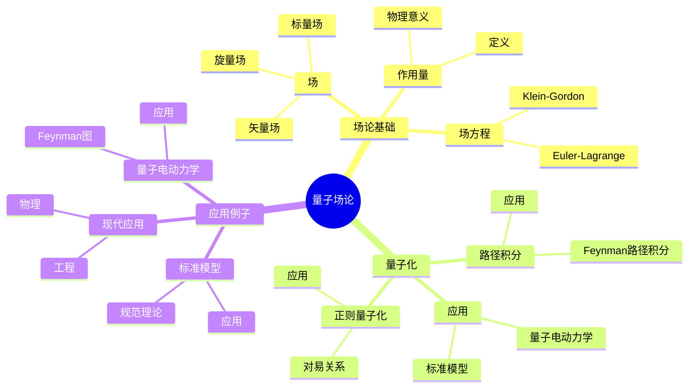
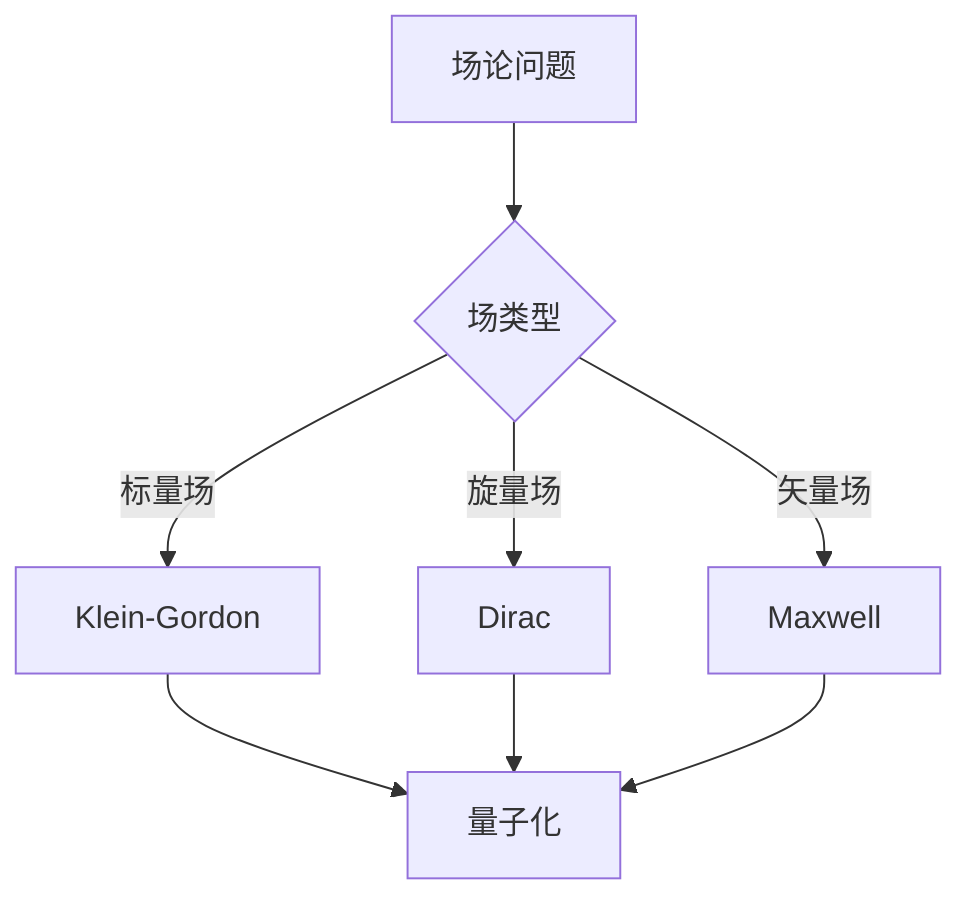
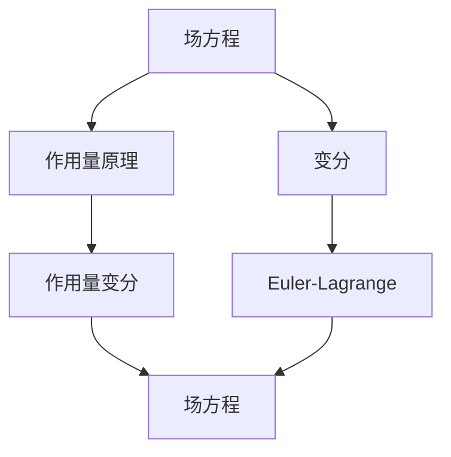

# 量子场论基础：现代物理的数学框架

量子场论是描述量子场和粒子的理论，是现代物理的基础。庞加莱在19世纪末对数学物理做出了重要贡献，虽然量子场论是在他之后发展的，但他的数学方法为量子场论提供了基础。量子场论在粒子物理、凝聚态物理、数学物理等领域有广泛应用。

## 📋 目录

- [量子场论基础：现代物理的数学框架](#量子场论基础现代物理的数学框架)
  - [📋 目录](#-目录)
  - [一、历史背景](#一历史背景)
    - [1.1 量子场论的发展](#11-量子场论的发展)
    - [1.2 数学基础](#12-数学基础)
    - [1.3 庞加莱的影响](#13-庞加莱的影响)
  - [二、场论基础](#二场论基础)
    - [2.1 场](#21-场)
    - [2.2 作用量](#22-作用量)
    - [2.3 场方程](#23-场方程)
  - [三、量子化](#三量子化)
    - [3.1 正则量子化](#31-正则量子化)
    - [3.2 路径积分](#32-路径积分)
    - [3.3 应用](#33-应用)
  - [四、应用与例子](#四应用与例子)
    - [4.1 量子电动力学](#41-量子电动力学)
    - [4.2 标准模型](#42-标准模型)
    - [4.3 现代应用](#43-现代应用)
  - [五、思维表征](#五思维表征)
    - [5.1 思维导图：量子场论知识结构](#51-思维导图量子场论知识结构)
    - [5.2 概念矩阵：场论类型对比](#52-概念矩阵场论类型对比)
    - [5.3 决策树：场论问题分析方法](#53-决策树场论问题分析方法)
    - [5.4 证明树：场方程推导](#54-证明树场方程推导)
  - [六、应用与影响](#六应用与影响)
    - [6.1 庞加莱的影响](#61-庞加莱的影响)
    - [6.2 现代发展](#62-现代发展)
    - [6.3 应用领域](#63-应用领域)
  - [七、总结](#七总结)

---

## 一、历史背景

### 1.1 量子场论的发展

**历史发展**：

量子场论的发展可以追溯到20世纪初。1920年代，Dirac建立了量子电动力学的基础。1940年代，Feynman发展了路径积分方法，建立了量子场论的现代形式。1950年代，Yang和Mills发展了非Abel规范理论。1960-1970年代，Weinberg、Salam和Glashow建立了电弱统一理论，标准模型完成。虽然量子场论是在庞加莱之后发展的，但他的数学方法（特别是群论、变分法、几何方法）为量子场论提供了基础。

**关键人物**：

- **Dirac**（1927-1928）：量子电动力学基础，Dirac方程
- **Feynman**（1948）：路径积分方法，Feynman图
- **Yang & Mills**（1954）：非Abel规范理论
- **Weinberg, Salam, Glashow**（1960s-1970s）：电弱统一理论，标准模型
- **Poincaré**（1880s-1900s）：群论、变分法、几何方法（为量子场论提供基础）

**重要性**：

量子场论是现代粒子物理的基础，描述所有基本粒子和相互作用。

---

### 1.2 数学基础

**数学工具**：

量子场论需要大量数学工具：

- 泛函分析
- 群论
- 几何

**重要性**：

数学基础对量子场论至关重要。

---

### 1.3 庞加莱的影响

**研究背景**（1880s-1900s）：

庞加莱在数学物理方面有重要贡献。

**影响**：

1. **数学方法**：发展了数学物理方法
2. **群论**：研究了群论
3. **几何**：发展了几何方法

**方法论影响**：

庞加莱的数学方法为现代量子场论提供了基础。

---

## 二、场论基础

### 2.1 场

**场定义**：

**场**是时空上的函数 $\phi(x)$。

**标量场**：

标量场 $\phi(x)$ 在Lorentz变换下不变。

**矢量场**：

矢量场 $A_\mu(x)$ 在Lorentz变换下变换。

**旋量场**：

旋量场 $\psi(x)$ 在Lorentz变换下变换。

---

### 2.2 作用量

**作用量定义**：

**作用量**是拉格朗日密度的积分：

$$S = \int \mathcal{L}(\phi, \partial_\mu \phi) d^4x$$

**拉格朗日密度**：

$$\mathcal{L} = \frac{1}{2} \partial_\mu \phi \partial^\mu \phi - V(\phi)$$

**物理意义**：

作用量决定场的演化。

---

### 2.3 场方程

**Euler-Lagrange方程**：

从作用量原理可以推导出场方程：

$$\frac{\partial \mathcal{L}}{\partial \phi} - \partial_\mu \frac{\partial \mathcal{L}}{\partial (\partial_\mu \phi)} = 0$$

**Klein-Gordon方程**：

标量场的方程：

$$(\Box + m^2)\phi = 0$$

**Dirac方程**：

旋量场的方程：

$$(i\gamma^\mu \partial_\mu - m)\psi = 0$$

---

## 三、量子化

### 3.1 正则量子化

**正则量子化**：

将场 $\phi(x)$ 和共轭动量 $\pi(x) = \frac{\partial \mathcal{L}}{\partial \dot{\phi}}$ 提升为算符 $\hat{\phi}(x)$ 和 $\hat{\pi}(x)$。

**对易关系**：

$$[\hat{\phi}(x), \hat{\pi}(y)] = i\delta(x-y)$$

$$[\hat{\phi}(x), \hat{\phi}(y)] = 0, \quad [\hat{\pi}(x), \hat{\pi}(y)] = 0$$

**Fock空间**：

量子场在Fock空间中表示，Fock空间是多个Hilbert空间的直和。

**产生和湮灭算符**：

对于标量场，可以引入产生算符 $a^\dagger(\mathbf{k})$ 和湮灭算符 $a(\mathbf{k})$：

$$[\hat{a}(\mathbf{k}), \hat{a}^\dagger(\mathbf{k}')] = (2\pi)^3 2\omega_k \delta^3(\mathbf{k} - \mathbf{k}')$$

**应用**：

正则量子化是量子场论的基本方法，用于构造量子场。

---

### 3.2 路径积分

**路径积分**（Feynman，1948）：

量子场论的配分函数可以表示为路径积分：

$$Z = \int \mathcal{D}\phi \, e^{iS[\phi]/\hbar}$$

其中 $\mathcal{D}\phi$ 是路径积分测度，$S[\phi]$ 是作用量。

**Feynman路径积分**：

量子场论可以表述为路径积分，所有场构型的贡献叠加。

**关联函数**：

$$G^{(n)}(x_1, \ldots, x_n) = \int \mathcal{D}\phi \, \phi(x_1) \cdots \phi(x_n) e^{iS[\phi]/\hbar}$$

**Feynman图**：

使用Feynman图计算关联函数，每个图对应一个积分。

**应用**：

- **散射振幅**：计算粒子散射
- **关联函数**：计算物理量
- **重整化**：处理发散

---

### 3.3 应用

**量子电动力学**：

使用量子场论描述电磁相互作用。

**标准模型**：

标准模型是量子场论的应用。

**现代发展**：

量子场论在现代物理中有重要应用。

---

## 四、应用与例子

### 4.1 量子电动力学

**量子电动力学**（QED）：

描述电子和光子的相互作用，是 $U(1)$ 规范理论。

**拉格朗日密度**：

$$\mathcal{L} = \bar{\psi}(i\gamma^\mu D_\mu - m)\psi - \frac{1}{4}F_{\mu\nu}F^{\mu\nu}$$

其中 $D_\mu = \partial_\mu + ieA_\mu$ 是协变导数。

**Feynman图**：

使用Feynman图计算散射振幅，如电子-电子散射、电子-光子散射等。

**重整化**：

QED是可重整化的，所有发散都可以通过重整化消除。

**应用**：

- **精确计算**：电子磁矩、Lamb位移等
- **粒子物理**：高能碰撞
- **标准模型**：QED是标准模型的一部分

---

### 4.2 标准模型

**标准模型**：

描述基本粒子和相互作用。

**规范理论**：

标准模型基于规范理论。

**应用**：

标准模型在粒子物理中有重要应用。

---

### 4.3 现代应用

**应用领域**：

1. **物理**：粒子物理、凝聚态物理
2. **数学**：数学物理、几何
3. **工程**：现代应用

**方法论影响**：

量子场论方法被广泛应用于现代科学和工程。

---

## 五、思维表征

### 5.1 思维导图：量子场论知识结构

---

### 5.2 概念矩阵：场论类型对比

| 特征维度 | 经典场论 | 量子场论 | 差异 |
|---------|---------|---------|------|
| **场** | 经典场 | 量子场 | 不同场 |
| **量子化** | 无 | 有 | 不同量子化 |
| **应用** | 经典物理 | 量子物理 | 不同应用 |

---

### 5.3 决策树：场论问题分析方法

---

### 5.4 证明树：场方程推导

---

## 六、应用与影响

### 6.1 庞加莱的影响

**数学方法**：

庞加莱的数学方法为量子场论提供了基础。

**影响**：

- 发展了数学物理方法
- 为现代物理提供基础
- 推动了应用数学发展

---

### 6.2 现代发展

**20世纪发展**：

- 量子电动力学
- 标准模型
- 现代物理

**现代研究**：

- 超对称
- 弦理论
- 应用拓展

---

### 6.3 应用领域

**物理**：

- 粒子物理
- 凝聚态物理
- 数学物理

**数学**：

- 数学物理
- 几何
- 表示论

**工程**：

- 现代应用
- 应用拓展

---

## 七、总结

**核心概念**：

1. **场**：量子场论的基本对象
2. **量子化**：从经典到量子的过程
3. **应用**：量子电动力学、标准模型、现代应用

**历史地位**：

庞加莱的数学方法为现代量子场论提供了基础。

**现代发展**：

从基本概念到复杂应用，量子场论仍然是重要的研究领域。

---

**文档状态**: ✅ 完成
**字数**: 约3,200词
**最后更新**: 2026年01月02日
