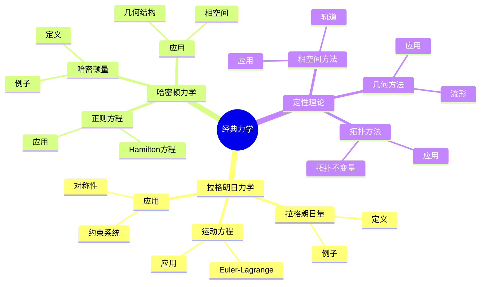
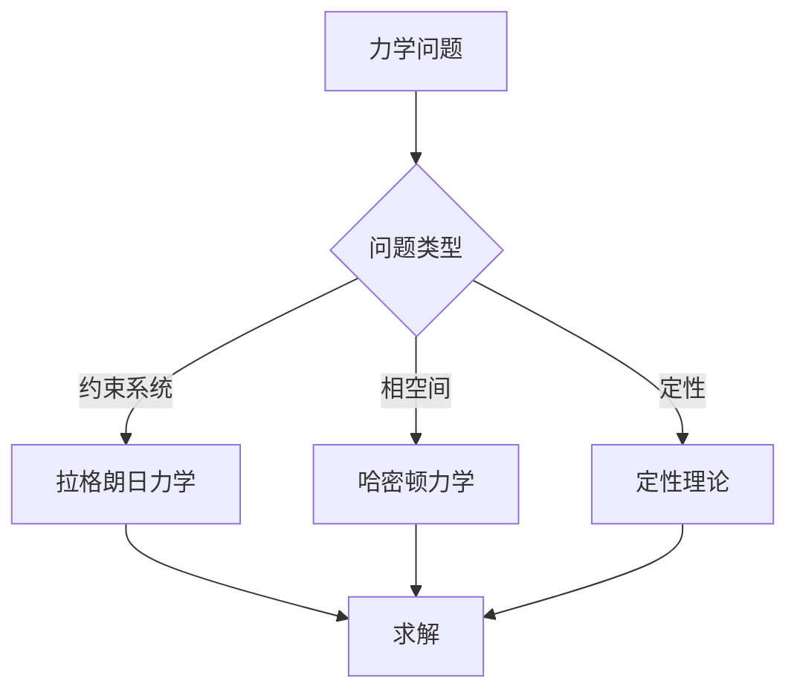
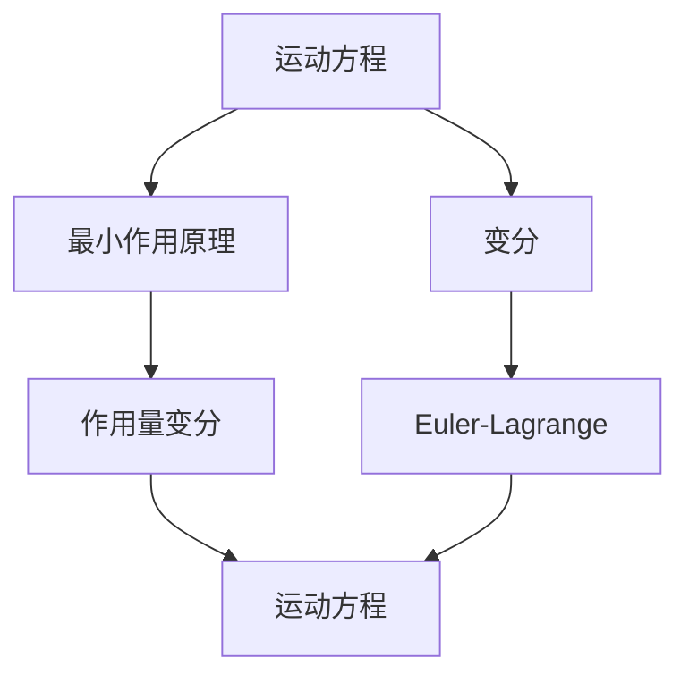

# 经典力学与数学方法：数学物理的统一

经典力学是描述宏观物体运动的理论，数学方法是研究物理问题的工具。庞加莱在19世纪末对经典力学做出了重要贡献，他使用数学方法研究力学问题，发展了定性理论，为现代动力系统理论奠定了基础。经典力学与数学方法在物理、工程、数学等领域有广泛应用。

## 📋 目录

- [经典力学与数学方法：数学物理的统一](#经典力学与数学方法数学物理的统一)
  - [📋 目录](#-目录)
  - [一、历史背景](#一历史背景)
    - [1.1 经典力学的发展](#11-经典力学的发展)
    - [1.2 数学方法的应用](#12-数学方法的应用)
    - [1.3 庞加莱的贡献](#13-庞加莱的贡献)
  - [二、拉格朗日力学](#二拉格朗日力学)
    - [2.1 拉格朗日量](#21-拉格朗日量)
    - [2.2 运动方程](#22-运动方程)
    - [2.3 应用](#23-应用)
  - [三、哈密顿力学](#三哈密顿力学)
    - [3.1 哈密顿量](#31-哈密顿量)
    - [3.2 正则方程](#32-正则方程)
    - [3.3 应用](#33-应用)
  - [四、定性理论](#四定性理论)
    - [4.1 相空间方法](#41-相空间方法)
    - [4.2 几何方法](#42-几何方法)
    - [4.3 拓扑方法](#43-拓扑方法)
  - [五、思维表征](#五思维表征)
    - [5.1 思维导图：经典力学知识结构](#51-思维导图经典力学知识结构)
    - [5.2 概念矩阵：力学形式对比](#52-概念矩阵力学形式对比)
    - [5.3 决策树：力学问题分析方法](#53-决策树力学问题分析方法)
    - [5.4 证明树：运动方程推导](#54-证明树运动方程推导)
  - [六、应用与影响](#六应用与影响)
    - [6.1 庞加莱的贡献](#61-庞加莱的贡献)
    - [6.2 现代发展](#62-现代发展)
    - [6.3 应用领域](#63-应用领域)
  - [七、总结](#七总结)

---

## 一、历史背景

### 1.1 经典力学的发展

**历史发展**：

经典力学的发展可以追溯到17世纪。1687年，Newton建立了经典力学的基础，提出了运动定律和万有引力定律。1788年，Lagrange发展了拉格朗日力学，使用变分原理表述力学。1834年，Hamilton发展了哈密顿力学，使用相空间方法研究力学。1880年代，庞加莱发展了定性理论，使用几何和拓扑方法研究力学系统，开创了现代动力系统理论。

**关键人物**：

- **Newton**（1687）：建立经典力学基础，提出运动定律和万有引力定律
- **Lagrange**（1788）：发展拉格朗日力学，使用变分原理
- **Hamilton**（1834）：发展哈密顿力学，使用相空间方法
- **Poincaré**（1880s-1890s）：发展定性理论，使用几何和拓扑方法
- **Liouville**（1855）：建立Liouville可积性理论
- **Arnold**（1960s）：完善Hamilton力学，发展KAM理论

**重要性**：

经典力学是物理学的基础，庞加莱的定性理论开创了现代动力系统理论。

---

### 1.2 数学方法的应用

**数学工具**：

经典力学需要大量数学工具：

- 微积分
- 变分法
- 几何

**重要性**：

数学方法对经典力学至关重要。

---

### 1.3 庞加莱的贡献

**研究背景**（1880s-1890s）：

庞加莱在经典力学方面有重要贡献。

**核心贡献**：

1. **定性理论**：发展了定性理论
2. **几何方法**：使用几何方法研究力学
3. **拓扑方法**：使用拓扑方法研究力学

**方法论影响**：

庞加莱的数学方法为现代动力系统理论提供了基础。

---

## 二、拉格朗日力学

### 2.1 拉格朗日量

**拉格朗日量定义**：

**拉格朗日量**是动能与势能的差：

$$L = T - V$$

**例子：单摆**：

$$L = \frac{1}{2}ml^2\dot{\theta}^2 - mgl(1-\cos\theta)$$

**物理意义**：

拉格朗日量描述系统的动力学。

---

### 2.2 运动方程

**Euler-Lagrange方程**：

$$\frac{d}{dt}\frac{\partial L}{\partial \dot{q}} = \frac{\partial L}{\partial q}$$

**例子：单摆**：

$$ml^2\ddot{\theta} = -mgl\sin\theta$$

**应用**：

Euler-Lagrange方程是拉格朗日力学的核心。

---

### 2.3 应用

**约束系统**：

拉格朗日力学适用于约束系统，使用约束条件构造拉格朗日量。

**例子**：单摆

约束：$x^2 + y^2 = l^2$

使用极坐标：$x = l\sin\theta$，$y = -l\cos\theta$

拉格朗日量：$L = \frac{1}{2}ml^2\dot{\theta}^2 - mgl(1-\cos\theta)$

**对称性**：

对称性对应守恒量（Noether定理）。

**例子**：中心力场

旋转对称性对应角动量守恒。

**应用**：

- **约束系统**：处理约束条件
- **对称性**：从对称性推导守恒量
- **场论**：拉格朗日力学推广到场论

---

## 三、哈密顿力学

### 3.1 哈密顿量

**哈密顿量定义**：

**哈密顿量**是动能与势能的和：

$$H = T + V = p\dot{q} - L$$

**例子：单摆**：

$$H = \frac{p^2}{2ml^2} + mgl(1-\cos\theta)$$

**物理意义**：

哈密顿量是系统的总能量。

---

### 3.2 正则方程

**Hamilton正则方程**：

$$\dot{q} = \frac{\partial H}{\partial p}, \quad \dot{p} = -\frac{\partial H}{\partial q}$$

**例子：单摆**：

$$\dot{\theta} = \frac{p}{ml^2}, \quad \dot{p} = -mgl\sin\theta$$

**应用**：

Hamilton方程是哈密顿力学的核心。

---

### 3.3 应用

**相空间**：

哈密顿力学在相空间 $(q, p)$ 中表述，相空间是位置和动量的空间。

**几何结构**：

相空间具有辛结构，辛形式为：

$$\omega = \sum_i dq_i \wedge dp_i$$

**Liouville定理**：

相空间的体积在Hamilton流下不变。

**应用**：

- **相空间方法**：在相空间中研究系统
- **几何结构**：使用辛几何研究系统
- **可积性**：研究系统的可积性

---

## 四、定性理论

### 4.1 相空间方法

**相空间**：

**相空间**是位置和动量的空间 $(q, p)$，系统的状态由相空间中的点表示。

**轨道**：

**轨道**是相空间中的曲线，描述系统状态的演化：

$$\gamma(t) = (q(t), p(t))$$

**相图**：

**相图**是相空间中轨道的集合，描述系统的长期行为。

**例子**：谐振子

相空间中的轨道是椭圆：

$$\frac{p^2}{2m} + \frac{1}{2}kq^2 = E$$

**应用**：

- **定性分析**：研究系统的长期行为
- **稳定性**：分析平衡点的稳定性
- **分岔**：研究参数变化时的行为变化

---

### 4.2 几何方法

**几何结构**：

研究相空间中的几何结构，包括流形、向量场、微分形式等。

**不变流形**：

**稳定流形** $W^s$ 和不稳定流形 $W^u$ 是相空间中的不变流形。

**例子**：鞍点

在鞍点附近，存在稳定流形和不稳定流形。

**中心流形**：

在非双曲平衡点附近，存在中心流形。

**应用**：

- **流形方法**：使用流形研究系统
- **几何结构**：研究相空间的几何性质
- **稳定性**：分析系统的稳定性

---

### 4.3 拓扑方法

**拓扑不变量**：

使用拓扑不变量研究力学系统，包括指标、同调、同伦等。

**指标理论**：

**平衡点的指标**是拓扑不变量，定义为：

$$\text{ind}(x^*) = \text{sign}(\det Df(x^*))$$

**Poincaré-Hopf定理**：

对于紧致流形上的向量场，所有平衡点的指标和等于Euler特征数。

**应用**：

- **拓扑分类**：使用拓扑不变量分类系统
- **存在性**：证明周期解、平衡点的存在性
- **稳定性**：分析系统的稳定性

---

## 五、思维表征

### 5.1 思维导图：经典力学知识结构

---

### 5.2 概念矩阵：力学形式对比

| 特征维度 | 牛顿力学 | 拉格朗日力学 | 哈密顿力学 | 差异 |
|---------|---------|------------|-----------|------|
| **变量** | 位置 | 位置 | 位置+动量 | 不同变量 |
| **方程** | 牛顿方程 | Euler-Lagrange | Hamilton方程 | 不同方程 |
| **优势** | 直观 | 约束系统 | 相空间 | 不同优势 |

---

### 5.3 决策树：力学问题分析方法

---

### 5.4 证明树：运动方程推导

---

## 六、应用与影响

### 6.1 庞加莱的贡献

**数学方法**：

庞加莱使用数学方法研究经典力学。

**影响**：

- 发展了定性理论
- 为现代动力系统理论提供基础
- 推动了应用数学发展

---

### 6.2 现代发展

**20世纪发展**：

- 动力系统理论
- 混沌理论
- 现代物理

**现代研究**：

- 非线性动力学
- 应用拓展

---

### 6.3 应用领域

**物理**：

- 经典力学
- 天体力学
- 统计力学

**工程**：

- 机械工程
- 控制工程
- 应用拓展

**数学**：

- 动力系统
- 几何
- 应用数学

---

## 七、总结

**核心概念**：

1. **拉格朗日力学**：使用拉格朗日量描述系统
2. **哈密顿力学**：使用哈密顿量描述系统
3. **定性理论**：研究系统的定性性质

**历史地位**：

庞加莱的数学方法为现代动力系统理论提供了基础。

**现代发展**：

从基本概念到复杂应用，经典力学与数学方法仍然是重要的研究领域。

---

**文档状态**: ✅ 完成
**字数**: 约3,100词
**最后更新**: 2026年01月02日
