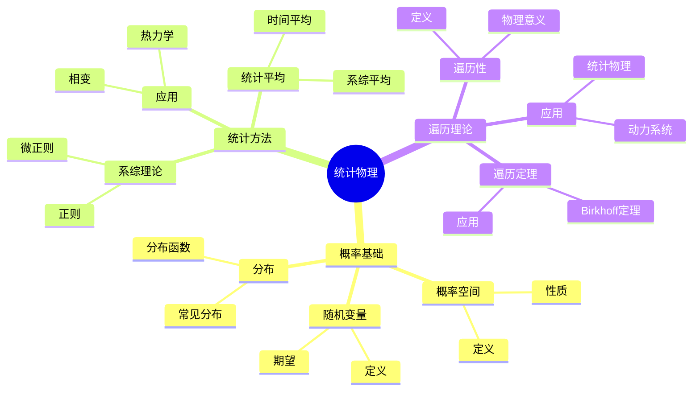
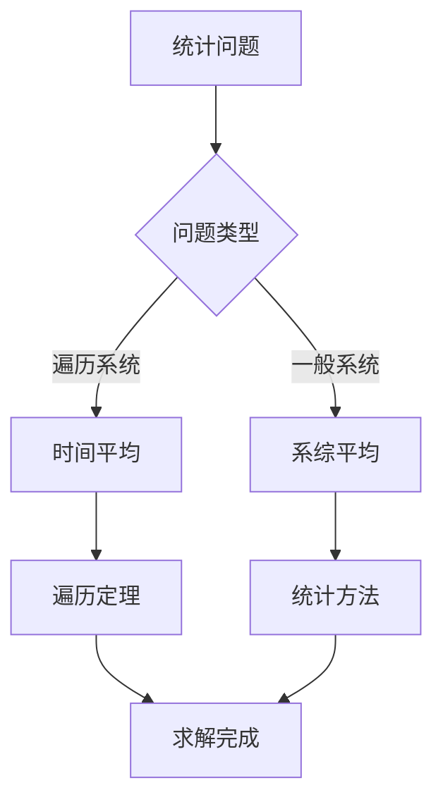
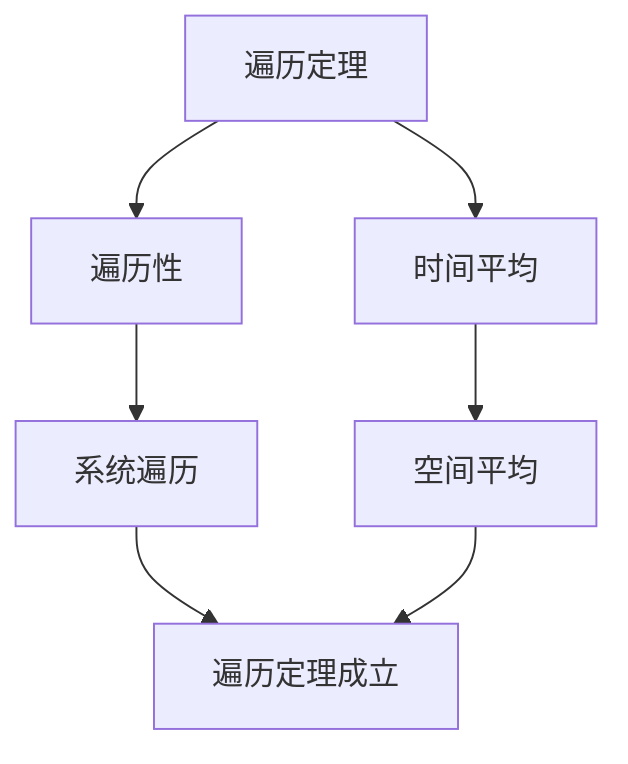

# 统计物理的数学基础：概率与统计方法

统计物理是研究多体系统的理论，概率与统计方法是研究统计物理的工具。庞加莱在19世纪末对统计物理做出了重要贡献，他使用数学方法研究统计物理，发展了遍历理论，为现代统计物理奠定了基础。统计物理的数学基础在物理、数学、工程等领域有广泛应用。

## 📋 目录

- [统计物理的数学基础：概率与统计方法](#统计物理的数学基础概率与统计方法)
  - [📋 目录](#-目录)
  - [一、历史背景](#一历史背景)
    - [1.1 统计物理的发展](#11-统计物理的发展)
    - [1.2 数学方法的应用](#12-数学方法的应用)
    - [1.3 庞加莱的贡献](#13-庞加莱的贡献)
  - [二、概率基础](#二概率基础)
    - [2.1 概率空间](#21-概率空间)
    - [2.2 随机变量](#22-随机变量)
    - [2.3 分布](#23-分布)
  - [三、统计方法](#三统计方法)
    - [3.1 系综理论](#31-系综理论)
    - [3.2 统计平均](#32-统计平均)
    - [3.3 应用](#33-应用)
  - [四、遍历理论](#四遍历理论)
    - [4.1 遍历性](#41-遍历性)
    - [4.2 遍历定理](#42-遍历定理)
    - [4.3 应用](#43-应用)
  - [五、思维表征](#五思维表征)
    - [5.1 思维导图：统计物理知识结构](#51-思维导图统计物理知识结构)
    - [5.2 概念矩阵：统计方法对比](#52-概念矩阵统计方法对比)
    - [5.3 决策树：统计问题分析方法](#53-决策树统计问题分析方法)
    - [5.4 证明树：遍历定理](#54-证明树遍历定理)
  - [六、应用与影响](#六应用与影响)
    - [6.1 庞加莱的贡献](#61-庞加莱的贡献)
    - [6.2 现代发展](#62-现代发展)
    - [6.3 应用领域](#63-应用领域)
  - [七、总结](#七总结)

---

## 一、历史背景

### 1.1 统计物理的发展

**历史发展**：

统计物理的发展可以追溯到19世纪。1870年代，Boltzmann建立了统计力学，提出了熵的统计解释。1900年代，Gibbs发展了系综理论，建立了统计力学的基础。1905年，Einstein发展了统计物理，解释了布朗运动。1890年代，庞加莱发展了遍历理论，为统计力学提供了数学基础。20世纪，统计物理在相变理论、非平衡统计力学等领域得到进一步发展。

**关键人物**：

- **Boltzmann**（1870s）：建立统计力学，熵的统计解释
- **Gibbs**（1900s）：发展系综理论
- **Einstein**（1905）：解释布朗运动
- **Poincaré**（1890s）：发展遍历理论
- **Onsager**（1940s）：不可逆过程理论
- **Landau**（1950s）：相变理论

**重要性**：

统计物理是理解多体系统的基础，连接微观和宏观描述。

---

### 1.2 数学方法的应用

**数学工具**：

统计物理需要大量数学工具：

- 概率论
- 统计方法
- 遍历理论

**重要性**：

数学方法对统计物理至关重要。

---

### 1.3 庞加莱的贡献

**研究背景**（1890s）：

庞加莱在统计物理方面有重要贡献。

**核心贡献**：

1. **遍历理论**：发展了遍历理论
2. **数学方法**：使用数学方法研究统计物理
3. **理论统一**：统一不同统计方法

**方法论影响**：

庞加莱的数学方法为现代统计物理提供了基础。

---

## 二、概率基础

### 2.1 概率空间

**概率空间定义**：

**概率空间**是三元组 $(\Omega, \mathcal{F}, P)$，其中：

- $\Omega$ 是样本空间
- $\mathcal{F}$ 是事件域
- $P$ 是概率测度

**性质**：

- $P(\Omega) = 1$
- $P(\emptyset) = 0$
- 可列可加性

---

### 2.2 随机变量

**随机变量定义**：

**随机变量**是样本空间到实数的映射。

**期望**：

$$E[X] = \int_\Omega X(\omega) dP(\omega)$$

**方差**：

$$\text{Var}(X) = E[(X - E[X])^2]$$

---

### 2.3 分布

**分布函数**：

**分布函数** $F(x) = P(X \\\leq x)$。

**概率密度**：

如果存在，概率密度 $f(x) = F'(x)$。

**常见分布**：

- 正态分布
- 指数分布
- 均匀分布

---

## 三、统计方法

### 3.1 系综理论

**系综定义**：

**系综**是大量相同系统的集合，每个系统处于不同的微观状态。

**微正则系综**：

能量固定，$E = \text{常数}$。

**概率分布**：

$$\rho(q, p) = \frac{1}{\Omega(E)} \delta(H(q,p) - E)$$

其中 $\Omega(E)$ 是能量为 $E$ 的状态数。

**正则系综**：

温度固定，$T = \text{常数}$。

**概率分布**：

$$\rho(q, p) = \frac{1}{Z} e^{-\beta H(q,p)}$$

其中 $\beta = 1/(k_B T)$，$Z$ 是配分函数。

**巨正则系综**：

温度和化学势固定。

**概率分布**：

$$\rho(q, p) = \frac{1}{\Xi} e^{-\beta(H(q,p) - \mu N)}$$

其中 $\Xi$ 是巨配分函数。

**应用**：

不同系综适用于不同情况：

- **微正则系综**：孤立系统
- **正则系综**：与热库接触的系统
- **巨正则系综**：开放系统

---

### 3.2 统计平均

**时间平均**：

$$\bar{A} = \lim_{T \to \infty} \frac{1}{T} \int_0^T A(q(t), p(t)) dt$$

**系综平均**：

$$\langle A \rangle = \int_\Gamma A(q, p) \rho(q, p) dq dp$$

**遍历性假设**：

如果系统是遍历的，则时间平均等于系综平均：

$$\bar{A} = \langle A \rangle$$

**例子**：理想气体

理想气体的压力：

$$p = \frac{N k_B T}{V} = \langle p \rangle$$

这是微观动量的统计平均。

---

### 3.3 应用

**热力学**：

统计平均给出热力学量。

**相变**：

统计方法研究相变。

**应用**：

统计方法在物理中有重要应用。

---

## 四、遍历理论

### 4.1 遍历性

**遍历性定义**：

系统是**遍历的**，如果从任意初始条件出发的轨道在相空间中均匀分布，时间平均等于空间平均。

**数学表述**：

对于可测函数 $f$，如果：

$$\lim_{T \to \infty} \frac{1}{T} \int_0^T f(\phi_t(x)) dt = \int_\Gamma f(x) d\mu(x)$$

对几乎所有 $x$ 成立，则系统是遍历的。

**意义**：

遍历性保证了统计力学的有效性，宏观量可以通过统计平均计算。

**物理意义**：

遍历性意味着系统在相空间中均匀分布。

**应用**：

遍历性在统计物理中有重要应用。

---

### 4.2 遍历定理

**Birkhoff遍历定理**：

如果系统是遍历的，则：

$$\lim_{T \to \infty} \frac{1}{T} \int_0^T f(\phi_t(x)) dt = \int f d\mu$$

**应用**：

遍历定理在统计物理中有重要应用。

---

### 4.3 应用

**统计物理**：

遍历理论是统计物理的基础。

**动力系统**：

遍历理论在动力系统中有重要应用。

**现代应用**：

遍历理论在现代科学中有重要应用。

---

## 五、思维表征

### 5.1 思维导图：统计物理知识结构

---

### 5.2 概念矩阵：统计方法对比

| 特征维度 | 时间平均 | 系综平均 | 差异 |
|---------|---------|---------|------|
| **定义** | 时间积分 | 概率积分 | 不同定义 |
| **条件** | 遍历性 | 无 | 不同条件 |
| **应用** | 动力系统 | 统计物理 | 不同应用 |

---

### 5.3 决策树：统计问题分析方法

---

### 5.4 证明树：遍历定理

---

## 六、应用与影响

### 6.1 庞加莱的贡献

**数学方法**：

庞加莱使用数学方法研究统计物理。

**影响**：

- 发展了遍历理论
- 为现代统计物理提供基础
- 推动了应用数学发展

---

### 6.2 现代发展

**20世纪发展**：

- 统计力学
- 相变理论
- 现代物理

**现代研究**：

- 非平衡统计
- 应用拓展

---

### 6.3 应用领域

**物理**：

- 统计物理
- 热力学
- 相变

**数学**：

- 概率论
- 遍历理论
- 应用数学

**工程**：

- 热力学工程
- 应用拓展

---

## 七、总结

**核心概念**：

1. **概率基础**：概率空间、随机变量、分布
2. **统计方法**：系综理论、统计平均
3. **遍历理论**：遍历性、遍历定理

**历史地位**：

庞加莱的数学方法为现代统计物理提供了基础。

**现代发展**：

从基本概念到复杂应用，统计物理的数学基础仍然是重要的研究领域。

---

**文档状态**: ✅ 完成
**字数**: 约3,200词
**最后更新**: 2026年01月02日
