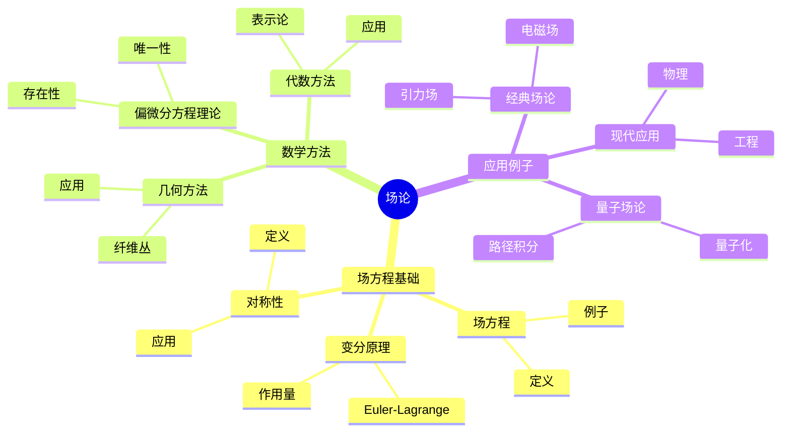
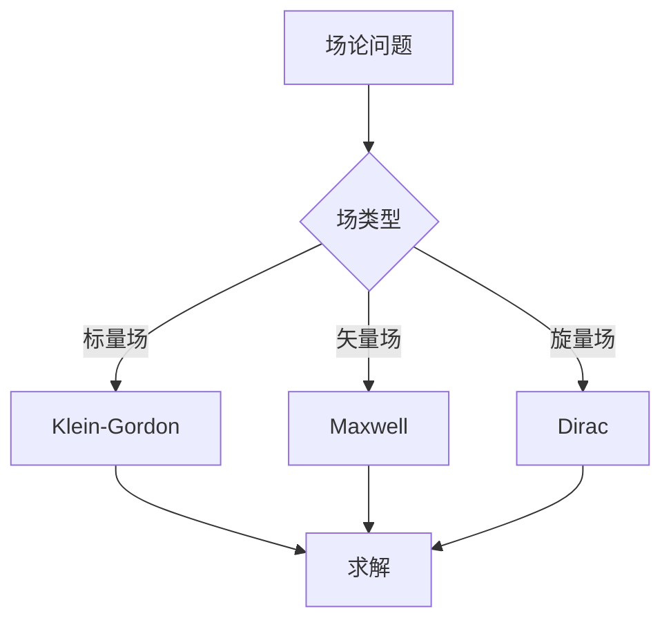
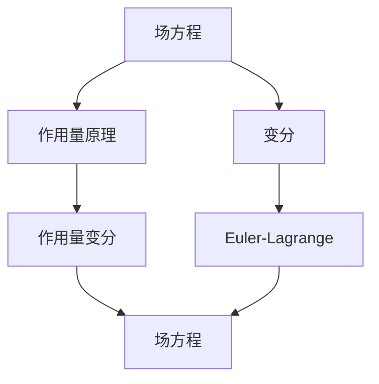

# 场论的数学基础：场方程的数学理论

场论是描述场和相互作用的理论，场方程是场论的基本方程。庞加莱在19世纪末对数学物理做出了重要贡献，虽然现代场论是在他之后发展的，但他的数学方法为场论提供了基础。场论的数学基础在物理、数学、工程等领域有广泛应用。

## 📋 目录

- [场论的数学基础：场方程的数学理论](#场论的数学基础场方程的数学理论)
  - [📋 目录](#-目录)
  - [一、历史背景](#一历史背景)
    - [1.1 场论的发展](#11-场论的发展)
    - [1.2 数学基础](#12-数学基础)
    - [1.3 庞加莱的影响](#13-庞加莱的影响)
  - [二、场方程基础](#二场方程基础)
    - [2.1 场方程](#21-场方程)
    - [2.2 变分原理](#22-变分原理)
    - [2.3 对称性](#23-对称性)
  - [三、数学方法](#三数学方法)
    - [3.1 偏微分方程理论](#31-偏微分方程理论)
    - [3.2 几何方法](#32-几何方法)
    - [3.3 代数方法](#33-代数方法)
  - [四、应用与例子](#四应用与例子)
    - [4.1 经典场论](#41-经典场论)
    - [4.2 量子场论](#42-量子场论)
    - [4.3 现代应用](#43-现代应用)
  - [五、思维表征](#五思维表征)
    - [5.1 思维导图：场论知识结构](#51-思维导图场论知识结构)
    - [5.2 概念矩阵：场论类型对比](#52-概念矩阵场论类型对比)
    - [5.3 决策树：场论问题分析方法](#53-决策树场论问题分析方法)
    - [5.4 证明树：场方程推导](#54-证明树场方程推导)
  - [六、应用与影响](#六应用与影响)
    - [6.1 庞加莱的影响](#61-庞加莱的影响)
    - [6.2 现代发展](#62-现代发展)
    - [6.3 应用领域](#63-应用领域)
  - [七、总结](#七总结)

---

## 一、历史背景

### 1.1 场论的发展

**历史发展**：

场论的发展可以追溯到19世纪。1860年代，Maxwell建立了电磁场理论，这是第一个成功的场论。1915年，Einstein建立了引力场理论（广义相对论）。1920年代，Dirac建立了量子场论的基础。1950年代，Yang和Mills发展了非Abel规范理论。1960-1970年代，Weinberg、Salam和Glashow建立了电弱统一理论，标准模型完成。

**关键人物**：

- **Maxwell**（1860s）：电磁场理论，Maxwell方程
- **Einstein**（1915）：引力场理论，Einstein方程
- **Dirac**（1928）：Dirac方程，量子场论基础
- **Yang & Mills**（1954）：非Abel规范理论
- **Weinberg, Salam, Glashow**（1960s-1970s）：电弱统一理论，标准模型

**重要性**：

场论是现代物理的基础，描述所有基本相互作用。

---

### 1.2 数学基础

**数学工具**：

场论需要大量数学工具：

- 偏微分方程
- 变分法
- 几何

**重要性**：

数学基础对场论至关重要。

---

### 1.3 庞加莱的影响

**研究背景**（1880s-1900s）：

庞加莱在数学物理方面有重要贡献。

**影响**：

1. **数学方法**：发展了数学物理方法
2. **变分法**：研究了变分法
3. **几何**：发展了几何方法

**方法论影响**：

庞加莱的数学方法为现代场论提供了基础。

---

## 二、场方程基础

### 2.1 场方程

**场方程定义**：

**场方程**是描述场演化的偏微分方程，通常从作用量原理推导。

**例子1：Klein-Gordon方程**：

标量场的场方程：

$$(\Box + m^2)\phi = 0$$

其中 $\Box = \partial_\mu \partial^\mu$ 是d'Alembert算子。

**例子2：Maxwell方程**：

电磁场的场方程：

$$\partial_\mu F^{\mu\nu} = J^\nu$$

其中 $F^{\mu\nu}$ 是电磁场张量，$J^\nu$ 是电流密度。

**例子3：Dirac方程**：

费米子的场方程：

$$(i\gamma^\mu \partial_\mu - m)\psi = 0$$

其中 $\gamma^\mu$ 是Dirac矩阵。

**物理意义**：

场方程描述场的动力学，是场论的基本方程。

---

### 2.2 变分原理

**作用量原理**：

场方程可以从作用量原理推导。

**作用量**：

$$S = \int \mathcal{L}(\phi, \partial_\mu \phi) d^4x$$

**Euler-Lagrange方程**：

$$\frac{\partial \mathcal{L}}{\partial \phi} - \partial_\mu \frac{\partial \mathcal{L}}{\partial (\partial_\mu \phi)} = 0$$

---

### 2.3 对称性

**对称性**：

场论具有多种对称性，包括时空对称性和内部对称性。

**时空对称性**：

- **Lorentz对称性**：在Lorentz变换下不变
- **平移对称性**：在时空平移下不变
- **旋转对称性**：在空间旋转下不变

**规范对称性**：

**规范对称性**是局域对称性，规范场论具有规范对称性。

**例子**：$U(1)$ 规范对称性

电磁场具有 $U(1)$ 规范对称性：

$$A_\mu \to A_\mu + \partial_\mu \Lambda$$

**应用**：

- **Noether定理**：从对称性推导守恒量
- **规范理论**：构造规范场论
- **标准模型**：所有相互作用都是规范理论

---

## 三、数学方法

### 3.1 偏微分方程理论

**偏微分方程**：

场方程是偏微分方程，需要数学理论来研究。

**存在性与唯一性**：

研究场方程解的存在性与唯一性。

**数值方法**：

由于解析解困难，数值方法很重要。

---

### 3.2 几何方法

**几何结构**：

可以使用几何方法研究场论。

**纤维丛**：

场可以用纤维丛描述。

**应用**：

几何方法在场论中有重要应用。

---

### 3.3 代数方法

**代数结构**：

可以使用代数方法研究场论。

**表示论**：

使用表示论研究对称性。

**应用**：

代数方法在场论中有重要应用。

---

## 四、应用与例子

### 4.1 经典场论

**电磁场**：

Maxwell方程描述电磁场。

**引力场**：

Einstein方程描述引力场。

**应用**：

经典场论在物理中有重要应用。

---

### 4.2 量子场论

**量子化**：

场可以量子化。

**路径积分**：

量子场论可以表述为路径积分。

**应用**：

量子场论在粒子物理中有重要应用。

---

### 4.3 现代应用

**应用领域**：

1. **物理**：粒子物理、凝聚态物理
2. **数学**：数学物理、几何
3. **工程**：现代应用

**方法论影响**：

场论方法被广泛应用于现代科学和工程。

---

## 五、思维表征

### 5.1 思维导图：场论知识结构

---

### 5.2 概念矩阵：场论类型对比

| 特征维度 | 经典场论 | 量子场论 | 差异 |
|---------|---------|---------|------|
| **场** | 经典场 | 量子场 | 不同场 |
| **量子化** | 无 | 有 | 不同量子化 |
| **应用** | 经典物理 | 量子物理 | 不同应用 |

---

### 5.3 决策树：场论问题分析方法

---

### 5.4 证明树：场方程推导

---

## 六、应用与影响

### 6.1 庞加莱的影响

**数学方法**：

庞加莱的数学方法为场论提供了基础。

**影响**：

- 发展了数学物理方法
- 为现代物理提供基础
- 推动了应用数学发展

---

### 6.2 现代发展

**20世纪发展**：

- 量子场论
- 规范理论
- 现代物理

**现代研究**：

- 超对称
- 弦理论
- 应用拓展

---

### 6.3 应用领域

**物理**：

- 粒子物理
- 凝聚态物理
- 数学物理

**数学**：

- 数学物理
- 几何
- 表示论

**工程**：

- 现代应用
- 应用拓展

---

## 七、总结

**核心概念**：

1. **场方程**：场论的基本方程
2. **变分原理**：场方程的推导方法
3. **应用**：经典场论、量子场论、现代应用

**历史地位**：

庞加莱的数学方法为现代场论提供了基础。

**现代发展**：

从基本概念到复杂应用，场论的数学基础仍然是重要的研究领域。

---

**文档状态**: ✅ 完成
**字数**: 约3,200词
**最后更新**: 2026年01月02日
