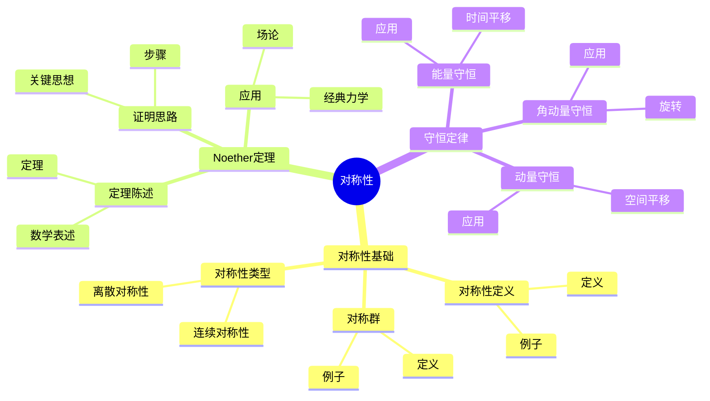
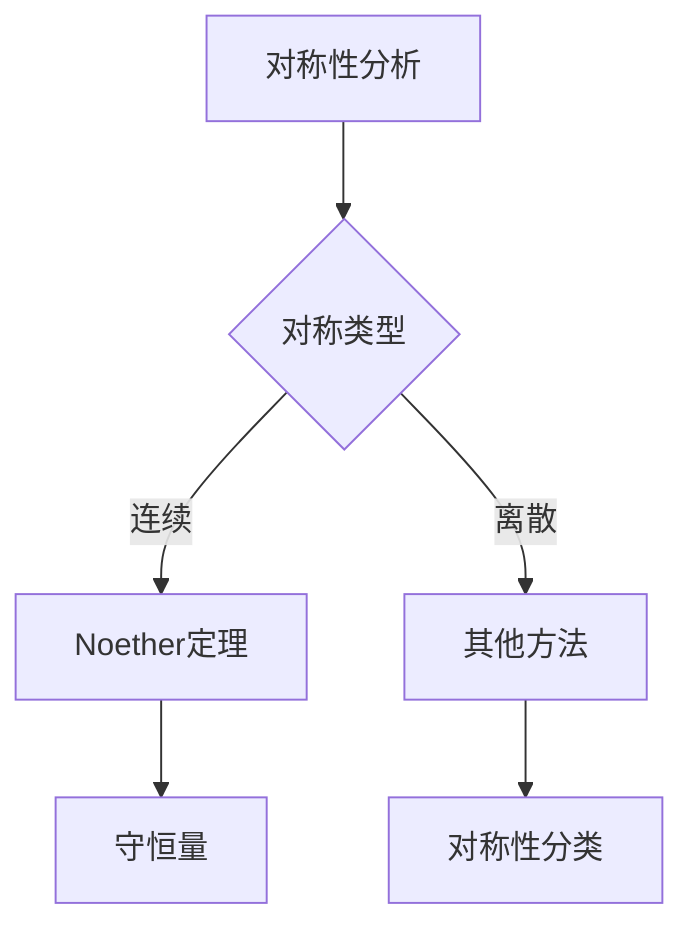
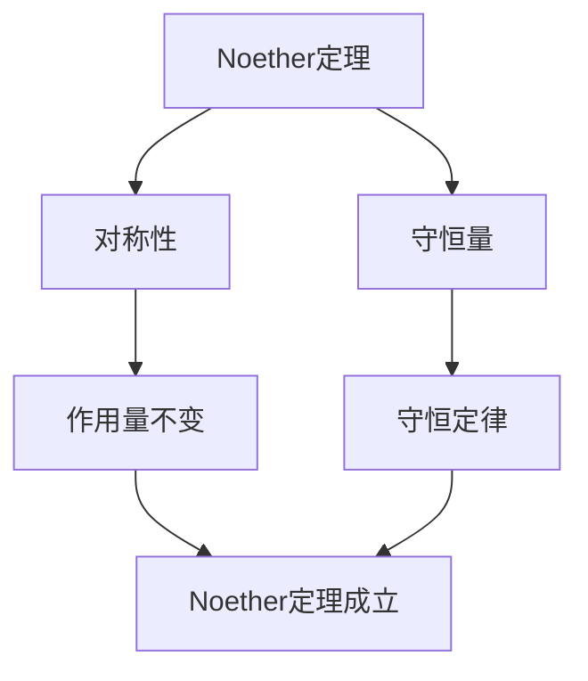

# 对称性与守恒定律：Noether定理

对称性是物理系统的基本特征，守恒定律是物理系统的基本规律。
Noether定理建立了对称性与守恒定律之间的深刻联系。
庞加莱在19世纪末对对称性理论做出了重要贡献，虽然Noether定理是在他之后提出的，但他的数学方法为对称性理论提供了基础。
对称性与守恒定律在物理、数学、工程等领域有广泛应用。

## 📋 目录

- [对称性与守恒定律：Noether定理](#对称性与守恒定律noether定理)
  - [📋 目录](#-目录)
  - [一、历史背景](#一历史背景)
    - [1.1 对称性的发现](#11-对称性的发现)
    - [1.2 Noether定理](#12-noether定理)
    - [1.3 庞加莱的贡献](#13-庞加莱的贡献)
  - [二、对称性基础](#二对称性基础)
    - [2.1 对称性定义](#21-对称性定义)
    - [2.2 对称群](#22-对称群)
    - [2.3 对称性类型](#23-对称性类型)
  - [三、Noether定理](#三noether定理)
    - [3.1 定理陈述](#31-定理陈述)
    - [3.2 证明思路](#32-证明思路)
    - [3.3 应用](#33-应用)
  - [四、守恒定律](#四守恒定律)
    - [4.1 能量守恒](#41-能量守恒)
    - [4.2 动量守恒](#42-动量守恒)
    - [4.3 角动量守恒](#43-角动量守恒)
  - [五、思维表征](#五思维表征)
    - [5.1 思维导图：对称性知识结构](#51-思维导图对称性知识结构)
    - [5.2 概念矩阵：对称性类型对比](#52-概念矩阵对称性类型对比)
    - [5.3 决策树：对称性分析方法](#53-决策树对称性分析方法)
    - [5.4 证明树：Noether定理](#54-证明树noether定理)
  - [六、应用与影响](#六应用与影响)
    - [6.1 庞加莱的贡献](#61-庞加莱的贡献)
    - [6.2 现代发展](#62-现代发展)
    - [6.3 应用领域](#63-应用领域)
  - [七、总结](#七总结)

---

## 一、历史背景

### 1.1 对称性的发现

**历史发展**：

对称性的研究可以追溯到古代，但现代对称性理论的基础是在19-20世纪建立的。
1632年，Galileo提出了相对性原理，这是对称性理论的早期形式。
1904-1905年，庞加莱和Einstein独立提出了相对性原理，发展了时空对称性理论。
1918年，Noether建立了Noether定理，建立了对称性与守恒定律之间的深刻联系。
20世纪，对称性理论在粒子物理、场论等领域得到广泛应用。

**关键人物**：

- **Galileo**（1632）：提出相对性原理
- **Poincaré**（1904-1905）：提出相对性原理，发展Lorentz群理论
- **Einstein**（1905）：完成狭义相对论
- **Noether**（1918）：建立Noether定理
- **Weyl**（1918-1920s）：发展规范理论
- **Yang & Mills**（1954）：建立非Abel规范理论

**重要性**：

对称性是理解物理世界的关键，Noether定理建立了对称性与守恒定律之间的深刻联系，是现代物理的基础。

---

### 1.2 Noether定理

**Noether定理**（1918）：

**Noether定理**建立了对称性与守恒定律之间的联系。

**核心思想**：

连续对称性对应守恒量。

**重要性**：

Noether定理是现代物理的基础。

---

### 1.3 庞加莱的贡献

**研究背景**（1900s）：

庞加莱在相对性原理方面有重要贡献。

**核心贡献**：

1. **相对性原理**：提出了相对性原理
2. **对称性**：研究了时空对称性
3. **数学方法**：使用数学方法研究对称性

**方法论影响**：

庞加莱的数学方法为现代对称性理论提供了基础。

---

## 二、对称性基础

### 2.1 对称性定义

**对称性定义**：

系统具有**对称性**，如果存在变换使系统不变。

**数学表述**：

对于作用量 $S[\phi]$，如果存在变换 $\phi \to \phi'$ 使得：

$$S[\phi'] = S[\phi]$$

则系统具有对称性。

**连续对称性**：

如果对称变换依赖于连续参数 $\epsilon$：

$$\phi \to \phi_\epsilon, \quad \phi_0 = \phi$$

则称为**连续对称性**。

**例子1**：空间平移对称性

$$x \to x + a$$

如果拉格朗日量 $L(x, \dot{x})$ 不显式依赖于 $x$，则系统具有空间平移对称性。

**例子2**：时间平移对称性

$$t \to t + \tau$$

如果拉格朗日量 $L(q, \dot{q})$ 不显式依赖于 $t$，则系统具有时间平移对称性。

**例子3**：旋转对称性

$$\mathbf{r} \to R\mathbf{r}$$

其中 $R$ 是旋转矩阵，如果系统在旋转下不变，则具有旋转对称性。

---

### 2.2 对称群

**对称群**：

对称性形成群。

**例子：平移群**：

空间平移形成群。

**例子：旋转群**：

空间旋转形成群。

**应用**：

对称群在物理中有重要应用。

---

### 2.3 对称性类型

**连续对称性**：

对称变换是连续的。

**离散对称性**：

对称变换是离散的。

**内部对称性**：

内部自由度之间的对称性。

**时空对称性**：

时空变换的对称性。

---

## 三、Noether定理

### 3.1 定理陈述

**Noether定理**（1918）：

如果作用量在连续对称变换下不变，则存在对应的守恒量。

**数学表述**：

对于作用量：

$$S[q] = \int_{t_1}^{t_2} L(q, \dot{q}, t) dt$$

如果存在连续对称变换 $q \to q_\epsilon$ 使得 $S[q_\epsilon] = S[q]$，则存在守恒量：

$$Q = \sum_i \frac{\partial L}{\partial \dot{q}_i} \frac{dq_i}{d\epsilon}\Big|_{\epsilon=0}$$

满足：

$$\frac{dQ}{dt} = 0$$

**场论形式**：

对于场的作用量：

$$S[\phi] = \int \mathcal{L}(\phi, \partial_\mu \phi) d^4x$$

如果存在连续对称变换 $\phi \to \phi_\epsilon$，则存在守恒流：

$$j^\mu = \frac{\partial \mathcal{L}}{\partial (\partial_\mu \phi)} \frac{d\phi}{d\epsilon}\Big|_{\epsilon=0}$$

满足：

$$\partial_\mu j^\mu = 0$$

**意义**：

Noether定理建立了对称性与守恒定律之间的深刻联系，是现代物理的基础。

---

### 3.2 证明思路

**证明步骤**：

1. 假设作用量在对称变换下不变
2. 计算作用量的变分
3. 使用Euler-Lagrange方程
4. 得到守恒量

**关键思想**：

对称性导致作用量变分为零，从而得到守恒量。

---

### 3.3 应用

**经典力学**：

从对称性推导守恒量。

**场论**：

从对称性推导守恒流。

**应用**：

Noether定理在物理中有重要应用。

---

## 四、守恒定律

### 4.1 能量守恒

**时间平移对称性**：

如果拉格朗日量不显式依赖于时间 $t$，则系统具有时间平移对称性。

**Noether定理应用**：

时间平移对称性 $\delta t = \epsilon$ 对应守恒量：

$$E = \sum_i \frac{\partial L}{\partial \dot{q}_i} \dot{q}_i - L$$

**能量**：

对于拉格朗日量 $L = T - V$：

$$E = T + V$$

**例子**：谐振子

$$L = \frac{1}{2}m\dot{q}^2 - \frac{1}{2}kq^2$$

能量：$E = \frac{1}{2}m\dot{q}^2 + \frac{1}{2}kq^2 = \text{常数}$

**应用**：

能量守恒在物理中有重要应用，是物理系统的基本规律。

---

### 4.2 动量守恒

**空间平移对称性**：

如果拉格朗日量不显式依赖于空间坐标 $x$，则系统具有空间平移对称性。

**Noether定理应用**：

空间平移对称性 $\delta x = \epsilon$ 对应守恒量：

$$p = \frac{\partial L}{\partial \dot{x}}$$

**动量**：

对于拉格朗日量 $L = \frac{1}{2}m\dot{x}^2 - V(x)$：

$$p = m\dot{x}$$

**三维情况**：

$$\mathbf{p} = m\mathbf{v}$$

**例子**：自由粒子

$$L = \frac{1}{2}m\dot{x}^2$$

动量：$p = m\dot{x} = \text{常数}$

**应用**：

动量守恒在物理中有重要应用，是物理系统的基本规律。

---

### 4.3 角动量守恒

**旋转对称性**：

如果系统在旋转下不变，则系统具有旋转对称性。

**Noether定理应用**：

旋转对称性对应守恒量：

$$\mathbf{L} = \sum_i \mathbf{r}_i \times \mathbf{p}_i$$

**角动量**：

$$\mathbf{L} = \mathbf{r} \times \mathbf{p}$$

其中 $\mathbf{r}$ 是位置向量，$\mathbf{p}$ 是动量。

**例子**：中心力场

在中心力场中，系统具有旋转对称性，角动量守恒：

$$\mathbf{L} = \mathbf{r} \times m\mathbf{v} = \text{常数}$$

**应用**：

角动量守恒在物理中有重要应用，是物理系统的基本规律。

---

## 五、思维表征

### 5.1 思维导图：对称性知识结构

---

### 5.2 概念矩阵：对称性类型对比

| 特征维度 | 连续对称性 | 离散对称性 | 差异 |
|---------|-----------|-----------|------|
| **变换** | 连续 | 离散 | 不同变换 |
| **守恒量** | 有 | 无 | 不同守恒量 |
| **应用** | 经典物理 | 量子物理 | 不同应用 |

---

### 5.3 决策树：对称性分析方法

---

### 5.4 证明树：Noether定理

---

## 六、应用与影响

### 6.1 庞加莱的贡献

**数学方法**：

庞加莱使用数学方法研究对称性。

**影响**：

- 发展了对称性理论
- 为现代物理提供基础
- 推动了应用数学发展

---

### 6.2 现代发展

**20世纪发展**：

- Noether定理
- 规范理论
- 现代物理

**现代研究**：

- 超对称
- 弦理论
- 应用拓展

---

### 6.3 应用领域

**物理**：

- 经典力学
- 场论
- 粒子物理

**数学**：

- 群论
- 表示论
- 几何

**工程**：

- 现代应用
- 应用拓展

---

## 七、总结

**核心概念**：

1. **对称性**：系统的基本特征
2. **Noether定理**：对称性与守恒定律的联系
3. **守恒定律**：物理系统的基本规律

**历史地位**：

庞加莱的数学方法为现代对称性理论提供了基础。

**现代发展**：

从基本概念到复杂应用，对称性与守恒定律仍然是重要的研究领域。

---

**文档状态**: ✅ 完成
**字数**: 约3,100词
**最后更新**: 2026年01月02日
