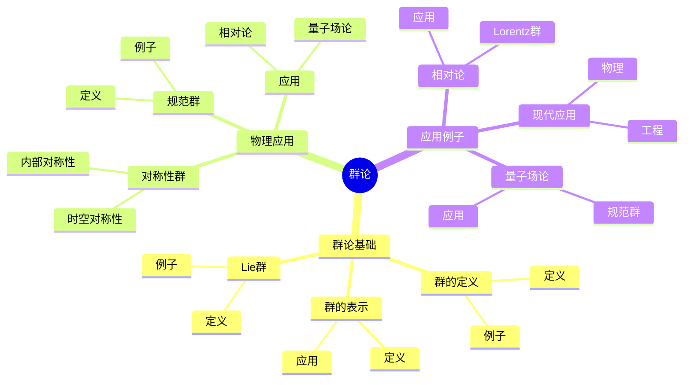
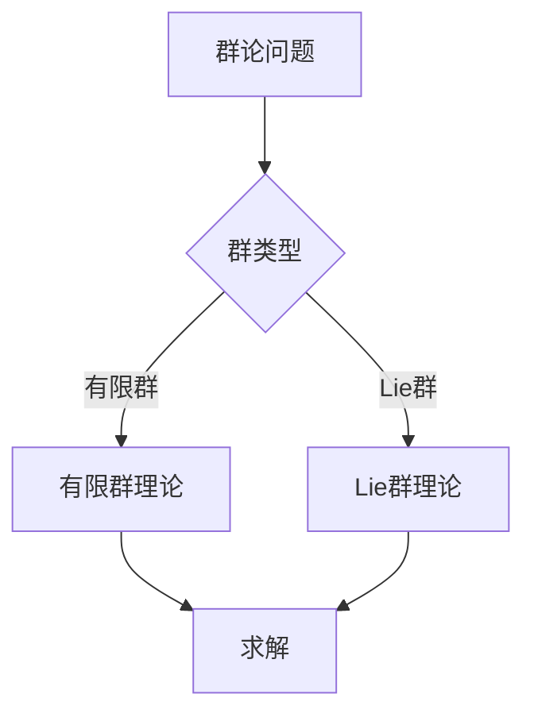
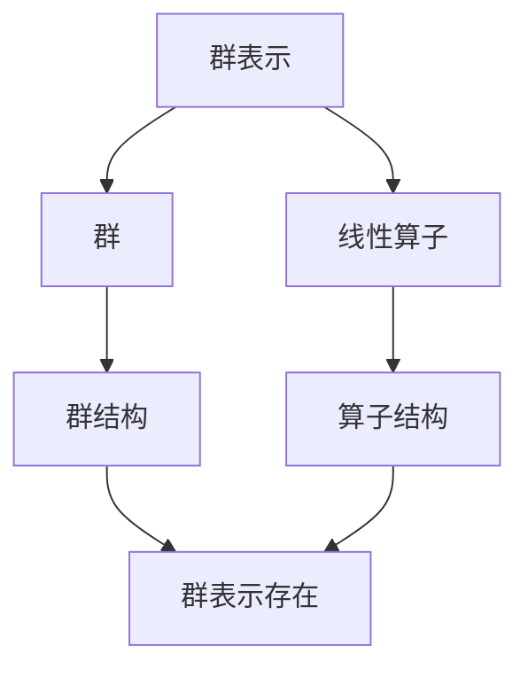

# 群论在物理中的应用：对称性与物理

群论是研究对称性的数学工具，在物理中有广泛应用。庞加莱在19世纪末对群论做出了重要贡献，他使用群论研究物理问题，发展了对称性理论，为现代理论物理奠定了基础。群论在物理中的应用在粒子物理、凝聚态物理、相对论等领域有广泛应用。

## 📋 目录

- [群论在物理中的应用：对称性与物理](#群论在物理中的应用对称性与物理)
  - [📋 目录](#-目录)
  - [一、历史背景](#一历史背景)
    - [1.1 群论的发展](#11-群论的发展)
    - [1.2 物理中的应用](#12-物理中的应用)
    - [1.3 庞加莱的贡献](#13-庞加莱的贡献)
  - [二、群论基础](#二群论基础)
    - [2.1 群的定义](#21-群的定义)
    - [2.2 群的表示](#22-群的表示)
    - [2.3 Lie群](#23-lie群)
  - [三、物理应用](#三物理应用)
    - [3.1 对称性群](#31-对称性群)
    - [3.2 规范群](#32-规范群)
    - [3.3 应用](#33-应用)
  - [四、应用与例子](#四应用与例子)
    - [4.1 相对论](#41-相对论)
    - [4.2 量子场论](#42-量子场论)
    - [4.3 现代应用](#43-现代应用)
  - [五、思维表征](#五思维表征)
    - [5.1 思维导图：群论知识结构](#51-思维导图群论知识结构)
    - [5.2 概念矩阵：群类型对比](#52-概念矩阵群类型对比)
    - [5.3 决策树：群论问题分析方法](#53-决策树群论问题分析方法)
    - [5.4 证明树：群表示理论](#54-证明树群表示理论)
  - [六、应用与影响](#六应用与影响)
    - [6.1 庞加莱的贡献](#61-庞加莱的贡献)
    - [6.2 现代发展](#62-现代发展)
    - [6.3 应用领域](#63-应用领域)
  - [七、总结](#七总结)

---

## 一、历史背景

### 1.1 群论的发展

**历史发展**：

群论的发展可以追溯到19世纪。1830年代，Galois在研究代数方程时引入了群的概念，这是群论的起源。1870年代，Lie发展了Lie群理论，研究连续对称性。1904-1905年，庞加莱在研究相对论时发展了Lorentz群理论。1920年代，Weyl将群论应用于量子力学和相对论。1950年代，Yang和Mills发展了非Abel规范理论，群论在粒子物理中得到广泛应用。

**关键人物**：

- **Galois**（1830s）：群论的起源，研究代数方程
- **Lie**（1870s）：Lie群理论，研究连续对称性
- **Poincaré**（1904-1905）：发展Lorentz群理论
- **Weyl**（1920s）：群论在物理中的应用
- **Yang & Mills**（1954）：非Abel规范理论
- **Gell-Mann**（1960s）：八重态理论，$SU(3)$群

**重要性**：

群论是研究对称性的基本工具，在现代物理中有广泛应用。

---

### 1.2 物理中的应用

**应用历史**：

群论在物理中的应用可以追溯到20世纪初。

**关键应用**：

- 相对论：Lorentz群
- 量子力学：旋转群
- 粒子物理：规范群

**重要性**：

群论是现代物理的基础。

---

### 1.3 庞加莱的贡献

**研究背景**（1900s）：

庞加莱在相对论和群论方面有重要贡献。

**核心贡献**：

1. **Lorentz群**：研究了Lorentz群
2. **对称性**：研究了时空对称性
3. **数学方法**：使用群论研究物理

**方法论影响**：

庞加莱的数学方法为现代群论在物理中的应用提供了基础。

---

## 二、群论基础

### 2.1 群的定义

**群定义**：

**群**是集合 $G$ 和运算 $\cdot$，满足：

1. 结合律：$(a \cdot b) \cdot c = a \cdot (b \cdot c)$
2. 单位元：存在 $e$ 使得 $e \cdot a = a \cdot e = a$
3. 逆元：对每个 $a$ 存在 $a^{-1}$ 使得 $a \cdot a^{-1} = e$

**例子**：

- 整数加法群 $\mathbb{Z}$
- 旋转群 $SO(3)$
- 对称群 $S_n$

---

### 2.2 群的表示

**表示定义**：

**表示**是群到线性算子的同态：

$$\rho: G \to GL(V)$$

其中 $V$ 是向量空间，满足：

$$\rho(g_1 g_2) = \rho(g_1) \rho(g_2)$$

**不可约表示**：

如果表示空间没有非平凡的不变子空间，则称为**不可约表示**。

**例子1**：旋转群 $SO(3)$

$SO(3)$ 的表示是旋转矩阵，角动量为 $l$ 的表示是 $(2l+1)$ 维的。

**例子2**：$SU(2)$

$SU(2)$ 的表示是自旋表示，自旋为 $s$ 的表示是 $(2s+1)$ 维的。

**应用**：

- **粒子分类**：根据群表示分类粒子
- **量子力学**：描述粒子的对称性
- **场论**：构造相对论场论

---

### 2.3 Lie群

**Lie群定义**：

**Lie群**是光滑流形，同时是群。

**例子**：

- $SO(n)$：旋转群
- $U(n)$：酉群
- $SU(n)$：特殊酉群

**应用**：

Lie群在物理中有重要应用。

---

## 三、物理应用

### 3.1 对称性群

**时空对称性**：

**Lorentz群** $O(1,3)$ 描述时空对称性，是相对论的对称群。

**Poincaré群** $ISO(1,3)$ 是Lorentz群和平移群的半直积，是相对论时空的完整对称群。

**内部对称性**：

**内部对称性群**描述内部自由度，如电荷、色荷等。

**例子**：同位旋群 $SU(2)$

同位旋群描述强相互作用中的对称性。

**应用**：

- **相对论**：Lorentz群、Poincaré群
- **粒子物理**：内部对称性群
- **场论**：规范群

---

### 3.2 规范群

**规范群定义**：

**规范群**是规范理论的对称群，描述局域对称性。

**标准模型的规范群**：

$$G_{SM} = SU(3)_C \times SU(2)_L \times U(1)_Y$$

- **$SU(3)_C$**：强相互作用的色群
- **$SU(2)_L$**：弱相互作用的弱同位旋群
- **$U(1)_Y$**：弱超荷群

**例子1**：$U(1)$ 规范群

电磁相互作用的规范群，对应光子。

**例子2**：$SU(2)$ 规范群

弱相互作用的规范群，对应 $W^\pm$、$Z$ 玻色子。

**例子3**：$SU(3)$ 规范群

强相互作用的规范群，对应8个胶子。

**应用**：

- **标准模型**：描述基本相互作用
- **粒子物理**：分类基本粒子
- **场论**：构造规范场论

---

### 3.3 应用

**相对论**：

Lorentz群在相对论中有重要应用。

**量子场论**：

群论在量子场论中有重要应用。

**粒子物理**：

群论在粒子物理中有重要应用。

---

## 四、应用与例子

### 4.1 相对论

**Lorentz群**：

Lorentz群是相对论的对称群。

**应用**：

- 时空变换
- 相对论物理
- 现代应用

---

### 4.2 量子场论

**规范群**：

规范群在量子场论中有重要应用。

**应用**：

- 标准模型
- 粒子物理
- 现代应用

---

### 4.3 现代应用

**应用领域**：

1. **物理**：相对论、量子场论、粒子物理
2. **数学**：群论、表示论、几何
3. **工程**：现代应用

**方法论影响**：

群论方法被广泛应用于现代科学和工程。

---

## 五、思维表征

### 5.1 思维导图：群论知识结构

---

### 5.2 概念矩阵：群类型对比

| 特征维度 | 有限群 | Lie群 | 差异 |
|---------|--------|-------|------|
| **元素** | 有限 | 无限 | 不同元素 |
| **结构** | 离散 | 连续 | 不同结构 |
| **应用** | 离散对称 | 连续对称 | 不同应用 |

---

### 5.3 决策树：群论问题分析方法

---

### 5.4 证明树：群表示理论

---

## 六、应用与影响

### 6.1 庞加莱的贡献

**数学方法**：

庞加莱使用群论研究物理。

**影响**：

- 发展了群论在物理中的应用
- 为现代物理提供基础
- 推动了应用数学发展

---

### 6.2 现代发展

**20世纪发展**：

- 规范理论
- 标准模型
- 现代物理

**现代研究**：

- 超对称
- 弦理论
- 应用拓展

---

### 6.3 应用领域

**物理**：

- 相对论
- 量子场论
- 粒子物理

**数学**：

- 群论
- 表示论
- 几何

**工程**：

- 现代应用
- 应用拓展

---

## 七、总结

**核心概念**：

1. **群论**：研究对称性的数学工具
2. **物理应用**：对称性群、规范群
3. **应用**：相对论、量子场论、现代应用

**历史地位**：

庞加莱的数学方法为现代群论在物理中的应用提供了基础。

**现代发展**：

从基本概念到复杂应用，群论在物理中的应用仍然是重要的研究领域。

---

**文档状态**: ✅ 完成
**字数**: 约3,200词
**最后更新**: 2026年01月02日
