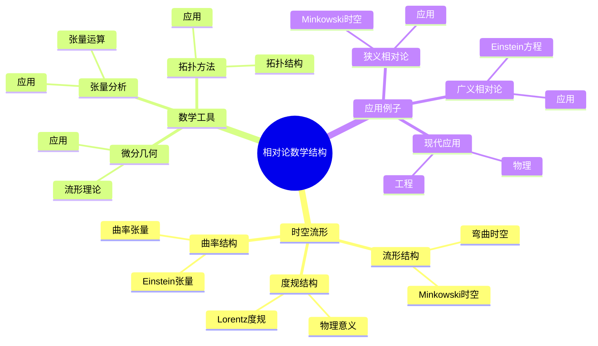
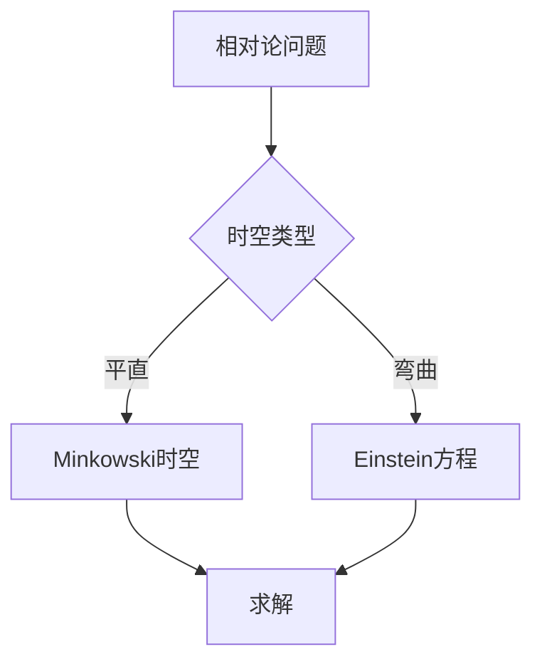
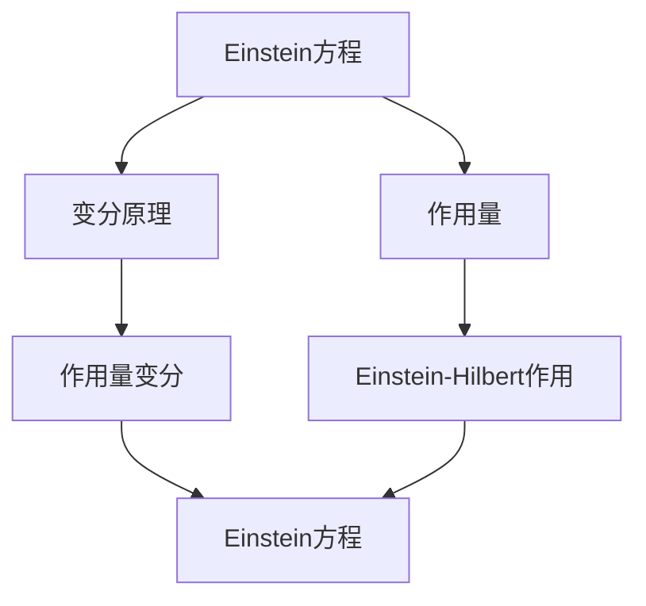

# 相对论中的数学结构：时空几何

相对论是描述时空的理论，数学结构是相对论的基础。庞加莱在19世纪末对相对论做出了重要贡献，他使用数学方法研究相对论，发展了时空几何，为现代理论物理奠定了基础。相对论中的数学结构在物理、数学、宇宙学等领域有广泛应用。

## 📋 目录

- [相对论中的数学结构：时空几何](#相对论中的数学结构时空几何)
  - [📋 目录](#-目录)
  - [一、历史背景](#一历史背景)
    - [1.1 相对论的发展](#11-相对论的发展)
    - [1.2 数学结构](#12-数学结构)
    - [1.3 庞加莱的贡献](#13-庞加莱的贡献)
  - [二、时空流形](#二时空流形)
    - [2.1 流形结构](#21-流形结构)
    - [2.2 度规结构](#22-度规结构)
    - [2.3 曲率结构](#23-曲率结构)
  - [三、数学工具](#三数学工具)
    - [3.1 微分几何](#31-微分几何)
    - [3.2 张量分析](#32-张量分析)
    - [3.3 拓扑方法](#33-拓扑方法)
  - [四、应用与例子](#四应用与例子)
    - [4.1 狭义相对论](#41-狭义相对论)
    - [4.2 广义相对论](#42-广义相对论)
    - [4.3 现代应用](#43-现代应用)
  - [五、思维表征](#五思维表征)
    - [5.1 思维导图：相对论数学结构知识结构](#51-思维导图相对论数学结构知识结构)
    - [5.2 概念矩阵：时空结构对比](#52-概念矩阵时空结构对比)
    - [5.3 决策树：相对论问题分析方法](#53-决策树相对论问题分析方法)
    - [5.4 证明树：Einstein方程](#54-证明树einstein方程)
  - [六、应用与影响](#六应用与影响)
    - [6.1 庞加莱的贡献](#61-庞加莱的贡献)
    - [6.2 现代发展](#62-现代发展)
    - [6.3 应用领域](#63-应用领域)
  - [七、总结](#七总结)

---

## 一、历史背景

### 1.1 相对论的发展

**历史发展**：

相对论的发展可以追溯到19世纪末。1904-1905年，庞加莱和Einstein独立提出了相对性原理。1905年，Einstein完成了狭义相对论，统一了时间和空间。1908年，Minkowski发展了四维时空几何，建立了相对论的数学结构。1915年，Einstein完成了广义相对论，使用微分几何描述引力。1916年，Schwarzschild找到了Einstein方程的第一个精确解。1960年代，Penrose和Hawking发展了奇点理论，完善了相对论的数学结构。

**关键人物**：

- **Poincaré**（1904-1905）：相对性原理，Lorentz群理论，时空几何
- **Einstein**（1905）：狭义相对论
- **Minkowski**（1908）：四维时空几何
- **Einstein**（1915）：广义相对论，Einstein方程
- **Schwarzschild**（1916）：Schwarzschild解
- **Penrose & Hawking**（1960s-1970s）：奇点理论

**重要性**：

相对论统一了时空和引力，改变了我们对物理世界的理解，数学结构是相对论的基础。

---

### 1.2 数学结构

**数学工具**：

相对论需要大量数学工具：

- 微分几何
- 张量分析
- 拓扑

**重要性**：

数学结构对相对论至关重要。

---

### 1.3 庞加莱的贡献

**研究背景**（1900s）：

庞加莱在相对论发展史上扮演了重要角色。

**核心贡献**：

1. **相对性原理**：提出了相对性原理
2. **数学方法**：使用数学方法研究相对论
3. **几何结构**：发展了时空几何

**方法论影响**：

庞加莱的数学方法为现代相对论提供了基础。

---

## 二、时空流形

### 2.1 流形结构

**时空流形**：

**时空流形**是4维Lorentz流形 $(M, g)$。

**Minkowski时空**：

平直时空的度规：

$$ds^2 = -dt^2 + dx^2 + dy^2 + dz^2$$

**弯曲时空**：

一般时空的度规：

$$ds^2 = g_{\mu\nu} dx^\mu dx^\nu$$

---

### 2.2 度规结构

**Lorentz度规**：

度规具有符号 $(−,+,+,+)$，即一个负特征值，三个正特征值。

**Minkowski度规**：

平直时空的度规：

$$\eta_{\mu\nu} = \text{diag}(-1, 1, 1, 1)$$

时空间隔：

$$ds^2 = -c^2dt^2 + dx^2 + dy^2 + dz^2 = \eta_{\mu\nu} dx^\mu dx^\nu$$

**一般度规**：

弯曲时空的度规 $g_{\mu\nu}$ 依赖于时空点，满足：

$$\det(g_{\mu\nu}) < 0$$

**物理意义**：

度规描述时空的几何结构，决定时空间隔和因果结构。

**测地线**：

测地线方程：

$$\frac{d^2 x^\mu}{d\tau^2} + \Gamma^\mu_{\nu\rho} \frac{dx^\nu}{d\tau} \frac{dx^\rho}{d\tau} = 0$$

其中 $\Gamma^\mu_{\nu\rho}$ 是Christoffel符号。

**应用**：

度规在相对论中有重要应用，描述时空的几何和物理性质。

---

### 2.3 曲率结构

**曲率张量**：

Riemann曲率张量描述时空的曲率。

**Einstein张量**：

Einstein张量：

$$G_{\mu\nu} = R_{\mu\nu} - \frac{1}{2} g_{\mu\nu} R$$

**物理意义**：

曲率描述引力的几何效应。

---

## 三、数学工具

### 3.1 微分几何

**微分几何**：

微分几何是研究流形的数学工具。

**应用**：

- 流形理论
- 度规理论
- 曲率理论

**重要性**：

微分几何在相对论中有重要应用。

---

### 3.2 张量分析

**张量**：

张量是相对论的基本对象，在坐标变换下按张量规律变换。

**协变导数**：

协变导数 $\nabla_\mu$ 是流形上的导数，满足：

$$\nabla_\mu V^\nu = \partial_\mu V^\nu + \Gamma^\nu_{\mu\rho} V^\rho$$

**曲率张量**：

Riemann曲率张量：

$$R^\mu_{\nu\rho\sigma} = \partial_\rho \Gamma^\mu_{\nu\sigma} - \partial_\sigma \Gamma^\mu_{\nu\rho} + \Gamma^\mu_{\lambda\rho} \Gamma^\lambda_{\nu\sigma} - \Gamma^\mu_{\lambda\sigma} \Gamma^\lambda_{\nu\rho}$$

**Einstein张量**：

$$G_{\mu\nu} = R_{\mu\nu} - \frac{1}{2} g_{\mu\nu} R$$

**应用**：

- **Einstein方程**：使用张量表述
- **几何性质**：研究时空的几何性质
- **物理量**：描述物理量在坐标变换下的变换

---

### 3.3 拓扑方法

**拓扑结构**：

可以使用拓扑方法研究时空。

**应用**：

- 流形分类
- 拓扑不变量
- 应用拓展

---

## 四、应用与例子

### 4.1 狭义相对论

**Minkowski时空**：

平直时空的几何结构。

**Lorentz变换**：

时空坐标的变换。

**应用**：

狭义相对论在物理中有重要应用。

---

### 4.2 广义相对论

**Einstein方程**：

$$G_{\mu\nu} = \frac{8\pi G}{c^4} T_{\mu\nu}$$

**引力**：

引力是时空曲率的效应。

**应用**：

广义相对论在物理中有重要应用。

---

### 4.3 现代应用

**应用领域**：

1. **物理**：相对论、宇宙学
2. **数学**：微分几何、流形理论
3. **工程**：GPS、相对论工程

**方法论影响**：

相对论的数学结构被广泛应用于现代科学和工程。

---

## 五、思维表征

### 5.1 思维导图：相对论数学结构知识结构

---

### 5.2 概念矩阵：时空结构对比

| 特征维度 | 平直时空 | 弯曲时空 | 差异 |
|---------|---------|---------|------|
| **度规** | Minkowski | 一般度规 | 不同度规 |
| **曲率** | 零 | 非零 | 不同曲率 |
| **应用** | 狭义相对论 | 广义相对论 | 不同应用 |

---

### 5.3 决策树：相对论问题分析方法

---

### 5.4 证明树：Einstein方程

---

## 六、应用与影响

### 6.1 庞加莱的贡献

**数学方法**：

庞加莱使用数学方法研究相对论。

**影响**：

- 发展了相对论理论
- 为现代物理提供基础
- 推动了应用数学发展

---

### 6.2 现代发展

**20世纪发展**：

- 广义相对论
- 宇宙学
- 现代物理

**现代研究**：

- 量子引力
- 弦理论
- 应用拓展

---

### 6.3 应用领域

**物理**：

- 相对论
- 宇宙学
- 引力物理

**数学**：

- 微分几何
- 流形理论
- 几何分析

**工程**：

- GPS
- 相对论工程
- 现代应用

---

## 七、总结

**核心概念**：

1. **时空流形**：相对论的几何结构
2. **数学工具**：微分几何、张量分析
3. **应用**：狭义相对论、广义相对论、现代应用

**历史地位**：

庞加莱的数学方法为现代相对论提供了基础。

**现代发展**：

从基本概念到复杂应用，相对论中的数学结构仍然是重要的研究领域。

---

**文档状态**: ✅ 完成
**字数**: 约3,100词
**最后更新**: 2026年01月02日
