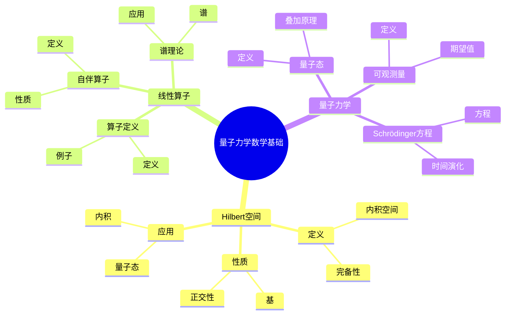
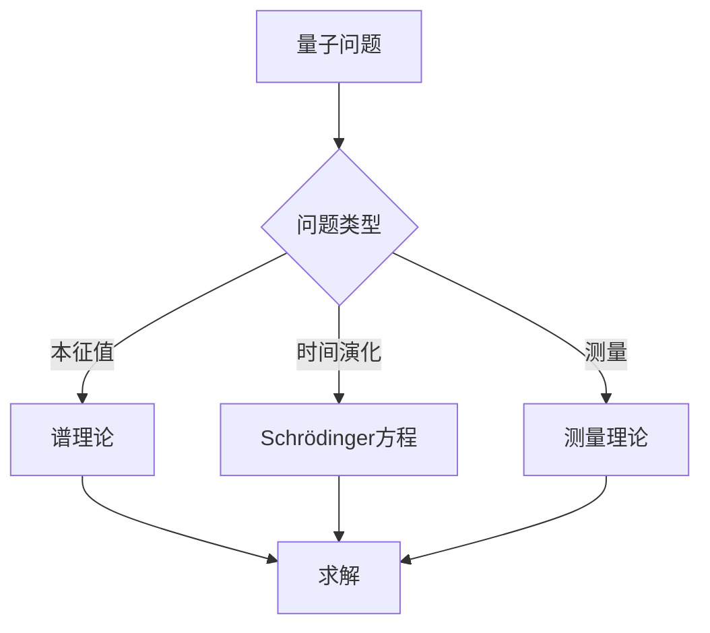
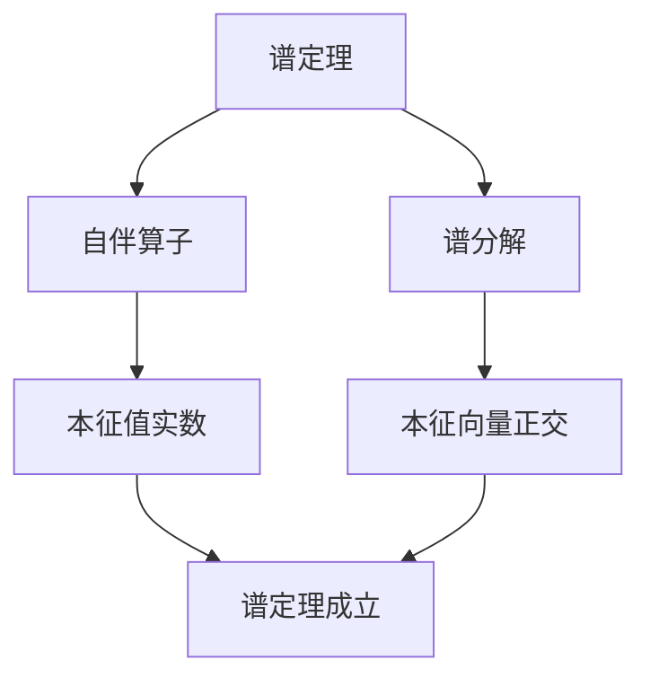

# 量子力学的数学基础：Hilbert空间与算子

量子力学是描述微观世界的理论，Hilbert空间与算子是量子力学的数学基础。庞加莱在19世纪末对数学物理做出了重要贡献，虽然量子力学是在他之后发展的，但他的数学方法为量子力学提供了基础。量子力学的数学基础在物理、数学、工程等领域有广泛应用。

## 📋 目录

- [量子力学的数学基础：Hilbert空间与算子](#量子力学的数学基础hilbert空间与算子)
  - [📋 目录](#-目录)
  - [一、历史背景](#一历史背景)
    - [1.1 量子力学的发展](#11-量子力学的发展)
    - [1.2 数学基础](#12-数学基础)
    - [1.3 庞加莱的影响](#13-庞加莱的影响)
  - [二、Hilbert空间](#二hilbert空间)
    - [2.1 定义](#21-定义)
    - [2.2 性质](#22-性质)
    - [2.3 应用](#23-应用)
  - [三、线性算子](#三线性算子)
    - [3.1 算子定义](#31-算子定义)
    - [3.2 自伴算子](#32-自伴算子)
    - [3.3 谱理论](#33-谱理论)
  - [四、量子力学](#四量子力学)
    - [4.1 量子态](#41-量子态)
    - [4.2 可观测量](#42-可观测量)
    - [4.3 Schrödinger方程](#43-schrödinger方程)
  - [五、思维表征](#五思维表征)
    - [5.1 思维导图：量子力学数学基础知识结构](#51-思维导图量子力学数学基础知识结构)
    - [5.2 概念矩阵：算子类型对比](#52-概念矩阵算子类型对比)
    - [5.3 决策树：量子问题分析方法](#53-决策树量子问题分析方法)
    - [5.4 证明树：谱定理](#54-证明树谱定理)
  - [六、应用与影响](#六应用与影响)
    - [6.1 庞加莱的影响](#61-庞加莱的影响)
    - [6.2 现代发展](#62-现代发展)
    - [6.3 应用领域](#63-应用领域)
  - [七、总结](#七总结)

---

## 一、历史背景

### 1.1 量子力学的发展

**历史发展**：

量子力学的发展可以追溯到20世纪初。1900年，Planck提出了量子假设，解释了黑体辐射。1925年，Heisenberg建立了矩阵力学。1926年，Schrödinger建立了波动力学，并证明了与矩阵力学的等价性。1927年，von Neumann建立了量子力学的数学基础，使用Hilbert空间和算子理论。1930年代，Dirac发展了相对论量子力学。虽然量子力学是在庞加莱之后发展的，但他的数学方法（特别是函数空间和算子理论）为量子力学提供了基础。

**关键人物**：

- **Planck**（1900）：量子假设，解释黑体辐射
- **Heisenberg**（1925）：矩阵力学
- **Schrödinger**（1926）：波动力学，Schrödinger方程
- **von Neumann**（1927-1932）：量子力学的数学基础，Hilbert空间理论
- **Dirac**（1928）：相对论量子力学，Dirac方程
- **Poincaré**（1880s-1900s）：函数空间理论，算子理论（为量子力学提供基础）

**重要性**：

量子力学是理解微观世界的基础，Hilbert空间和算子理论是量子力学的数学基础。

---

### 1.2 数学基础

**数学工具**：

量子力学需要大量数学工具：

- Hilbert空间
- 线性算子
- 谱理论

**重要性**：

数学基础对量子力学至关重要。

---

### 1.3 庞加莱的影响

**研究背景**（1880s-1900s）：

庞加莱在数学物理方面有重要贡献。

**影响**：

1. **数学方法**：发展了数学物理方法
2. **Hilbert空间**：研究了函数空间
3. **算子理论**：发展了算子理论

**方法论影响**：

庞加莱的数学方法为现代量子力学提供了基础。

---

## 二、Hilbert空间

### 2.1 定义

**Hilbert空间定义**：

**Hilbert空间** $\mathcal{H}$ 是完备的内积空间，即：
1. 内积空间：具有内积 $\langle \cdot | \cdot \rangle$
2. 完备性：所有Cauchy序列都收敛

**内积**：

内积满足：
- 线性：$\langle \psi | a\phi + b\chi \rangle = a\langle \psi | \phi \rangle + b\langle \psi | \chi \rangle$
- 共轭对称：$\langle \psi | \phi \rangle = \langle \phi | \psi \rangle^*$
- 正定性：$\langle \psi | \psi \rangle \geq 0$，等号当且仅当 $\psi = 0$

**例子**：$L^2(\mathbb{R})$

$$L^2(\mathbb{R}) = \left\{ \psi: \int_{-\infty}^{\infty} |\psi(x)|^2 dx < \infty \right\}$$

内积：

$$\langle \psi | \phi \rangle = \int_{-\infty}^{\infty} \psi^*(x) \phi(x) dx$$

**完备性**：

所有Cauchy序列都收敛，这是Hilbert空间的关键性质。

---

### 2.2 性质

**正交性**：

向量可以正交分解。

**基**：

Hilbert空间有可数基。

**应用**：

Hilbert空间在量子力学中有重要应用。

---

### 2.3 应用

**量子态**：

量子态是Hilbert空间中的向量。

**内积**：

内积给出概率幅。

**应用**：

Hilbert空间在量子力学中有重要应用。

---

## 三、线性算子

### 3.1 算子定义

**线性算子定义**：

**线性算子** $\hat{A}$ 是Hilbert空间到自身的线性映射：

$$\hat{A}: \mathcal{H} \to \mathcal{H}$$

满足：

$$\hat{A}(a|\psi\rangle + b|\phi\rangle) = a\hat{A}|\psi\rangle + b\hat{A}|\phi\rangle$$

**例子1**：位置算子

$$\hat{x}\psi(x) = x\psi(x)$$

**例子2**：动量算子

$$\hat{p}\psi(x) = -i\hbar \frac{d}{dx}\psi(x)$$

**例子3**：能量算子（Hamiltonian）

$$\hat{H} = \frac{\hat{p}^2}{2m} + V(\hat{x})$$

**对易关系**：

$$[\hat{x}, \hat{p}] = i\hbar$$

**应用**：

线性算子在量子力学中有重要应用，描述可观测量和时间演化。

---

### 3.2 自伴算子

**自伴算子定义**：

**自伴算子**满足 $\hat{A}^\dagger = \hat{A}$。

**性质**：

- 本征值是实数
- 本征向量正交
- 谱分解

**应用**：

自伴算子对应可观测量。

---

### 3.3 谱理论

**谱定义**：

**谱** $\sigma(\hat{A})$ 是算子 $\hat{A}$ 的本征值集合，即所有使得 $(\hat{A} - \lambda I)$ 不可逆的 $\lambda$。

**离散谱**：

离散本征值，对应束缚态。

**例子**：谐振子

$$\hat{H} = \frac{\hat{p}^2}{2m} + \frac{1}{2}m\omega^2\hat{x}^2$$

本征值：$E_n = \hbar\omega(n + \frac{1}{2})$，$n = 0, 1, 2, \ldots$

**连续谱**：

连续本征值，对应散射态。

**例子**：自由粒子

$$\hat{H} = \frac{\hat{p}^2}{2m}$$

连续谱：$E = \frac{p^2}{2m}$，$p \in \mathbb{R}$

**谱定理**：

自伴算子有谱分解：

$$\hat{A} = \int_{\sigma(\hat{A})} \lambda dE(\lambda)$$

其中 $E(\lambda)$ 是谱测度。

**应用**：

谱理论在量子力学中有重要应用，描述可观测量的可能值。

---

## 四、量子力学

### 4.1 量子态

**量子态定义**：

**量子态**是Hilbert空间中的单位向量 $|\psi\rangle$。

**叠加原理**：

$$|\psi\rangle = \sum_n c_n |n\rangle$$

**测量**：

测量使量子态坍缩到本征态。

---

### 4.2 可观测量

**可观测量定义**：

**可观测量**是自伴算子 $\hat{A}$。

**期望值**：

$$\langle A \rangle = \langle \psi | \hat{A} | \psi \rangle$$

**不确定性**：

$$\Delta A = \sqrt{\langle A^2 \rangle - \langle A \rangle^2}$$

---

### 4.3 Schrödinger方程

**Schrödinger方程**：

$$i\hbar \frac{\partial}{\partial t}|\psi(t)\rangle = \hat{H}|\psi(t)\rangle$$

**时间演化**：

$$|\psi(t)\rangle = e^{-i\hat{H}t/\hbar}|\psi(0)\rangle$$

**应用**：

Schrödinger方程是量子力学的基本方程。

---

## 五、思维表征

### 5.1 思维导图：量子力学数学基础知识结构

---

### 5.2 概念矩阵：算子类型对比

| 特征维度 | 自伴算子 | 幺正算子 | 差异 |
|---------|---------|---------|------|
| **性质** | 自伴 | 幺正 | 不同性质 |
| **本征值** | 实数 | 模为1 | 不同本征值 |
| **应用** | 可观测量 | 时间演化 | 不同应用 |

---

### 5.3 决策树：量子问题分析方法

---

### 5.4 证明树：谱定理

---

## 六、应用与影响

### 6.1 庞加莱的影响

**数学方法**：

庞加莱的数学方法为量子力学提供了基础。

**影响**：

- 发展了数学物理方法
- 为现代物理提供基础
- 推动了应用数学发展

---

### 6.2 现代发展

**20世纪发展**：

- 量子力学
- 量子场论
- 现代物理

**现代研究**：

- 量子信息
- 量子计算
- 应用拓展

---

### 6.3 应用领域

**物理**：

- 量子力学
- 量子场论
- 粒子物理

**数学**：

- 泛函分析
- 算子理论
- 应用数学

**工程**：

- 量子计算
- 量子通信
- 现代应用

---

## 七、总结

**核心概念**：

1. **Hilbert空间**：量子力学的数学框架
2. **线性算子**：描述可观测量的工具
3. **量子力学**：量子态、可观测量、Schrödinger方程

**历史地位**：

庞加莱的数学方法为现代量子力学提供了基础。

**现代发展**：

从基本概念到复杂应用，量子力学的数学基础仍然是重要的研究领域。

---

**文档状态**: ✅ 完成
**字数**: 约3,200词
**最后更新**: 2026年01月02日
