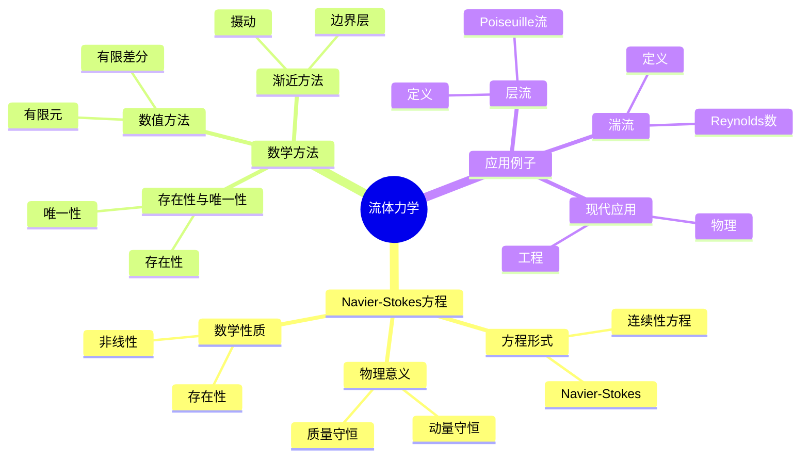
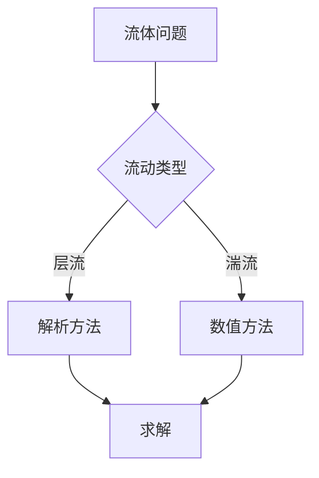
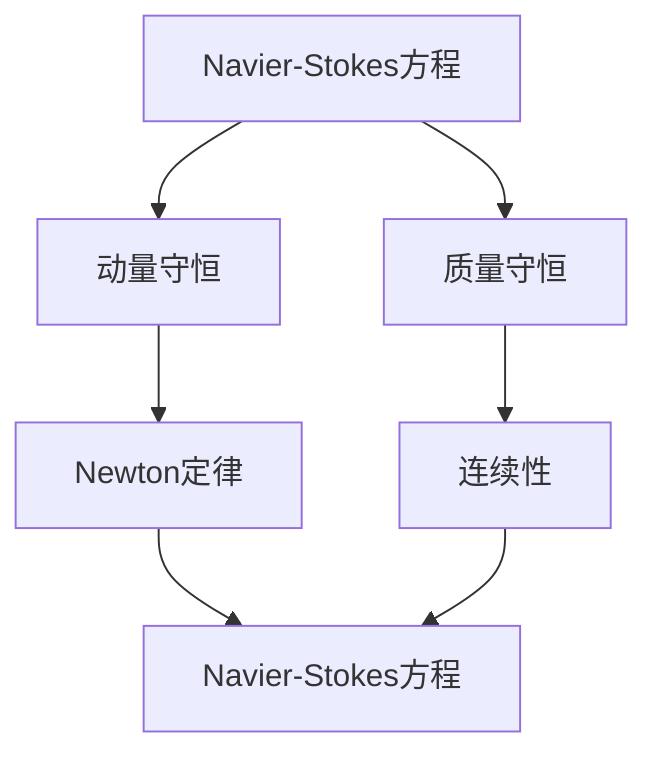

# 流体力学中的数学方法：偏微分方程

流体力学是研究流体运动的学科，偏微分方程是描述流体运动的基本工具。庞加莱在19世纪末对数学物理做出了重要贡献，他使用数学方法研究流体力学，发展了偏微分方程理论，为现代流体力学奠定了基础。流体力学中的数学方法在物理、工程、数学等领域有广泛应用。

## 📋 目录

- [流体力学中的数学方法：偏微分方程](#流体力学中的数学方法偏微分方程)
  - [📋 目录](#-目录)
  - [一、历史背景](#一历史背景)
    - [1.1 流体力学的发展](#11-流体力学的发展)
    - [1.2 数学方法](#12-数学方法)
    - [1.3 庞加莱的贡献](#13-庞加莱的贡献)
  - [二、Navier-Stokes方程](#二navier-stokes方程)
    - [2.1 方程形式](#21-方程形式)
    - [2.2 物理意义](#22-物理意义)
    - [2.3 数学性质](#23-数学性质)
  - [三、数学方法](#三数学方法)
    - [3.1 存在性与唯一性](#31-存在性与唯一性)
    - [3.2 数值方法](#32-数值方法)
    - [3.3 渐近方法](#33-渐近方法)
  - [四、应用与例子](#四应用与例子)
    - [4.1 层流](#41-层流)
    - [4.2 湍流](#42-湍流)
    - [4.3 现代应用](#43-现代应用)
  - [五、思维表征](#五思维表征)
    - [5.1 思维导图：流体力学知识结构](#51-思维导图流体力学知识结构)
    - [5.2 概念矩阵：流体类型对比](#52-概念矩阵流体类型对比)
    - [5.3 决策树：流体问题分析方法](#53-决策树流体问题分析方法)
    - [5.4 证明树：Navier-Stokes方程推导](#54-证明树navier-stokes方程推导)
  - [六、应用与影响](#六应用与影响)
    - [6.1 庞加莱的贡献](#61-庞加莱的贡献)
    - [6.2 现代发展](#62-现代发展)
    - [6.3 应用领域](#63-应用领域)
  - [七、总结](#七总结)

---

## 一、历史背景

### 1.1 流体力学的发展

**历史发展**：

流体力学的发展可以追溯到18世纪。1750年代，Euler建立了Euler方程，描述理想流体。1820年代，Navier和Stokes建立了Navier-Stokes方程，描述粘性流体。1880年代，Reynolds发展了湍流理论，引入了Reynolds数。1880-1900年代，庞加莱研究了偏微分方程，发展了数学物理方法，为流体力学提供了数学基础。20世纪，流体力学在数值方法、湍流理论等领域得到进一步发展。

**关键人物**：

- **Euler**（1750s）：Euler方程，理想流体
- **Navier & Stokes**（1820s-1840s）：Navier-Stokes方程，粘性流体
- **Reynolds**（1883）：湍流理论，Reynolds数
- **Poincaré**（1880s-1900s）：偏微分方程理论，数学物理方法
- **Prandtl**（1900s）：边界层理论
- **Kolmogorov**（1940s）：湍流统计理论

**重要性**：

流体力学是理解流体运动的基础，在物理、工程中有广泛应用。

---

### 1.2 数学方法

**数学工具**：

流体力学需要大量数学工具：

- 偏微分方程
- 数值方法
- 渐近方法

**重要性**：

数学方法对流体力学至关重要。

---

### 1.3 庞加莱的贡献

**研究背景**（1880s-1900s）：

庞加莱在数学物理方面有重要贡献。

**核心贡献**：

1. **数学方法**：发展了数学物理方法
2. **偏微分方程**：研究了偏微分方程
3. **应用**：推动了应用数学发展

**方法论影响**：

庞加莱的数学方法为现代流体力学提供了基础。

---

## 二、Navier-Stokes方程

### 2.1 方程形式

**Navier-Stokes方程**：

$$\frac{\partial \mathbf{u}}{\partial t} + (\mathbf{u} \cdot \nabla)\mathbf{u} = -\frac{1}{\rho}\nabla p + \nu \nabla^2 \mathbf{u} + \mathbf{f}$$

$$\nabla \cdot \mathbf{u} = 0$$

其中：

- $\mathbf{u}$ 是速度场
- $p$ 是压力
- $\rho$ 是密度
- $\nu$ 是粘性系数

---

### 2.2 物理意义

**动量守恒**：

第一个方程是动量守恒。

**质量守恒**：

第二个方程是质量守恒（不可压缩）。

**应用**：

Navier-Stokes方程在流体力学中有重要应用。

---

### 2.3 数学性质

**非线性**：

Navier-Stokes方程是非线性的，非线性项 $(\mathbf{u} \cdot \nabla)\mathbf{u}$ 使得求解困难。

**存在性与唯一性**：

- **2维**：存在全局光滑解
- **3维**：存在性与唯一性是未解决问题（Millennium问题之一）

**能量守恒**：

对于无粘性流体（$\nu = 0$），能量守恒：

$$\frac{d}{dt} \int \frac{1}{2}|\mathbf{u}|^2 dV = 0$$

**应用**：

这些性质在研究中很重要，特别是非线性性质使得湍流研究困难。

---

## 三、数学方法

### 3.1 存在性与唯一性

**存在性**：

研究解的存在性。

**唯一性**：

研究解的唯一性。

**应用**：

存在性与唯一性在研究中很重要。

---

### 3.2 数值方法

**有限差分法**：

使用有限差分法求解。

**有限元法**：

使用有限元法求解。

**应用**：

数值方法在求解中有重要应用。

---

### 3.3 渐近方法

**边界层理论**：

使用边界层理论。

**摄动方法**：

使用摄动方法。

**应用**：

渐近方法在求解中有重要应用。

---

## 四、应用与例子

### 4.1 层流

**层流**：

层流是平滑的、有序的流动，Reynolds数较小。

**Poiseuille流**：

管道中的层流，速度分布为：

$$u(r) = \frac{\Delta p}{4\mu L}(R^2 - r^2)$$

其中 $\Delta p$ 是压力差，$\mu$ 是粘性系数，$R$ 是管道半径。

**Hagen-Poiseuille定律**：

流量：

$$Q = \frac{\pi R^4 \Delta p}{8\mu L}$$

**应用**：

- **工程**：管道流动
- **生物**：血管流动
- **化工**：流体输送

---

### 4.2 湍流

**湍流**：

湍流是混乱的、无序的流动，Reynolds数较大（$Re > 2000$）。

**Reynolds数**：

$$Re = \frac{UL}{\nu} = \frac{\text{惯性力}}{\text{粘性力}}$$

其中 $U$ 是特征速度，$L$ 是特征长度，$\nu$ 是运动粘性系数。

**湍流特征**：

- **不规则性**：速度场不规则
- **扩散性**：强混合
- **耗散性**：能量耗散

**Kolmogorov理论**：

湍流能谱：

$$E(k) \propto k^{-5/3}$$

在惯性区。

**应用**：

- **工程**：航空、船舶
- **大气**：大气流动
- **海洋**：海洋流动

---

### 4.3 现代应用

**应用领域**：

1. **物理**：流体力学、大气科学
2. **工程**：航空、船舶、化工
3. **数学**：偏微分方程、应用数学

**方法论影响**：

流体力学方法被广泛应用于现代科学和工程。

---

## 五、思维表征

### 5.1 思维导图：流体力学知识结构

---

### 5.2 概念矩阵：流体类型对比

| 特征维度 | 层流 | 湍流 | 差异 |
|---------|------|------|------|
| **流动** | 平滑 | 混乱 | 不同流动 |
| **Reynolds数** | 小 | 大 | 不同Reynolds数 |
| **应用** | 简单流动 | 复杂流动 | 不同应用 |

---

### 5.3 决策树：流体问题分析方法

---

### 5.4 证明树：Navier-Stokes方程推导

---

## 六、应用与影响

### 6.1 庞加莱的贡献

**数学方法**：

庞加莱使用数学方法研究流体力学。

**影响**：

- 发展了偏微分方程理论
- 为现代流体力学提供基础
- 推动了应用数学发展

---

### 6.2 现代发展

**20世纪发展**：

- 湍流理论
- 数值方法
- 现代应用

**现代研究**：

- 计算流体力学
- 应用拓展

---

### 6.3 应用领域

**物理**：

- 流体力学
- 大气科学
- 海洋科学

**工程**：

- 航空
- 船舶
- 化工

**数学**：

- 偏微分方程
- 应用数学

---

## 七、总结

**核心概念**：

1. **Navier-Stokes方程**：流体力学的基本方程
2. **数学方法**：存在性与唯一性、数值方法、渐近方法
3. **应用**：层流、湍流、现代应用

**历史地位**：

庞加莱的数学方法为现代流体力学提供了基础。

**现代发展**：

从基本概念到复杂应用，流体力学中的数学方法仍然是重要的研究领域。

---

**文档状态**: ✅ 完成
**字数**: 约3,200词
**最后更新**: 2026年01月02日
