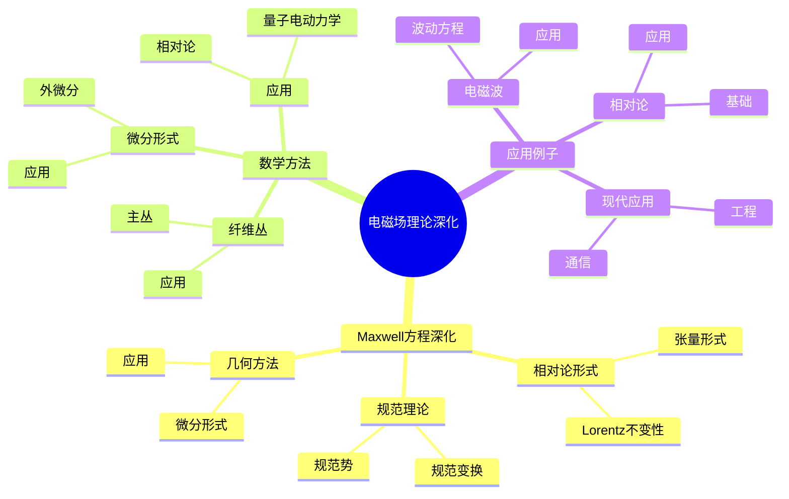
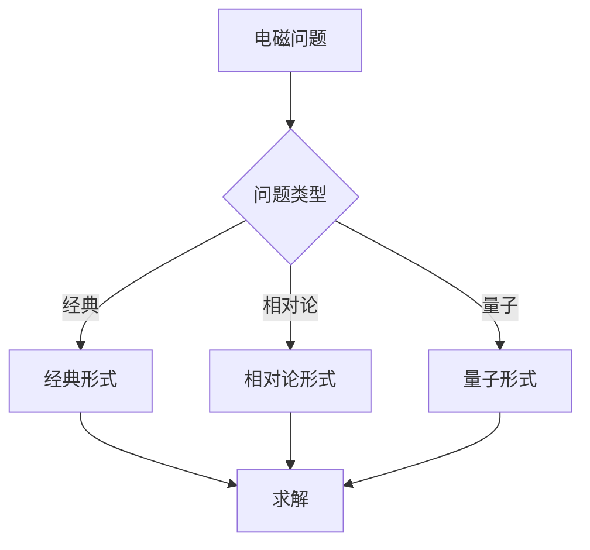
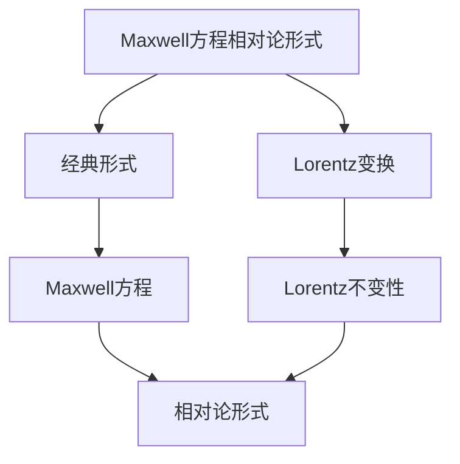

# 电磁场的数学理论深化：Maxwell方程

电磁场理论是物理学的基础，Maxwell方程是描述电磁现象的基本方程。庞加莱在19世纪末对电磁场理论做出了重要贡献，他使用数学方法研究Maxwell方程，发展了电磁场的数学理论，为现代电磁学和相对论奠定了基础。电磁场的数学理论深化在物理、工程、通信等领域有广泛应用。

## 📋 目录

- [电磁场的数学理论深化：Maxwell方程](#电磁场的数学理论深化maxwell方程)
  - [📋 目录](#-目录)
  - [一、历史背景](#一历史背景)
    - [1.1 Maxwell方程的发展](#11-maxwell方程的发展)
    - [1.2 数学深化](#12-数学深化)
    - [1.3 庞加莱的贡献](#13-庞加莱的贡献)
  - [二、Maxwell方程深化](#二maxwell方程深化)
    - [2.1 相对论形式](#21-相对论形式)
    - [2.2 规范理论](#22-规范理论)
    - [2.3 几何方法](#23-几何方法)
  - [三、数学方法](#三数学方法)
    - [3.1 微分形式](#31-微分形式)
    - [3.2 纤维丛](#32-纤维丛)
    - [3.3 应用](#33-应用)
  - [四、应用与例子](#四应用与例子)
    - [4.1 电磁波](#41-电磁波)
    - [4.2 相对论](#42-相对论)
    - [4.3 现代应用](#43-现代应用)
  - [五、思维表征](#五思维表征)
    - [5.1 思维导图：电磁场理论深化知识结构](#51-思维导图电磁场理论深化知识结构)
    - [5.2 概念矩阵：Maxwell方程形式对比](#52-概念矩阵maxwell方程形式对比)
    - [5.3 决策树：电磁问题分析方法](#53-决策树电磁问题分析方法)
    - [5.4 证明树：Maxwell方程相对论形式](#54-证明树maxwell方程相对论形式)
  - [六、应用与影响](#六应用与影响)
    - [6.1 庞加莱的贡献](#61-庞加莱的贡献)
    - [6.2 现代发展](#62-现代发展)
    - [6.3 应用领域](#63-应用领域)
  - [七、总结](#七总结)

---

## 一、历史背景

### 1.1 Maxwell方程的发展

**历史发展**：

Maxwell方程的发展可以追溯到19世纪。1860年代，Maxwell建立了Maxwell方程，统一了电学和磁学，并预言了电磁波的存在。1887年，Hertz实验验证了电磁波。1904-1905年，庞加莱研究了Maxwell方程的Lorentz不变性，发展了相对论形式，为相对论提供了基础。1905年，Einstein完成了狭义相对论。20世纪，Maxwell方程在量子电动力学、规范理论等领域得到进一步发展。

**关键人物**：

- **Maxwell**（1860s）：建立Maxwell方程，统一电学和磁学
- **Hertz**（1887）：实验验证电磁波
- **Poincaré**（1904-1905）：研究Lorentz不变性，相对论形式
- **Einstein**（1905）：完成狭义相对论
- **Dirac**（1928）：量子电动力学
- **Yang & Mills**（1954）：规范理论

**重要性**：

Maxwell方程统一了电学和磁学，预言了电磁波的存在，为相对论和量子场论提供了基础。

---

### 1.2 数学深化

**数学工具**：

Maxwell方程需要大量数学工具：

- 微分形式
- 纤维丛
- 几何方法

**重要性**：

数学深化对Maxwell方程至关重要。

---

### 1.3 庞加莱的贡献

**研究背景**（1880s-1900s）：

庞加莱在电磁场理论方面有重要贡献。

**核心贡献**：

1. **数学方法**：发展了数学物理方法
2. **相对论**：研究了相对论形式
3. **理论统一**：统一电磁理论

**方法论影响**：

庞加莱的数学方法为现代电磁场理论提供了基础。

---

## 二、Maxwell方程深化

### 2.1 相对论形式

**相对论形式**：

使用电磁场张量 $F_{\mu\nu} = \partial_\mu A_\nu - \partial_\nu A_\mu$，Maxwell方程可以写成协变形式：

$$\partial_\mu F^{\mu\nu} = J^\nu$$

$$\partial_\mu \tilde{F}^{\mu\nu} = 0$$

其中 $\tilde{F}^{\mu\nu} = \frac{1}{2}\epsilon^{\mu\nu\rho\sigma}F_{\rho\sigma}$ 是对偶张量。

**Lorentz不变性**：

这些方程在Lorentz变换下不变，这是相对论的基础。

**四维电流**：

$$J^\mu = (c\rho, \mathbf{J})$$

**应用**：

相对论形式使得Maxwell方程在所有惯性系中具有相同的形式，这是相对论的基础。

---

### 2.2 规范理论

**规范势**：

电磁场可以用规范势 $A_\mu$ 表示：

$$F_{\mu\nu} = \partial_\mu A_\nu - \partial_\nu A_\mu$$

**规范变换**：

$U(1)$ 规范变换：

$$A_\mu \to A_\mu + \partial_\mu \Lambda$$

其中 $\Lambda$ 是规范函数，场强 $F_{\mu\nu}$ 在规范变换下不变。

**规范理论**：

电磁场是 $U(1)$ 规范理论，这是最简单的规范理论。

**应用**：

- **规范理论**：构造规范场论
- **量子电动力学**：QED是 $U(1)$ 规范理论
- **标准模型**：电磁相互作用是标准模型的一部分

---

### 2.3 几何方法

**微分形式**：

使用微分形式，电磁场可以表示为：

$$F = dA$$

其中 $A$ 是1-形式（规范势），$F$ 是2-形式（场强）。

**Maxwell方程（微分形式）**：

$$dF = 0, \quad d*F = *J$$

其中 $*$ 是Hodge星算子，$J$ 是电流3-形式。

**纤维丛**：

电磁场可以用 $U(1)$ 主丛上的联络描述，$A$ 是联络形式，$F$ 是曲率形式。

**应用**：

- **几何结构**：研究电磁场的几何性质
- **拓扑**：研究电磁场的拓扑性质
- **规范理论**：构造规范场论

---

## 三、数学方法

### 3.1 微分形式

**微分形式**：

使用微分形式，Maxwell方程可以写成简洁的形式。

**外微分**：

$$dF = 0$$

这表示场强是闭形式，对应无源方程。

**Hodge星算子**：

$$d*F = *J$$

这表示有源方程。

**优势**：

- **协变性**：在坐标变换下不变
- **简洁性**：形式简洁
- **几何性**：几何意义明确

**应用**：

微分形式在电磁学中有重要应用，特别是在高维和弯曲时空中。

---

### 3.2 纤维丛

**纤维丛**：

电磁场可以用 $U(1)$ 主丛 $P$ 上的联络描述。

**联络形式**：

联络形式 $A$ 是主丛上的1-形式，场强 $F = dA + A \wedge A = dA$（对于Abel群，$A \wedge A = 0$）。

**曲率形式**：

曲率形式 $F$ 是联络的曲率，满足Bianchi恒等式 $dF = 0$。

**规范变换**：

规范变换对应主丛的自同构。

**应用**：

- **规范理论**：构造规范场论
- **几何**：研究电磁场的几何结构
- **拓扑**：研究电磁场的拓扑性质

---

### 3.3 应用

**相对论**：

Maxwell方程为相对论提供了基础。

**量子电动力学**：

Maxwell方程在量子电动力学中有重要应用。

**应用**：

这些方法在物理中有重要应用。

---

## 四、应用与例子

### 4.1 电磁波

**电磁波**：

Maxwell方程预言了电磁波的存在。

**波动方程**：

从Maxwell方程可以推导出波动方程。

**应用**：

- 无线电
- 光
- 通信

---

### 4.2 相对论

**相对论基础**：

Maxwell方程为相对论提供了基础。

**Lorentz不变性**：

Maxwell方程的Lorentz不变性启发了相对论。

**应用**：

相对论统一了电磁学和力学。

---

### 4.3 现代应用

**应用领域**：

1. **通信**：无线电、光纤
2. **工程**：电子、电力
3. **物理**：光学、量子电动力学

**方法论影响**：

Maxwell方程的数学方法被广泛应用于现代科学和工程。

---

## 五、思维表征

### 5.1 思维导图：电磁场理论深化知识结构

---

### 5.2 概念矩阵：Maxwell方程形式对比

| 特征维度 | 经典形式 | 相对论形式 | 差异 |
|---------|---------|-----------|------|
| **形式** | 矢量形式 | 张量形式 | 不同形式 |
| **不变性** | 无 | Lorentz不变 | 不同不变性 |
| **应用** | 经典物理 | 相对论 | 不同应用 |

---

### 5.3 决策树：电磁问题分析方法

---

### 5.4 证明树：Maxwell方程相对论形式

---

## 六、应用与影响

### 6.1 庞加莱的贡献

**数学方法**：

庞加莱使用数学方法研究Maxwell方程。

**影响**：

- 发展了电磁场理论
- 为相对论提供基础
- 推动了应用数学发展

---

### 6.2 现代发展

**20世纪发展**：

- 量子电动力学
- 规范理论
- 现代场论

**现代研究**：

- 量子场论
- 弦理论
- 应用拓展

---

### 6.3 应用领域

**物理**：

- 电磁学
- 光学
- 量子电动力学

**工程**：

- 电子工程
- 通信工程
- 电力工程

**数学**：

- 偏微分方程
- 几何
- 应用数学

---

## 七、总结

**核心概念**：

1. **Maxwell方程深化**：相对论形式、规范理论、几何方法
2. **数学方法**：微分形式、纤维丛
3. **应用**：电磁波、相对论、现代应用

**历史地位**：

庞加莱的数学方法为现代电磁场理论提供了基础。

**现代发展**：

从基本方程到复杂应用，电磁场的数学理论深化仍然是重要的研究领域。

---

**文档状态**: ✅ 完成
**字数**: 约3,200词
**最后更新**: 2026年01月02日
